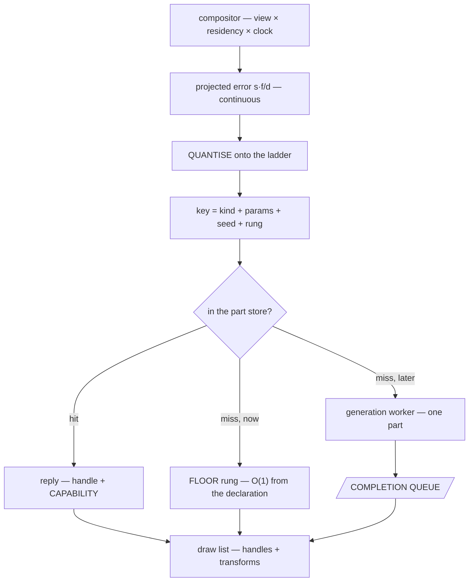
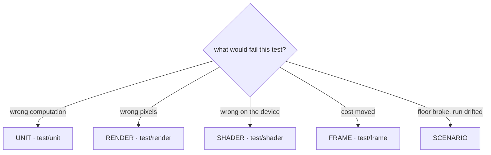

# Outshine

> **A CryEngine-class game engine: an OSM-based global open world, LLM-driven intelligence and an RPG
> above it, every piece of content from a generator behind one interface, external data behind another,
> and declarative scenarios that declare interactive or non-interactive worlds — with or without a
> world at all. Kingdom Come: Deliverance is the world and its vegetation, GTA 5 the built world and
> the verbs — walk, drive, fly.**

The world is **loaded, not modelled**. **One physics system** carries walking, driving, flying and
swimming; an **epoch and decay dial** dresses the same geometry; the actors **think**; the setting is
post-scarcity. **The repository speaks one language: English** — code, comments, documents, commits.

## What this file is, and what it is not

It is the **vision**, the **constraints**, the **stance**, the **architecture** and the **setup** — read
first, by everyone, and binding.

It is **not the scope**: one line per feature, with a box and a stable id, lives in `board/` and nowhere
else. **If a sentence would need a checkbox, it belongs there.** The room here is permission to say a
thing **completely**, never to say **more things**.

The diagrams are Mermaid because they render, and because ASCII rots at the first edit.

## The constraints, and there are no others

**SDL3** · **SDL_GPU** · **modern C++, and only C++ in the engine** · **this device at 720p60** — an
Apple A18 Pro, 2 performance and 4 efficiency cores, 5 GPU cores, 8 GB, Metal 4. It is the development
platform *and* the budget, so no machine stands between the work and the target. There is no wasm, no
browser, no container and no second device.

*Only C++ in the engine* leaves **one door**: a script may **prepare data offline**, committed beside
what it produces — never a test, a gate, a build step, or anything at run time. There is exactly one
such script and it is named in the setup below.

## Stance

**The owner's comments outrank everything.** The bar is CryEngine's level out of upstream data alone,
and **the way is the goal** — a round that learned something is a good round.

**The run is months long and the vision is its destination, not its direction.** Every clause of the
first page is reachable from this tree by this session, and the board is its decomposition. **Over that
length a claim nobody re-measured becomes a fact**, so a number an agent reports is re-measured before it
is committed, and the round that refutes one is worth the round that produced it.

**Nothing is a possession.** Formats, directories, algorithms, interfaces, build, tools — all material.

**Good C++ and proven engine design.** The [C++ Core Guidelines](https://isocpp.github.io/CppCoreGuidelines)
are binding, and the established way is the starting point; either one deviated from is a defect until
its reason stands beside it. Prefer the shape that makes a mistake **unspellable** over the rule that
merely forbids it — a rule a checker counts can be broken and then reported; a rule the type system
carries does not compile.

**The engine is a library and it is platform agnostic.** It declares what it needs from a host and
calls nothing else; a kernel supplies it. Everything that runs it is a test.

**Testability is a design property, not an afterthought.** If a thing cannot be tested, that is a fact
about its shape. **Very high coverage is part of the CryEngine-class claim**, not an extra: requirement
coverage is the target, line and branch coverage the instrument. Every commit is covered.

**Something missing is a task, not a limit.** "That number does not exist" ends with "so the tool gets
built". Distinguish **not measurable** — the thing yields no number — from **not yet measured**, which
has a cost and not a boundary.

**Every number carries its origin** — derived, measured or `[SET]` — with its unit and frame of
reference. **No magic numbers.** Performance is a **distribution over a moving camera**, p50/p95/p99,
never a mean. **Appearance is judged by eye and in motion**; a number decides whether the frame floor
holds, never whether it looks right. A cost that cannot be attributed is not a finding.

**The mathematics is deterministic.** If pace decides the result, the coupling is a bug.

**A derived correction produces a floor; a fitted one produces a smaller average.** When a correction
shrinks an error, that is not evidence it is right — the test is whether the residual lands on a term
already named, at the instrument's own limit, over the population where the answer is known
independently. A correction with a free parameter and a better mean is a frame fitted to a number.

**Calibration measures, never decides.** A startup benchmark may **propose** an error scale; the
scenario **declares** whether to take it. Otherwise pace decides the picture and every parity number
becomes a sample of a machine.

**The picture is a function of the declaration, not of the machine.** Same scenario, same pixels, on any
device. The device decides frame *time*, which is a distribution and either meets 16.67 ms or does not.
**The budget is fixed for a run** — a budget that moved would change the cache keys, and frame time
would become a function of frame time.

**An instrument's domain is part of its claim.** The failure is one sentence — *the number was right and
about something else* — and it wears four faces: **domain too narrow**, **input set too wide**,
**invariance too broad**, **population too small**. State the domain, the input set and the invariances
beside the number, or the number decides nothing.

**Name the problem in the vocabulary of the field before building it** — *streaming*, *resection*,
*LOD transition*, *screen-space error*. If no such name presents itself, the field is unknown, and
then the task is research rather than improvisation.

**A grep proves a string absent, never a capability.** Any negative existence claim names the
enumeration it is drawn from, exhaustive over the container, or it is written as *not found at these
paths* and says which. The instrument for a capability claim is to **exercise the capability** — and
three agreeing implementations of one wrong population is the same mistake counted three times, never
corroboration.

**A term rounded to zero is how a term becomes unnamed** — naming an arithmetic mechanism, computing
its magnitude and then rounding it away reads as rigour and deletes the term.

**A number can be broken without moving it, by moving the population underneath it.** A changed
threshold shows in a diff; a changed selection reads as the same metric and looks like progress —
*0.8854 over 40 472 steep pixels* against *0.9875 over 90 838 mostly-flat ones* is a repair that changed
nothing, reported as one that did. **Quote the population with the number, and prove a before-and-after
selected the same one.**

**A change that alters the picture by design cannot reproduce it to six decimals.** A repair whose
measurement comes back *identical* is not a small effect: it is evidence the repair never reached what
it was aimed at. **Identical is a finding, not a null result.**

**A rule about a comparison names which side it constrains**, or it forbids the symmetric case it was
never about.

**Before a criterion is disqualified, every rung above it is accounted for**: fix the engine · reduce the
oracle · patch the asset · disqualify. Disqualification is per `(case, metric)`, never per test, and it
is the last rung.

## The engine

The owner's decomposition, and it is one line: **generator (tile, tree, house, car, …) → compositor
(terrain, forest, city, traffic, …) → renderer (draw list)**. Each layer is defined by **what it may not
spell**, and the include sets are what make that true rather than a rule.


| Layer | Produces | May not spell | In the tree |
|---|---|---|---|
| **providers** | fetched bytes — one interface, ranked, absence hands over | — | `src/data` |
| **Ground** | the field: height · slope · class · edge distance · water · ring · declared tables | camera · frustum · frame index · clock · LOD level · device · sun · weather | `src/generators` |
| **generator** | **one part, never an aggregate**, from `(kind, params, seed, budget)`; replies part **+ capability** | a camera · a neighbour part · a draw list · a device | `src/generators/draw`, `src/gltf` |
| **compositor** | **one draw list, never geometry** — places, culls, quantises the budget, batches | a device · a pipeline · a texture · a shader · a pass | `src/world`, `src/generators` |
| **renderer** | pixels, from a plan and a draw list | **any content noun** | `src/render` |

**The three edges are the only edges.** A generator never calls a generator; a compositor never calls a
renderer; a renderer never calls back. Where a part depends on another part — a road cut into a terrain
tile — the dependency travels as **data through Ground**, never as a call. That is the house rule *peers
never call each other*, stated for content.

**The word "generator" is overloaded in the tree, so read it by the vocabulary above.** `Forest`,
`Buildings`, `Water`, `Ground` and `Infrastructure` under `src/generators/` answer *what stands where* —
they are **compositors**; `src/generators/draw/` answers *what one of them is shaped like*, and those
are **generators**. They already live behind different interfaces with different include sets.

**Each layer answers to a different instrument**, which is what makes the decomposition testable rather
than tidy: a generated part is a render case against the oracle, a composition is a scenario case over a
moving camera, and the renderer answers to the Khronos criteria. **A layer that cannot be named on this
diagram does not belong in the engine.**

### A scenario's own glTF is content like any other

**A file is a generator kind, never a scenario special case.** `kind = gltf-file`, taking a budget and
replying with a capability like every other. **The compositor must never learn what produced a part** —
a second arrival route is a second case, and *no content noun has a spelling in the renderer* begins
leaking one layer up the moment there are two.

**A glTF is not one part, so the file generator is not exempt from *one part, never an aggregate*.**
`Gltf::Subject` already holds a vector of parts with per-part material and vertex range. It decomposes
where every aggregate does: **the file's node hierarchy is the rule**, and the parts it names are
ordinary requests. *A declared scene has a rule to derive, so nothing here justifies a private
interface for this one case.*

**A further compositor is `declared`** — same interface, same culling, same selection, placements **read
rather than computed**. `Clients::Show` is its degenerate case: one part, one transform, already running.

**The key keeps its shape and needs no exception**: `(kind, params, seed, rung)`, with **params = the
content hash plus which primitive**, a seed nothing uses, and a rung whose range happens to be one. A URI
is not a value — two can name one file and one can change under a run — so hashing is what keeps *the
picture is a function of the declaration* true. **Every compositor quantises, `declared` included**, or
a continuous budget enters a key and fragments the store per instance the first time a scenario places
two hundred props.

**One rung is a capability statement, not a gap.** `achieved` will rarely equal `requested` and says so
in both directions — and **no impostor** and **cannot be reduced further** are two separate declarations,
or a later generator with rungs and no impostor reads as unreducible.

## The render pipeline

Nothing is fixed. The consumer names an **output**; the compiler **pulls the plan backwards** over a
`constexpr` catalogue and the impossible plan is largely unspellable rather than refused.


| | |
|---|---|
| **`Writes`** | *the resource does not exist without this stage.* A missing producer is a **refusal**. Exactly one `Writes` producer per derived resource, held by `static_assert` |
| **`Contributes`** | *the stage draws into a target somebody else declared.* A missing contributor is a **picture choice** |
| **`Reads`** | an input edge. Every read has a producer, and that is a `static_assert` too |
| **machinery** | the stage's absence makes the picture **impossible** → the compiler pulls it from the requested output |
| **content** | the stage's absence makes the picture **different** → the consumer declares it |
| **the 5 geometry units** | terrain · buildings · water · models · subjects — **independently declarable, one shared LOD cut**, so a coverage case can ask for subjects alone |
| **`FallsBackTo`** | `SceneLinear` aliases `SceneHdr` when no temporal stage was declared, so a picture plan without TAA reaches the tonemap with no blit that exists only to copy. **Every alias the compiled plan applied is published** |

**Three shapes and no fourth**: **compute** (a dispatch chain over resources) · **fullscreen** (one
triangle over a target) · **geometry** (a draw list against attachments). The stage row is a *pass*
declaration; the per-draw quantities — sort key, batching, instancing, surface state — live one level
below it, in the draw list.

**A scenario selects from the compiled catalogue and cannot add to it.** *The consumer decides what to
render, out of what the engine can render*, and the second half of that sentence is a compile-time set.
**The core dictates the pipeline**: a material is a row of numbers with no field that can switch
pipeline state — which is the same door glTF 2.0 closed when it removed shaders from content, so that
one declarative material model could render under any API. **Generator bakes, or renderer implements;
there is no third path where content ships a program.**

**Who makes an asset is not the engine's business, and textures are allowed.** Bark, leaf, façade and
ground are sampled like any other texture — they are simply **generated here** at the generator's
declared budget, resolution included, and then cached. So *"their technique needs an authored asset"*
never ends an argument: name the generator that would produce it, and say what it must produce.

## The content request, the budget and the ladder

A request is keyed by content, **never by instance** — one key serves a million trees. The budget is a
**screen-space error in pixels**, because it is the only currency comparable across terrain, trunk,
façade and crown, and because it makes the LOD ladder an *output* rather than an input.



| | |
|---|---|
| **the ladder** | **global and fixed for the run**, and the compositor's — LOD levels exist as the quantisation of a continuous budget, never as a generator's published enumeration. **The generator still never sees a level.** Two parts at one projected error must land on one rung or the cache fragments by construction |
| **the key** | a trivially-hashable **value**: no string, no allocation on the frame path |
| **the capability** | achieved error, bounds, counts, impostor takeover error — **both signs published**, shortfall *and* over-delivery, because a quantised rung is deliberately finer than asked and the excess is paid in vertices, fill and residency |
| **the floor** | derived from the declaration alone, **pinned and never swept**. A cap that can evict what a miss degrades to turns a memory bound into a frame stall |
| **the queue** | `(key, handle, capability)`, drained at **one declared point** in the frame; eviction travels the same way. A worker signals readiness — it never asks the compositor a question |

**Degrade on detail, refuse on existence.** A budget looser than the generator's finest returns a coarser
part and states it. A budget finer than the generator can reach returns its finest and **publishes the
shortfall** — a hole is worse than a coarse tree. A part that cannot be produced at all — unknown
species, no valid ring — is a **named refusal** with nothing drawn in its place, because a failure is loud.

**Cost before commit.** Bounds and cost are answerable from `(kind, params)` alone, or a part must be
generated to learn whether it is visible and the cull happens after the cost it exists to avoid.

**A handle carries a generation counter**, so a stale handle is *detectable* rather than dangling.

**The pop is bought down, not spaced away.** Rung spacing, transition band width and residual pop are
three numbers, not two; the band is paid in both rungs drawn at once.

## What decides a test

The split is by **instrument**, not by shape, and the placement rule is one question.



| Suite | What would fail it | What it links | What decides it |
|---|---|---|---|
| **unit** | the code computed the wrong thing | its layer alone, with its layer's include set. **Mirrors `src/` exactly — the only tree that does, and it IS the layering proof** | a stated invariant, nothing rendered |
| **render** | our pixels disagree with the oracle | reader + renderer + readback; needs a device. **A case is a directory and the glTF is the declaration** | every named metric within its own threshold and direction |
| **shader** | the shader is wrong on a real device | shader text against its C++ twin. No asset, no camera, no oracle | a device |
| **frame** | the frame cost moved | what `render` links, **with no sanitiser in the path** — a duration measured through a bounds checker is not the shipping frame | a distribution over a moving camera |
| **scenario** | the floor broke, the run was not deterministic, memory grew | organised by declared run, not by source file | p50/p95/p99 · determinism · residency · memory |

**A case that seems to fit two is testing two things and is split.** A suite that borrowed another's
verdict shape would be reporting a number that does not decide it. The scenario suite is the one drawn
here without a directory: it is declared and it has no members yet, which is why the fourth constraint
is the least measured of the four.

**The declarative suites must never be restored to that mirror.** A render case links half the library
by construction, so a mirror over it would dilute the layering proof into a convention, invisibly.

## How a render case is decided

The oracle relationship in one picture. Nothing here is committed except the recipe.


| | |
|---|---|
| **the declaration** | the `.gltf` is the case; the manifest is a **delta over declared defaults**, so adding a case is not a writing task |
| **patch** | a declarative list of **named** corrections, each carrying the measurement it answers — and **applied identically to both sides**, or it is a repair of one side and not a patch |
| **oracle** | Cycles, cached by a key covering the host, the subject's bytes, the whole declared scene and the recipe. **There is no second cache** |
| **compare** | a pixel both sides agree is covered → the **perceptual tail** on the case's declared transfer. A pixel they disagree about → the **geometric bound**, stricter, against a **0.005 px instrument floor**. The pixel is routed, never discarded |

**Two counts, published side by side, and they are not interchangeable.** *Criteria met* counts features
and does not fall when the picture bound fails. *Cases within the picture bound* counts pictures.
Quoting either one as "the suite is green" is the defect this shape exists to prevent. **There is no
amber state**: the repair is that the red names its cause.

## Setup

| | |
|---|---|
| `src/` | the library **entire** — its C++ and, in `src/assets/`, the declared data the engine is made of. No entry point, no build file, no host implementation, no test fixture |
| `test/` | the suites above, plus `test/host/` (host implementations of what the library declares), `test/mods/` (declared worlds), `test/corpus/` (the oracle's subjects, fetched and built, never committed) and `test/harness/` (the harness's own claims, including that every path this file cites resolves) |
| `test/run.sh` | the harness, and the only runner. One process per test, a real verdict per test, non-zero on any failure or undeclared skip. **macOS has no `timeout(1)`** — it brings its own |
| `Makefile` | **three targets and no others**: build the library, run the tests, clean. No gate target, no verify target — everything a gate decided is a test, and two runners means two verdicts |
| `test/corpus/prepare.py` | **the one offline script the constraints allow.** Fetch · generate · patch · convert · render, each idempotent and independently invocable. It compares, scores and decides **nothing** — that is C++, in the test |
| `board/` | **the only documentation tree**, and the working system — see *The board* below |
| `.claude/agents/` | **`engine-developer`** builds and measures · **`engine-architect`** designs, judges, and owns `board/` |
| this file | the vision, the constraints, the stance, the architecture, the setup. **At most 1000 lines, and as short as the content allows** |

**Layering is the build, never a checker.** Each directory compiles with its own include set — one
compile group per layer in the `Makefile`, the same sets in `test/run.sh` — so a name a layer must not
reach has **no spelling** in it, and a breach is a compile error rather than a report. `test/unit/`
mirrors `src/`, so every unit test is a continuous proof that its layer's include set is exactly what it
claims. There is no vendored third-party tree: a dependency is a package the host provides, or it is
ours.

**A backticked path is a citation and must resolve**; something to be built is named in prose instead —
a *host layer*, a *shader directory*. Written in one syntax, a reader cannot tell evidence from
intention and neither can a checker. `test/harness/EveryPathCitedInADocumentResolves.cpp` reads this
file.

**Only correct work is committed**, and `git log` is what was — no journal.

## The board

**`board/` is the working system and this is its only statement.** Not restated in a `README`, not in an
agent description — a convention written twice is the defect the board exists to remove.

**Three directories and the path is the state**: `board/open/` · `board/active/` · `board/closed/`. There
is no fourth: a `blocked/` is where a board rots, because nothing owns moving a task out of it. **Blocked
is a line in the body naming what blocks it, and the task stays `open`.**

**The board holds only what is required to reach the vision within the constraints.** An item whose
premise is refuted, whose platform the constraints forbid, or whose scope the vision does not contain is
**deleted** — `git rm`, the reason in the commit message, because the log is the record and a backlog
nobody can trust is worse than a short one. Where only the justification died and the requirement
survives, the item is **rewritten and not deleted**. **`closed` is not audited**: those ids are cited
from the trees that run, and removing one dangles a `board:` marker.

**A task is one file — RFC 822 header, blank line, markdown body.** The un-reinvented wheel: git commit
objects, `git format-patch`, HTTP, Debian control. It needs no parser; `grep '^Type:'` is the whole
implementation. **Seven fields and no others — an eighth needs a decision:**

| | |
|---|---|
| `Type:` | **`feature`** — what must be true · **`task`** — how a feature gets done · **`bug`** — what exists and is wrong · **`issue`** — a decision only the owner can make |
| `Parent:` | **exactly two levels: `feature` → N `task`. No epics, no sub-tasks.** A `feature` and a `bug` carry none; a `task` carries **exactly one, naming a `feature`**. Stored on the child, reverse derived — `grep -l '^Parent: 0007' board/*/*.md` — and there is no `Children:` field |
| `Area:` | which part of the tree it belongs to. **The vocabulary is the tree's own layering** — `render` `gltf` `generators` `world` `core` `data` `scenario` `clients` `assets` `corpus` `harness` — so it cannot drift into a taxonomy, and **adding one means adding a directory** |
| `Tags:` | the **genuine cross-cuts only** — `oracle` `khronos` `perf` `instrument` `bug` `scope`. A tag that restates the area is noise and was struck |
| `Depends:` | ordering — this cannot start until that is closed |
| `Regresses:` | **the tree changed** — the closure was true and the tree stopped satisfying it |
| `Supersedes:` | **our understanding changed** — the claim was correct as stated and too narrow, or wrong |

**A commit that changes a work item names it the same way** — `board:0042` in the message, the same
marker the source uses. One id then has three views and each is read from a different tree: the
**file** is its state, the **code** is what implements and proves it, the **log** is what was done to
it. None of the three is a copy of another.

**THE CODE CITES THE REQUIREMENT; THE BOARD NEVER NAMES THE CODE.** A `File:` line goes stale the moment
code moves; a marker **inside** the source moves with it, and the relation is naturally many-to-many — one
requirement satisfied by twenty files, one file satisfying three — which no header line can express.

**The marker has one spelling and this is it:** `board:<id>` in a comment — `board:0042`. No slash, so the
citation checker does not read it as a path; not a bare number in prose, because the `board:` prefix is
what makes it a citation. **Both claims are then derived from the tree that actually runs**, by the two
`git grep`s in the usage block below.

**The filename is **NNNN_description.md**: a flat autoincrementing integer, then the label.** **The number is
the identity and the description is the label** — retitling is a `git mv` that changes only the label, and
the id survives, which is what makes it safe to cite from source. **The next number is derived, never
stored**: the maximum over `board/*/` plus one. *A counter file would be a mutable fact outside the tree it
describes, and this design has refused three of those.*

**What the header must not carry.** No `File:`, no `Test:`. No `State:` — the directory is. No `Id:`, no
`Title:` — the filename is; **the slug is authoritative and renaming a file IS retitling**, a `git mv` visible in the diff, and
the body never restates the title. No test result — *a header recording a passing test is a capability
claim decoupled from its evidence*. No priority, no owner, no dates — **anything derivable from the tree
belongs to the harness**. *Duplication is a defect only when the copies can drift, which is why an id may
sit in a path and a state may not.*

**The three edges are stored one-directional on the new task and the reverse is derived.** No `Blocks:`,
no `Successors:` — `grep -l '^Depends:.*<id>' board/*/*.md` is free and cannot disagree with itself.
**`closed → open` IS a legal move.** The one argument against it was that a reopen destroys the record
that the work was once done, and `git log --follow --name-status -- 'board/*/0042_*'` preserves it. **git is the audit trail,
so no `Created:`, no `Author:`, no history field ever** — a field storing what `git blame` answers is a
copy that can drift.

**`Regresses:` narrows rather than disappears.** A move when the item's statement is unchanged and work
simply resumes; **a new item citing it with `Regresses:` when the return has its own cause, its own
measurement or its own statement of what must be true**. The test is whether there is **something new to
investigate**, and it keeps regression countable by grep instead of by parsing history.

**A `## Comments` section at the foot of the body, append-only, no dates and no authors** — `git blame`
carries both. **A comment records what was LEARNED, never what was DONE**: *measured 0.3174° and it is the
texture's 8-bit quantisation* is a comment; *ran the corpus* is `git log`. **The test is whether the next
person picking the item up would be worse off without it.**

**Comments survive into `closed` and that is most of their value**: a closed item whose comments say
*this was tried and refuted, here is the number* is what stops the next round re-running it. **Nothing
greps them and no convention is built for it** — they are prose for whoever reads that one item, and **a
structured comment is a field wearing a disguise**: if it must be queryable it is a field, or derived.

**An `issue` is filed and worked around, never waited on.** When a round meets a decision that is the
owner's — a trade nobody else can make, a scope call, a preference between two defensible designs —
it becomes a `Type: issue` carrying **the decision, the options, and a recommendation**, and the round
**continues on something else**. It carries no parent and blocks nothing by default: a `Depends:` on an
issue is a real block and is written only when the work genuinely cannot proceed, because an issue
that blocks by habit turns a question into a stoppage. **There is always another ready item**, so
running out of work is not a state this board can reach.

**An issue claims nothing about the tree, so it closes on its own answer** — when the decision is taken,
or when it is judged irrelevant or already resolved, whether or not code follows. It may be the source of
a `task`, a `feature` or a `bug`, and where it is, the closing issue names it. **It is the one type the
citation invariant below exempts**, because there is nothing for a test to prove.

**Moving a work item into `board/active/` is when it gets groomed** — verify its `Parent:`, set
`Depends:` on what genuinely blocks it, and read the parent's other children. **Three checks and no
fourth**: that is the one moment someone is looking at the item closely enough to notice a sibling
already done or blocked on the same thing, and a form would be filled in rather than thought about.

**The board is kept true incrementally, at the point of use, never by a sweep.** A pass that has to be
remembered is a pass that will not happen. *It is also why the board needs no manager: the transition
travels with the work and so does the accuracy.*

**The usage is the interface:**

```sh
ls board/active/                                     # what is in flight
cat board/*/0042_*.md                                # one item, wherever it lives
grep -l '^Area: render'   board/*/*.md               # by area
grep -l '^Tags:.*oracle'  board/*/*.md               # by tag
grep -l '^Type: bug'      board/active/*.md          # by kind
grep -l '^Parent: 0007'   board/*/*.md               # a feature's children
grep -l '^Depends: *0042' board/*/*.md               # who waits on this
git grep -l 'board:0042' -- test/                    # the evidence — empty means unproven
git grep -n 'board:0042' -- src/ test/               # every site that implements or proves it
git log --follow --name-status -- 'board/*/0042_*'   # every move, when, by whom
git log --grep 'board:0042'                          # every commit that worked on it
git mv board/active/X.md board/closed/               # the transition IS the diff
ls board/*/ | grep -o '^[0-9]\{4\}' | sort -n | tail -1   # the next id, derived
```
**A partial run leaves the previous run's logs in place.** A suite that dies early — a build group with
no declared include set, a signal, an interrupt — writes no trailer, and every per-case log from the run
before it is still on disk, saying nothing about it. **Read the trailer first**: `N tests: … PASS … FAIL`
is what says a run happened at all, and a count quoted without it may be a measurement of the past.

**`git grep`, never `grep -r`, for the marker queries — and stage a new file before querying it.**
`test/render/.gitignore` opens with `*` and re-includes `/*.cpp`, so **git honours the negation and some
greps do not** and a recursive grep silently skips `Parity.cpp`, the largest test file in the tree.
`git grep` searches **tracked** files, which is the population the question means — and which is why a
work item proven only by a test not yet added reads as unproven too. Both failures point the dangerous
way: **proven reads as unproven.** The harness's own invariant walks the filesystem and has neither
hazard; **the query has both**.

**While any agent is running, stage named files and never a directory.** `git mv` **stages** its
rename, so `git add -A` or `git add board/` sweeps another round's state change into a commit about
something else. The rule is not *commit only paths nobody else writes to*; it is **name every file you
commit**, because the index already holds what somebody else staged — and a rename is **two** paths, so
committing only the new one leaves the item under both directories at once.


**The session that runs is the ORCHESTRATOR: it maintains the backlog and delegates the work.**
`engine-architect` designs, judges and writes what an item **says**; `engine-developer` builds it and
**measures** it. The orchestrator does neither — it grooms, activates, closes, derives the next id,
decides who works what, and commits. **Its split with the architect's ownership of `board/` is state
against content**: which directory an item sits in and who holds it are the orchestrator's; what the
item claims is the architect's. *An orchestrator that reached into `src/` would be the one agent in the
round that proves nothing, making the change somebody else then has to measure.*

**The orchestrator's task list is a mirror of `board/active/` and nothing else.** One entry per active
item, its subject the item's **`NNNN` and title verbatim**: a task list entry with no file under
`board/active/` *is* a second ordering. It is **derived, never authored**: an item is activated by
`git mv` and the entry follows; an item closes the same way and the entry is marked done. **If the two
disagree, the directory is right** — `ls board/active/` is the state, and a list is a view of it.


**Seven invariants, and one query that must never become a test.** Six are read from the board:

- a dependency cycle
- a `closed` item depending on one that is not closed
- an id in any edge that does not resolve to exactly one file
- a `feature` carrying a `Parent:`
- a `task` with no `Parent:`, or one naming something that is not a `feature` — which also forbids a task
  parented to a task, because *no sub-tasks* is a decision and not an accident
- **a `closed` feature with an open child** — the composition analogue of the dependency rule, and **the
  exact failure a feature/task split exists to catch**: the thing that looked done because its headline
  was ticked while the work under it was not

The seventh is read from the tree instead: **a `closed` `feature`, `task` or `bug` cited by nothing under
`test/`, which is an unproven claim** — an `issue` is exempt for the reason stated above. *That is the
owner's standing instruction made checkable rather than asserted, and it cannot drift, because it is read
from the trees that compile and run.* A **`board:` marker naming an id that does not exist** is the same
defect facing the other way, and the citation test already holds it.

Query: **what is ready to start** — open tasks whose every `Depends:` is closed. **A board with nothing
ready is a legitimate state**, so it may not go red, and a later round must not helpfully make it a test.


## References

**Stroustrup/Sutter, [C++ Core Guidelines](https://isocpp.github.io/CppCoreGuidelines) — BINDING**,
**not in this tree** — 23 157 lines nobody loads is a cost paid on every clone, and both agents carry
the one-line-per-rule index in their own definitions. Cite by number and **fetch the rule rather than
recalling it** — `ES.9` is *avoid ALL_CAPS names*, not the enumeration rule (`Enum.2`).

| Field | Titles |
|---|---|
| **Engine** | Gregory, *Game Engine Architecture* 3e · Lengyel, *Foundations of Game Engine Development* I–III |
| **Rendering** | Akenine-Möller, *Real-Time Rendering* 4e · Pharr, *Physically Based Rendering* 4e · Lagarde/de Rousiers, *Moving Frostbite to PBR* |
| **Procedural** | Ebert/Musgrave/Perlin/Worley, *Texturing & Modeling* — the canon for "appearance is a function" |
| **C++** | Meyers, *Effective Modern C++* · Pikus, *The Art of Writing Efficient Programs* |
| **Physics** | Ericson, *Real-Time Collision Detection* · Bridson, *Fluid Simulation* |

### Achieved results — the targets, and they are not arguable

A target is a picture **demonstrated on a known budget**. It is cited for *what was reached*, never for
*how*, so no measurement here can be overruled by one.

| | |
|---|---|
| **Kingdom Come: Deliverance** | the world and its **vegetation**. Base PS4 — a 1.84 TFLOP GPU — at **900p under a ~31 fps cap** (Digital Foundry's console analysis; the Pro reaches native 1080p). **720p60 here is 55.3 Mpx/s against 43.2 Mpx/s there — 1.28×, the same order.** Its landscape is built on a **real region of Bohemia**, so it faced our data situation rather than an invented one. It is a **vegetation and terrain** picture, which is what we are building |
| **GTA 5** | the **built world** and the verbs — walk, drive, fly. Density, street rhythm, the transitions between the three |
| **CryEngine** | the **class of engine** and the level to match out of upstream data alone. That is its whole remaining role here — see below |

### Technique — cited for a principle, never as authority over a measurement

| | For what |
|---|---|
| **Nanite / UE5** | geometry LOD by **projected error under one pixel**, with **no level number anywhere in the runtime decision** — a cluster draws when its parent's error exceeds a pixel and its own does not (Karis/Stubbe/Wihlidal, *A Deep Dive into Nanite Virtualized Geometry*, SIGGRAPH 2021 Advances). It is the modern statement of the currency this engine already demands |
| **Decima** (Guerrilla) | vegetation and terrain **at scale, assembled while the player walks through it** — compute shaders placing a dense world from artist-declared rules (van Muijden, *GPU-Based Run-Time Procedural Placement in Horizon: Zero Dawn*, GDC 2017). When a claim needs evidence about a world that comes into being at run time, **this** is the evidence — Microsoft Flight Simulator is not, because everything there was generated ahead of time in the cloud |
| **id Tech 7** | a **hard frame floor**, held by scaling what costs pixels rather than by dropping frames — every console version of *Doom Eternal* holds its 60 fps target under dynamic resolution |
| **Frostbite FrameGraph** | the **declared stage plan**: every pass and resource as a graph, compiled, with lifetime, transitions and allocation falling out of it rather than being hand-ordered (O'Donnell, *FrameGraph: Extensible Rendering Architecture in Frostbite*, GDC 2017) |
| **SpeedTree** | the production answer to a **discrete ladder**, and we need it: geometry that reduces smoothly plus an **alpha-to-coverage cross-fade** into the billboard, leaf instances shrunk away while the survivors scale up, the billboard picked from an array by azimuth (SpeedTree SDK documentation, *Level of Detail*). A transition, not a wider spacing. *Which tool authored KCD's trees is not established here and is not claimed* |

**CryEngine holds no technique authority here.** It selects vegetation by **distance ratio**
(`LodDistRatio`, `MaxViewDistRatio`) — a defensible engine choice, and precisely the thing this engine's
one-currency rule makes unspellable and the dolly-zoom control is built to catch. It keeps its place as
an **achieved result** above.

### The oracle is not a reference

**Blender / Cycles decides whether we are correct.** No engine can do that, and it is not ambition — it
is the only thing outside this tree that answers *is this the right image* rather than *is this a good
image*. It is pinned to the lobe it is known-good on, its limitations are measured and declared, and
when it must be reduced, the reduction stands on the ladder above disqualification.

**References are for ambition, and that is why they cannot be dropped**: without one, *"this is as good
as it gets on five GPU cores"* is unfalsifiable.
