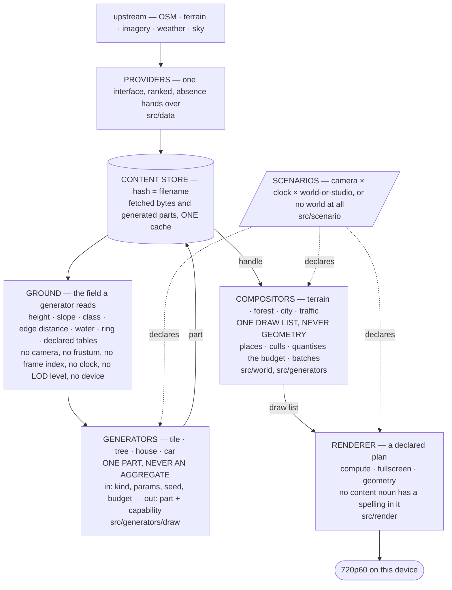
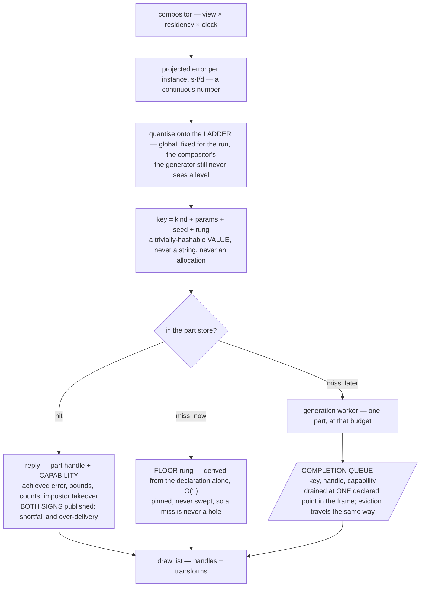
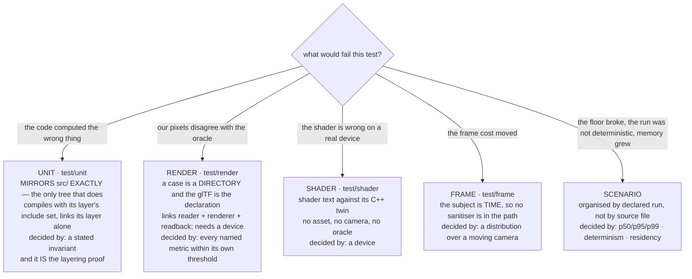
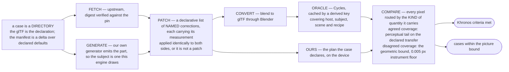

# Outshine

> **A CryEngine-class game engine: an OSM-based global open world, LLM-driven intelligence and an RPG
> above it, every piece of content from a generator behind one interface, external data behind another,
> and declarative scenarios that declare interactive or non-interactive worlds — with or without a
> world at all. Kingdom Come: Deliverance is the world and its vegetation, GTA 5 the built world and
> the verbs — walk, drive, fly.**

The world is **loaded, not modelled**. **One physics system** carries walking, driving, flying and
swimming; an **epoch and decay dial** dresses the same geometry; the actors **think**; the setting is
post-scarcity. **The repository speaks one language: English** — code, comments, documents, commits.

## What this file is, and what it is not

It is the **vision**, the **constraints**, the **stance**, the **architecture** and the **setup** — read
first, by everyone, and binding.

It is **not the scope**. One line per feature, with a box, a stable id, the file that implements it and
the test that holds it, lives in [`doc/requirements.md`](doc/requirements.md) and nowhere else. This
file has drifted into scope prose once and was cut back; the room here is permission to say a thing
**completely**, never to say **more things**. If a sentence would need a checkbox, it belongs there.

The diagrams are Mermaid because they render, and because ASCII rots at the first edit.

## The constraints, and there are no others

**SDL3** · **SDL_GPU** · **modern C++, and only C++ in the engine** · **this device at 720p60** — an
Apple A18 Pro, 2 performance and 4 efficiency cores, 5 GPU cores, 8 GB, Metal 4. It is the development
platform *and* the budget, so no machine stands between the work and the target. There is no wasm, no
browser, no container and no second device.

*Only C++ in the engine* leaves **one door**: a script may **prepare data offline**, committed beside
what it produces — never a test, a gate, a build step, or anything at run time. There is exactly one
such script and it is named in the setup below.

## Stance

**The owner's comments outrank everything.** The bar is CryEngine's level out of upstream data alone,
and **the way is the goal** — a round that learned something is a good round.

**Nothing is a possession.** Formats, directories, algorithms, interfaces, build, tools — all material.

**Good C++ and proven engine design.** The [C++ Core Guidelines](https://isocpp.github.io/CppCoreGuidelines)
are binding and a deviation is a defect until its reason stands beside it. The established way is the
starting point; a deviation needs its reason too. Prefer the shape that makes a mistake **unspellable**
over the rule that merely forbids it — a rule a checker counts can be broken and then reported; a rule
the type system carries does not compile.

**The engine is a library and it is platform agnostic.** A kernel manages it, so this can: the library
declares what it needs from a host and calls nothing else. Everything that runs it is a test.

**Testability is a design property, not an afterthought.** If a thing cannot be tested, that is a fact
about its shape. **Very high coverage is part of the CryEngine-class claim**, not an extra: requirement
coverage is the target, line and branch coverage the instrument. Every commit is covered.

**Something missing is a task, not a limit.** "That number does not exist" ends with "so the tool gets
built". Distinguish **not measurable** — the thing yields no number — from **not yet measured**, which
has a cost and not a boundary.

**Every number carries its origin** — derived, measured or `[SET]` — with its unit and frame of
reference. **No magic numbers.** Performance is a **distribution over a moving camera**, p50/p95/p99,
never a mean. **Appearance is judged by eye and in motion**; a number decides whether the frame floor
holds, never whether it looks right. A cost that cannot be attributed is not a finding.

**The mathematics is deterministic.** If pace decides the result, the coupling is a bug.

**Calibration measures, never decides.** A startup benchmark may **propose** an error scale; the
scenario **declares** whether to take it. Otherwise pace decides the picture and every parity number
becomes a sample of a machine.

**The picture is a function of the declaration, not of the machine.** Same scenario, same pixels, on any
device. The device decides frame *time*, which is a distribution and either meets 16.67 ms or does not.
**The budget is fixed for a run** — a budget that moved would change the cache keys, and frame time
would become a function of frame time.

### What five wrong findings in one week bought, one line each

**An instrument's domain is part of its claim**, and the class is one sentence — *the number was right
and about something else*. Four faces so far: **domain too narrow** (a boundary measure quoted about
interior noise) · **input set too wide** (every triangle edge measured where the silhouette was meant) ·
**invariance too broad** (a hue criterion blind to the mirror it was catching) · **population too small**
(files enumerated to answer a question about paths). State the domain, the input set and the invariances
beside the number, or the number decides nothing.

**A grep proves a string absent, never a capability** — and any negative existence claim names the
enumeration it is drawn from, exhaustive over the container, or it is written as *not found at these
paths* and says which. The instrument for a capability claim is to **exercise the capability**.

**A term rounded to zero is how a term becomes unnamed.** Naming an arithmetic mechanism, computing its
magnitude and then rounding it away reads as rigour and deletes the term.

**Three agreeing implementations of one wrong population is not corroboration**, it is the same mistake
counted three times.

**A rule about a comparison must name which side it constrains.** *No repair in a comparison* was true
of repairing **one side** and false of a correction applied identically to **both**.

**The ladder before a disqualification, and every rung above is accounted for or the entry does not
parse**: fix the engine · reduce the oracle · patch the asset · disqualify. Disqualification is
per `(case, metric)`, never per test, and it is the last rung.

## The engine

The owner's decomposition, and it is one line: **generator (tile, tree, house, car) → compositor
(terrain, forest, city, traffic) → renderer (draw list)**. Each layer is defined by **what it may not
spell**, and the include sets are what make that true rather than a rule.

**The three edges are the only edges.** A generator never calls a generator; a compositor never calls a
renderer; a renderer never calls back. Where a part depends on another part — a road cut into a terrain
tile — the dependency travels as **data through Ground**, never as a call. That is the house rule *peers
never call each other*, stated for content.

**The word "generator" is overloaded in the tree, so read it by the vocabulary above.** `Forest`,
`Buildings`, `Water`, `Ground` and `Infrastructure` under `src/generators/` answer *what stands where* —
they are **compositors**. `src/generators/draw/` answers *what one of them is shaped like* — those are
**generators**. The two already live behind different interfaces with different include sets, which is
the strongest evidence available that the decomposition is right.

**Each layer answers to a different instrument**, which is what makes the decomposition testable rather
than tidy: a generated part is a render case against the oracle, a composition is a scenario case over a
moving camera, and the renderer answers to the Khronos criteria. **A layer that cannot be named on this
diagram does not belong in the engine.**

## The render pipeline

Nothing is fixed. The consumer names an **output**; the compiler **pulls the plan backwards** over a
`constexpr` catalogue and the impossible plan is largely unspellable rather than refused.

```mermaid
flowchart LR
  tl["Transmittance · compute"] ==>|Writes| tlut[("TransmittanceLut")]
  tlut -->|Reads| ms["MultiScatter · compute"] ==>|Writes| mlut[("MultiScatterLut")]
  tlut & mlut -->|Reads| sv["SkyView · compute"] ==>|Writes| svlut[("SkyViewLut")]
  svlut -->|Reads| irr["Irradiance · compute"] ==>|Writes| irb[("IrradianceBuffer")]

  irb -->|Reads| ae["AutoExposure · compute"] ==>|Writes| meter[("Meter")]
  svlut -->|Reads| sky["Sky · fullscreen"]
  irb -->|Reads| geo["Terrain · Buildings · Water · Models · Subjects<br/>geometry, ONE shared LOD cut"]
  sm["ShadowMap · geometry"] -.->|Contributes| atlas[("ShadowAtlas")]
  atlas -->|Reads| geo

  sky -.->|Contributes| hdr[("SceneHdr")]
  geo -.->|Contributes| hdr
  hdr -->|Reads| taa["TemporalResolve · fullscreen"] ==>|Writes| lin[("SceneLinear<br/>FallsBackTo SceneHdr")]
  lin & meter -->|Reads| tone["Tonemap · fullscreen"] ==>|Writes| ftex[("FrameTex")]
  ftex -->|Reads| pres["Present · fullscreen"] -.->|Contributes| surf([Surface])
```

| | |
|---|---|
| **`Writes`** | *the resource does not exist without this stage.* A missing producer is a **refusal**. Exactly one `Writes` producer per derived resource, held by `static_assert` |
| **`Contributes`** | *the stage draws into a target somebody else declared.* A missing contributor is a **picture choice** |
| **`Reads`** | an input edge. Every read has a producer, and that is a `static_assert` too |
| **machinery** | the stage's absence makes the picture **impossible** → the compiler pulls it from the requested output |
| **content** | the stage's absence makes the picture **different** → the consumer declares it |

**Three shapes and no fourth**: **compute** (a dispatch chain over resources) · **fullscreen** (one
triangle over a target) · **geometry** (a draw list against attachments). The stage row is a *pass*
declaration; the per-draw quantities — sort key, batching, instancing, surface state — live one level
below it, in the draw list.

**A scenario selects from the compiled catalogue and cannot add to it.** *The consumer decides what to
render, out of what the engine can render*, and the second half of that sentence is a compile-time set.
**The core dictates the pipeline**: a material is a row of numbers with no field that can switch
pipeline state — which is the same door glTF 2.0 closed when it removed shaders from content, so that
one declarative material model could render under any API. **Generator bakes, or renderer implements;
there is no third path where content ships a program.**

**Who makes an asset is not the engine's business, and textures are allowed.** Bark, leaf, façade and
ground are sampled like any other texture — they are simply **generated here** at the generator's
declared budget, resolution included, and then cached. So *"their technique needs an authored asset"*
never ends an argument: name the generator that would produce it, and say what it must produce.

## The content request, the budget and the ladder

A request is keyed by content, **never by instance** — one key serves a million trees. The budget is a
**screen-space error in pixels**, because it is the only currency comparable across terrain, trunk,
façade and crown, and because it makes the LOD ladder an *output* rather than an input.

**Degrade on detail, refuse on existence.** A budget looser than the generator's finest returns a coarser
part and states it. A budget finer than the generator can reach returns its finest and **publishes the
shortfall** — a hole is worse than a coarse tree. A part that cannot be produced at all — unknown
species, no valid ring — is a **named refusal** with nothing drawn in its place, because a failure is
loud.

**Cost before commit.** Bounds and cost are answerable from `(kind, params)` alone, or a part must be
generated to learn whether it is visible and the cull happens after the cost it exists to avoid.

**A handle carries a generation counter**, so a stale handle is *detectable* rather than dangling.

**The pop is bought down, not spaced away.** Rung spacing, transition band width and residual pop are
three numbers, not two; the band is paid in both rungs drawn at once.

## What decides a test

The split is by **instrument**, not by shape, and the placement rule is one question.

**A case that seems to fit two is testing two things and is split.** A suite that borrowed another's
verdict shape would be reporting a number that does not decide it. The scenario suite is the one drawn
here without a directory: it is declared and it has no members yet, which is why the fourth constraint
is the least measured of the four.

**Only the unit tree mirrors `src/`, and it must**: its organising axis *is* source location, and each
directory compiles with its own include set, so a name it must not reach has **no spelling** and a
breach is a compile error. Restoring the mirror over the declarative suites would dilute that proof into
a convention, invisibly — a render case links half the library by construction.

## How a render case is decided

The oracle relationship in one picture. Nothing here is committed except the recipe.

**Two counts, published side by side, and they are not interchangeable.** *Criteria met* counts features
and does not fall when the picture bound fails. *Cases within the picture bound* counts pictures.
Quoting either one as "the suite is green" is the defect this shape exists to prevent. **There is no
amber state**: the repair is that the red names its cause.

## Setup

| | |
|---|---|
| `src/` | the library **entire** — its C++ and, in `src/assets/`, the declared data the engine is made of. No entry point, no build file, no host implementation, no test fixture |
| `test/` | the suites above, plus `test/host/` (host implementations of what the library declares), `test/mods/` (declared worlds), `test/corpus/` (the oracle's subjects, fetched and built, never committed) and `test/harness/` (the harness's own claims, including that every path this file cites resolves) |
| `test/run.sh` | the harness, and the only runner. One process per test, a real verdict per test, non-zero on any failure or undeclared skip. **macOS has no `timeout(1)`** — it brings its own |
| `Makefile` | **three targets and no others**: build the library, run the tests, clean. No gate target, no verify target — everything a gate decided is a test, and this tree has already paid for having two runners |
| `test/corpus/prepare.py` | **the one offline script the constraints allow.** Fetch · generate · patch · convert · render, each idempotent and independently invocable. It compares, scores and decides **nothing** — that is C++, in the test |
| `doc/requirements.md` | **the scope**, and the authority on what the engine must do. The architect extends it on its own evidence; only the owner shortens it |
| `doc/todo.md` · `doc/bugs.md` | the current work item, short · what exists and is wrong, with file and site, what decides it and what right looks like. A fixed bug is deleted in the round that fixes it |
| `.claude/agents/` | **`engine-developer`** builds and measures · **`engine-architect`** designs, judges, and owns `doc/bugs.md` and `doc/requirements.md` |
| this file | the vision, the constraints, the stance, the architecture, the setup. **At most 1000 lines, and as short as the content allows** |

**Layering is the build, never a checker.** Each directory compiles with its own include set — one
compile group per layer in the `Makefile`, the same sets in `test/run.sh` — so a name a layer must not
reach has **no spelling** in it, and a breach is a compile error rather than a report. `test/unit/`
mirrors `src/`, so every unit test is a continuous proof that its layer's include set is exactly what it
claims. There is no vendored third-party tree: a dependency is a package the host provides, or it is
ours.

**A backticked path is a citation and must resolve.** Something to be built is named in prose instead —
a *host layer*, a *shader directory*. Both were once written in the same syntax, so a reader could not
tell evidence from intention and a checker could not either. `test/harness/EveryPathCitedInADocumentResolves.cpp`
reads this file, and it is currently clean.

**Only correct work is committed**, and `git log` is what was — no journal.

## References

**Stroustrup/Sutter, [C++ Core Guidelines](https://isocpp.github.io/CppCoreGuidelines) — BINDING**,
whole in the tree at [`doc/CppCoreGuidelines.md`](doc/CppCoreGuidelines.md) (514 sections), indexed one
line per rule at [`doc/CppCoreGuidelinesIndex.md`](doc/CppCoreGuidelinesIndex.md). Cite by number and
**read the rule rather than recalling it** — `ES.9` is *avoid ALL_CAPS names*, not the enumeration rule
(`Enum.2`), and that miscitation has already cost this project a round.

| Field | Titles |
|---|---|
| **Engine** | Gregory, *Game Engine Architecture* 3e · Lengyel, *Foundations of Game Engine Development* I–III |
| **Rendering** | Akenine-Möller, *Real-Time Rendering* 4e · Pharr, *Physically Based Rendering* 4e · Lagarde/de Rousiers, *Moving Frostbite to PBR* |
| **Procedural** | Ebert/Musgrave/Perlin/Worley, *Texturing & Modeling* — the canon for "appearance is a function" |
| **C++** | Meyers, *Effective Modern C++* · Pikus, *The Art of Writing Efficient Programs* |
| **Physics** | Ericson, *Real-Time Collision Detection* · Bridson, *Fluid Simulation* |

### Achieved results — the targets, and they are not arguable

A target is a picture **demonstrated on a known budget**. It is cited for *what was reached*, never for
*how*, so no measurement here can be overruled by one.

| | |
|---|---|
| **Kingdom Come: Deliverance** | the world and its **vegetation**. Base PS4 — a 1.84 TFLOP GPU — at **900p under a ~31 fps cap** (Digital Foundry's console analysis; the Pro reaches native 1080p). **720p60 here is 55.3 Mpx/s against 43.2 Mpx/s there — 1.28×, the same order.** Its landscape is built on a **real region of Bohemia**, so it faced our data situation rather than an invented one. It is a **vegetation and terrain** picture, which is what we are building |
| **GTA 5** | the **built world** and the verbs — walk, drive, fly. Density, street rhythm, the transitions between the three |
| **CryEngine** | the **class of engine** and the level to match out of upstream data alone. That is its whole remaining role here — see below |

### Technique — cited for a principle, never as authority over a measurement

| | For what |
|---|---|
| **Nanite / UE5** | geometry LOD by **projected error under one pixel**, with **no level number anywhere in the runtime decision** — a cluster draws when its parent's error exceeds a pixel and its own does not (Karis/Stubbe/Wihlidal, *A Deep Dive into Nanite Virtualized Geometry*, SIGGRAPH 2021 Advances). It is the modern statement of the currency this engine already demands |
| **Decima** (Guerrilla) | vegetation and terrain **at scale, assembled while the player walks through it** — compute shaders placing a dense world from artist-declared rules (van Muijden, *GPU-Based Run-Time Procedural Placement in Horizon: Zero Dawn*, GDC 2017). When a claim needs evidence about a world that comes into being at run time, **this** is the evidence — Microsoft Flight Simulator is not, because everything there was generated ahead of time in the cloud |
| **id Tech 7** | a **hard frame floor**, held by scaling what costs pixels rather than by dropping frames — every console version of *Doom Eternal* holds its 60 fps target under dynamic resolution |
| **Frostbite FrameGraph** | the **declared stage plan**: every pass and resource as a graph, compiled, with lifetime, transitions and allocation falling out of it rather than being hand-ordered (O'Donnell, *FrameGraph: Extensible Rendering Architecture in Frostbite*, GDC 2017) |
| **SpeedTree** | the production answer to a **discrete ladder**, and we need it: geometry that reduces smoothly plus an **alpha-to-coverage cross-fade** into the billboard, leaf instances shrunk away while the survivors scale up, the billboard picked from an array by azimuth (SpeedTree SDK documentation, *Level of Detail*). A transition, not a wider spacing. *Which tool authored KCD's trees is not established here and is not claimed* |

**CryEngine's technique role is withdrawn, and it is said here rather than dropped silently**, because
this file named it "the level to match" for months. It selects vegetation by **distance ratio**
(`LodDistRatio`, `MaxViewDistRatio`) — a defensible engine choice, and precisely the thing this engine's
one-currency rule makes unspellable and the dolly-zoom control is built to catch. It keeps its place as
an **achieved result** above, and holds no authority over a technique here.

### The oracle is not a reference

**Blender / Cycles decides whether we are correct.** No engine can do that, and it is not ambition — it
is the only thing outside this tree that answers *is this the right image* rather than *is this a good
image*. It is pinned to the lobe it is known-good on, its limitations are measured and declared, and
when it must be reduced, the reduction stands on the ladder above disqualification.

**References are for ambition, and that is why they cannot be dropped**: without one, *"this is as good
as it gets on five GPU cores"* is unfalsifiable.
