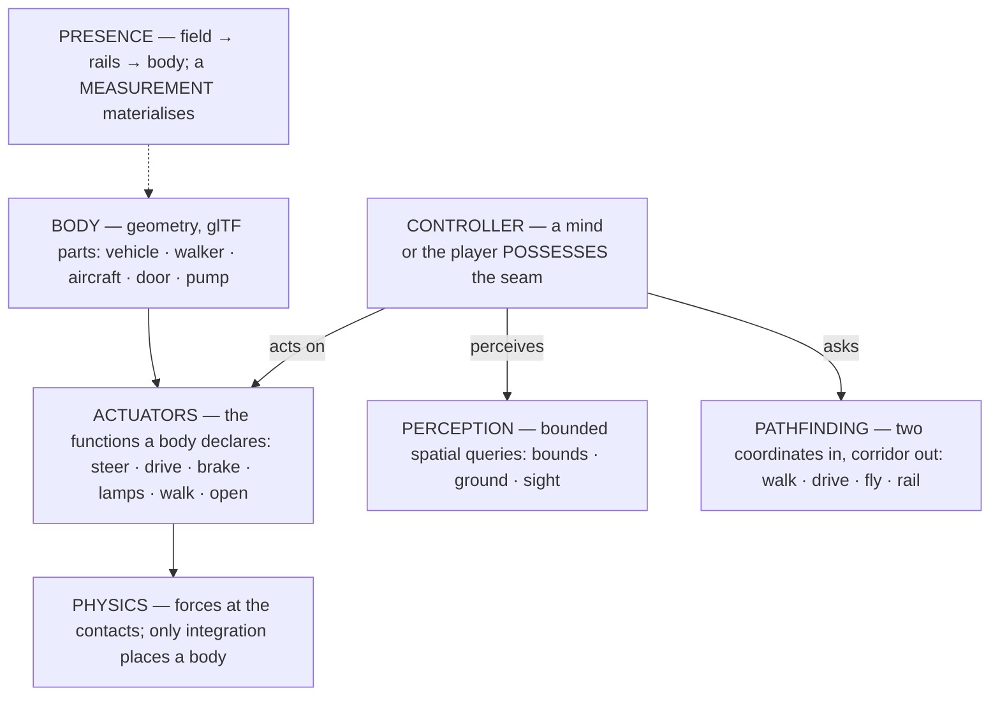
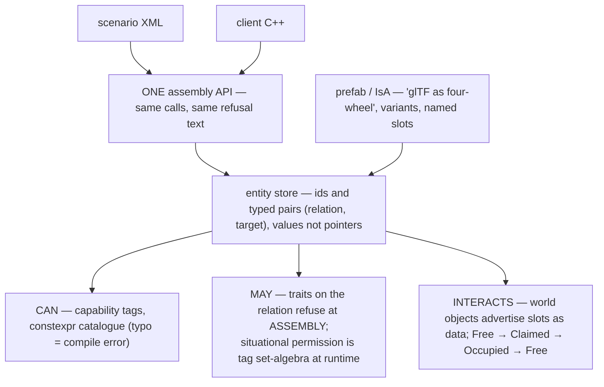
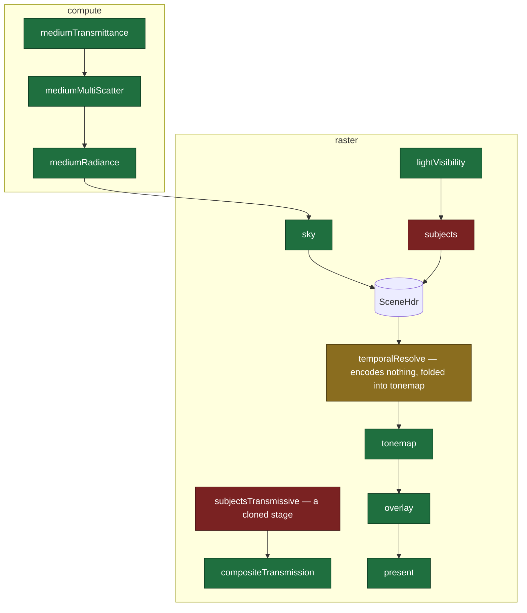
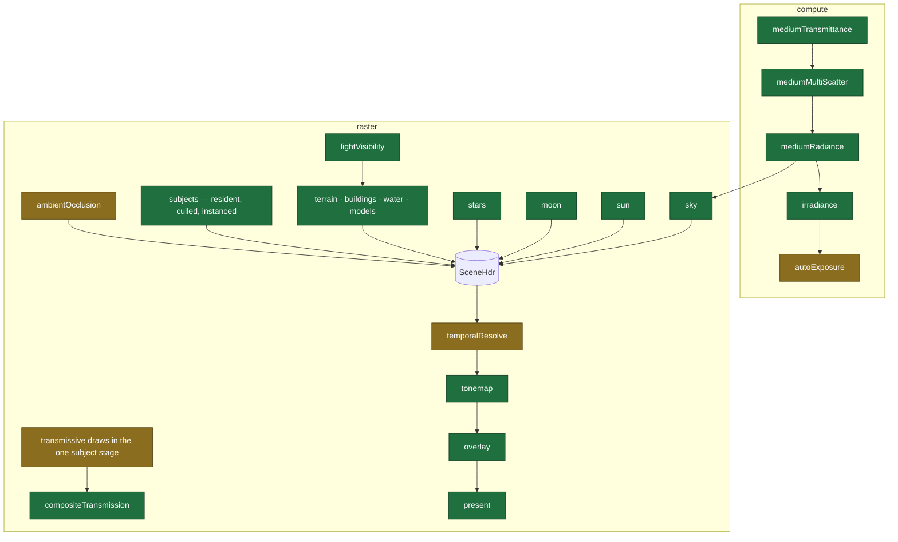
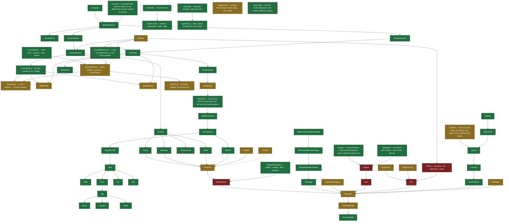
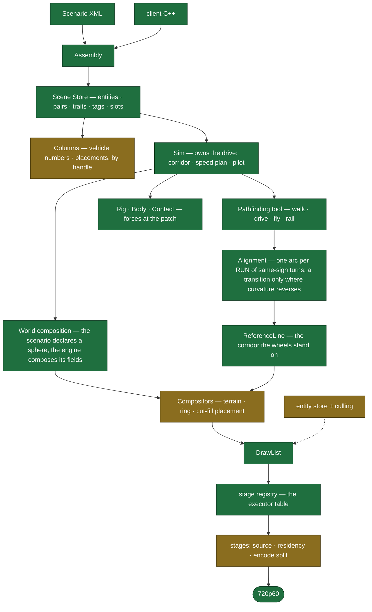
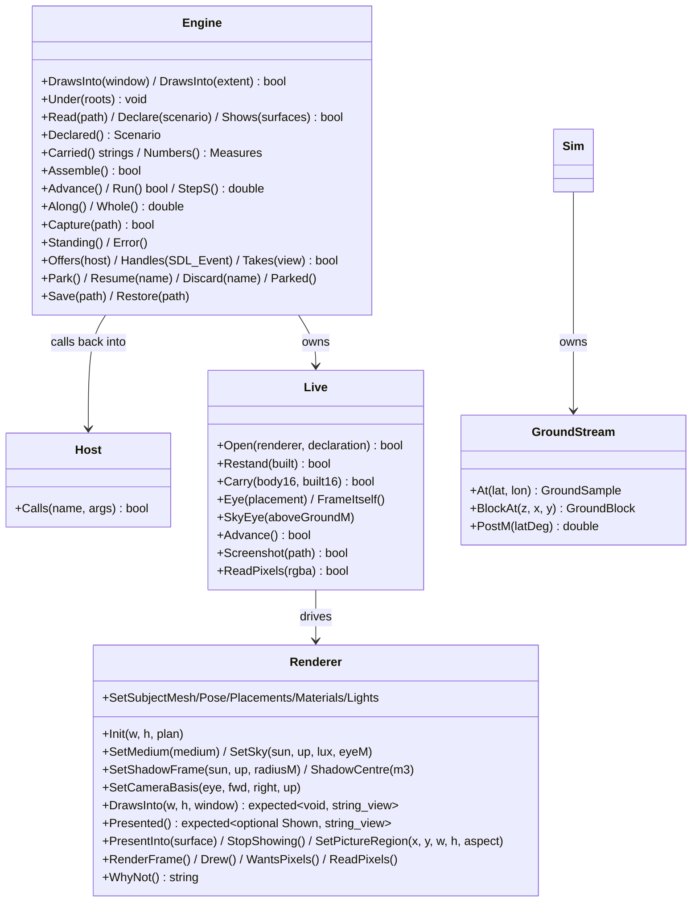
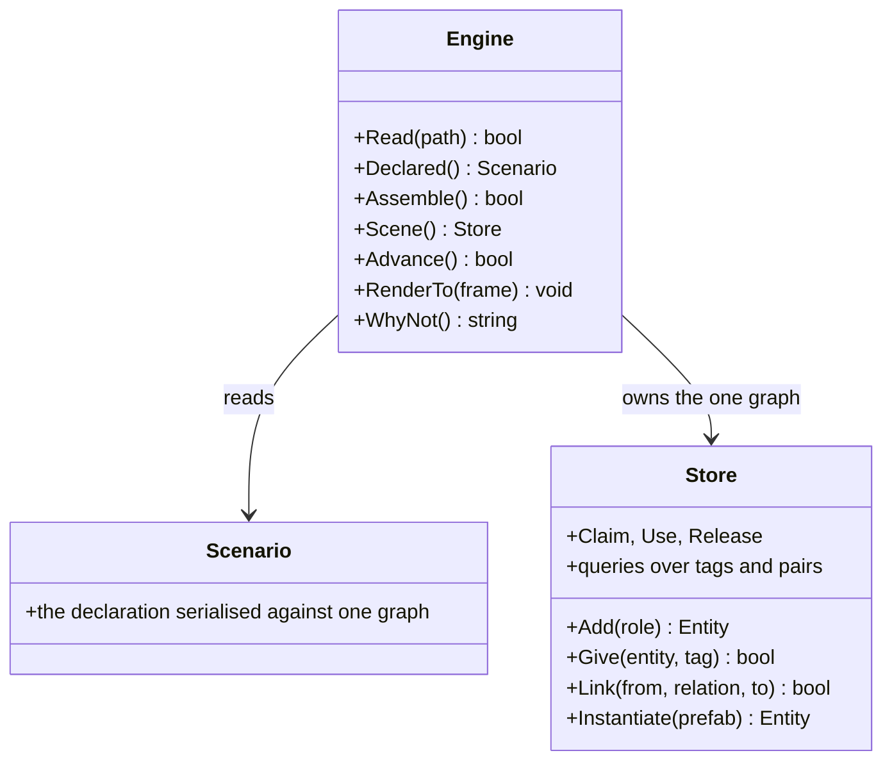
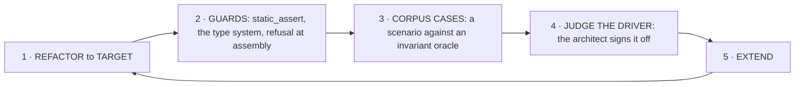

# Outshine

**A modern game engine combining the best of RAGE and Unreal.** Development platform IS the target:
Apple A18 Pro (2P+4E cores, 5 GPU cores, 8 GB, Metal 4), **720p60 held** — p50/p95/p99 over a moving
camera, never a mean.

**THE BENCHMARK IS A QUARRY, NOT A SPECIFICATION.** RAGE and Unreal are shipped and outshine is
not, so where they have settled a question, their answer is EVIDENCE and the burden is on
departing from it. But neither is the target: the job is to take what each got right, refuse what
each got wrong, and answer to the tree we are actually building. Where they disagree — RAGE's
decisionless pools against Unreal's toolable modules — take both if both hold, and say which one
this tree is following and why. Where they agree and the tree does not, the tree is the finding.
Where neither has the question, decide it and write down the reason. **The decision is mine to
make and the reason is what I owe** — a design that cites a benchmark instead of arguing has
argued nothing.

**And the two quarries are not equally open.** Unreal's source can be read, so a claim about
`FEngineLoop::Tick`, `Build.cs` dependency declarations, `Public/`/`Private/`, or
`AddToWorld`/`RemoveFromWorld` stands on the thing itself. RAGE is closed, and what is known of
`atArray`, `fwPool`, `fwEntity`, `phBound`, `gameSkeleton` or the `rage::`-versus-`C` split comes
from public reverse engineering — FiveM/CitizenFX headers, modding documentation, Rockstar's own
conference talks. Broadly corroborated and NOT authoritative. So a rule that leans on RAGE alone
carries less than one that leans on Unreal alone, and one that leans on a RAGE detail nobody can
check carries least of all: state the confidence where it matters, and never let a reconstructed
detail outrank a measurement of THIS tree.

**What an engine IS**: an interactive physics simulation with a focus on graphics — physically as
accurate as NECESSARY, graphically as good as the FRAME BUDGET allows, temporally DETERMINISTIC.
Each of those three is a bound, and the middle one is the bound "as good as possible" does not
carry: a target without a ceiling cannot be missed, and a stage that was as good as possible six
times over is the god stage. **The engine knows no cars and no aircraft** — only bodies, forces,
actuators and control. A control command comes from the player through bindings or from a mind;
it ACTIVATES a force, and only integration places a body. RAGE keeps `CVehicle` in the game layer
and Unreal keeps wheeled movement in a plugin; a vehicle noun inside the engine core is a finding
wherever it stands.

- **SDL3 is REQUIRED and `include/Outshine.h` says so** by including it: the CLIENT owns the process and calls `SDL_Init`, the library never does. **SDL_GPU is one renderer, not the door** — `SDL_Window` is SDL3's core, so the door stays renderer-neutral. **glTF 2.0** is the only content surface
- **C++23**, `-Wall -Werror -Wpedantic`, one `-std` for the whole tree; `static_assert` and the type system over checkers; `std::span`/`std::string_view` at boundaries, `std::mdspan` for field and instance views, `std::expected` where a refusal carries its reason
- **Precision has ONE boundary and it is the camera**: the scene keeps 64-bit positions and the
  renderer is camera-relative in 32-bit — `Anchor - Eye` in `double`, the model-view-projection
  product in `double`, and the cast to `float` only at the uniform push
  (`src/render/stages/SubjectDraw.cpp:841,846,854`). A `float` that ever holds a world position
  is a defect; a `double` that reaches a shader is a different one
- **SIMD- and optimization-friendly**: contiguous, one-width, pointer-free layouts; fast path on the hot path; batch over per-item; bounded terms on the frame path (no alloc/lock/disk/unbounded block)
- **Declarative**: scenarios declare, the engine behaves; content = data, engine = verbs; the consumer selects from a `constexpr` catalogue and cannot add to it. **A section that is NOT declared decides nothing** — its `Declared` flag is read where the decision is made, and what stands in its place is the engine's own default, never the zeroes of a struct nobody filled in
- **A SCENARIO IS A STREAM, not a value that is re-declared.** The engine streams from its
  generators and a scenario arrives the same way: `Declare` seeds, and after that parts enter and
  leave. Swapping a part must be EASY and FAST — reuse what can be reused, recompute or allocate
  only what changed. Both benchmarks say it and neither rebuilds a world to change part of one:
  Unreal streams levels into a persistent world with `AddToWorld`/`RemoveFromWorld`, budgeted and
  incremental across frames, and spawns and destroys actors against it; RAGE swaps one IMAP group
  for another through a map change against a streamed map data store, out of decisionless pools.
  The measurement is a cost bound: the work a declaration causes is proportional to what it
  CHANGED, never to how big it is
- **Batteries as declarations**: outshine ships convenience components -- generators, providers, world templates and factories (`Planet(params)` → a Scenario value) -- all catalogue citizens the scenario selects; the engine core stays scenario-agnostic
- **Every number carries its origin** (derived · measured · `[SET]`) with unit and population; no magic numbers; calibration measures, never decides
- **The code carries NO comments** — `src/`, `include/` and `apps/` hold no `//`, no block, no
  TODO, no derivation, no board number: names and structure carry the meaning, a number's
  origin lives in its board item and its commit, and prose may stand in a PROOF because a proof
  explains what it proves -- a proof being any source that carries `Covers("`, wherever it
  lives, and every source that does not being bound; work items live in `board/`, code never
  names them
- **Infrastructure built from OSM is PLAUSIBLE and geometrically correct, never necessarily
  true to the real road**: the data is a source of shape, not a specification to be reproduced,
  so a corner the graph demands is a finding only where it is implausible or geometrically
  wrong — never merely because the real road there is built to another class. And OSM does not
  carry the third dimension: **bridges, ramps, over- and underpasses, tunnels and every other
  3D course are RECONSTRUCTED**, and what a reconstruction owes is four kinds of plausibility —
  **geometric** (it closes, it is continuous, it does not intersect itself or what it crosses),
  **physical** (a vehicle can drive it at the speed the class implies), **static** (it stands:
  spans, piers and clearances that could carry their own load), **architectural** (it looks
  like the thing it is). A guess that holds all four is right; one that holds three is a finding
- **GREP BEFORE YOU WRITE.** A new type, function or file is preceded by a search for what it
  would do; a capability that looks absent is usually present and unreachable, and that is the
  finding
- **Cycles is the oracle** for correctness; references are for ambition; the corpus is a driver, not a certificate
- **One world space**; a failure is loud; something is always drawn; delete on the day you replace
- Artefacts go to the system temp dir, never the tree; `git log` is what was — no journal

**Diagram colours** — CURRENT: green = correct by current knowledge · amber = uncertain · red =
provably wrong · grey dashed = absent. TARGET: green = certain · amber = probable.

## Architecture (TARGET)





## Render plan (CURRENT — what executes, judged as architecture)




| red | what makes it red, at HEAD |
|---|---|
| `SUBJ` | one stage carrying six responsibilities -- `ShaderSource(const SourceOptions &options)` (SubjectDraw.h:30), `PipelineAt(VertexLayout layout, SurfaceKind kind, bool cullsBack)` (:154), `FlushCrossings(SDL_GPUCommandBuffer *commands)` (:148), `SetPlacements(const double *models, size_t rows, std::string &error)` (:51), `SetLights(std::span<const SubjectLight> lights, std::string &error)` (:89) and `EncodeDepthOnly(const double lightFromWorld16[16], const double eye[3], int atlasPx,` (:96) beside its one `void Encode(const FrameContext &ctx, const PassRecording &into)` (:93); nothing culls |
| `GLASS` | `{Stage::SubjectsTransmissive, Provenance::Content, PassKind::Raster, "subjectsTransmissive",` (RenderCatalogue.h:268) is a full clone of `{Stage::Subjects, Provenance::Content, PassKind::Raster, "subjects",` (:263) -- transmissive draws belong in the one subject stage |

## Render plan (TARGET)



## Class structure (CURRENT)




| red | what makes it red, at HEAD |
|---|---|
| `World` | spells camera and LOD inside the ground layer: `struct Eye` (World.h:49), `Refine(const Eye &eye, double nowMs)` (:55), `EyeInMercatorBand()` (:118), and 9 `const double eye[3]` (:189-195) |
| `SubjectDraw` | six responsibilities in one class: `ShaderSource(const SourceOptions &options)` (SubjectDraw.h:30), `PipelineAt(VertexLayout layout, SurfaceKind kind, bool cullsBack)` (:154), `FlushCrossings(SDL_GPUCommandBuffer *commands)` (:148), `SetPlacements(const double *models, size_t rows, std::string &error)` (:51), `SetLights(std::span<const SubjectLight> lights, std::string &error)` (:89), and `EncodeDepthOnly(const double lightFromWorld16[16], const double eye[3], int atlasPx,` (:96) beside the one `void Encode(const FrameContext &ctx, const PassRecording &into)` (:93) a stage owes |
| `Sim` | `class Sim {` (Sim.h:37) is a hand-wired god facade the component model replaces, and since the cut it has NO consumer at all: `grep -rn '"Sim.h"' src apps test include` finds one line, `src/engine/Sim.cpp:1`. 798 lines, 25 `#include "`, five green nodes hanging off it |
| `Live` | `class Live {` (Live.h:71) reaches the renderer and the layout from one class — `#include "Renderer.h"` (:18) beside `#include "Layout.h"` (:13) |
| `Engine` | `bool Engine::State::Composes(void) {` (Engine.cpp:279) lays the ring at `auto laid = LayPatchwork(Stack.Pool(), over);` (:322) behind `const bool overADrive = false;` (:287), a branch nailed shut because the ring is anchored on its own ECEF origin and the vehicle on the corridor's (board:1890). Of the five bindings `f31.scenario` declares, `throttle`, `brake`, `steer-left` and `steer-right` reach `Host::Calls` and no client answers them, so no key moves the car. Tables and Sounds are accepted and never advanced |

| amber | the form in question, at HEAD |
|---|---|
| `Wayfinding` | `bool Network::Weave(std::string &error) {` (Wayfinding.cpp:110) welds loose ends onto the edges they end on by reading an index it invalidates as it goes: `byEdgeCell` is built at :243 and never updated, while `unlink(bestFrom, bestTo)` (:321) plus `link(bestFrom, loose)` (:329-330) split the edge it lists, so a second end that ties onto the same segment finds a pair that is gone, removes nothing and links a parallel chord. The tie is measured only by its own printed counts -- 2450 ends, 4193 pieces, 26853 of 45248 joined -- and no case in `test/` names `Weave` (board:1894) |
| `BuildingField` | `class BuildingField {` (BuildingField.h:20) holds a `struct Footprint` of raw index ranges (`uint32_t FirstPoint = 0, PointCount = 0;`, :24) and takes a mesher by pointer (`void Shapes(const StructureMesher *mesher)`, :32) -- a field that tessellates |
| `WaterField` | `void Tessellate(const OsmField &field, std::vector<float> &out) const;` (WaterField.h:47) -- the same: a field that meshes rather than one that answers |
| `Subject` | `class Subject {` (Subject.h:98) carries 42 `[[nodiscard]]` over one glTF document -- the getter carpet |
| `DrawList` | `class DrawList {` (DrawList.h:167) with `struct VertexLayoutRow {` (:49) beside it: the list and the layout table in one header |
| `Renderer` | `class Renderer {` (Renderer.h:34) publishes 55 `[[nodiscard]]` and 17 `const {` -- the getter carpet, on the frame path |
| `TonemapStage` | `class TonemapStage {` (TonemapStage.h:14) is where `temporalResolve` folded into, so it carries two picture decisions |
| `LightVisibilityStage` | `class LightVisibilityStage {` (LightVisibilityStage.h:16) -- one shadow atlas for every light, no cascade selection declared |
| `Frustum` | `struct Frustum {` (CameraBasis.h:94) sits in `src/content/shade` beside the camera basis, while culling belongs to the compositor |
| `Ephemeris` | `inline void EarthSunPos(double lat, double lon, double utc, float *el, float *az) {` (Ephemeris.h:11) -- a whole-function header, out-parameters by pointer, and `constexpr int kEphemerisMinYear = 1901, kEphemerisMaxYear = 2099;` (:9) bounding a sphere the engine may not name |
| `RegionForge` | `class RegionForge {` (RegionForge.h:18) forges regions from a client layer |
| `GltfStudio` | `struct Studio {` (GltfStudio.h:26) beside `struct StudioScratch {` (:49) -- the studio and its scratch are two spellings of one stand-up |
| `DriveAssembly` | `[[nodiscard]] bool AssembleDrive(const Store &scene, const Assembled &cast,` (DriveAssembly.h:60) takes a product's worth of inputs, listed one per line, and a product that needs that many is a product whose shape is not settled |
| `CorridorLay` | `[[nodiscard]] bool LayCorridor(const Path::Route &route, const GroundQuery &ground,` (CorridorLay.h:100) -- same shape, same question. The product it lays holds no band parallel to its stations: `std::vector<Station> Fine;` (:52) is one extent and `At(double alongM)` (:68) one clamped index, so an unlaid corridor refuses at the tick's entry instead of returning a default per read (board:1820) |
| `DriveTick` | `[[nodiscard]] const Ridden &DriveTick(const Corridor &way, const Rigged &stood,` (DriveTick.h:111) hands back the accumulator the caller owns -- `Ridden &out = drive.Tally;` (DriveTick.cpp:38). The copy is gone and the struct is 2472 -> **440 bytes, which `static_assert(sizeof(Ridden) == 440)` at DriveTick.cpp:18 is the measurement of**; what stays in question is a product that is both a per-tick answer and a route-long tally (board:1815) |
| `TAA` | `{Stage::TemporalResolve, Provenance::Content, PassKind::Raster, "temporalResolve",` (RenderCatalogue.h:278) declares a stage that encodes nothing of its own -- it is folded into tonemap rather than standing as its own resolve |
| `TilePool` | `class TilePool : public TileMeshes {` (TilePool.h:30) holds 3 `std::mutex`, a `std::condition_variable`, a `std::map` and a `std::set` where a slot table and a ring would do -- a decisionless pool holds no tree |
| `Typeface` | reached and correct on the picture -- three faces at two sizes in the viewer's own frame -- and `[[nodiscard]] Glyph Shape(char32_t code, double sizePx, Family family) const override;` (Typeface.h:30) still rasters lazily from inside the draw: `SDL_Surface *ink = TTF_GetGlyphImage(set, (Uint32)code, &kind);` (Typeface.cpp:192) and `SDL_ConvertSurface(ink, SDL_PIXELFORMAT_RGBA32);` (:200) allocate and free two surfaces per first-sight glyph. The face is read once into memory and each (family, size) opens its own instance over it, so no size flushes a shared cache and no draw touches the disk (board:1892) |
| `TriggerField` | reached -- `auto stood = TriggerField::Stand(scenario.Volumes, scenario.Events);` (Engine.cpp:610) stands one and `Volumes->Probe(0, body.PositionM, (double)Standing->At() * kTickS);` (:929) probes the driven body every tick -- and NOTHING fires: a box of 1e7 m extent about the origin, which the body cannot be outside of, drains empty, because the volume stands in the scenario's origin and the body in the corridor's (board:1891) |

| stranded | its only way to a client, at HEAD |
|---|---|
| `Forest` | `src/engine/Sim.{h,cpp}` and nothing else in `src/` |
| `Buildings` | `Sim.{h,cpp}`, `BuildingField.cpp`, `OsmLayer.h`, `World.{h,cpp}` -- every one of them inside the ground/client pair |
| `Water` | `Sim.cpp`, `World.h` |
| `Infrastructure` | `Sim.h` |
| `RegionForge` | `Sim.h` |
| `BusGraph` | nothing outside its own two files |
| `GroundPatchwork` | `#include "GroundPatchwork.h"` (Engine.cpp:25) inside `bool Engine::State::Composes(void) {` (:279), which `Assemble` now calls -- and `const bool overADrive = false;` (:287) shuts the only branch a drive could reach it by, while `grep -rl '<ground' --include=*.scenario .` finds NO scenario in the tree that declares one. No tile has reached a frame |

## Class structure (TARGET — where the tree is going)



## Public interface (CURRENT)



## Public interface (TARGET — one door)



## Board

```mermaid
stateDiagram-v2
  [*] --> open : filed (defect found = item, same round)
  open --> active : being worked NOW (groom parent/depends)
  active --> [*] : the file is DELETED; the commit names the proving test
  active --> open : parked
```



`board/` is ONE FLAT DIRECTORY. One file = RFC 822 header + markdown body. Fields: `Type`
(feature|task|bug|issue) · `State` (open|active) · `Parent` · `Area` · `Tags` · `Depends` ·
`Regresses` · `Supersedes`. Filename `NNNN_label.md`; number = identity; no dates — git is the
truth. **Closing is DELETING the file**: what it said is in the commit that removed it.
Titles say what WILL BE TRUE. Commits reference `board:NNNN`. `State: active` marks what is
being worked on right now — always.

**GIT IS THE LOGBOOK. The item is what is true NOW.** A newer measurement REPLACES the older one
it corrects; a paragraph the tree has overtaken is deleted, not appended after. A closure states
what became true and names the proving test and its negative control — the derivation, the
numbers and the story belong in the commit message, which is where anyone looks for what
happened. An item that has grown three stacked rounds of prose needs rewriting, not a fourth.

```sh
grep -l '^State: active' board/*.md                  # in flight NOW
grep -l '^Type: bug' board/*.md                      # by kind
grep -l '^Parent: 0007' board/*.md                   # a feature's children
git log --grep 'board:0042'                          # every commit on an item, and its closure
ls board/*.md | grep -o '[0-9]\{4\}' | sort -n | tail -1  # next id, derived
```

## Setup

| | |
|---|---|
| `src/` | the library entire; `src/assets/` its declared data; no entry point, no test. **The directory IS the dependency tier and the tier is DECLARED**: `LayerReaches` in `test/run.sh` states what each may include and `--audit-layers` refuses a source that crosses it -- and refuses a CYCLE between two modules
inside one tier, which the tier table alone cannot see. `base/` (math · geo · format · spatial · io) reaches nothing; `content/` (gltf · shade) and `actor/` reach base; `world/` (ground · generators · data · sky · weather) reaches base and content; `render/`, `scene/`, `scenario/`, `ui/`, `audio/`, `host/`, `compositor/` and `sim/` reach what their row says; `engine/` reaches all of it and is the door's own implementation, which is why it is not called `clients/` — the clients live in `apps/`. Unreal declares the same thing per module in `Build.cs`; a layering that is only a convention is how a 44-header drawer forms (board:1902) |
| `test/` | `test/` the established corpora (Khronos · WPT · test262); `test/khronos/validator/` the 263 glTF-Validator cases, judged as a REFUSAL against Khronos's own report; `test/harness/` their scorers and the board/harness claims. Everything under `test/` reaches the library through `include/` and NOTHING of `src/` |
| `apps/` | the CLIENTS, built ON the library and each a product. **A client is almost no code, and its LINE COUNT is a measurement of the door**: when a client needs much code, the interface is too complicated and the door is the finding, never the client. At HEAD `apps/driver` is 223 lines and `apps/viewer` 349, and both are too long (board:1898): **`apps/driver`** is outshine's one integration test and the architect signs it off; **`apps/viewer`** shows any scenario and becomes a scenario itself, layered over the one it shows (board:1880) |
| `Makefile` | build · test · clean, nothing else |
| `board/` | the working system (above) |

**Every `make` writes `build/STATE`** -- what the library IS, on one page, generated: the door's verbs
extracted from `include/`, the tier graph and what each tier may include, every claim a case
`Covers`, every standing red, every open item, and the counts. There is no RFC for this and the
nearest established shapes are a `.pyi` stub and a man page's SYNOPSIS -- signatures without
bodies. Those answer what a door OFFERS; this answers what the tree PROVES, which is the half
that goes stale in prose. Nothing in it is written by hand, so nothing in it can lie about the
tree. It is an artefact and lives with the build, never in the tree, so it cannot go stale and
cannot be edited into a lie: 16 kB, 247 lines, one command.

`make` builds the library and every program under `apps/` into `build/`. `test/run.sh` is the
only TEST runner and runs nothing else; by default it runs the corpora and the claims, while
`tools` and `apps` run when named. A standing RED is declared in `EXPECT_FAIL` with its count,
and the gate turns red the day such a case passes with the declaration still in place.

**The front door is three headers**: `include/Outshine.h` the verbs, `include/Scenario.h` the
declaration, `include/Event.h` the return channel — `Host`, `Argument`, `Measure`, the shape RAGE
keeps in `fwEvent` and Unreal in its delegate header, apart from the engine door in both. outshine
loads a scenario and runs it — that is the whole of it. A client that needs an assembly view, a
transport or a parser is a client reaching past the door, and the door is what wants widening,
never the reach.

## The order the work is done in



**EVERY CASE IS A SCENARIO WITH AN INVARIANT ORACLE.** A case declares what the engine should
stand up, the engine runs it, and the answer is compared against a reference whose truth does not
depend on our design. Nothing else is a test here — a case that asserts the shape of our own
architecture specifies nothing while TARGET moves, and blocks the refactor it should serve.

What a corpus HOLDS decides what it can prove:

| grade | it holds | it proves |
|---|---|---|
| **SPEC** | a standards body states the answer | conformance |
| **TRUTH** | a measurement or computation carried to more digits than we hold | correctness |
| **SNAPSHOT** | another implementation, frozen | agreement, never correctness |
| **INPUT** | nothing is supplied | that we survive it |

**A FUZZ CASE IS INPUT GRADE AND DETERMINISTIC.** It proves survival and never correctness. A
random fuzzer belongs OUTSIDE a gate that must not go silent: it finds a different thing every
run, so its green means nothing and its red cannot be repeated. A fuzz case in the gate walks a
FIXED schedule — every mutant a pure function of (seed, position, kind), the same on every
machine forever — and a long random soak is a separate job whose OUTPUT is a reduced case
committed here, never a tick. Its two controls are that the schedule produces documents the
reader REFUSES and documents that still STAND: a reader that accepted everything, or one that
refused everything, would otherwise pass by silence.

**`test/<vendor>/` is the vendor's word; `test/harness/outshine/` is OUR OWN ORACLE and carries less.**
A khronos, wpt, test262 or geographiclib case is a SPECIFICATION: it fails and the code is
wrong, full stop. An `outshine/` case is a law of nature we implemented ourselves — static
equilibrium, a closed form, a conservation — and it fails in TWO ways: the code is wrong, or the
oracle is. So an `outshine/` case must carry its DERIVATION in prose beside the number, because
the derivation is the part a reader can check and the number is not. A self-built oracle that
states only a constant proves nothing but that we agree with ourselves.

Effort has two halves and the second one bites: FETCH is a pinned URL and a hash; REACH is priced
by the two-header door. `test/CORPORA.md` is the survey — which established corpus asserts which
capability of TARGET, at which grade, and what it costs to reach.

**A client that compiles against `include/` and renders proves more than any suite.**
`apps/driver` is outshine's one integration test and its product; the hourly architect signs it
off on a fresh screenshot.

An architecture review lands hourly (cron :17, its own worktree, files but never edits `src/`).
It owns both maps, measures the distance CURRENT → TARGET, judges the driver on a fresh
screenshot, and writes the next hour's work order. Its brief is `.claude/agents/`.
