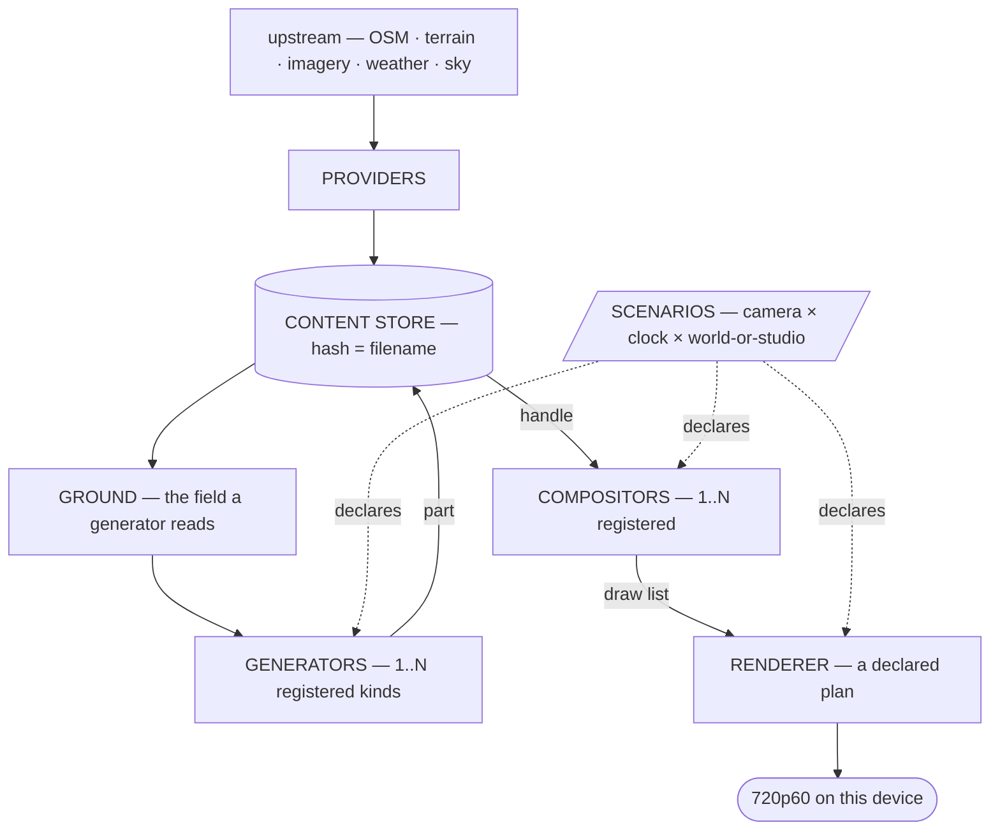
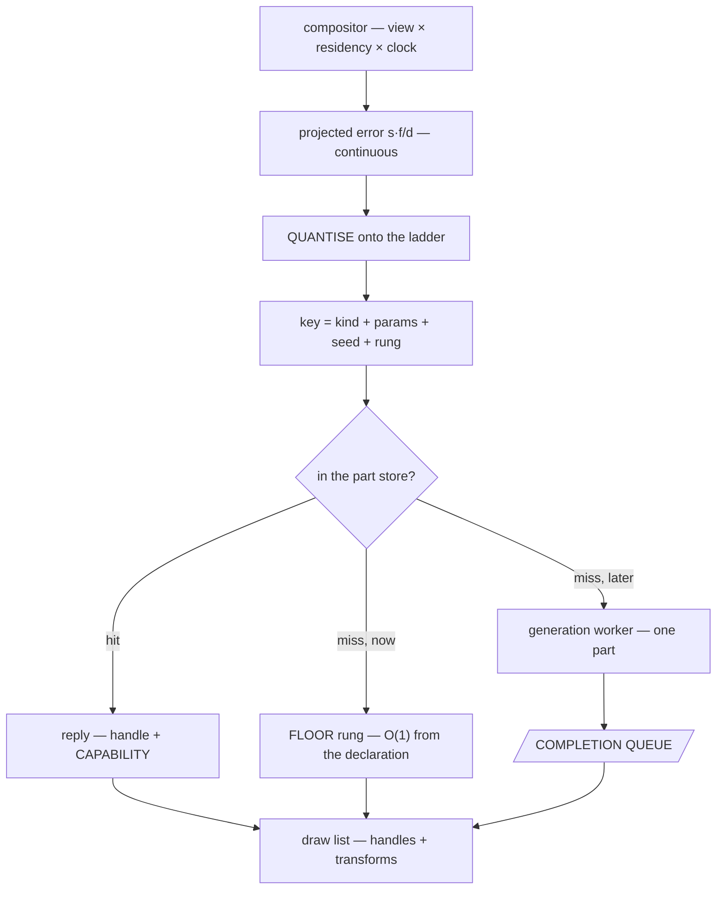
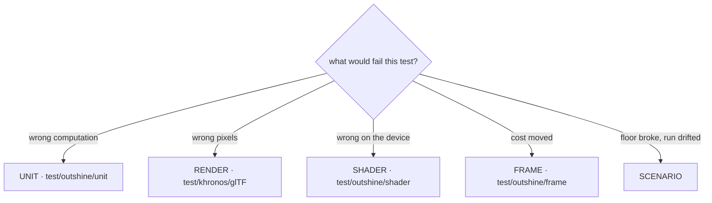
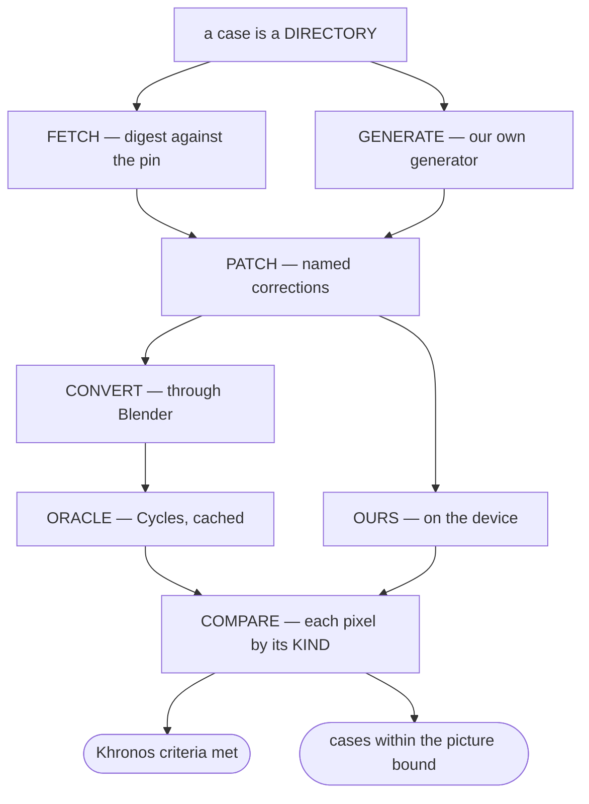

# Outshine

> **THIS IS A GAME ENGINE.** An OSM-based global open world, LLM-driven intelligence and an RPG above
> it; every piece of content from a **generator** behind one interface, external data behind a
> **provider** interface, actors that **think**, and declarative scenarios that declare interactive or
> non-interactive worlds — with or without a world at all. **SDL3, SDL_GPU and glTF are its backbone.
> 720p60 on this device is its target, and that target is the whole of its ambition** — a budget is
> falsifiable where a named game is only evocative.

The world is **loaded, not modelled**. **One physics system** carries walking, driving, flying and
swimming; an **epoch and decay dial** dresses the same geometry; the actors **think**; the setting is
post-scarcity. **The repository speaks one language: English** — code, comments, documents, commits.

**AND IT IS REACHABLE.** Not one piece of this is unsolved in principle: worlds this size are streamed
today, geometry reduces to a pixel of error today, a hard frame floor is held on weaker hardware than
this today. What is new here is the COMBINATION and the discipline under it — so the honest posture is
neither hope nor doubt but **appetite**. The pieces exist; assembling them well is the work, and the
work is the good part.

## What this file is, and what it is not

It is the **vision**, the **constraints**, the **stance**, the **architecture** and the **setup** — read
first, by everyone, and binding.

**IT SAYS WHAT WE WANT AND WHAT WE CAN, and that is a rule about its grammar and not only its mood.** A
rule written as a prohibition is satisfied by doing nothing — every *never* in a document is obeyed
perfectly by an empty afternoon — so a file written only in prohibitions makes STOPPING the cheapest
correct action. **Every rule here that can be phrased as something the engine does, is.** Where one
genuinely cannot be — a refusal, a thing that would be silently wrong — it is written as the narrowest
possible *no* with the reason beside it, and never as a general caution.

*So a line that reads as forbidding something is either load-bearing exactly as written, or it is a
line waiting to be turned around. Turning it around is welcome and needs no permission.*

It is **not the scope**: one line per feature, with a box and a stable id, lives in `board/` and nowhere
else. **If a sentence would need a checkbox, it belongs there.** The room here is permission to say a
thing **completely**, never to say **more things**.

The diagrams are Mermaid because they render, and because ASCII rots at the first edit.

## What this is built ON, and it is a short list on purpose

**SDL3** · **SDL_GPU** · **modern C++** · **this device at 720p60** — an Apple A18 Pro, 2 performance
and 4 efficiency cores, 5 GPU cores, 8 GB, Metal 4.

**The development platform IS the budget, and that is a luxury rather than a limit**: the machine the
work happens on is the machine the target is measured on, so every number is real the moment it is
taken and no port, no emulator and no second device stands between a change and its verdict. **A
one-device target is the shortest possible path from an idea to whether it holds.**

**The engine is C++ and nothing else**, which is what keeps one language between a thought and a frame.
There is **one door** beside it: a script may **prepare data offline**, committed beside what it
produces — that door is for the corpus, and there is exactly one such script, named in the setup below.
Everything at run time, in a test, in a gate or in the build is the engine's own language.

## Stance

**The owner's comments outrank everything.** The bar is a world that holds 720p60 out of upstream data
alone, and **the way is the goal** — a round that learned something is a good round.

**Build as though it will work, and measure as though it will not.** Those are not in tension: the
first decides what is attempted and the second decides what is believed, and a project that swaps them
either ships nothing or ships nonsense. **Every rule below that reads as a prohibition is there to make
the ambitious thing SAFE to attempt**, never to talk anyone out of attempting it. A tree whose defects
are named and bounded is a tree you can be bold in.

**Difficulty is information and not a verdict.** *Resistance is information* appears further down as a
warning against improvising; read it the other way too — a thing that pushes back is a thing worth
understanding, and the round that understands it has bought something. **A refutation is a result, a
withdrawal is a result, and a capability nobody could reach yet is a measurement of where the edge
is** — none of the three is a bad day.

**The run is months long and the vision is its destination, not its direction.** Every clause of the
first page is reachable from this tree by this session, and the board is its decomposition. **Over that
length a claim nobody re-measured becomes a fact**, so a number an agent reports is re-measured before it
is committed, and the round that refutes one is worth the round that produced it.

**Nothing is a possession.** Formats, directories, algorithms, interfaces, build, tools — all material.

**Good C++ and proven engine design.** The [C++ Core Guidelines](https://isocpp.github.io/CppCoreGuidelines)
are binding, and the established way is the starting point; either one deviated from is a defect until
its reason stands beside it. Prefer the shape that makes a mistake **unspellable** over the rule that
merely forbids it — a rule a checker counts can be broken and then reported; a rule the type system
carries does not compile.

**The engine is a library and it is platform agnostic.** It declares what it needs from a host and
calls nothing else; a kernel supplies it. Everything that runs it is a test.

**Testability is a design property, not an afterthought.** If a thing cannot be tested, that is a fact
about its shape. **Very high coverage is part of the claim and not an extra**: requirement
coverage is the target, line and branch coverage the instrument. Every commit is covered.

**Something missing is a task, not a limit.** "That number does not exist" ends with "so the tool gets
built". Distinguish **not measurable** — the thing yields no number — from **not yet measured**, which
has a cost and not a boundary.

**Every number carries its origin** — derived, measured or `[SET]` — with its unit and frame of
reference. **No magic numbers.** Performance is a **distribution over a moving camera**, p50/p95/p99,
never a mean. **Appearance is judged by eye and in motion**; a number decides whether the frame floor
holds, never whether it looks right. A cost that cannot be attributed is not a finding.

**The mathematics is deterministic.** If pace decides the result, the coupling is a bug.

**A derived correction produces a floor; a fitted one produces a smaller average.** When a correction
shrinks an error, that is not evidence it is right — the test is whether the residual lands on a term
already named, at the instrument's own limit, over the population where the answer is known
independently. A correction with a free parameter and a better mean is a frame fitted to a number.

**Calibration measures, never decides.** A startup benchmark may **propose** an error scale; the
scenario **declares** whether to take it. Otherwise pace decides the picture and every parity number
becomes a sample of a machine.

**The picture is a function of the declaration, not of the machine.** Same scenario, same pixels, on any
device. The device decides frame *time*, which is a distribution and either meets 16.67 ms or does not.
**The budget is fixed for a run** — a budget that moved would change the cache keys, and frame time
would become a function of frame time.

**An instrument's domain is part of its claim.** The failure is one sentence — *the number was right and
about something else* — and it wears four faces: **domain too narrow**, **input set too wide**,
**invariance too broad**, **population too small**. State the domain, the input set and the invariances
beside the number, or the number decides nothing.

**Name the problem in the vocabulary of the field before building it** — *streaming*, *resection*,
*LOD transition*, *screen-space error*. If no such name presents itself, the field is unknown, and
then the task is research rather than improvisation.

**A grep proves a string absent, never a capability.** Any negative existence claim names the
enumeration it is drawn from, exhaustive over the container, or it is written as *not found at these
paths* and says which. The instrument for a capability claim is to **exercise the capability** — and
three agreeing implementations of one wrong population is the same mistake counted three times, never
corroboration.

**A term rounded to zero is how a term becomes unnamed** — naming an arithmetic mechanism, computing
its magnitude and then rounding it away reads as rigour and deletes the term.

**A number can be broken without moving it, by moving the population underneath it.** A changed
threshold shows in a diff; a changed selection reads as the same metric and looks like progress —
*0.8854 over 40 472 steep pixels* against *0.9875 over 90 838 mostly-flat ones* is a repair that changed
nothing, reported as one that did. **Quote the population with the number, and prove a before-and-after
selected the same one.**

**A change that alters the picture by design cannot reproduce it to six decimals.** A repair whose
measurement comes back *identical* is not a small effect: it is evidence the repair never reached what
it was aimed at. **Identical is a finding, not a null result.**

**A rule about a comparison names which side it constrains**, or it forbids the symmetric case it was
never about.

**Before a criterion is disqualified, every rung above it is accounted for**: fix the engine · reduce the
oracle · patch the asset · disqualify. Disqualification is per `(case, metric)`, never per test, and it
is the last rung.

**The caveat first, every time.** Before a defect is reported the harmless explanation is actively sought
and named, with why it is ruled out. **A confounded finding costs a whole round.**

**Measure before you reach.** A suspected cause is measured before it is repaired, and **when the
measurement refutes the guess, the refutation is the round's result.**

**Look it up, do not recall it, and check the source rather than citing it.** A domain claim without a
source is a defect rather than a finding, and a source that does not support what it is cited for is the
same defect one step later.

**A run-wide average is not a zero point** when the quantity drifts across the run — take the
neighbourhood and say which. **A photograph is not a photometer** beyond a couple of stops. **A
colour-keyed population is built once on the reference and used on both sides**, or the mask moves with
the light and is not a ruler.

**A measurement pins its subject by a digest of the source, never by a build archive's hash** — an
archive identifies a build event and not a state of the code. **An instrument in the path is its own
field**, never folded into the number.

**Look at every image produced and report what is seen**, not what is expected. **The still is the
comparison resolution and not the acceptance**: the most expensive defects are the ones a single frame
cannot show, and they are decided in motion or not at all. **On a picture judgement the answer is yes or
no** — and the answer to a bad comparison is never more detail.

**What is replaced disappears in the same round.** A fallback is a dead path, and a dead path that can
still fire is worse than one line too many. Diagnostics are not dead paths.

**Every statement has exactly one place.** An argument standing in two places will drift the moment one
side is measured.

**Warnings are errors.** A pre-existing red is neither worsened nor repaired unasked — it is named.

**Half-built is worse than not built.** *I cannot solve this as stated*, with the measurement that shows
it, beats something that explodes later. **Resistance is information**: when a thing is hard, that does
not mean make it easier, it means there is something here you do not understand.

**Every artefact goes to the system temp directory, never into the tree** — a repository is what is
declared and what is built from it.


## This is a game engine, and every one of these outranks a smaller number

**These come before the C++ rules and before the measurement rules, because they decide WHICH number is
worth measuring.** Every one of them was paid for: each is a round this repository spent going the other
way.

### What is being built

**The unit of delivery is a FRAME, not a picture.** A picture that is right and late is wrong. Every
decision is finally about whether 16.67 ms holds on this device.

**720p60 on this device is the falsifiable target, and it needs no other reference.** A named game dates;
a budget does not. *If a thing cannot be traced to that budget, ask what it is for before building it.*

**An engine is a mechanism and content is data.** The engine spells verbs — place, cull, quantise, draw;
content spells nouns. A noun appearing in the mechanism is the defect this decomposition exists to
prevent.

**SDL3, SDL_GPU and glTF are the backbone and not implementation details.** The host surface, the device
surface and the content surface are each one interface, and each one is the whole of what the engine may
assume about the world outside it.

**The three ideas ARE the vision and nothing else has to be**: content from a **generator** behind one
interface, external data behind a **provider** interface, and actors that **think**. Everything in this
file serves one of those or the budget above.

### What good means here

**Right to the eye at 60 Hz is right.** Nobody is harmed by a pixel that is a code off. A residual worth
chasing is one that is visible, or one that is the largest thing between here and a frame.

**COVERAGE BEFORE PRECISION.** A case that exists and is red says more than a case that does not exist,
because a missing case reports nothing about anything. *This rule cost a round: the third decimal of one
pixel was worked while a hundred models had no case at all.*

**Breadth first, depth on demand.** Reach every feature shallowly before any feature deeply — the shallow
pass is what tells you which depth is worth buying.

**A known, named, measured defect is a finished piece of work.** Understanding beats a green light: an
engine whose every error is named and bounded is in a better state than one whose errors are merely
absent from a report.

**Perfect is a direction and never a destination.** There is no last decimal — so **move on when the
next one buys no frame and no picture**, and spend what it would have cost on the next capability
instead. *Finishing is choosing where the effort goes, not choosing to stop.*

### The six the frame path keeps, and they are what make the rest safe to attempt

*A rule written as a prohibition is satisfied by doing nothing; a rule written as a requirement is not.
These six are therefore stated as what the engine DOES, because each one is a thing to build and not a
thing to avoid — a frame that always lands, a world with nothing missing from it, a frame path made
only of bounded terms, and state that two frames in flight can both own. Hold these and almost
everything else is free.*

**THE FRAME LANDS.** A frame that misses is seen by everyone; a code of error is seen by nobody, so
every trade between the two goes to the frame — and that is what makes an expensive-looking idea worth
trying: the budget is where it gets decided, not the argument beforehand.

**SOMETHING IS ALWAYS DRAWN.** Absence is the one failure a viewer always notices, so detail degrades
and only existence refuses — loudly. **A coarse tree is a picture; a hole is not**, which is why a
generator may always answer with less rather than wait until it can answer with everything.

**THE FRAME PATH IS MADE OF BOUNDED TERMS.** Every step in it costs a number somebody can name, which
is exactly what an allocation, a block, a lock that might wait and a disk touch are not — so those four
live at load, and everything they produce is ready before the frame asks.

**THE FRAME PATH CARRIES VALUES, NOT NAMES.** A key is a trivially-hashable value; a name is something
looked up before the frame begins. **This is what lets one key serve a million instances**, and it is
the reason scale is a design decision here rather than a later crisis.

**EVERYTHING THAT GROWS STATES ITS BOUND**, and the bound is a number somebody chose on purpose. A
loop, a queue and a cache each say how far they go, so growth is a declared quantity and a run of any
length is a thing you can reason about.

**STATE BELONGS TO A FRAME.** Two frames in flight is the normal case, so every piece of state is owned
by one of them — which is what makes the second frame free rather than frightening, and why neither a
global nor a singleton has a place to live.

### How it degrades, because it will

**Every capability answers what it achieved, in both directions.** Short of what was asked and past it
are both facts the caller needs; only one of them is usually reported.

**Cost is answerable before the thing is made.** A part whose visibility can only be known by making it
has already spent what the cull exists to save.

**One key serves a million instances.** Anything keyed by instance is a design that has not met scale
yet.

**A budget is quantised before it becomes a key.** A continuous number in a cache key fragments the cache
by construction, and it does it silently.

**A worker signals readiness; it never asks a question.** Anything that has to ask has coupled the frame
to something that is not in it.

**Latency is a feature and it is the one nobody declares.** Input to photon is the number a player feels;
throughput is the number a benchmark shows.

### Working on it

**The corpus is a driver, not a certificate.** It exists to make the engine good, not to produce a score.
A green count that bought no capability is a number about a number.

**Fix the class, not the case.** A repair that helps one asset and no other is a patch; the same round
usually affords the rule underneath it.

**Build the thing that unblocks ten things before the thing that unblocks one.** Ranking by impact is
cheap and it is almost never done.

**A tool that makes the next twenty items mechanical beats finishing the twenty-first by hand.** Ask, at
every item, whether it is the last of its kind — and if it is not, build the thing that ends the kind.

**Prefer the shape that makes a mistake unspellable.** A rule a checker counts can be broken and then
reported; a rule the type system carries does not compile.

**A dead path is worse than a missing one.** Anything that can still fire and should not is a bug waiting
for a frame that takes it.

**Delete on the same day you replace.** Two ways to do one thing is one way and one trap.

**When two designs are defensible, take the one a stranger could not misuse.** The reader of this code is
tired, and so are you.

**Ship the vertical slice.** One feature working end to end, from provider to pixel, is worth more than
five features working in the middle.


## The engine

The owner's decomposition, and it is one line: **generator (tile, tree, house, car, …) → compositor
(terrain, forest, city, traffic, …) → renderer (draw list)**. Each layer is defined by **what it may not
spell**, and the include sets are what make that true rather than a rule.



| Layer | Produces | May not spell | In the tree |
|---|---|---|---|
| **providers** | fetched bytes — one interface, ranked, absence hands over | — | `src/data` |
| **Ground** | the field: height · slope · class · edge distance · water · ring · declared tables | camera · frustum · frame index · clock · LOD level · device · sun · weather | `src/generators` |
| **generator** | **one part, never an aggregate**, from `(kind, params, seed, budget)`; replies part **+ capability** | a camera · a neighbour part · a draw list · a device | `src/generators/draw`, `src/gltf` |
| **compositor** | **one draw list, never geometry** — places, culls, quantises the budget, batches | a device · a pipeline · a texture · a shader · a pass | `src/world`, `src/generators` |
| **renderer** | pixels, from a plan and a draw list | **any content noun** | `src/render` |

**The three edges are the only edges.** A generator never calls a generator; a compositor never calls a
renderer; a renderer never calls back. Where a part depends on another part — a road cut into a terrain
tile — the dependency travels as **data through Ground**, never as a call. That is the house rule *peers
never call each other*, stated for content.

**The word "generator" is overloaded in the tree, so read it by the vocabulary above.** `Forest`,
`Buildings`, `Water`, `Ground` and `Infrastructure` under `src/generators/` answer *what stands where* —
they are **compositors**; `src/generators/draw/` answers *what one of them is shaped like*, and those
are **generators**. They already live behind different interfaces with different include sets.

**Each layer answers to a different instrument**, which is what makes the decomposition testable rather
than tidy: a generated part is a render case against the oracle, a composition is a scenario case over a
moving camera, and the renderer answers to the Khronos criteria. **A layer that cannot be named on this
diagram does not belong in the engine.**

### A scenario's own glTF is content like any other

**A file is a generator kind, never a scenario special case.** `kind = gltf-file`, taking a budget and
replying with a capability like every other. **The compositor must never learn what produced a part** —
a second arrival route is a second case, and *no content noun has a spelling in the renderer* begins
leaking one layer up the moment there are two.

**A glTF is not one part, so the file generator is not exempt from *one part, never an aggregate*.**
`Gltf::Subject` already holds a vector of parts with per-part material and vertex range. It decomposes
where every aggregate does: **the file's node hierarchy is the rule**, and the parts it names are
ordinary requests. *A declared scene has a rule to derive, so nothing here justifies a private
interface for this one case.*

**A further compositor is `declared`** — same interface, same culling, same selection, placements **read
rather than computed**. `Clients::Show` is its degenerate case: one part, one transform, already running.

**The key keeps its shape and needs no exception**: `(kind, params, seed, rung)`, with **params = the
content hash plus which primitive**, a seed nothing uses, and a rung whose range happens to be one. A URI
is not a value — two can name one file and one can change under a run — so hashing is what keeps *the
picture is a function of the declaration* true. **Every compositor quantises, `declared` included**, or
a continuous budget enters a key and fragments the store per instance the first time a scenario places
two hundred props.

**One rung is a capability statement, not a gap.** `achieved` will rarely equal `requested` and says so
in both directions — and **no impostor** and **cannot be reduced further** are two separate declarations,
or a later generator with rungs and no impostor reads as unreducible.

## The render pipeline

Nothing is fixed. The consumer names an **output**; the compiler **pulls the plan backwards** over a
`constexpr` catalogue and the impossible plan is largely unspellable rather than refused.


| | |
|---|---|
| **`Writes`** | *the resource does not exist without this stage.* A missing producer is a **refusal**. Exactly one `Writes` producer per derived resource, held by `static_assert` |
| **`Contributes`** | *the stage draws into a target somebody else declared.* A missing contributor is a **picture choice** |
| **`Reads`** | an input edge. Every read has a producer, and that is a `static_assert` too |
| **machinery** | the stage's absence makes the picture **impossible** → the compiler pulls it from the requested output |
| **content** | the stage's absence makes the picture **different** → the consumer declares it |
| **the 5 geometry units** | terrain · buildings · water · models · subjects — **independently declarable, one shared LOD cut**, so a coverage case can ask for subjects alone |
| **`FallsBackTo`** | `SceneLinear` aliases `SceneHdr` when no temporal stage was declared, so a picture plan without TAA reaches the tonemap with no blit that exists only to copy. **Every alias the compiled plan applied is published** |

**Three shapes and no fourth**: **compute** (a dispatch chain over resources) · **fullscreen** (one
triangle over a target) · **geometry** (a draw list against attachments). The stage row is a *pass*
declaration; the per-draw quantities — sort key, batching, instancing, surface state — live one level
below it, in the draw list.

**A scenario selects from the compiled catalogue and cannot add to it.** *The consumer decides what to
render, out of what the engine can render*, and the second half of that sentence is a compile-time set.
**The core dictates the pipeline**: a material is a row of numbers with no field that can switch
pipeline state — which is the same door glTF 2.0 closed when it removed shaders from content, so that
one declarative material model could render under any API. **Generator bakes, or renderer implements;
there is no third path where content ships a program.**

**Who makes an asset is not the engine's business, and textures are allowed.** Bark, leaf, façade and
ground are sampled like any other texture — they are simply **generated here** at the generator's
declared budget, resolution included, and then cached. So *"their technique needs an authored asset"*
never ends an argument: name the generator that would produce it, and say what it must produce.

## The content request, the budget and the ladder

A request is keyed by content, **never by instance** — one key serves a million trees. The budget is a
**screen-space error in pixels**, because it is the only currency comparable across terrain, trunk,
façade and crown, and because it makes the LOD ladder an *output* rather than an input.



| | |
|---|---|
| **the ladder** | **global and fixed for the run**, and the compositor's — LOD levels exist as the quantisation of a continuous budget, never as a generator's published enumeration. **The generator still never sees a level.** Two parts at one projected error must land on one rung or the cache fragments by construction |
| **the key** | a trivially-hashable **value**: no string, no allocation on the frame path |
| **the capability** | achieved error, bounds, counts, impostor takeover error — **both signs published**, shortfall *and* over-delivery, because a quantised rung is deliberately finer than asked and the excess is paid in vertices, fill and residency |
| **the floor** | derived from the declaration alone, **pinned and never swept**. A cap that can evict what a miss degrades to turns a memory bound into a frame stall |
| **the queue** | `(key, handle, capability)`, drained at **one declared point** in the frame; eviction travels the same way. A worker signals readiness — it never asks the compositor a question |

**Degrade on detail, refuse on existence.** A budget looser than the generator's finest returns a coarser
part and states it. A budget finer than the generator can reach returns its finest and **publishes the
shortfall** — a hole is worse than a coarse tree. A part that cannot be produced at all — unknown
species, no valid ring — is a **named refusal** with nothing drawn in its place, because a failure is loud.

**Cost before commit.** Bounds and cost are answerable from `(kind, params)` alone, or a part must be
generated to learn whether it is visible and the cull happens after the cost it exists to avoid.

**A handle carries a generation counter**, so a stale handle is *detectable* rather than dangling.

**The pop is bought down, not spaced away.** Rung spacing, transition band width and residual pop are
three numbers, not two; the band is paid in both rungs drawn at once.

## What decides a test

The split is by **instrument**, not by shape, and the placement rule is one question.



| Suite | What would fail it | What it links | What decides it |
|---|---|---|---|
| **unit** | the code computed the wrong thing | its layer alone, with its layer's include set. **Mirrors `src/` exactly — the only tree that does, and it IS the layering proof** | a stated invariant, nothing rendered |
| **render** | our pixels disagree with the oracle | reader + renderer + readback; needs a device. **A case is a directory and the glTF is the declaration** | every named metric within its own threshold and direction |
| **shader** | the shader is wrong on a real device | shader text against its C++ twin. No asset, no camera, no oracle | a device |
| **frame** | the frame cost moved | what `render` links, **with no sanitiser in the path** — a duration measured through a bounds checker is not the shipping frame | a distribution over a moving camera |
| **scenario** | the floor broke, the run was not deterministic, memory grew | organised by declared run, not by source file | p50/p95/p99 · determinism · residency · memory |

**A case that seems to fit two is testing two things and is split.** A suite that borrowed another's
verdict shape would be reporting a number that does not decide it.

**THE SCENARIO SUITE IS THE NEXT INSTRUMENT TO BUILD**, and it is drawn on this diagram already because
its shape is known: p50/p95/p99 over a moving camera, determinism across two runs, residency and memory
across a long one. It is the one that turns *720p60 on this device* from a claim into a distribution —
so the fourth constraint is not the least defended, it is **the one whose measurement is still ahead of
us**, and building it is how the frame budget starts deciding things instead of being quoted.

**The declarative suites must never be restored to that mirror.** A render case links half the library
by construction, so a mirror over it would dilute the layering proof into a convention, invisibly.

## How a render case is decided

The oracle relationship in one picture. Nothing here is committed except the recipe.



| | |
|---|---|
| **the declaration** | the `.gltf` is the case; the manifest is a **delta over declared defaults**, so adding a case is not a writing task |
| **patch** | a declarative list of **named** corrections, each carrying the measurement it answers — and **applied identically to both sides**, or it is a repair of one side and not a patch |
| **oracle** | Cycles. **Its renders are NOT cached and that is the owner's ruling** — this machine has more CPU than disk, and the store had reached 54 GB over 18 655 entries with no way to tell a live entry from a dead one. A render is produced, delivered and forgotten. **The FETCH cache stays**, because upstream bytes cost the network and the network rate-limits; **there is no second cache** of either kind |
| **compare** | a pixel both sides agree is covered → the **perceptual tail** on the case's declared transfer. A pixel they disagree about → the **geometric bound**, stricter, against a **0.005 px instrument floor**. The pixel is routed, never discarded |

**Two counts, published side by side, and they are not interchangeable.** *Criteria met* counts features
and does not fall when the picture bound fails. *Cases within the picture bound* counts pictures.
Quoting either one as "the suite is green" is the defect this shape exists to prevent. **There is no
amber state**: the repair is that the red names its cause.

## Setup

| | |
|---|---|
| `src/` | the library **entire** — its C++ and, in `src/assets/`, the declared data the engine is made of. No entry point, no build file, no host implementation, no test fixture |
| `test/` | the suites above, plus `test/outshine/host/` (host implementations of what the library declares), `test/outshine/mods/` (declared worlds), `test/harness/shared/corpus/` (the oracle's subjects, fetched and built, never committed) and `test/outshine/harness/` (the harness's own claims, including that every path this file cites resolves) |
| `test/run.sh` | the harness, and the only runner. One process per test, a real verdict per test, non-zero on any failure or undeclared skip. **macOS has no `timeout(1)`** — it brings its own |
| `Makefile` | **three targets and no others**: build the library, run the tests, clean. No gate target, no verify target — everything a gate decided is a test, and two runners means two verdicts |
| `test/harness/shared/corpus/prepare.py` | **the one offline script the constraints allow.** Fetch · generate · patch · convert · render, each idempotent and independently invocable. It compares, scores and decides **nothing** — that is C++, in the test |
| `board/` | **the only documentation tree**, and the working system — see *The board* below |
| this file | the vision, the constraints, the stance, the architecture, the setup, **the roles** and the rule index. As short as the content allows, and no shorter |

**Layering is the build, never a checker.** Each directory compiles with its own include set — one
compile group per layer in the `Makefile`, the same sets in `test/run.sh` — so a name a layer must not
reach has **no spelling** in it, and a breach is a compile error rather than a report. `test/outshine/unit/`
mirrors `src/`, so every unit test is a continuous proof that its layer's include set is exactly what it
claims. There is no vendored third-party tree: a dependency is a package the host provides, or it is
ours.

**A backticked path is a citation and must resolve**; something to be built is named in prose instead —
a *host layer*, a *shader directory*. Written in one syntax, a reader cannot tell evidence from
intention and neither can a checker. `test/outshine/harness/EveryPathCitedInADocumentResolves.cpp` reads this
file.

**Only correct work is committed**, and `git log` is what was — no journal.

## The board

**`board/` is the working system and this is its only statement.** Not restated in a `README`, not in an
agent description — a convention written twice is the defect the board exists to remove.

**Three directories and the path is the state**: `board/open/` · `board/active/` · `board/closed/`. There
is no fourth: a `blocked/` is where a board rots, because nothing owns moving a task out of it. **Blocked
is a line in the body naming what blocks it, and the task stays `open`.**

**A task is one file — RFC 822 header, blank line, markdown body.** The un-reinvented wheel: git commit
objects, `git format-patch`, HTTP, Debian control. It needs no parser; `grep '^Type:'` is the whole
implementation. **Seven fields and no others — an eighth needs a decision:**

| | |
|---|---|
| `Type:` | **`feature`** — what must be true · **`task`** — how a feature gets done · **`bug`** — what exists and is wrong · **`issue`** — a decision only the owner can make |
| `Parent:` | **exactly two levels: `feature` → N `task`. No epics, no sub-tasks.** A `feature` and a `bug` carry none; a `task` carries **exactly one, naming a `feature`**. Stored on the child, reverse derived — `grep -l '^Parent: 0007' board/*/*.md` — and there is no `Children:` field |
| `Area:` | which part of the tree it belongs to. **The vocabulary is the tree's own layering** — `render` `gltf` `generators` `world` `core` `data` `scenario` `clients` `assets` `corpus` `harness` — so it cannot drift into a taxonomy, and **adding one means adding a directory** |
| `Tags:` | the **genuine cross-cuts only** — `oracle` `khronos` `perf` `instrument` `bug` `scope`. A tag that restates the area is noise and was struck |
| `Depends:` | ordering — this cannot start until that is closed |
| `Regresses:` | **the tree changed** — the closure was true and the tree stopped satisfying it |
| `Supersedes:` | **our understanding changed** — the claim was correct as stated and too narrow, or wrong |

**BOTH KINDS ARE GOOD NEWS AND THE WORDS ALREADY SAY SO.** A `feature` is a thing to look forward to
— nobody writes one about something they dread — and **a `bug` is not a wound, it is a discovery: we
have found something we can make better, and we found it before a player did.** An engine whose bug
list is long is an engine that is being LOOKED at; the frightening tree is the one with no findings in
it, because that one is not being measured.

*This is why the board may be extended and may not be shortened: every line on it is either something
to build or something we now know. Neither is a debt.*

**AN ITEM SAYS WHAT WILL BE TRUE, not what is broken.** A title is the capability the tree gains, and
the body is how to get there — *the oracle multiplies the vertex colour*, never *the oracle is wrong
about vertex colour*. It costs nothing to write and it changes what a reader does with it: a defect
reads as a complaint and closes with relief, **a capability reads as a plan and closes with something
gained**. The measurement that motivated it belongs in the body, in full, with its number.

**A closed item is a thing the engine can now do.** The board's real product is not a shrinking count
of faults; it is the growing list of sentences that begin *this engine can*. Read `board/closed/` that
way and the run's shape is visible: sixty of them and every one is a capability nobody has to build
again.

**A defect found becomes a work item in the same round it is found.** A finding that lives only in a
report is lost at the next context boundary.

**The board may be extended and may not be shortened.** Adding what is true costs a round nothing;
**removing what looks false can cost a capability nobody notices is gone**, so a deleted line is scope
given up and that is the owner's alone.

**Feature or bug is decided by one question: does the code claim to do it?** An unticked requirement has
never worked; a bug worked, or looks like it works. **Nothing is ticked that was not checked in the tree
that round.**

**A commit that changes a work item names it the same way** — `board:0042` in the message, the same
marker the source uses. One id then has three views and each is read from a different tree: the
**file** is its state, the **code** is what implements and proves it, the **log** is what was done to
it. None of the three is a copy of another.

**THE CODE CITES THE REQUIREMENT; THE BOARD NEVER NAMES THE CODE.** A `File:` line goes stale the moment
code moves; a marker **inside** the source moves with it, and the relation is naturally many-to-many — one
requirement satisfied by twenty files, one file satisfying three — which no header line can express.

**The marker has one spelling and this is it:** `board:<id>` in a comment — `board:0042`. No slash, so the
citation checker does not read it as a path; not a bare number in prose, because the `board:` prefix is
what makes it a citation. **Both claims are then derived from the tree that actually runs**, by the two
`git grep`s in the usage block below.

**The filename is **NNNN_description.md**: a flat autoincrementing integer, then the label.** **The number is
the identity and the description is the label** — retitling is a `git mv` that changes only the label, and
the id survives, which is what makes it safe to cite from source. **The next number is derived, never
stored**: the maximum over `board/*/` plus one. *A counter file would be a mutable fact outside the tree it
describes, and this design has refused three of those.*

**What the header must not carry.** No `File:`, no `Test:`. No `State:` — the directory is. No `Id:`, no
`Title:` — the filename is; **the slug is authoritative and renaming a file IS retitling**, a `git mv` visible in the diff, and
the body never restates the title. No test result — *a header recording a passing test is a capability
claim decoupled from its evidence*. No priority, no owner, no dates — **anything derivable from the tree
belongs to the harness**. *Duplication is a defect only when the copies can drift, which is why an id may
sit in a path and a state may not.*

**The three edges are stored one-directional on the new task and the reverse is derived.** No `Blocks:`,
no `Successors:` — `grep -l '^Depends:.*<id>' board/*/*.md` is free and cannot disagree with itself.
**`closed → open` IS a legal move.** The one argument against it was that a reopen destroys the record
that the work was once done, and `git log --follow --name-status -- 'board/*/0042_*'` preserves it. **git is the audit trail,
so no `Created:`, no `Author:`, no history field ever** — a field storing what `git blame` answers is a
copy that can drift.

**`Regresses:` narrows rather than disappears.** A move when the item's statement is unchanged and work
simply resumes; **a new item citing it with `Regresses:` when the return has its own cause, its own
measurement or its own statement of what must be true**. The test is whether there is **something new to
investigate**, and it keeps regression countable by grep instead of by parsing history.

**A `## Comments` section at the foot of the body, append-only, no dates and no authors** — `git blame`
carries both. **A comment records what was LEARNED, never what was DONE**: *measured 0.3174° and it is the
texture's 8-bit quantisation* is a comment; *ran the corpus* is `git log`. **The test is whether the next
person picking the item up would be worse off without it.**

**Comments survive into `closed` and that is most of their value**: a closed item whose comments say
*this was tried and refuted, here is the number* is what stops the next round re-running it. **Nothing
greps them and no convention is built for it** — they are prose for whoever reads that one item, and **a
structured comment is a field wearing a disguise**: if it must be queryable it is a field, or derived.

**An `issue` is filed and worked around, never waited on.** When a round meets a decision that is the
owner's — a trade nobody else can make, a scope call, a preference between two defensible designs —
it becomes a `Type: issue` carrying **the decision, the options, and a recommendation**, and the round
**continues on something else**. It carries no parent and blocks nothing by default: a `Depends:` on an
issue is a real block and is written only when the work genuinely cannot proceed, because an issue
that blocks by habit turns a question into a stoppage. **There is always another ready item**, so
running out of work is not a state this board can reach.

**An issue claims nothing about the tree, so it closes on its own answer** — when the decision is taken,
or when it is judged irrelevant or already resolved, whether or not code follows. It may be the source of
a `task`, a `feature` or a `bug`, and where it is, the closing issue names it. **It is the one type the
citation invariant below exempts**, because there is nothing for a test to prove.

**Moving a work item into `board/active/` is when it gets groomed** — verify its `Parent:`, set
`Depends:` on what genuinely blocks it, and read the parent's other children. **Three checks and no
fourth**: that is the one moment someone is looking at the item closely enough to notice a sibling
already done or blocked on the same thing, and a form would be filled in rather than thought about.

**The board is kept true incrementally, at the point of use, never by a sweep.** A pass that has to be
remembered is a pass that will not happen. *It is also why the board needs no manager: the transition
travels with the work and so does the accuracy.*

**The usage is the interface:**

```sh
ls board/active/                                     # what is in flight
cat board/*/0042_*.md                                # one item, wherever it lives
grep -l '^Area: render'   board/*/*.md               # by area
grep -l '^Tags:.*oracle'  board/*/*.md               # by tag
grep -l '^Type: bug'      board/active/*.md          # by kind
grep -l '^Parent: 0007'   board/*/*.md               # a feature's children
grep -l '^Depends: *0042' board/*/*.md               # who waits on this
git grep -l 'board:0042' -- test/                    # the evidence — empty means unproven
git grep -n 'board:0042' -- src/ test/               # every site that implements or proves it
git log --follow --name-status -- 'board/*/0042_*'   # every move, when, by whom
git log --grep 'board:0042'                          # every commit that worked on it
git mv board/active/X.md board/closed/               # the transition IS the diff
ls board/*/ | grep -o '^[0-9]\{4\}' | sort -n | tail -1   # the next id, derived
```
**A partial run leaves the previous run's logs in place.** A suite that dies early — a build group with
no declared include set, a signal, an interrupt — writes no trailer, and every per-case log from the run
before it is still on disk, saying nothing about it. **Read the trailer first**: `N tests: … PASS … FAIL`
is what says a run happened at all, and a count quoted without it may be a measurement of the past.

**`git grep`, never `grep -r`, for the marker queries — and stage a new file before querying it.**
`test/khronos/glTF/.gitignore` opens with `*` and re-includes `/*.cpp`, so **git honours the negation and some
greps do not** and a recursive grep silently skips `Parity.cpp`, the largest test file in the tree.
`git grep` searches **tracked** files, which is the population the question means — and which is why a
work item proven only by a test not yet added reads as unproven too. Both failures point the dangerous
way: **proven reads as unproven.** The harness's own invariant walks the filesystem and has neither
hazard; **the query has both**.

**While any agent is running, stage named files and never a directory.** `git mv` **stages** its
rename, so `git add -A` or `git add board/` sweeps another round's state change into a commit about
something else. The rule is not *commit only paths nobody else writes to*; it is **name every file you
commit**, because the index already holds what somebody else staged — and a rename is **two** paths, so
committing only the new one leaves the item under both directories at once.


**The session's task list is not used, and `board/active/` is the only ordering.** A mirror was tried
and it was a second register that had to be kept true by hand: every entry was a copy of a file, the
copy could drift, and nothing read it. **`ls board/active/` is the state** — the transition is a
`git mv`, it travels with the work, and it is visible in the diff. *A view that no instrument consumes
is not a view; it is a duplicate, and duplication is a defect exactly when the copies can drift.*


**Seven invariants, and one query that must never become a test.** Six are read from the board:

- a dependency cycle
- a `closed` item depending on one that is not closed
- an id in any edge that does not resolve to exactly one file
- a `feature` carrying a `Parent:`
- a `task` with no `Parent:`, or one naming something that is not a `feature` — which also forbids a task
  parented to a task, because *no sub-tasks* is a decision and not an accident
- **a `closed` feature with an open child** — the composition analogue of the dependency rule, and **the
  exact failure a feature/task split exists to catch**: the thing that looked done because its headline
  was ticked while the work under it was not

The seventh is read from the tree instead: **a `closed` `feature`, `task` or `bug` cited by nothing under
`test/`, which is an unproven claim** — an `issue` is exempt for the reason stated above. *That is the
owner's standing instruction made checkable rather than asserted, and it cannot drift, because it is read
from the trees that compile and run.* A **`board:` marker naming an id that does not exist** is the same
defect facing the other way, and the citation test already holds it.

Query: **what is ready to start** — open tasks whose every `Depends:` is closed. **A board with nothing
ready is a legitimate state**, so it may not go red, and a later round must not helpfully make it a test.


## References

**Stroustrup/Sutter, [C++ Core Guidelines](https://isocpp.github.io/CppCoreGuidelines) — BINDING**,
**not in this tree** — 23 157 lines nobody loads is a cost paid on every clone, so **the one-line-per-rule
index is at the foot of this file** and the standard itself is fetched. Cite by number and **fetch the
rule rather than recalling it** — `ES.9` is *avoid ALL_CAPS names*, not the enumeration rule (`Enum.2`).

| Field | Titles |
|---|---|
| **Engine** | Gregory, *Game Engine Architecture* 3e · Lengyel, *Foundations of Game Engine Development* I–III |
| **Rendering** | Akenine-Möller, *Real-Time Rendering* 4e · Pharr, *Physically Based Rendering* 4e · Lagarde/de Rousiers, *Moving Frostbite to PBR* |
| **Procedural** | Ebert/Musgrave/Perlin/Worley, *Texturing & Modeling* — the canon for "appearance is a function" |
| **C++** | Meyers, *Effective Modern C++* · Pikus, *The Art of Writing Efficient Programs* |
| **Physics** | Ericson, *Real-Time Collision Detection* · Bridson, *Fluid Simulation* |

### The target, and it is a number rather than a name

**720p60 on this device.** An Apple A18 Pro — 2 performance and 4 efficiency cores, 5 GPU cores, 8 GB,
Metal 4 — carrying **55.3 Mpx/s** inside **16.67 ms**, over a moving camera, at p50, p95 and p99.

**A named game is not a target and this file no longer carries any.** A shipped title dates, its budget
is somebody else's hardware, and *"as good as that one"* cannot be measured on a Tuesday. **A frame time
can.** Where a claim needs evidence that something is reachable, the evidence is a technique with a
published mechanism — the table below — and never a screenshot.

**That the target is a number does not make it a small one, and the number is not what this is FOR.**
16.67 ms is the discipline; what it buys is a world loaded from the real one, actors that think in it,
and a game above both — walked into at sixty frames a second on a machine that fits in a bag. **Every
one of the techniques below is somebody's shipped answer to a piece of that**, which is exactly why
they are cited: not to borrow a look, but because they are the evidence that the pieces are real. The
combination is the new part, and a combination is a thing you assemble rather than a thing you hope
for.

### Technique — cited for a principle, never as authority over a measurement

| | For what |
|---|---|
| **Nanite / UE5** | geometry LOD by **projected error under one pixel**, with **no level number anywhere in the runtime decision** — a cluster draws when its parent's error exceeds a pixel and its own does not (Karis/Stubbe/Wihlidal, *A Deep Dive into Nanite Virtualized Geometry*, SIGGRAPH 2021 Advances). It is the modern statement of the currency this engine already demands |
| **Decima** (Guerrilla) | vegetation and terrain **at scale, assembled while the player walks through it** — compute shaders placing a dense world from artist-declared rules (van Muijden, *GPU-Based Run-Time Procedural Placement in Horizon: Zero Dawn*, GDC 2017). When a claim needs evidence about a world that comes into being at run time, **this** is the evidence — Microsoft Flight Simulator is not, because everything there was generated ahead of time in the cloud |
| **id Tech 7** | a **hard frame floor**, held by scaling what costs pixels rather than by dropping frames — every console version of *Doom Eternal* holds its 60 fps target under dynamic resolution |
| **Frostbite FrameGraph** | the **declared stage plan**: every pass and resource as a graph, compiled, with lifetime, transitions and allocation falling out of it rather than being hand-ordered (O'Donnell, *FrameGraph: Extensible Rendering Architecture in Frostbite*, GDC 2017) |
| **SpeedTree** | the production answer to a **discrete ladder**, and we need it: geometry that reduces smoothly plus an **alpha-to-coverage cross-fade** into the billboard, leaf instances shrunk away while the survivors scale up, the billboard picked from an array by azimuth (SpeedTree SDK documentation, *Level of Detail*). A transition, not a wider spacing |

**Selection by DISTANCE RATIO is the technique this engine refuses**, wherever it is found: a per-object
distance multiplier is a second currency beside projected error, and two currencies mean no comparison
across terrain, trunk, façade and crown. The one-currency rule makes it unspellable and the dolly-zoom
control is built to catch it.

### The oracle is not a reference

**Blender / Cycles decides whether we are correct.** No engine can do that, and it is not ambition — it
is the only thing outside this tree that answers *is this the right image* rather than *is this a good
image*. It is pinned to the lobe it is known-good on, its limitations are measured and declared, and
when it must be reduced, the reduction stands on the ladder above disqualification.

**References are for ambition, and that is why they cannot be dropped**: without one, *"this is as good
as it gets on five GPU cores"* is unfalsifiable.
# The C++ Core Guidelines, one line per rule

**511 citable rule numbers.** This index exists so a rule number and its content are never apart: cite
from here and the number is right. Where the rule's *content* decides a question, the full text in
the C++ Core Guidelines (fetched, not in the tree) is what settles it — this is an index, not the standard.

Its own reason: `ES.9` stood in two agent definitions as "use an enumeration rather than boolean flags"
for a long time. `ES.9` is *avoid ALL_CAPS names*. The enumeration rule is `Enum.2`. A round was spent
finding that, and the correction had to be checked.

# C++ Core Guidelines — rule index

**Source:** the C++ Core Guidelines (fetched, not in the tree) — Stroustrup/Sutter, *C++ Core Guidelines*, dated **Jun 14, 2026** (841 KB, 514 `### ` sections).

**This is an index, not the standard.** One line per rule, so that a rule number can be *recognised and
cited correctly* without opening the source. A judgement cites the rule; where the rule's **content**
decides a question, the full text in the C++ Core Guidelines (fetched, not in the tree) is what settles it — never this line.

Numbers are copied from the source, never regenerated. Gaps (`I.13` → `I.22`, `C.5` → `C.7`), out-of-order
entries (`F.60` between `F.21` and `F.22`), removed rules (`T.46`), placeholders (`CP.201`, `T.101`) and the
stray `?` in `T.142?` are the source's own and are preserved.

**Count:** 511 rules + 16 non-rule headings. See "Count reconciliation" at the end.

---

### In: Introduction

```
In.0  Don't panic!
```

### P: Philosophy

```
P.1   Express ideas directly in code
P.2   Write in ISO Standard C++
P.3   Express intent
P.4   Ideally, a program should be statically type safe
P.5   Prefer compile-time checking to run-time checking
P.6   What cannot be checked at compile time should be checkable at run time
P.7   Catch run-time errors early
P.8   Don't leak any resources
P.9   Don't waste time or space
P.10  Prefer immutable data to mutable data
P.11  Encapsulate messy constructs, rather than spreading through the code
P.12  Use supporting tools as appropriate
P.13  Use support libraries as appropriate
```

### I: Interfaces

```
I.1   Make interfaces explicit
I.2   Avoid non-`const` global variables
I.3   Avoid singletons
I.4   Make interfaces precisely and strongly typed
I.5   State preconditions (if any)
I.6   Prefer `Expects()` for expressing preconditions
I.7   State postconditions
I.8   Prefer `Ensures()` for expressing postconditions
I.9   If an interface is a template, document its parameters using concepts
I.10  Use exceptions to signal a failure to perform a required task
I.11  Never transfer ownership by a raw pointer (`T*`) or reference (`T&`)
I.12  Declare a pointer that must not be null as `not_null`
I.13  Do not pass an array as a single pointer
I.22  Avoid complex initialization of global objects
I.23  Keep the number of function arguments low
I.24  Avoid adjacent parameters that can be invoked by the same arguments in either order with different meaning
I.25  Prefer empty abstract classes as interfaces to class hierarchies
I.26  If you want a cross-compiler ABI, use a C-style subset
I.27  For stable library ABI, consider the Pimpl idiom
I.30  Encapsulate rule violations
```

### F: Functions

```
F.1   Package meaningful operations as carefully named functions
F.2   A function should perform a single logical operation
F.3   Keep functions short and simple
F.4   If a function might have to be evaluated at compile time, declare it `constexpr`
F.5   If a function is very small and time-critical, declare it `inline`
F.6   If your function must not throw, declare it `noexcept`
F.7   For general use, take `T*` or `T&` arguments rather than smart pointers
F.8   Prefer pure functions
F.9   Unused parameters should be unnamed
F.10  If an operation can be reused, give it a name
F.11  Use an unnamed lambda if you need a simple function object in one place only
F.15  Prefer simple and conventional ways of passing information
F.16  For "in" parameters, pass cheaply-copied types by value and others by reference to `const`
F.17  For "in-out" parameters, pass by reference to non-`const`
F.18  For "will-move-from" parameters, pass by `X&&` and `std::move` the parameter
F.19  For "forward" parameters, pass by `TP&&` and only `std::forward` the parameter
F.20  For "out" output values, prefer return values to output parameters
F.21  To return multiple "out" values, prefer returning a struct
F.60  Prefer `T*` over `T&` when "no argument" is a valid option
F.22  Use `T*` or `owner<T*>` to designate a single object
F.23  Use a `not_null<T>` to indicate that "null" is not a valid value
F.24  Use a `span<T>` or a `span_p<T>` to designate a half-open sequence
F.25  Use a `zstring` or a `not_null<zstring>` to designate a C-style string
F.26  Use a `unique_ptr<T>` to transfer ownership where a pointer is needed
F.27  Use a `shared_ptr<T>` to share ownership
F.42  Return a `T*` to indicate a position (only)
F.43  Never (directly or indirectly) return a pointer or a reference to a local object
F.44  Return a `T&` when copy is undesirable and "returning no object" isn't needed
F.45  Don't return a `T&&`
F.46  `int` is the return type for `main()`
F.47  Return `T&` from assignment operators
F.48  Don't `return std::move(local)`
F.49  Don't return `const T`
F.50  Use a lambda when a function won't do (to capture local variables, or to write a local function)
F.51  Where there is a choice, prefer default arguments over overloading
F.52  Prefer capturing by reference in lambdas that will be used locally
F.53  Avoid capturing by reference in lambdas that will be used non-locally
F.54  Don't use `[=]` default capture in a lambda that captures `this` or a data member
F.55  Don't use `va_arg` arguments
F.56  Avoid unnecessary condition nesting
```

### C: Classes and class hierarchies

```
C.1    Organize related data into structures (`struct`s or `class`es)
C.2    Use `class` if the class has an invariant; use `struct` if the data members can vary independently
C.3    Represent the distinction between an interface and an implementation using a class
C.4    Make a function a member only if it needs direct access to the representation of a class
C.5    Place helper functions in the same namespace as the class they support
C.7    Don't define a class or enum and declare a variable of its type in the same statement
C.8    Use `class` rather than `struct` if any member is non-public
C.9    Minimize exposure of members
C.10   Prefer concrete types over class hierarchies
C.11   Make concrete types regular
C.12   Don't make data members `const` or references in a copyable or movable type
C.13   If data member `B` uses another data member `A`, declare `A` before `B`
C.20   If you can avoid defining default operations, do
C.21   If you define or `=delete` any copy, move, or destructor function, define or `=delete` them all
C.22   Make default operations consistent
C.30   Define a destructor if a class needs an explicit action at object destruction
C.31   All resources acquired by a class must be released by the class's destructor
C.32   If a class has a raw pointer (`T*`) or reference (`T&`), consider whether it might be owning
C.33   If a class has an owning pointer member, define a destructor
C.35   A base class destructor should be either public and virtual, or protected and non-virtual
C.36   A destructor must not fail
C.37   Make destructors `noexcept`
C.40   Define a constructor if a class has an invariant
C.41   A constructor should create a fully initialized object
C.42   If a constructor cannot construct a valid object, throw an exception
C.43   Ensure that a copyable class has a default constructor
C.44   Prefer default constructors to be simple and non-throwing
C.45   Don't define a default constructor that only initializes data members
C.46   By default, declare single-argument constructors explicit
C.47   Define and initialize data members in the order of member declaration
C.48   Prefer default member initializers to member initializers in constructors for constant initializers
C.49   Prefer initialization to assignment in constructors
C.50   Use a factory function if you need "virtual behavior" during initialization
C.51   Use delegating constructors to represent common actions for all constructors of a class
C.52   Use inheriting constructors to import constructors into a derived class that needs no further initialization
C.60   Make copy assignment non-`virtual`, take the parameter by `const&`, and return by non-`const&`
C.61   A copy operation should copy
C.62   Make copy assignment safe for self-assignment
C.63   Make move assignment non-`virtual`, take the parameter by `&&`, and return by non-`const&`
C.64   A move operation should move and leave its source in a valid state
C.65   Make move assignment safe for self-assignment
C.66   Make move operations `noexcept`
C.67   A polymorphic class should suppress public copy/move
C.80   Use `=default` if you have to be explicit about using the default semantics
C.81   Use `=delete` when you want to disable default behavior (without wanting an alternative)
C.82   Don't call virtual functions in constructors and destructors
C.83   For value-like types, consider providing a `noexcept` swap function
C.84   A `swap` function must not fail
C.85   Make `swap` `noexcept`
C.86   Make `==` symmetric with respect to operand types and `noexcept`
C.87   Beware of `==` on base classes
C.89   Make a `hash` `noexcept`
C.90   Rely on constructors and assignment operators, not `memset` and `memcpy`
C.100  Follow the STL when defining a container
C.101  Give a container value semantics
C.102  Give a container move operations
C.103  Give a container an initializer list constructor
C.104  Give a container a default constructor that sets it to empty
C.109  If a resource handle has pointer semantics, provide `*` and `->`
C.120  Use class hierarchies to represent concepts with inherent hierarchical structure (only)
C.121  If a base class is used as an interface, make it a pure abstract class
C.122  Use abstract classes as interfaces when complete separation of interface and implementation is needed
C.126  An abstract class typically doesn't need a user-written constructor
C.127  A class with a virtual function should have a virtual or protected destructor
C.128  Virtual functions should specify exactly one of `virtual`, `override`, or `final`
C.129  When designing a class hierarchy, distinguish between implementation inheritance and interface inheritance
C.130  Prefer a virtual `clone` function to public copy construction for deep copies of polymorphic classes
C.131  Avoid trivial getters and setters
C.132  Don't make a function `virtual` without reason
C.133  Avoid `protected` data
C.134  Ensure all non-`const` data members have the same access level
C.135  Use multiple inheritance to represent multiple distinct interfaces
C.136  Use multiple inheritance to represent the union of implementation attributes
C.137  Use `virtual` bases to avoid overly general base classes
C.138  Create an overload set for a derived class and its bases with `using`
C.139  Use `final` on classes sparingly
C.140  Do not provide different default arguments for a virtual function and an overrider
C.145  Access polymorphic objects through pointers and references
C.146  Use `dynamic_cast` where class hierarchy navigation is unavoidable
C.147  Use `dynamic_cast` to a reference type when failure to find the required class is considered an error
C.148  Use `dynamic_cast` to a pointer type when failure to find the required class is considered a valid alternative
C.149  Use `unique_ptr` or `shared_ptr` to avoid forgetting to `delete` objects created using `new`
C.150  Use `make_unique()` to construct objects owned by `unique_ptr`s
C.151  Use `make_shared()` to construct objects owned by `shared_ptr`s
C.152  Never assign a pointer to an array of derived class objects to a pointer to its base
C.153  Prefer virtual function to casting
C.160  Define operators primarily to mimic conventional usage
C.161  Use non-member functions for symmetric operators
C.162  Overload operations that are roughly equivalent
C.163  Overload only for operations that are roughly equivalent
C.164  Avoid implicit conversion operators
C.165  Use `using` for customization points
C.166  Overload unary `&` only as part of a system of smart pointers and references
C.167  Use an operator for an operation with its conventional meaning
C.168  Define overloaded operators in the namespace of their operands
C.170  If you feel like overloading a lambda, use a generic lambda
C.180  Use `union`s to save memory
C.181  Avoid "naked" `union`s
C.182  Use anonymous `union`s to implement tagged unions
C.183  Don't use a `union` for type punning
```

### Enum: Enumerations

```
Enum.1  Prefer enumerations over macros
Enum.2  Use enumerations to represent sets of related named constants
Enum.3  Prefer class enums over "plain" enums
Enum.4  Define operations on enumerations for safe and simple use
Enum.5  Don't use `ALL_CAPS` for enumerators
Enum.6  Avoid unnamed enumerations
Enum.7  Specify the underlying type of an enumeration only when necessary
Enum.8  Specify enumerator values only when necessary
```

### R: Resource management

```
R.1   Manage resources automatically using resource handles and RAII (Resource Acquisition Is Initialization)
R.2   In interfaces, use raw pointers to denote individual objects (only)
R.3   A raw pointer (a `T*`) is non-owning
R.4   A raw reference (a `T&`) is non-owning
R.5   Prefer scoped objects, don't heap-allocate unnecessarily
R.6   Avoid non-`const` global variables
R.10  Avoid `malloc()` and `free()`
R.11  Avoid calling `new` and `delete` explicitly
R.12  Immediately give the result of an explicit resource allocation to a manager object
R.13  Perform at most one explicit resource allocation in a single expression statement
R.14  Avoid `[]` parameters, prefer `span`
R.15  Always overload matched allocation/deallocation pairs
R.20  Use `unique_ptr` or `shared_ptr` to represent ownership
R.21  Prefer `unique_ptr` over `shared_ptr` unless you need to share ownership
R.22  Use `make_shared()` to make `shared_ptr`s
R.23  Use `make_unique()` to make `unique_ptr`s
R.24  Use `std::weak_ptr` to break cycles of `shared_ptr`s
R.30  Take smart pointers as parameters only to explicitly express lifetime semantics
R.31  If you have non-`std` smart pointers, follow the basic pattern from `std`
R.32  Take a `unique_ptr<widget>` parameter to express that a function assumes ownership of a `widget`
R.33  Take a `unique_ptr<widget>&` parameter to express that a function reseats the `widget`
R.34  Take a `shared_ptr<widget>` parameter to express shared ownership
R.35  Take a `shared_ptr<widget>&` parameter to express that a function might reseat the shared pointer
R.36  Take a `const shared_ptr<widget>&` parameter to express that it might retain a reference count to the object ???
R.37  Do not pass a pointer or reference obtained from an aliased smart pointer
```

### ES: Expressions and statements

```
ES.1    Prefer the standard library to other libraries and to "handcrafted code"
ES.2    Prefer suitable abstractions to direct use of language features
ES.3    Don't repeat yourself, avoid redundant code
ES.5    Keep scopes small
ES.6    Declare names in for-statement initializers and conditions to limit scope
ES.7    Keep common and local names short, and keep uncommon and non-local names longer
ES.8    Avoid similar-looking names
ES.9    Avoid `ALL_CAPS` names
ES.10   Declare one name (only) per declaration
ES.11   Use `auto` to avoid redundant repetition of type names
ES.12   Do not reuse names in nested scopes
ES.20   Always initialize an object
ES.21   Don't introduce a variable (or constant) before you need to use it
ES.22   Don't declare a variable until you have a value to initialize it with
ES.23   Prefer the `{}`-initializer syntax
ES.24   Use a `unique_ptr<T>` to hold pointers
ES.25   Declare an object `const` or `constexpr` unless you want to modify its value later on
ES.26   Don't use a variable for two unrelated purposes
ES.27   Use `std::array` or `stack_array` for arrays on the stack
ES.28   Use lambdas for complex initialization, especially of `const` variables
ES.30   Don't use macros for program text manipulation
ES.31   Don't use macros for constants or "functions"
ES.32   Use `ALL_CAPS` for all macro names
ES.33   If you must use macros, give them unique names
ES.34   Don't define a (C-style) variadic function
ES.40   Avoid complicated expressions
ES.41   If in doubt about operator precedence, parenthesize
ES.42   Keep use of pointers simple and straightforward
ES.43   Avoid expressions with undefined order of evaluation
ES.44   Don't depend on order of evaluation of function arguments
ES.45   Avoid "magic constants"; use symbolic constants
ES.46   Avoid lossy (narrowing, truncating) arithmetic conversions
ES.47   Use `nullptr` rather than `0` or `NULL`
ES.48   Avoid casts
ES.49   If you must use a cast, use a named cast
ES.50   Don't cast away `const`
ES.55   Avoid the need for range checking
ES.56   Write `std::move()` only when you need to explicitly move an object to another scope
ES.60   Avoid `new` and `delete` outside resource management functions
ES.61   Delete arrays using `delete[]` and non-arrays using `delete`
ES.62   Don't compare pointers into different arrays
ES.63   Don't slice
ES.64   Use the `T{e}`notation for construction
ES.65   Don't dereference an invalid pointer
ES.70   Prefer a `switch`-statement to an `if`-statement when there is a choice
ES.71   Prefer a range-`for`-statement to a `for`-statement when there is a choice
ES.72   Prefer a `for`-statement to a `while`-statement when there is an obvious loop variable
ES.73   Prefer a `while`-statement to a `for`-statement when there is no obvious loop variable
ES.74   Prefer to declare a loop variable in the initializer part of a `for`-statement
ES.75   Avoid `do`-statements
ES.76   Avoid `goto`
ES.77   Minimize the use of `break` and `continue` in loops
ES.78   Don't rely on implicit fallthrough in `switch` statements
ES.79   Use `default` to handle common cases (only)
ES.84   Don't try to declare a local variable with no name
ES.85   Make empty statements visible
ES.86   Avoid modifying loop control variables inside the body of raw for-loops
ES.87   Don't add redundant `==` or `!=` to conditions
ES.100  Don't mix signed and unsigned arithmetic
ES.101  Use unsigned types for bit manipulation
ES.102  Use signed types for arithmetic
ES.103  Don't overflow
ES.104  Don't underflow
ES.105  Don't divide by integer zero
ES.106  Don't try to avoid negative values by using `unsigned`
ES.107  Don't use `unsigned` for subscripts, prefer `gsl::index`
```

### Per: Performance

```
Per.1   Don't optimize without reason
Per.2   Don't optimize prematurely
Per.3   Don't optimize something that's not performance critical
Per.4   Don't assume that complicated code is necessarily faster than simple code
Per.5   Don't assume that low-level code is necessarily faster than high-level code
Per.6   Don't make claims about performance without measurements
Per.7   Design to enable optimization
Per.10  Rely on the static type system
Per.11  Move computation from run time to compile time
Per.12  Eliminate redundant aliases
Per.13  Eliminate redundant indirections
Per.14  Minimize the number of allocations and deallocations
Per.15  Do not allocate on a critical branch
Per.16  Use compact data structures
Per.17  Declare the most used member of a time-critical struct first
Per.18  Space is time
Per.19  Access memory predictably
Per.30  Avoid context switches on the critical path
```

### CP: Concurrency and parallelism

```
CP.1    Assume that your code will run as part of a multi-threaded program
CP.2    Avoid data races
CP.3    Minimize explicit sharing of writable data
CP.4    Think in terms of tasks, rather than threads
CP.8    Don't try to use `volatile` for synchronization
CP.9    Whenever feasible use tools to validate your concurrent code
CP.20   Use RAII, never plain `lock()`/`unlock()`
CP.21   Use `std::lock()` or `std::scoped_lock` to acquire multiple `mutex`es
CP.22   Never call unknown code while holding a lock (e.g., a callback)
CP.23   Think of a joining `thread` as a scoped container
CP.24   Think of a `thread` as a global container
CP.25   Prefer `gsl::joining_thread` over `std::thread`
CP.26   Don't `detach()` a thread
CP.31   Pass small amounts of data between threads by value, rather than by reference or pointer
CP.32   To share ownership between unrelated `thread`s use `shared_ptr`
CP.40   Minimize context switching
CP.41   Minimize thread creation and destruction
CP.42   Don't `wait` without a condition
CP.43   Minimize time spent in a critical section
CP.44   Remember to name your `lock_guard`s and `unique_lock`s
CP.50   Define a `mutex` together with the data it guards. Use `synchronized_value<T>` where possible
CP.51   Do not use capturing lambdas that are coroutines
CP.52   Do not hold locks or other synchronization primitives across suspension points
CP.53   Parameters to coroutines should not be passed by reference
CP.60   Use a `future` to return a value from a concurrent task
CP.61   Use `async()` to spawn concurrent tasks
CP.100  Don't use lock-free programming unless you absolutely have to
CP.101  Distrust your hardware/compiler combination
CP.102  Carefully study the literature
CP.110  Do not write your own double-checked locking for initialization
CP.111  Use a conventional pattern if you really need double-checked locking
CP.200  Use `volatile` only to talk to non-C++ memory
CP.201  ??? Signals
```

### E: Error handling

```
E.1   Develop an error-handling strategy early in a design
E.2   Throw an exception to signal that a function can't perform its assigned task
E.3   Use exceptions for error handling only
E.4   Design your error-handling strategy around invariants
E.5   Let a constructor establish an invariant, and throw if it cannot
E.6   Use RAII to prevent leaks
E.7   State your preconditions
E.8   State your postconditions
E.12  Use `noexcept` when exiting a function because of a `throw` is impossible or unacceptable
E.13  Never throw while being the direct owner of an object
E.14  Use purpose-designed user-defined types as exceptions (not built-in types)
E.15  Throw by value, catch exceptions from a hierarchy by reference
E.16  Destructors, deallocation, `swap`, and exception type copy/move construction must never fail
E.17  Don't try to catch every exception in every function
E.18  Minimize the use of explicit `try`/`catch`
E.19  Use a `final_action` object to express cleanup if no suitable resource handle is available
E.25  If you can't throw exceptions, simulate RAII for resource management
E.26  If you can't throw exceptions, consider failing fast
E.27  If you can't throw exceptions, use error codes systematically
E.28  Avoid error handling based on global state (e.g. `errno`)
E.30  Don't use exception specifications
E.31  Properly order your `catch`-clauses
```

### Con: Constants and immutability

```
Con.1  By default, make objects immutable
Con.2  By default, make member functions `const`
Con.3  By default, pass pointers and references to `const`s
Con.4  Use `const` to define objects with values that do not change after construction
Con.5  Use `constexpr` for values that can be computed at compile time
```

### T: Templates and generic programming

```
T.1     Use templates to raise the level of abstraction of code
T.2     Use templates to express algorithms that apply to many argument types
T.3     Use templates to express containers and ranges
T.4     Use templates to express syntax tree manipulation
T.5     Combine generic and OO techniques to amplify their strengths, not their costs
T.10    Specify concepts for all template arguments
T.11    Whenever possible use standard concepts
T.12    Prefer concept names over `auto` for local variables
T.13    Prefer the shorthand notation for simple, single-type argument concepts
T.20    Avoid "concepts" without meaningful semantics
T.21    Require a complete set of operations for a concept
T.22    Specify axioms for concepts
T.23    Differentiate a refined concept from its more general case by adding new use patterns
T.24    Use tag classes or traits to differentiate concepts that differ only in semantics
T.25    Avoid complementary constraints
T.26    Prefer to define concepts in terms of use-patterns rather than simple syntax
T.40    Use function objects to pass operations to algorithms
T.41    Require only essential properties in a template's concepts
T.42    Use template aliases to simplify notation and hide implementation details
T.43    Prefer `using` over `typedef` for defining aliases
T.44    Use function templates to deduce class template argument types (where feasible)
T.46    (removed)
T.47    Avoid highly visible unconstrained templates with common names
T.48    If your compiler does not support concepts, fake them with `enable_if`
T.49    Where possible, avoid type-erasure
T.60    Minimize a template's context dependencies
T.61    Do not over-parameterize members (SCARY)
T.62    Place non-dependent class template members in a non-templated base class
T.64    Use specialization to provide alternative implementations of class templates
T.65    Use tag dispatch to provide alternative implementations of a function
T.67    Use specialization to provide alternative implementations for irregular types
T.68    Use `{}` rather than `()` within templates to avoid ambiguities
T.69    Inside a template, don't make an unqualified non-member function call unless you intend it to be a customization point
T.80    Do not naively templatize a class hierarchy
T.81    Do not mix hierarchies and arrays
T.82    Linearize a hierarchy when virtual functions are undesirable
T.83    Do not declare a member function template virtual
T.84    Use a non-template core implementation to provide an ABI-stable interface
T.100   Use variadic templates for a function taking a variable number of arguments of varying types
T.101   ??? How to pass arguments to a variadic template ???
T.102   How to process arguments to a variadic template
T.103   Don't use variadic templates for homogeneous argument lists
T.120   Use template metaprogramming only when you really need to
T.121   Use template metaprogramming primarily to emulate concepts
T.122   Use templates (usually template aliases) to compute types at compile time
T.123   Use `constexpr` functions to compute values at compile time
T.124   Prefer to use standard-library TMP facilities
T.125   If you need to go beyond the standard-library TMP facilities, use an existing library
T.140   If an operation can be reused, give it a name
T.141   Use an unnamed lambda if you need a simple function object in one place only
T.142?  Use template variables to simplify notation
T.143   Don't write unintentionally non-generic code
T.144   Don't specialize function templates
T.150   Check that a class matches a concept using `static_assert`
```

### CPL: C-style programming

```
CPL.1  Prefer C++ to C
CPL.2  If you must use C, use the common subset of C and C++, and compile the C code as C++
CPL.3  If you must use C for interfaces, use C++ in the calling code using such interfaces
```

### SF: Source files

```
SF.1   Use a `.cpp` suffix for code files and `.h` for interface files
SF.2   A header file must not contain object definitions or non-inline function definitions
SF.3   Use header files for all declarations used in multiple source files
SF.4   Include header files before other declarations in a file
SF.5   A `.cpp` file must include the header file(s) that defines its interface
SF.6   Use `using namespace` directives for transition, for foundation libraries (such as `std`), or within a local scope (only)
SF.7   Don't write `using namespace` at global scope in a header file
SF.8   Use `#include` guards for all header files
SF.9   Avoid cyclic dependencies among source files
SF.10  Avoid dependencies on implicitly `#include`d names
SF.11  Header files should be self-contained
SF.12  Prefer the quoted form of `#include` for files relative to the including file and the angle bracket form everywhere else
SF.13  Use portable header identifiers in `#include` statements
SF.20  Use `namespace`s to express logical structure
SF.21  Don't use an unnamed (anonymous) namespace in a header
SF.22  Use an unnamed (anonymous) namespace for all internal/non-exported entities
```

### SL: The Standard Library

```
SL.1       Use libraries wherever possible
SL.2       Prefer the standard library to other libraries
SL.3       Do not add non-standard entities to namespace `std`
SL.4       Use the standard library in a type-safe manner
SL.con.1   Prefer using STL `array` or `vector` instead of a C array
SL.con.2   Prefer using STL `vector` by default unless you have a reason to use a different container
SL.con.3   Avoid bounds errors
SL.con.4   don't use `memset` or `memcpy` for arguments that are not trivially-copyable
SL.str.1   Use `std::string` to own character sequences
SL.str.2   Use `std::string_view` or `gsl::span<char>` to refer to character sequences
SL.str.3   Use `zstring` or `czstring` to refer to a C-style, zero-terminated, sequence of characters
SL.str.4   Use `char*` to refer to a single character
SL.str.5   Use `std::byte` to refer to byte values that do not necessarily represent characters
SL.str.10  Use `std::string` when you need to perform locale-sensitive string operations
SL.str.11  Use `gsl::span<char>` rather than `std::string_view` when you need to mutate a string
SL.str.12  Use the `s` suffix for string literals meant to be standard-library `string`s
SL.io.1    Use character-level input only when you have to
SL.io.2    When reading, always consider ill-formed input
SL.io.3    Prefer `iostream`s for I/O
SL.io.10   Unless you use `printf`-family functions call `ios_base::sync_with_stdio(false)`
SL.io.50   Avoid `endl`
SL.C.1     Don't use setjmp/longjmp
```

### A: Architectural ideas

```
A.1  Separate stable code from less stable code
A.2  Express potentially reusable parts as a library
A.4  There should be no cycles among libraries
```

### NR: Non-Rules and myths

```
NR.1  Don't insist that all declarations should be at the top of a function
NR.2  Don't insist on having only a single `return`-statement in a function
NR.3  Don't avoid exceptions
NR.4  Don't insist on placing each class definition in its own source file
NR.5  Don't use two-phase initialization
NR.6  Don't place all cleanup actions at the end of a function and `goto exit`
NR.7  Don't make data members `protected`
```


### Pro: Profiles

The profile rules are **bullets** in the source, not `### ` headings — but they are citable numbers,
so they are indexed here. They are not part of the 514.

**Pro.safety: Type-safety profile**

```
Type.1  Avoid casts
Type.2  Don't use `static_cast` to downcast
Type.3  Don't use `const_cast` to cast away `const` (i.e., at all)
Type.4  Don't use C-style `(T)expression` or functional `T(expression)` casts
Type.5  Don't use a variable before it has been initialized
Type.6  Always initialize a data member
Type.7  Avoid naked union
Type.8  Avoid varargs
```

**Pro.bounds: Bounds safety profile**

```
Bounds.1  Don't use pointer arithmetic. Use `span` instead
Bounds.2  Only index into arrays using constant expressions
Bounds.3  No array-to-pointer decay
Bounds.4  Don't use standard-library functions and types that are not bounds-checked
```

**Pro.lifetime: Lifetime safety profile**

```
Lifetime.1  Don't dereference a possibly invalid pointer
```


### GSL: Guidelines support library

```
GSL.ptr  Smart pointer concepts
```

### NL: Naming and layout suggestions

```
NL.1   Don't say in comments what can be clearly stated in code
NL.2   State intent in comments
NL.3   Keep comments crisp
NL.4   Maintain a consistent indentation style
NL.5   Avoid encoding type information in names
NL.7   Make the length of a name roughly proportional to the length of its scope
NL.8   Use a consistent naming style
NL.9   Use `ALL_CAPS` for macro names only
NL.10  Prefer `underscore_style` names
NL.11  Make literals readable
NL.15  Use spaces sparingly
NL.16  Use a conventional class member declaration order
NL.17  Use K&R-derived layout
NL.18  Use C++-style declarator layout
NL.19  Avoid names that are easily misread
NL.20  Don't place two statements on the same line
NL.21  Declare one name (only) per declaration
NL.25  Don't use `void` as an argument type
NL.26  Use conventional `const` notation
NL.27  Use a `.cpp` suffix for code files and `.h` for interface files
```

### FAQ: Answers to frequently asked questions

```
FAQ.1   What do these guidelines aim to achieve?
FAQ.2   When and where was this work first announced?
FAQ.3   Who are the authors and maintainers of these guidelines?
FAQ.4   How can I contribute?
FAQ.5   How can I become an editor/maintainer?
FAQ.6   Have these guidelines been approved by the ISO C++ standards committee?
FAQ.7   If these guidelines are not approved by the committee, why are they under `github.com/isocpp`?
FAQ.8   Will there be a C++98 version of these Guidelines? A C++11 version?
FAQ.9   Do these guidelines propose new language features?
FAQ.10  What version of Markdown do these guidelines use?
FAQ.50  What is the GSL (guidelines support library)?
FAQ.51  Is github.com/Microsoft/GSL the GSL?
FAQ.52  Why not supply an actual GSL implementation in/with these guidelines?
FAQ.53  Why weren't the GSL types proposed through Boost?
FAQ.54  Has the GSL (guidelines support library) been approved by the ISO C++ standards committee?
FAQ.55  Why is the GSL `span<char>` different from the standard `string_view`?
FAQ.56  Is `owner` the same as the proposed `observer_ptr`?
FAQ.57  Is `stack_array` the same as the standard `array`?
FAQ.58  Is `dyn_array` the same as `vector` or the proposed `dynarray`?
FAQ.59  Is `Expects` the same as `assert`?
FAQ.60  Is `Ensures` the same as `assert`?
```


### Appendix C: Discussion

Expanded discussion of rules listed above. **No citable numbers** — cite the rule these support.

```
- Define and initialize data members in the order of member declaration
- Use of `=`, `{}`, and `()` as initializers
- Use a factory function if you need "virtual behavior" during initialization
- Make base class destructors public and virtual, or protected and non-virtual
- Usage of noexcept
- Destructors, deallocation, and swap must never fail
- Provide strong resource safety; that is, never leak anything that you think of as a resource
- Never return or throw while holding a resource not owned by a handle
- A "raw" pointer or reference is never a resource handle
- Never let a pointer outlive the object it points to
- Use templates to express containers (and other resource handles)
- Return containers by value (relying on move or copy elision for efficiency)
- If a class is a resource handle, it needs a constructor, a destructor, and copy and/or move operations
- If a class is a container, give it an initializer-list constructor
```

### Appendix D: Supporting tools

Tool pages, not rules. **No citable numbers.**

```
- Clang-tidy
- CppCoreCheck
```


