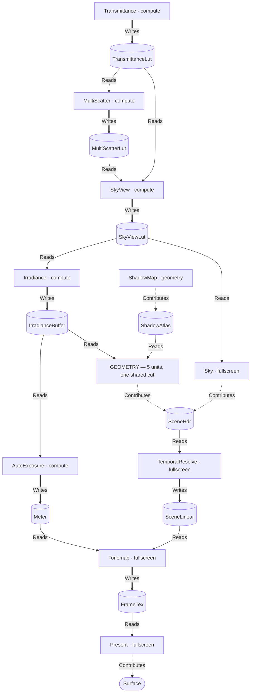
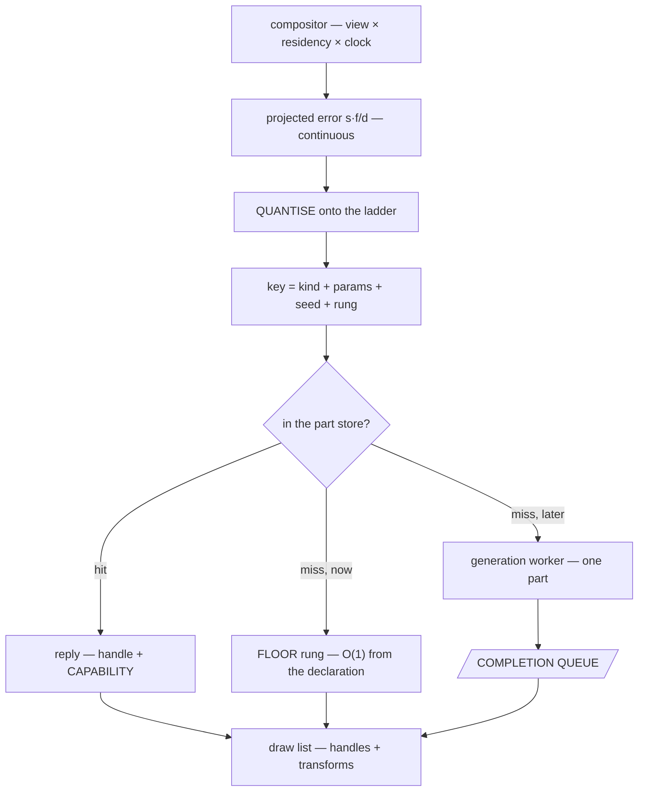
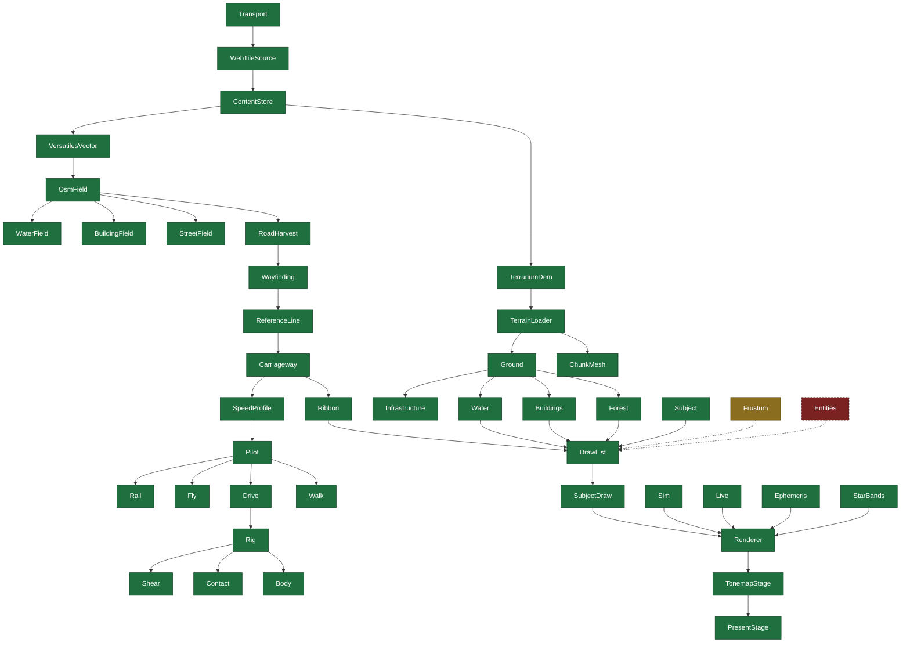
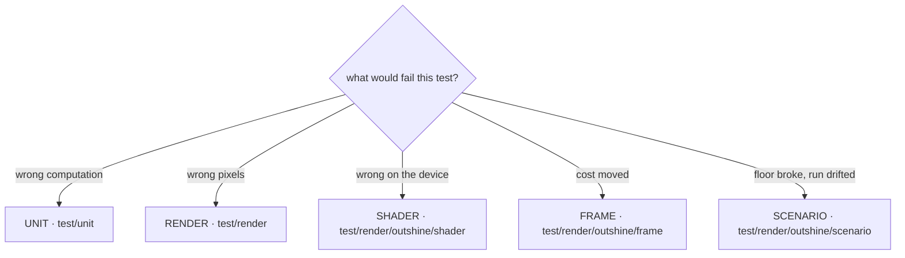

# Outshine

> **THIS IS A GAME ENGINE.** An OSM-based global open world, LLM-driven intelligence and an RPG above
> it; every piece of content from a **generator** behind one interface, external data behind a
> **provider** interface, actors that **think**, and declarative scenarios that declare interactive or
> non-interactive worlds — with or without a world at all. **SDL3, SDL_GPU and glTF are its backbone.
> 720p60 on this device is its target, and that target is the whole of its ambition** — a budget is
> falsifiable where a named game is only evocative.

The world is **loaded, not modelled**. **One physics system** carries walking, driving, flying and
swimming; an **epoch and decay dial** dresses the same geometry; the actors **think**; the setting is
post-scarcity. **The repository speaks one language: English** — code, comments, documents, commits.

**AND IT IS REACHABLE.** Not one piece of this is unsolved in principle: worlds this size are streamed
today, geometry reduces to a pixel of error today, a hard frame floor is held on weaker hardware than
this today. What is new here is the COMBINATION and the discipline under it — so the honest posture is
neither hope nor doubt but **appetite**. The pieces exist; assembling them well is the work, and the
work is the good part.

## What this file is, and what it is not

It is the **vision**, the **constraints**, the **stance**, the **architecture** and the **setup** — read
first, by everyone, and binding.

**IT SAYS WHAT WE WANT AND WHAT WE CAN, and that is a rule about its grammar and not only its mood.** A
rule written as a prohibition is satisfied by doing nothing — every *never* in a document is obeyed
perfectly by an empty afternoon — so a file written only in prohibitions makes STOPPING the cheapest
correct action. **Every rule here that can be phrased as something the engine does, is.** Where one
genuinely cannot be — a refusal, a thing that would be silently wrong — it is written as the narrowest
possible *no* with the reason beside it, and never as a general caution.

*So a line that reads as forbidding something is either load-bearing exactly as written, or it is a
line waiting to be turned around. Turning it around is welcome and needs no permission.*

It is **not the scope**: one line per feature, with a box and a stable id, lives in `board/` and nowhere
else. **If a sentence would need a checkbox, it belongs there.** The room here is permission to say a
thing **completely**, never to say **more things**.

The diagrams are Mermaid because they render, and because ASCII rots at the first edit.

## What this is built ON, and it is a short list on purpose

**SDL3** · **SDL_GPU** · **modern C++** · **this device at 720p60** — an Apple A18 Pro, 2 performance
and 4 efficiency cores, 5 GPU cores, 8 GB, Metal 4.

**The development platform IS the budget, and that is a luxury rather than a limit**: the machine the
work happens on is the machine the target is measured on, so every number is real the moment it is
taken and no port, no emulator and no second device stands between a change and its verdict. **A
one-device target is the shortest possible path from an idea to whether it holds.**

**The engine is C++ and nothing else**, which is what keeps one language between a thought and a frame.
There is **one door** beside it: a script may **prepare data offline**, committed beside what it
produces — that door is for the corpus, and there is exactly one such script, named in the setup below.
Everything at run time, in a test, in a gate or in the build is the engine's own language.

## Stance

**The owner's comments outrank everything.** The bar is a world that holds 720p60 out of upstream data
alone, and **the way is the goal** — a round that learned something is a good round.

**Build as though it will work, and measure as though it will not.** The first decides what is
attempted, the second decides what is believed. **Difficulty is information and not a verdict**: a
refutation is a result, a withdrawal is a result, and a capability nobody could reach yet is a
measurement of where the edge is.

**THIS IS A GREEN FIELD AND THE TESTS ARE THE WHOLE OF THE CONTRACT.** No released interface has to
survive and no shape is owed anything by its own history. Question any of it and rewrite what needs
rewriting; the bar is that the suite still holds and that the round says what moved and why.

**The engine is a library and it is platform agnostic.** It declares what it needs from a host and
calls nothing else. Everything that runs it is a test.

**Testability is a design property.** If a thing cannot be tested, that is a fact about its shape.
Requirement coverage is the target, line and branch coverage the instrument.

**Something missing is a task, not a limit.** Distinguish **not measurable** — the thing yields no
number — from **not yet measured**, which has a cost and not a boundary.

### Numbers

**Every number carries its origin** — derived, measured or `[SET]` — with its unit and frame of
reference. **No magic numbers.** Performance is a **distribution over a moving camera**, p50/p95/p99,
never a mean. **Appearance is judged by eye and in motion.** A cost that cannot be attributed is not a
finding.

**Quote the population with the number.** A changed threshold shows in a diff; a changed selection reads
as the same metric and looks like progress. A before-and-after proves it selected the same population.

**A change that alters the picture by design cannot reproduce it to six decimals. Identical is a
finding, not a null result.**

**A derived correction produces a floor; a fitted one produces a smaller average.** The test is whether
the residual lands on a term already named, at the instrument's own limit, over a population where the
answer is known independently.

**Calibration measures, never decides.** A startup benchmark may propose an error scale; the scenario
declares whether to take it. **The picture is a function of the declaration, not of the machine.**

**An instrument's domain is part of its claim** — domain too narrow, input set too wide, invariance too
broad, population too small. State the domain, the input set and the invariances beside the number.

**A term rounded to zero is how a term becomes unnamed.**

**Read the trailer first.** A partial run leaves the previous run's logs in place, saying nothing about
it; a count quoted without `N tests: … PASS … FAIL` may be a measurement of the past.

### Method

**Name the problem in the vocabulary of the field before building it** — *streaming*, *resection*, *LOD
transition*, *screen-space error*. If no such name presents itself, the task is research rather than
improvisation.

**WHEN A SHAPE IS BEING CHOSEN, LOOK UP WHAT THE SHIPPED ENGINES DO.** RAGE and Unreal have thirty years
of published answers between them. **Take the MECHANISM and never the budget, and name the assumption
that came with it** — a mature answer adopted without its assumption is a slow copy.

**Look it up, do not recall it, and check the source rather than citing it.** A domain claim without a
source is a defect rather than a finding.

**A grep proves a string absent, never a capability.** The instrument for a capability claim is to
exercise the capability.

**Measure before you reach**, and when the measurement refutes the guess, the refutation is the round's
result. **The caveat first, every time**: before a defect is reported the harmless explanation is
actively sought and named, with why it is ruled out. A confounded finding costs a whole round.

**Before a criterion is disqualified, every rung above it is accounted for**: fix the engine · reduce
the oracle · patch the asset · disqualify. Disqualification is per `(case, metric)`.

**Look at every image produced and report what is seen**, not what is expected. **On a picture
judgement the answer is yes or no.**

### Working

**Warnings are errors.** A pre-existing red is neither worsened nor repaired unasked — it is named.

**Prefer the shape that makes a mistake unspellable**: `static_assert` and the type system over a rule a
checker counts. Prefer layouts a machine can stream — contiguous, of one width, without a pointer in the
middle. **Pedantry is the virtue**: every shortcut is repaid with interest.

**Half-built is worse than not built.** *I cannot solve this as stated*, with the measurement that shows
it, beats something that explodes later. **Resistance is information.**

**What is replaced disappears in the same round.** A fallback is a dead path.

**Every statement has exactly one place.** An argument standing in two places will drift the moment one
side is measured.

**THE CODE CARRIES NO COMMENTARY.** What the code does is the code's to say, and why a shape was chosen
belongs to the work item that chose it. **A work item may name code; code never names a work item** — a
marker in the source is a second index that goes stale, and the board is the only documentation tree.

**Every artefact goes to the system temp directory, never into the tree.**

**Only correct work is committed**, and `git log` is what was — no journal.

## This is a game engine, and every one of these outranks a smaller number

**These decide WHICH number is worth measuring.** Each was paid for: a round spent going the other way.

**The unit of delivery is a FRAME, not a picture.** A picture that is right and late is wrong. **720p60
on this device is the falsifiable target and it needs no other reference** — a named game dates, a
budget does not.

**An engine is a mechanism and content is data.** The engine spells verbs — place, cull, quantise,
draw; content spells nouns. A noun appearing in the mechanism is the defect this decomposition exists
to prevent.

**SDL3, SDL_GPU and glTF are the backbone.** The host surface, the device surface and the content
surface are each one interface, and each is the whole of what the engine may assume about the world
outside it.

**The three ideas ARE the vision**: content from a **generator** behind one interface, external data
behind a **provider** interface, and actors that **think**.

### What good means here

**Right to the eye at 60 Hz is right.** A residual worth chasing is one that is visible, or one that is
the largest thing between here and a frame.

**COVERAGE BEFORE PRECISION.** A case that exists and is red says more than a case that does not exist.
**Breadth first, depth on demand** — the shallow pass is what tells you which depth is worth buying.

**A known, named, measured defect is a finished piece of work.** An engine whose every error is named
and bounded is in a better state than one whose errors are merely absent from a report.

**Perfect is a direction and never a destination.** Move on when the next decimal buys no frame and no
picture.

### The six the frame path keeps

*Stated as what the engine DOES, because each is a thing to build and not a thing to avoid.*

**THE FRAME LANDS.** A frame that misses is seen by everyone; a code of error is seen by nobody, so
every trade between the two goes to the frame.

**SOMETHING IS ALWAYS DRAWN.** Detail degrades and only existence refuses — loudly. A coarse tree is a
picture; a hole is not.

**THE FRAME PATH IS MADE OF BOUNDED TERMS.** Every step costs a number somebody can name — which an
allocation, a block, a lock that might wait and a disk touch are not, so those four live at load.

**THE FRAME PATH CARRIES VALUES, NOT NAMES.** A key is a trivially-hashable value. This is what lets one
key serve a million instances.

**EVERYTHING THAT GROWS STATES ITS BOUND**, and the bound is a number somebody chose on purpose.

**STATE BELONGS TO A FRAME.** Two frames in flight is the normal case, so neither a global nor a
singleton has a place to live.

### How it degrades, because it will

**Every capability answers what it achieved, in both directions** — short of what was asked and past it
are both facts the caller needs.

**Cost is answerable before the thing is made.** A part whose visibility can only be known by making it
has already spent what the cull exists to save.

**A budget is quantised before it becomes a key.** A continuous number in a cache key fragments the
cache by construction, and silently.

**A worker signals readiness; it never asks a question.**

**Latency is a feature and it is the one nobody declares.** Input to photon is the number a player
feels; throughput is the number a benchmark shows.

**A shape is 0 or 1..N.** Code that assumes exactly one of something is a defect waiting for the second.

### Working on it

**The corpus is a driver, not a certificate.** A green count that bought no capability is a number about
a number.

**Fix the class, not the case.** **Build the thing that unblocks ten things before the thing that
unblocks one.** **A tool that makes the next twenty items mechanical beats finishing the twenty-first by
hand.**

**A dead path is worse than a missing one.** **Delete on the same day you replace.**

**When two designs are defensible, take the one a stranger could not misuse.**

**Ship the vertical slice.** One feature working end to end, from provider to pixel, is worth more than
five features working in the middle.

## The engine

The owner's decomposition, and it is one line: **generator (tile, tree, house, car, …) → compositor
(terrain, forest, city, traffic, …) → renderer (draw list)**. Each layer is defined by **what it may not
spell**, and the include sets are what make that true rather than a rule.


| Layer | Produces | May not spell | In the tree |
|---|---|---|---|
| **providers** | fetched bytes — one interface, ranked, absence hands over | — | `src/data` |
| **Ground** | the field: height · slope · class · edge distance · water · ring · declared tables | camera · frustum · frame index · clock · LOD level · device · sun · weather | `src/generators` |
| **generator** | **one part, never an aggregate**, from `(kind, params, seed, budget)`; replies part **+ capability** | a camera · a neighbour part · a draw list · a device | `src/generators/draw`, `src/gltf` |
| **compositor** | **one draw list, never geometry** — places, culls, quantises the budget, batches | a device · a pipeline · a texture · a shader · a pass | `src/world`, `src/generators` |
| **renderer** | pixels, from a plan and a draw list | **any content noun** | `src/render` |

**The three edges are the only edges.** A generator never calls a generator; a compositor never calls a
renderer; a renderer never calls back. Where a part depends on another part — a road cut into a terrain
tile — the dependency travels as **data through Ground**, never as a call. That is the house rule *peers
never call each other*, stated for content.

**The word "generator" is overloaded in the tree, so read it by the vocabulary above.** `Forest`,
`Buildings`, `Water`, `Ground` and `Infrastructure` under `src/generators/` answer *what stands where* —
they are **compositors**; `src/generators/draw/` answers *what one of them is shaped like*, and those
are **generators**. They already live behind different interfaces with different include sets.

**Each layer answers to a different instrument**, which is what makes the decomposition testable rather
than tidy: a generated part is a render case against the oracle, a composition is a scenario case over a
moving camera, and the renderer answers to the Khronos criteria. **A layer that cannot be named on this
diagram does not belong in the engine.**

### A scenario's own glTF is content like any other

**A file is a generator kind, never a scenario special case.** `kind = gltf-file`, taking a budget and
replying with a capability like every other. **The compositor must never learn what produced a part** —
a second arrival route is a second case, and *no content noun has a spelling in the renderer* begins
leaking one layer up the moment there are two.

**A glTF is not one part, so the file generator is not exempt from *one part, never an aggregate*.**
`Gltf::Subject` already holds a vector of parts with per-part material and vertex range. It decomposes
where every aggregate does: **the file's node hierarchy is the rule**, and the parts it names are
ordinary requests. *A declared scene has a rule to derive, so nothing here justifies a private
interface for this one case.*

**A further compositor is `declared`** — same interface, same culling, same selection, placements **read
rather than computed**. `Clients::Show` is its degenerate case: one part, one transform, already running.

**The key keeps its shape and needs no exception**: `(kind, params, seed, rung)`, with **params = the
content hash plus which primitive**, a seed nothing uses, and a rung whose range happens to be one. A URI
is not a value — two can name one file and one can change under a run — so hashing is what keeps *the
picture is a function of the declaration* true. **Every compositor quantises, `declared` included**, or
a continuous budget enters a key and fragments the store per instance the first time a scenario places
two hundred props.

**One rung is a capability statement, not a gap.** `achieved` will rarely equal `requested` and says so
in both directions — and **no impostor** and **cannot be reduced further** are two separate declarations,
or a later generator with rungs and no impostor reads as unreducible.

## The render pipeline

Nothing is fixed. The consumer names an **output**; the compiler **pulls the plan backwards** over a
`constexpr` catalogue and the impossible plan is largely unspellable rather than refused.



| | |
|---|---|
| **`Writes`** | *the resource does not exist without this stage.* A missing producer is a **refusal**. Exactly one `Writes` producer per derived resource, held by `static_assert` |
| **`Contributes`** | *the stage draws into a target somebody else declared.* A missing contributor is a **picture choice** |
| **`Reads`** | an input edge. Every read has a producer, and that is a `static_assert` too |
| **machinery** | the stage's absence makes the picture **impossible** → the compiler pulls it from the requested output |
| **content** | the stage's absence makes the picture **different** → the consumer declares it |
| **the 5 geometry units** | terrain · buildings · water · models · subjects — **independently declarable, one shared LOD cut**, so a coverage case can ask for subjects alone |
| **`FallsBackTo`** | `SceneLinear` aliases `SceneHdr` when no temporal stage was declared, so a picture plan without TAA reaches the tonemap with no blit that exists only to copy. **Every alias the compiled plan applied is published** |

**Three shapes and no fourth**: **compute** (a dispatch chain over resources) · **fullscreen** (one
triangle over a target) · **geometry** (a draw list against attachments). The stage row is a *pass*
declaration; the per-draw quantities — sort key, batching, instancing, surface state — live one level
below it, in the draw list.

**A scenario selects from the compiled catalogue and cannot add to it.** *The consumer decides what to
render, out of what the engine can render*, and the second half of that sentence is a compile-time set.
**The core dictates the pipeline**: a material is a row of numbers with no field that can switch
pipeline state — which is the same door glTF 2.0 closed when it removed shaders from content, so that
one declarative material model could render under any API. **Generator bakes, or renderer implements;
there is no third path where content ships a program.**

**Who makes an asset is not the engine's business, and textures are allowed.** Bark, leaf, façade and
ground are sampled like any other texture — they are simply **generated here** at the generator's
declared budget, resolution included, and then cached. So *"their technique needs an authored asset"*
never ends an argument: name the generator that would produce it, and say what it must produce.

## The content request, the budget and the ladder

A request is keyed by content, **never by instance** — one key serves a million trees. The budget is a
**screen-space error in pixels**, because it is the only currency comparable across terrain, trunk,
façade and crown, and because it makes the LOD ladder an *output* rather than an input.



| | |
|---|---|
| **the ladder** | **global and fixed for the run**, and the compositor's — LOD levels exist as the quantisation of a continuous budget, never as a generator's published enumeration. **The generator still never sees a level.** Two parts at one projected error must land on one rung or the cache fragments by construction |
| **the key** | a trivially-hashable **value**: no string, no allocation on the frame path |
| **the capability** | achieved error, bounds, counts, impostor takeover error — **both signs published**, shortfall *and* over-delivery, because a quantised rung is deliberately finer than asked and the excess is paid in vertices, fill and residency |
| **the floor** | derived from the declaration alone, **pinned and never swept**. A cap that can evict what a miss degrades to turns a memory bound into a frame stall |
| **the queue** | `(key, handle, capability)`, drained at **one declared point** in the frame; eviction travels the same way. A worker signals readiness — it never asks the compositor a question |

**Degrade on detail, refuse on existence.** A budget looser than the generator's finest returns a coarser
part and states it. A budget finer than the generator can reach returns its finest and **publishes the
shortfall** — a hole is worse than a coarse tree. A part that cannot be produced at all — unknown
species, no valid ring — is a **named refusal** with nothing drawn in its place, because a failure is loud.

**Cost before commit.** Bounds and cost are answerable from `(kind, params)` alone, or a part must be
generated to learn whether it is visible and the cull happens after the cost it exists to avoid.

**A handle carries a generation counter**, so a stale handle is *detectable* rather than dangling.

**The pop is bought down, not spaced away.** Rung spacing, transition band width and residual pop are
three numbers, not two; the band is paid in both rungs drawn at once.

## What stands today, in the tree's own class names

**The diagram above is the target; this one is the tree.** Every name here is a class or a struct that
exists, so a reader can tell the design from its implementation at a glance -- and the three shades are
the whole of the reading.



| | |
|---|---|
| **green** | built, and exercised by a test that decides it |
| **amber** | **written and never called** -- the mechanism exists in the tree and no caller reaches it |
| **red, dashed** | **not built.** Named here because the target needs it, not because something is broken |

### Where the tree departs from the design, with the measurement that says so

**Each of these is a work item, and each was measured rather than recalled.**

| Departure | The measurement | Item |
|---|---|---|
| **the geometry path does not instance** | `SubjectDraw.cpp:1626` passes a **literal `1`** as the instance count, while `OverlayDraw.cpp:265` passes `Count` -- so the engine instances on one path and not the other. `DrawBatch::Draws` exists at `DrawList.h:155` and is summed **as a statistic only** at `SubjectDraw.cpp:1540` | `1538` |
| **nothing culls against the frustum** | `Camera.h:100-115` defines `Frustum`, `FrustumFrom` and `AabbVisible`, and **no `.cpp` under `src/` calls any of the three.** The compositor row promises *places, culls, quantises, batches*; two of the four are written down | `1538` |
| **there is no entity store** | thousands of traffic participants, aircraft and clouds need one. The good news is measured: **`src/pilot/`, `src/physics/`, `src/corridor/` hold no mutable static at all**, so many actors is a memory question rather than an architectural one | `1538` |
| **the drive is proven where the suite does not look** | `tools/driver/` drives 774.852 km; `test/render/outshine/drive/` **refuses** over the stale free `Plan(from, to)` at `Wayfinding.h:100`, whose only caller is that case | `1539` |
| **the window stands up a subject, not a world** | the driver's GUI assembles one `Gltf::Subject`; `Sim` is the world path and the driver does not use it | `1537` |

**And a caution that belongs beside every count quoted from a run**: the last full suite read
**1735 tests, 1315 PASS, 9 FAIL, 411 UNPREPARED**, with khronos at **49 criteria of 49 and 49 within
bound** -- against 181 and 180 before, because 1178 cases were pruned at a 27.9 GB corpus peak.
**49 of 49 is not the same measurement as 180 of 181**, and reading it as progress is the
changed-selection defect this file names.

## What decides a test

The split is by **instrument**, not by shape, and the placement rule is one question.



**TWO TREES DECIDE WHETHER THE LIBRARY IS RIGHT AND THEY BOTH RUN ON EVERY CHANGE TO IT.**
`test/unit/` holds the computation and mirrors `src/` exactly; `test/render/`, one directory per vendor and suite,
is everything a device or a vendor's corpus decides — `khronos/glTF`, `khronos/generator`,
`outshine/grown`, `outshine/frame`, `outshine/shader`, `outshine/scenario`, `wpt/css`, `test262/js`.
`test/harness/` holds the programs that score them, positioned to mirror the cases they serve.

**`tools/` IS BUILT ON THE LIBRARY AND IS NOT RUN WITH IT.** The browser and a host's transports
answer a different question, so they are named to run at all — `test/run.sh tools/viewer` — and a
change to the engine does not pay for them. *A tool that had to pass before the library could be
measured would make the library's own verdict hostage to something the library does not contain.*

| Suite | What would fail it | What it links | What decides it |
|---|---|---|---|
| **unit** | the code computed the wrong thing | its layer alone, with its layer's include set. **Mirrors `src/` exactly — the only tree that does, and it IS the layering proof** | a stated invariant, nothing rendered |
| **render** | our pixels disagree with the oracle | reader + renderer + readback; needs a device. **A case is a directory and the glTF is the declaration** | every named metric within its own threshold and direction |
| **shader** | the shader is wrong on a real device | shader text against its C++ twin. No asset, no camera, no oracle | a device |
| **frame** | the frame cost moved | what `render` links, **with no sanitiser in the path** — a duration measured through a bounds checker is not the shipping frame | a distribution over a moving camera |
| **scenario** | the floor broke, the run was not deterministic, memory grew | organised by declared run, not by source file | p50/p95/p99 · determinism · residency · memory |

**A case that seems to fit two is testing two things and is split.** A suite that borrowed another's
verdict shape would be reporting a number that does not decide it.

**THE SCENARIO SUITE IS THE NEXT INSTRUMENT TO BUILD**, and it is drawn on this diagram already because
its shape is known: p50/p95/p99 over a moving camera, determinism across two runs, residency and memory
across a long one. It is the one that turns *720p60 on this device* from a claim into a distribution —
so the fourth constraint is not the least defended, it is **the one whose measurement is still ahead of
us**, and building it is how the frame budget starts deciding things instead of being quoted.

**The declarative suites must never be restored to that mirror.** A render case links half the library
by construction, so a mirror over it would dilute the layering proof into a convention, invisibly.

## How a render case is decided

The oracle relationship in one picture. Nothing here is committed except the recipe.


| | |
|---|---|
| **the declaration** | the `.gltf` is the case; the manifest is a **delta over declared defaults**, so adding a case is not a writing task |
| **patch** | a declarative list of **named** corrections, each carrying the measurement it answers — and **applied identically to both sides**, or it is a repair of one side and not a patch |
| **oracle** | Cycles. **Its renders are NOT cached and that is the owner's ruling** — this machine has more CPU than disk, and the store had reached 54 GB over 18 655 entries with no way to tell a live entry from a dead one. A render is produced, delivered and forgotten. **The FETCH cache stays**, because upstream bytes cost the network and the network rate-limits; **there is no second cache** of either kind |
| **compare** | a pixel both sides agree is covered → the **perceptual tail** on the case's declared transfer. A pixel they disagree about → the **geometric bound**, stricter, against a **0.005 px instrument floor**. The pixel is routed, never discarded |

**Two counts, published side by side, and they are not interchangeable.** *Criteria met* counts features
and does not fall when the picture bound fails. *Cases within the picture bound* counts pictures.
Quoting either one as "the suite is green" is the defect this shape exists to prevent. **There is no
amber state**: the repair is that the red names its cause.

## Setup

| | |
|---|---|
| `src/` | the library **entire** — its C++ and, in `src/assets/`, the declared data the engine is made of. No entry point, no build file, no host implementation, no test fixture |
| `test/` | **`test/unit/`** mirroring `src/`, **`test/render/`** -- one directory per vendor and suite -- for everything a device or a vendor's corpus decides, and **`harness/`** — the programs that score them, mirroring the cases they serve, plus `test/harness/claims/` (the harness's own claims, including that every path this file cites resolves) and `test/harness/shared/corpus/` (the oracle's subjects, fetched and built, never committed) |
| `tools/` | programs built ON the library and not run with it: `tools/viewer/` (the browser) and `tools/host/`. Named to run at all — `test/run.sh tools/viewer` |
| `test/run.sh` | the harness, and the only runner. One process per test, a real verdict per test, non-zero on any failure or undeclared skip. **macOS has no `timeout(1)`** — it brings its own |
| `Makefile` | **three targets and no others**: build the library, run the tests, clean. No gate target, no verify target — everything a gate decided is a test, and two runners means two verdicts |
| `test/harness/shared/corpus/prepare.py` | **the one offline script the constraints allow.** Fetch · generate · patch · convert · render, each idempotent and independently invocable. It compares, scores and decides **nothing** — that is C++, in the test |
| `board/` | **the only documentation tree**, and the working system — see *The board* below |
| this file | the vision, the stance, the architecture, the setup and the board. As short as the content allows, and no shorter |

**Layering is the build, never a checker.** Each directory compiles with its own include set — one
compile group per layer in the `Makefile`, the same sets in `test/run.sh` — so a name a layer must not
reach has **no spelling** in it, and a breach is a compile error rather than a report. `test/unit/`
mirrors `src/`, so every unit test is a continuous proof that its layer's include set is exactly what it
claims. There is no vendored third-party tree: a dependency is a package the host provides, or it is
ours.

**A backticked path is a citation and must resolve**; something to be built is named in prose instead —
a *host layer*, a *shader directory*. Written in one syntax, a reader cannot tell evidence from
intention and neither can a checker. `test/harness/claims/EveryPathCitedInADocumentResolves.cpp` reads this
file.

**Only correct work is committed**, and `git log` is what was — no journal.

## The board

**`board/` is the working system and this is its only statement.**

**Three directories and the path is the state**: `board/open/` · `board/active/` · `board/closed/`.
There is no fourth: **blocked is a line in the body naming what blocks it, and the task stays `open`.**

**A task is one file — RFC 822 header, blank line, markdown body.** `grep '^Type:'` is the whole
implementation. **Seven fields and no others:**

| | |
|---|---|
| `Type:` | **`feature`** — what must be true · **`task`** — how a feature gets done · **`bug`** — what exists and is wrong · **`issue`** — a decision only the owner can make |
| `Parent:` | **exactly two levels: `feature` → N `task`.** A `feature` and a `bug` carry none; a `task` carries exactly one, naming a `feature`. Stored on the child, reverse derived |
| `Area:` | `render` `gltf` `generators` `world` `core` `data` `scenario` `clients` `assets` `corpus` `harness` — **the tree's own layering**, so it cannot drift into a taxonomy |
| `Tags:` | the genuine cross-cuts only — `oracle` `khronos` `perf` `instrument` `bug` `scope` |
| `Depends:` | ordering — this cannot start until that is closed |
| `Regresses:` | **the tree changed** — the closure was true and the tree stopped satisfying it |
| `Supersedes:` | **our understanding changed** — the claim was correct as stated and too narrow, or wrong |

**The filename is `NNNN_description.md`**: a flat autoincrementing integer, then the label. **The number
is the identity and the description is the label** — retitling is a `git mv`. The next number is
derived, never stored: the maximum over `board/*/` plus one.

**What the header must not carry.** No `State:` — the directory is. No `Id:`, no `Title:` — the filename
is. No test result — a header recording a passing test is a capability claim decoupled from its
evidence. No priority, no owner, no dates: **git is the audit trail**, so no `Created:`, no `Author:`,
no history field ever.

**BOTH KINDS ARE GOOD NEWS.** A `feature` is a thing to look forward to, and **a `bug` is a discovery:
we have found something we can make better, and we found it before a player did.** An engine whose bug
list is long is an engine that is being LOOKED at.

**AN ITEM SAYS WHAT WILL BE TRUE, not what is broken.** A title is the capability the tree gains — *the
oracle multiplies the vertex colour*, never *the oracle is wrong about vertex colour*. A defect reads as
a complaint and closes with relief; **a capability reads as a plan and closes with something gained.**

**A closed item is a thing the engine can now do.** The board's product is the growing list of sentences
that begin *this engine can*.

**A defect found becomes a work item in the same round it is found.** A finding that lives only in a
report is lost at the next context boundary.

**The board may be extended and may not be shortened.** Removing what looks false can cost a capability
nobody notices is gone — that is the owner's alone.

**Feature or bug is decided by one question: does the code claim to do it?** An unticked requirement has
never worked; a bug worked, or looks like it works. **Nothing is ticked that was not checked in the tree
that round.**

### The item names the code, and the code names nothing

**A work item may name the file that implements it and the test that proves it. Source carries no
reference back.** A marker in the source is a second index over the same relation, and two indexes
drift. **A closed item whose body names no test is an unproven claim**, and that is read when it is
closed, by the person closing it.

**A commit that changes a work item names it** — `board:0042` in the message. The **file** is its state,
the **log** is what was done to it, and `git log --grep 'board:0042'` is the join.

### Issues, comments, grooming

**An `issue` is filed and worked around, never waited on.** It carries the decision, the options and a
recommendation, and the round **continues on something else**. It carries no parent and blocks nothing
by default. **There is always another ready item.** An issue claims nothing about the tree, so it closes
on its own answer, whether or not code follows.

**A `## Comments` section at the foot of the body, append-only, no dates and no authors.** **A comment
records what was LEARNED, never what was DONE**: *measured 0.3174° and it is the texture's 8-bit
quantisation* is a comment; *ran the corpus* is `git log`. **Comments survive into `closed` and that is
most of their value**: a closed item whose comments say *this was tried and refuted, here is the number*
is what stops the next round re-running it.

**Moving an item into `board/active/` is when it gets groomed** — verify its `Parent:`, set `Depends:`
on what genuinely blocks it, and read the parent's other children. **Three checks and no fourth.**

**The board is kept true incrementally, at the point of use, never by a sweep**, and **no test reads
it** — a suite that went red over a markdown file would be reporting the writing about the thing as a
defect in the thing. Six of these are read by eye at grooming:

- a dependency cycle
- a `closed` item depending on one that is not closed
- an id in any edge that does not resolve to exactly one file
- a `feature` carrying a `Parent:`
- a `task` with no `Parent:`, or one naming something that is not a `feature`
- **a `closed` feature with an open child** — the exact failure a feature/task split exists to catch

The seventh is read when an item closes: **does its body name the test that proves it.**

**The session's task list is not used, and `board/active/` is the only ordering.** The transition is a
`git mv`, it travels with the work, and it is visible in the diff.

**Stage named files and never a directory.** `git mv` stages its rename, so `git add -A` sweeps whatever
else is in flight into a commit about something else — and a rename is two paths, so committing only the
new one leaves the item under both directories at once.

```sh
ls board/active/                                     # what is in flight
cat board/*/0042_*.md                                # one item, wherever it lives
grep -l '^Area: render'   board/*/*.md               # by area
grep -l '^Type: bug'      board/active/*.md          # by kind
grep -l '^Parent: 0007'   board/*/*.md               # a feature's children
grep -l '^Depends: *0042' board/*/*.md               # who waits on this
git log --follow --name-status -- 'board/*/0042_*'   # every move, when, by whom
git log --grep 'board:0042'                          # every commit that worked on it
git mv board/active/X.md board/closed/               # the transition IS the diff
ls board/*/ | grep -o '^[0-9]\{4\}' | sort -n | tail -1   # the next id, derived
```

## References

**Stroustrup/Sutter, [C++ Core Guidelines](https://isocpp.github.io/CppCoreGuidelines) — binding, and
fetched rather than carried.** The established answer is the starting point; a deviation is a defect
until its reason stands beside it.

| Field | Titles |
|---|---|
| **Engine** | Gregory, *Game Engine Architecture* 3e · Lengyel, *Foundations of Game Engine Development* I–III |
| **Rendering** | Akenine-Möller, *Real-Time Rendering* 4e · Pharr, *Physically Based Rendering* 4e · Lagarde/de Rousiers, *Moving Frostbite to PBR* |
| **Procedural** | Ebert/Musgrave/Perlin/Worley, *Texturing & Modeling* |
| **C++** | Meyers, *Effective Modern C++* · Pikus, *The Art of Writing Efficient Programs* |
| **Physics** | Ericson, *Real-Time Collision Detection* · Bridson, *Fluid Simulation* |

### The target, and it is a number rather than a name

**720p60 on this device.** An Apple A18 Pro — 2 performance and 4 efficiency cores, 5 GPU cores, 8 GB,
Metal 4 — carrying **55.3 Mpx/s** inside **16.67 ms**, over a moving camera, at p50, p95 and p99.

**A named game is not a target and this file no longer carries any.** A shipped title dates, its budget
is somebody else's hardware, and *"as good as that one"* cannot be measured on a Tuesday. **A frame time
can.** Where a claim needs evidence that something is reachable, the evidence is a technique with a
published mechanism — the table below — and never a screenshot.

**That the target is a number does not make it a small one, and the number is not what this is FOR.**
16.67 ms is the discipline; what it buys is a world loaded from the real one, actors that think in it,
and a game above both — walked into at sixty frames a second on a machine that fits in a bag. **Every
one of the techniques below is somebody's shipped answer to a piece of that**, which is exactly why
they are cited: not to borrow a look, but because they are the evidence that the pieces are real. The
combination is the new part, and a combination is a thing you assemble rather than a thing you hope
for.

### Technique — cited for a principle, never as authority over a measurement

| | For what |
|---|---|
| **Nanite / UE5** | geometry LOD by **projected error under one pixel**, with **no level number anywhere in the runtime decision** — a cluster draws when its parent's error exceeds a pixel and its own does not (Karis/Stubbe/Wihlidal, *A Deep Dive into Nanite Virtualized Geometry*, SIGGRAPH 2021 Advances). It is the modern statement of the currency this engine already demands |
| **Decima** (Guerrilla) | vegetation and terrain **at scale, assembled while the player walks through it** — compute shaders placing a dense world from artist-declared rules (van Muijden, *GPU-Based Run-Time Procedural Placement in Horizon: Zero Dawn*, GDC 2017). When a claim needs evidence about a world that comes into being at run time, **this** is the evidence — Microsoft Flight Simulator is not, because everything there was generated ahead of time in the cloud |
| **id Tech 7** | a **hard frame floor**, held by scaling what costs pixels rather than by dropping frames — every console version of *Doom Eternal* holds its 60 fps target under dynamic resolution |
| **Frostbite FrameGraph** | the **declared stage plan**: every pass and resource as a graph, compiled, with lifetime, transitions and allocation falling out of it rather than being hand-ordered (O'Donnell, *FrameGraph: Extensible Rendering Architecture in Frostbite*, GDC 2017) |
| **RAGE** (Rockstar) | **an allocator with nothing to decide**: pools sized at build time and declared in content, where exceeding one is a refusal rather than a heap that grows. The lesson is the direction — a frame path that takes nothing cannot leak, fragment or stall in an allocator — and Unreal states the same thing the other way with `FMemStack`, a linear stack whose whole frame is popped at once by an `FMemMark` |
| **SpeedTree** | the production answer to a **discrete ladder**, and we need it: geometry that reduces smoothly plus an **alpha-to-coverage cross-fade** into the billboard, leaf instances shrunk away while the survivors scale up, the billboard picked from an array by azimuth (SpeedTree SDK documentation, *Level of Detail*). A transition, not a wider spacing |

**Selection by DISTANCE RATIO is the technique this engine refuses**, wherever it is found: a per-object
distance multiplier is a second currency beside projected error, and two currencies mean no comparison
across terrain, trunk, façade and crown. The one-currency rule makes it unspellable and the dolly-zoom
control is built to catch it.

### The oracle is not a reference

**Blender / Cycles decides whether we are correct.** No engine can do that, and it is not ambition — it
is the only thing outside this tree that answers *is this the right image* rather than *is this a good
image*. It is pinned to the lobe it is known-good on, its limitations are measured and declared, and
when it must be reduced, the reduction stands on the ladder above disqualification.

**References are for ambition, and that is why they cannot be dropped**: without one, *"this is as good
as it gets on five GPU cores"* is unfalsifiable.
