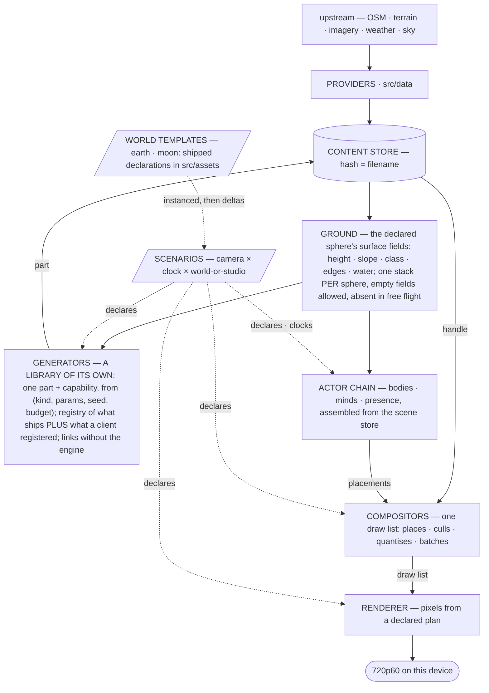
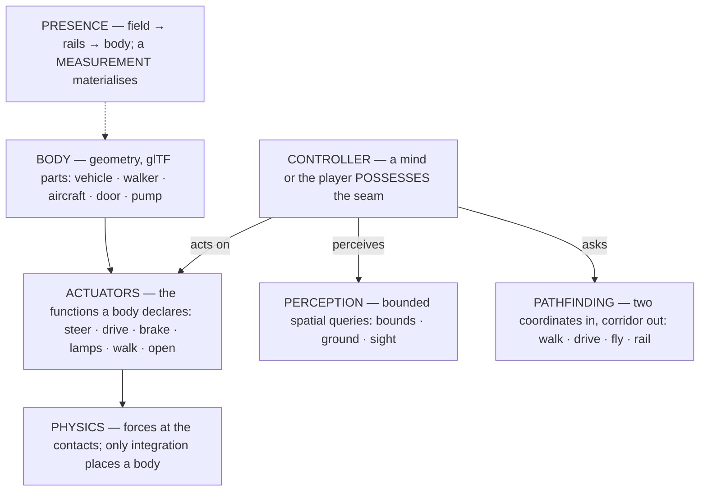
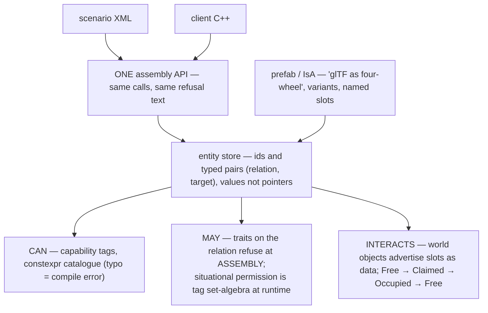
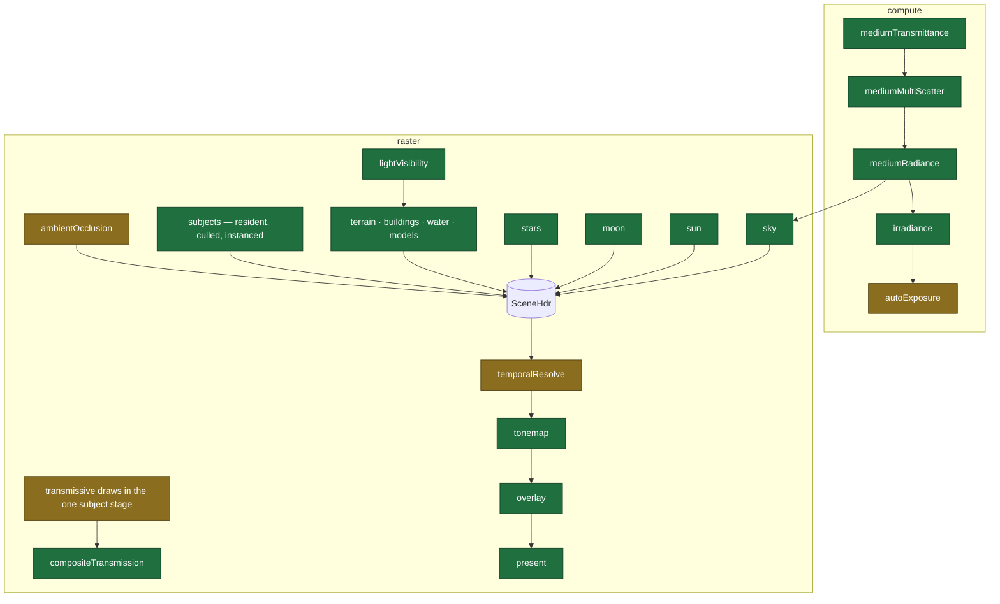
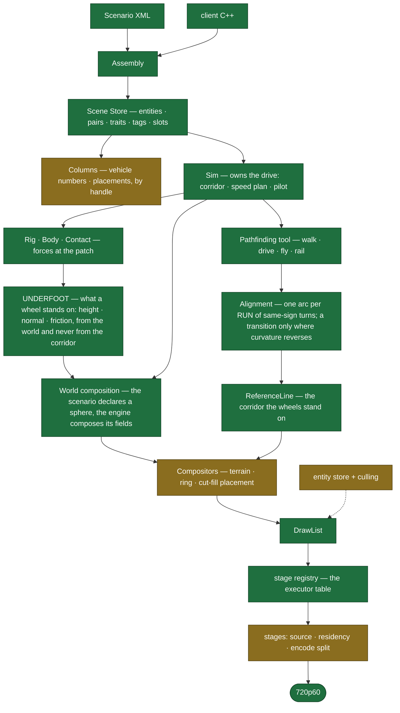
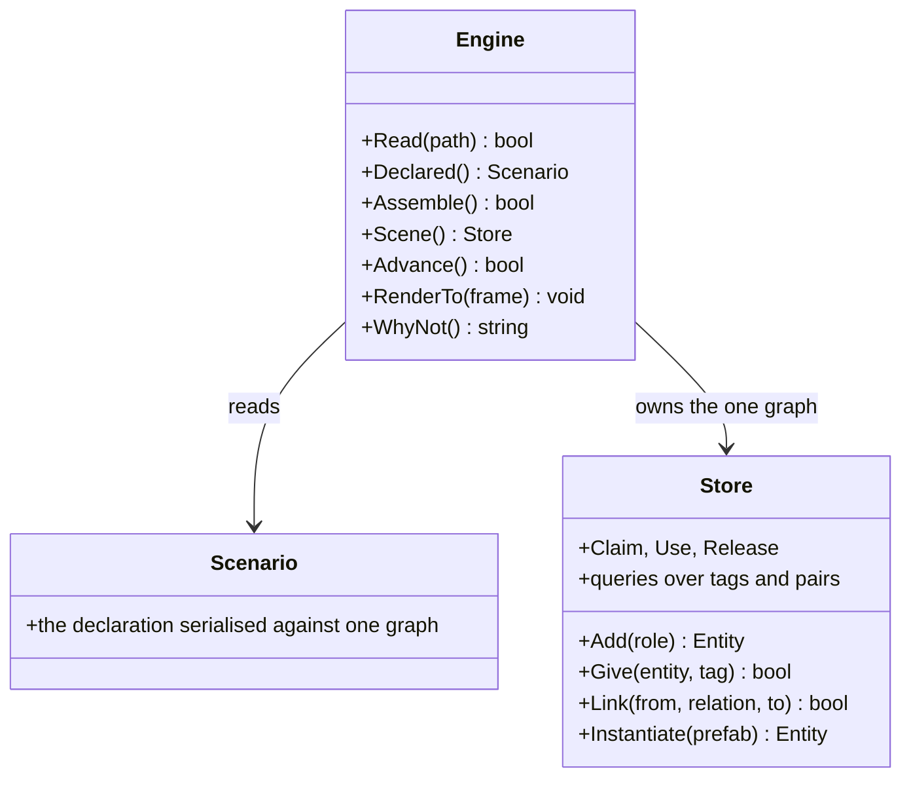
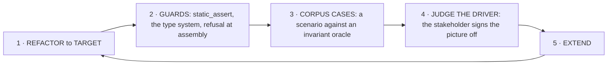

# Outshine

**A modern game engine combining the best of RAGE and Unreal.** Development platform IS the target:
Apple A18 Pro (2P+4E cores, 5 GPU cores, 8 GB, Metal 4), **720p60 held** — p50/p95/p99 over a moving
camera, never a mean.

**THE BENCHMARK IS A QUARRY, NOT A SPECIFICATION.** Where RAGE or Unreal settled a question their
answer is evidence and departing carries the burden — but the decision is mine and the REASON is
what I owe. Unreal can be read; RAGE is reconstruction, so it carries less, and neither outranks
a measurement of THIS tree.

**What an engine IS**: an interactive physics simulation with a focus on graphics — physically as
accurate as NECESSARY, graphically as good as the FRAME BUDGET allows, temporally DETERMINISTIC.
Each of those three is a bound, and the middle one is the bound "as good as possible" does not
carry: a target without a ceiling cannot be missed, and a stage that was as good as possible six
times over is the god stage. **The engine knows no cars and no aircraft** — only bodies, forces,
actuators and control. A control command comes from the player through bindings or from a mind;
it ACTIVATES a force, and only integration places a body. RAGE keeps `CVehicle` in the game layer
and Unreal keeps wheeled movement in a plugin; a vehicle noun inside the engine core is a finding
wherever it stands.

- **SDL3 is REQUIRED and `include/Outshine.h` says so** by including it: the CLIENT owns the process and calls `SDL_Init`, the library never does. **SDL_GPU is one renderer, not the door** — `SDL_Window` is SDL3's core, so the door stays renderer-neutral. **glTF 2.0** is the only content surface
- **C++23**, `-Wall -Werror -Wpedantic`, one `-std` for the whole tree; `static_assert` and the type system over checkers; `std::span`/`std::string_view` at boundaries, `std::mdspan` for field and instance views, `std::expected` where a refusal carries its reason
- **Precision has ONE boundary and it is the camera**: the scene keeps 64-bit positions and the
  renderer is camera-relative in 32-bit — `Anchor - Eye` in `double`, the model-view-projection
  product in `double`, and the cast to `float` only at the uniform push
  (`src/render/stages/SubjectDraw.cpp:731,733,736`). A `float` that ever holds a world position
  is a defect; a `double` that reaches a shader is a different one
- **Private is the DEFAULT and a wider door justifies itself** in the item that widened it. What
  is private can be changed; a public data member is an invariant nobody can hold. Composition is
  the usual answer, inheritance the right one where a stable interface carries shared machinery.
  `--audit-access` counts what stands wider and refuses when the count moves
- **SIMD- and optimization-friendly**: contiguous, one-width, pointer-free layouts; fast path on the hot path; batch over per-item; bounded terms on the frame path (no alloc/lock/disk/unbounded block)
- **Declarative**: scenarios declare, the engine behaves; content = data, engine = verbs; the consumer selects from a `constexpr` catalogue and cannot add to it. **A section that is NOT declared decides nothing** — its `Declared` flag is read where the decision is made, and what stands in its place is the engine's own default, never the zeroes of a struct nobody filled in
- **A SCENARIO IS A STREAM, not a value that is re-declared.** `Declare` seeds; after that parts
  enter and leave. The bound is a cost: the work a declaration causes is proportional to what it
  CHANGED, never to how big it is. Neither benchmark rebuilds a world to change part of one
- **Batteries as declarations**: outshine ships convenience components -- generators, providers, world templates and factories (`Planet(params)` → a Scenario value) -- all catalogue citizens the scenario selects; the engine core stays scenario-agnostic
- **Every number carries its origin** (derived · measured · `[SET]`) with unit and population; no magic numbers; calibration measures, never decides
- **The code carries NO comments** — `src/`, `include/` and `apps/` hold no `//`, no block, no
  TODO, no derivation, no board number: names and structure carry the meaning, a number's
  origin lives in its board item and its commit, and prose may stand in a PROOF because a proof
  explains what it proves -- a proof being any source that carries `Covers("`, wherever it
  lives, and every source that does not being bound; work items live in `board/`, code never
  names them
- **Infrastructure built from OSM is PLAUSIBLE and geometrically correct, never necessarily
  true to the real road**: the data is a source of shape, not a specification to be reproduced,
  so a corner the graph demands is a finding only where it is implausible or geometrically
  wrong — never merely because the real road there is built to another class. And OSM does not
  carry the third dimension: **bridges, ramps, over- and underpasses, tunnels and every other
  3D course are RECONSTRUCTED**, and what a reconstruction owes is four kinds of plausibility —
  **geometric** (it closes, it is continuous, it does not intersect itself or what it crosses),
  **physical** (a vehicle can drive it at the speed the class implies), **static** (it stands:
  spans, piers and clearances that could carry their own load), **architectural** (it looks
  like the thing it is). A guess that holds all four is right; one that holds three is a finding
- **GREP BEFORE YOU WRITE.** A new type, function or file is preceded by a search for what it
  would do; a capability that looks absent is usually present and unreachable, and that is the
  finding
- **Cycles is the oracle** for correctness; references are for ambition; the corpus is a driver, not a certificate
- **One world space**; a failure is loud; something is always drawn; delete on the day you replace
- Artefacts go to the system temp dir, never the tree; `git log` is what was — no journal

**Diagram colours** — CURRENT: green = correct by current knowledge · amber = uncertain · red =
provably wrong · grey dashed = absent. TARGET: green = certain · amber = probable.

## Who reads this

**This file is the DEVELOPER's, and it is VISION and TARGET — never a description.** I read it on
every turn and drive with it: pick the next item, repair it, close it with a proving test and a
negative control. **TWO reviewers read from OUTSIDE the change**, each against its own brief in
`.claude/agents/`, each filing findings and neither editing `src/`. I advance, they CORRECT.

| who | judges | never |
|---|---|---|
| **architect** | structure: layering, abstraction, the door, what a scenario can REACH | takes a screenshot, signs off the picture |
| **stakeholder** | the PICTURE: `apps/driver` as a test drive at Gran Turismo 7's level, on short routes it picks itself | judges architecture |

The asymmetry is not tempo but standing: inside the work I can be wrong and measure my way out
before the hour is over. A finding either of them files becomes work, so it takes nothing on my
word — each runs the gate itself and reads the tree, not my account of it. **`STATE.md` is
CURRENT for all three of us**, generated by every `make` and written by no hand.

## CURRENT is `STATE.md` and TARGET is here

**This file carries only what the tree is going TOWARD. What it IS lives in `STATE.md`, which
every `make` regenerates and no hand writes** — the door's verbs, the module graph with any cycle
named, the tier table, the heaviest units, the widest surfaces, colliding header names, the
sources no suite links, what stands wider than private, what is declared red, which suites reach
past the door, every named constant standing as a bare literal, and the PROGRESS table.

**PROGRESS measures nine areas against RAGE and Unreal, and it is counted from `board/`** —
where the target already lives, so there is no second list to keep. An item declares
`Progress: <area>` and its checkboxes are that area's predicates; a ticked one must NAME ITS
PROOF, a case or an audit flag, and a tick whose proof this tree does not hold is REPORTED rather
than counted. A predicate states a behaviour or a reachability, never a name: counting declared
class names would have scored the world generators complete while 6528 lines of them sat in the
archive with no path from any declaration. The denominator is visible and it GROWS, because
discovering work is not progress.

**A diagram here is an intention and never a description.** When the two disagree the tree is
what `STATE.md` says, and the distance between them is the work.

## Architecture (TARGET)





## Render plan (TARGET)



## Class structure (TARGET — where the tree is going)



## Public interface (TARGET — one door)



## Board

```mermaid
stateDiagram-v2
  [*] --> open : filed (defect found = item, same round)
  open --> active : being worked NOW (groom parent/depends)
  active --> [*] : the file is DELETED; the commit names the proving test
  active --> open : parked
```



`board/` is ONE FLAT DIRECTORY. One file = RFC 822 header + markdown body. Fields: `Type`
(feature|task|bug|issue) · `State` (open|active) · `Parent` · `Area` · `Tags` · `Depends` ·
`Regresses` · `Supersedes`. Filename `NNNN_label.md`; number = identity; no dates — git is the
truth. **Closing is DELETING the file**: what it said is in the commit that removed it.
Titles say what WILL BE TRUE. Commits reference `board:NNNN`. `State: active` marks what is
being worked on right now — always.

**GIT IS THE LOGBOOK. The item is what is true NOW.** A newer measurement REPLACES the older one
it corrects; a paragraph the tree has overtaken is deleted, not appended after. A closure states
what became true and names the proving test and its negative control — the derivation, the
numbers and the story belong in the commit message, which is where anyone looks for what
happened. An item that has grown three stacked rounds of prose needs rewriting, not a fourth.

```sh
grep -l '^State: active' board/*.md                  # in flight NOW
grep -l '^Type: bug' board/*.md                      # by kind
grep -l '^Parent: 0007' board/*.md                   # a feature's children
git log --grep 'board:0042'                          # every commit on an item, and its closure
ls board/*.md | grep -o '[0-9]\{4\}' | sort -n | tail -1  # next id, derived
```

## Setup

| | |
|---|---|
| `src/` | the library entire; `src/assets/` its declared data; no entry point, no test. **The directory IS the dependency tier and the tier is DECLARED**: `LayerReaches` in `test/run.sh` states what each may include and `--audit-layers` refuses a source that crosses it -- and refuses a CYCLE between two modules
inside one tier, which the tier table alone cannot see. `base/` (math · geo · format · spatial · io) reaches nothing; `content/` (gltf · shade) and `actor/` reach base; `world/` (ground · generators · data · sky · weather) reaches base and content; `render/`, `scene/`, `scenario/`, `ui/`, `audio/`, `host/`, `compositor/` and `sim/` reach what their row says; `engine/` reaches all of it and is the door's own implementation, which is why it is not called `clients/` — the clients live in `apps/`. Unreal declares the same thing per module in `Build.cs`; a layering that is only a convention is how a 44-header drawer forms (board:1902) |
| `test/` | `test/` the established corpora (Khronos · WPT · test262); `test/khronos/validator/` the 263 glTF-Validator cases, judged as a REFUSAL against Khronos's own report; `test/harness/` their scorers and the board/harness claims. Everything under `test/` reaches the library through `include/` and NOTHING of `src/` |
| `apps/` | the CLIENTS, built ON the library and each a product. **A client is almost no code, and its LINE COUNT is a measurement of the door**: when a client needs much code, the interface is too complicated and the door is the finding, never the client. At HEAD `apps/driver` is 236 lines and `apps/viewer` 338, and both are too long and the driver is GROWING (board:1898): **`apps/driver`** is outshine's one integration test and the stakeholder signs it off; **`apps/viewer`** shows any scenario and becomes a scenario itself, layered over the one it shows (board:1880) |
| `Makefile` | build · test · clean, nothing else. `make` writes TWO archives: `liboutshine.a`, and `libgenerators.a` — the generator tier alone, its member list DERIVED from the closure the linker itself computes, never a second list kept by hand |
| `board/` | the working system (above) |

`make` builds the library and every program under `apps/` into `build/`. `test/run.sh` is the
only TEST runner and runs nothing else; by default it runs the corpora and the claims, while
`tools` and `apps` run when named. A standing RED is declared in `EXPECT_FAIL` with its count,
and the gate turns red the day such a case passes with the declaration still in place.

**THE GENERATORS ARE A LIBRARY WITH THEIR OWN DOOR.** outshine ships a registry — forest,
buildings, water, infrastructure — a client REGISTERS its own beside them, and another project
takes the tier alone with none of outshine's program behind it. A generator does not serialise:
it hands back the INTERNAL REPRESENTATION, and a glTF serialiser ships beside it for a caller who
wants a file. That representation is the UNIVERSAL interface for exchanging 3D data with
outshine — a glTF reader fills it, a generator fills it, a foreign program fills it with no file
anywhere, the compositor consumes it. One value, many producers, many consumers; **glTF is one of
its file forms and not its identity**. The shipped catalogue stays closed against a typo; a
client's generator enters as a VALUE with a handle, never a string.

**The front door is three headers**: `include/Outshine.h` the verbs, `include/Scenario.h` the
declaration, `include/Event.h` the return channel — `Host`, `Argument`, `Measure`, the shape RAGE
keeps in `fwEvent` and Unreal in its delegate header, apart from the engine door in both. outshine
loads a scenario and runs it — that is the whole of it. A client that needs an assembly view, a
transport or a parser is a client reaching past the door, and the door is what wants widening,
never the reach.

## The order the work is done in



**EVERY CASE IS A SCENARIO WITH AN INVARIANT ORACLE.** A case declares what the engine should
stand up, the engine runs it, and the answer is compared against a reference whose truth does not
depend on our design. Nothing else is a test here — a case that asserts the shape of our own
architecture specifies nothing while TARGET moves, and blocks the refactor it should serve.

What a corpus HOLDS decides what it can prove:

| grade | it holds | it proves |
|---|---|---|
| **SPEC** | a standards body states the answer | conformance |
| **TRUTH** | a measurement or computation carried to more digits than we hold | correctness |
| **SNAPSHOT** | another implementation, frozen | agreement, never correctness |
| **INPUT** | nothing is supplied | that we survive it |

**A FUZZ CASE IS INPUT GRADE AND DETERMINISTIC** — every mutant a pure function of (seed,
position, kind). A random fuzzer belongs outside a gate that must not go silent; its output is a
reduced case committed here, never a tick. Its two controls: the schedule must produce documents
the reader REFUSES and documents that still STAND.

**`test/<vendor>/` is the vendor's word; `test/harness/outshine/` is OUR OWN ORACLE and carries less.**
A khronos, wpt, test262 or geographiclib case is a SPECIFICATION: it fails and the code is
wrong, full stop. An `outshine/` case is a law of nature we implemented ourselves — static
equilibrium, a closed form, a conservation — and it fails in TWO ways: the code is wrong, or the
oracle is. So an `outshine/` case must carry its DERIVATION in prose beside the number, because
the derivation is the part a reader can check and the number is not. A self-built oracle that
states only a constant proves nothing but that we agree with ourselves.

Effort has two halves and the second one bites: FETCH is a pinned URL and a hash; REACH is priced
by the two-header door. `test/CORPORA.md` is the survey — which established corpus asserts which
capability of TARGET, at which grade, and what it costs to reach.

**A client that compiles against `include/` and renders proves more than any suite.**
`apps/driver` is outshine's one integration test and its product; the stakeholder signs the
picture off on screenshots it took itself.

**Two reviews land on alternating hours at :17, each in its own worktree** — the architect on
even hours, the stakeholder on odd. **Each is started with its brief and NOTHING else** — no
ticket list, no delta, no "check this first". A review handed my account of the hour reviews my
account; each reads CLAUDE.md, the tree and `git log` itself, and that independence is the only
thing that makes their findings worth having.

The architect owns both maps and measures the distance CURRENT → TARGET; the stakeholder owns
the picture and the sign-off. Each writes the next round's work order in `board/`.
