# Outshine

**A modern game engine combining the best of RAGE and Unreal.** Development platform IS the target:
Apple A18 Pro (2P+4E cores, 5 GPU cores, 8 GB, Metal 4), **720p60 held** — p50/p95/p99 over a moving
camera, never a mean.

- **SDL3 · SDL3_GPU · SDL3_\*** are the only platform surface; **glTF 2.0** the only content surface
- **Modern C++**, `-Wall -Werror -Wpedantic`; `static_assert` and the type system over checkers
- **SIMD- and optimization-friendly**: contiguous, one-width, pointer-free layouts; fast path on the hot path; batch over per-item; bounded terms on the frame path (no alloc/lock/disk/unbounded block)
- **Declarative**: scenarios declare, the engine behaves; content = data, engine = verbs; the consumer selects from a `constexpr` catalogue and cannot add to it
- **Every number carries its origin** (derived · measured · `[SET]`) with unit and population; no magic numbers; calibration measures, never decides
- **The code carries no commentary**; work items live in `board/`, code never names them
- **Cycles is the oracle** for correctness; references are for ambition; the corpus is a driver, not a certificate
- **One world space**; a failure is loud; something is always drawn; delete on the day you replace
- Artefacts go to the system temp dir, never the tree; `git log` is what was — no journal

**Diagram colours** — IST: green = correct by current knowledge · amber = uncertain · red =
provably wrong · grey dashed = absent. SOLL: green = certain · amber = probable.

## Architecture (SOLL)

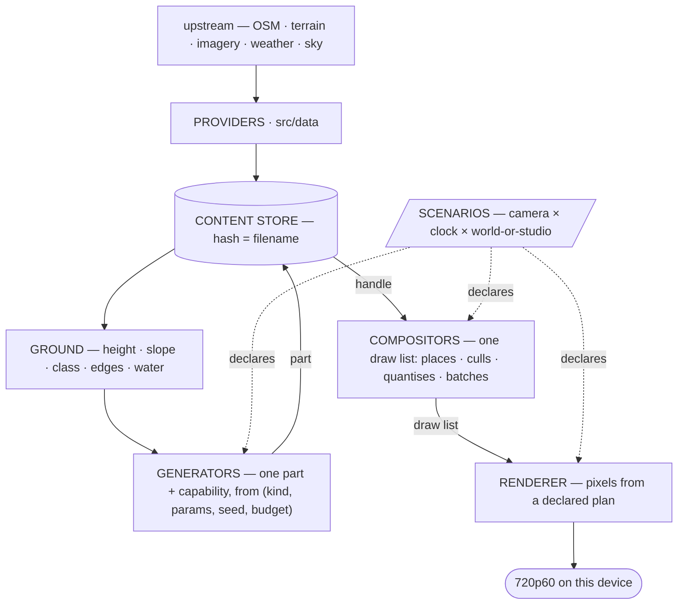

| layer may not spell | |
|---|---|
| Ground | camera · frustum · clock · LOD level · device · sun |
| generator | camera · neighbour part · draw list · device |
| compositor | device · pipeline · texture · shader · pass |
| renderer | any content noun |

Peers never call each other; a part-on-part dependency travels as data through Ground.
Budget = screen-space error in px, quantised to a global ladder before it becomes a key;
key = `(kind, params, seed, rung)` value, no strings. Degrade on detail, refuse on existence.

### The actor chain (SOLL — the owner's causal decomposition, general)

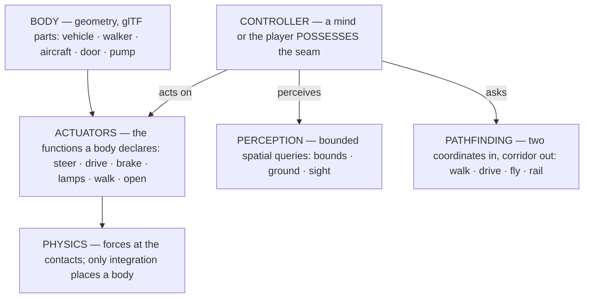

The chain holds for EVERYTHING that moves, with or without a mind: a parked car is a body whose
seam nobody possesses; a door is a body with one actuator; an NPC differs from the player only
in who possesses the seam (Unreal's Pawn/Controller possession — the reference). Perception is
spatial query over bounds, never privileged state; navigation is one pathfinding service with
modes, handed as a TOOL ; physics binds to actuators, never to the controller.
`Journey` folds into `Sim` along this chain. **A client includes nothing but
`include/outshine/`** — enforced by the build.

### The component model (SOLL — the decided reference design)

Reference: **Flecs** (relationships + traits + script parity), supplemented by GAS tag algebra,
Smart-Object slots, CARLA's vehicle grammar. Written here, never a dependency.

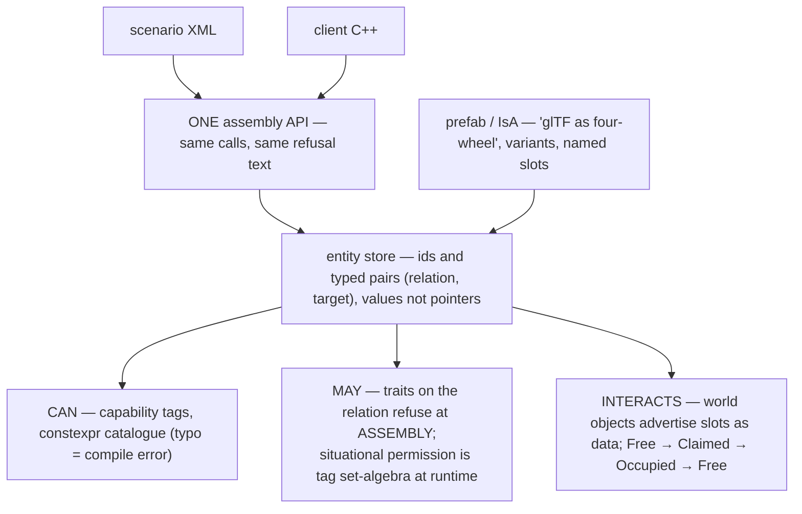

The XML reader is a serialisation of the assembly API against ONE graph — no second
representation, no converter (the Unity-baking rot). XML declares what the API can and nothing of
its own: no conditions, no control flow — behaviour belongs to the mind and the assignment. The
render plan stays a `constexpr` catalogue (unspellable beats refused-at-load); this graph is the
SCENE domain: vehicles, minds, tools, assignments, world objects. Banned by the sources
themselves: stringly-typed capabilities · content that ships a program · god actors ·
ECS-for-everything · unreserved shared affordances.

## Render plan (IST — what executes, judged as architecture)

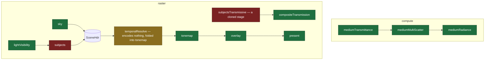

Green = sound abstraction by current knowledge; amber = form in question; red = provably wrong
(subjects: six responsibilities, instancing a literal, nothing culls; glass: a full clone of the
subject stage). One `Writes` producer per derived resource (`static_assert`); missing
contributor = picture choice, **published** as `-> neutral`; load/store ops derived from the
plan (`Stored()`).

## Render plan (SOLL — the declared target)

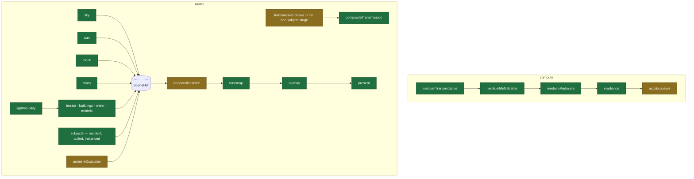

Green = certain; amber = probable (auto-exposure shape, AO method, TAA's place, and whether
transmissive draws fold into the subject stage are open design calls).

## Class structure (IST)

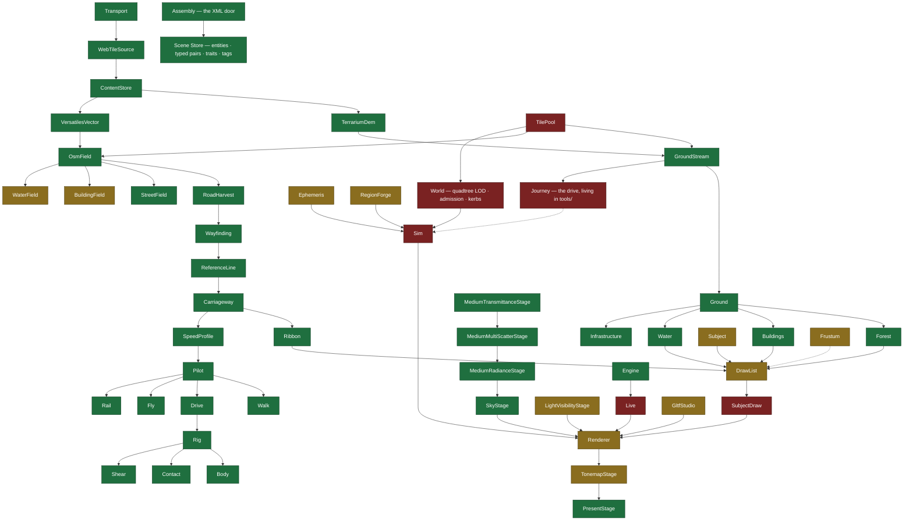

Colours are ARCHITECTURE, adjudicated by an independent review (2026-08-22): green = right
responsibility in the right layer; amber = form in question (fields that tessellate, the getter
carpet, TAA folded into tonemap, idle values); red = provably wrong — `TilePool` and `World`
spell camera and LOD inside the ground layer, `SubjectDraw` is six responsibilities, `Sim` and
`Live` are hand-wired god facades the component model replaces, `Journey` is engine work in a
tool. The rot concentrates at the orchestration edges; the middle of the tree is sound.

## Class structure (SOLL — where the tree is going)

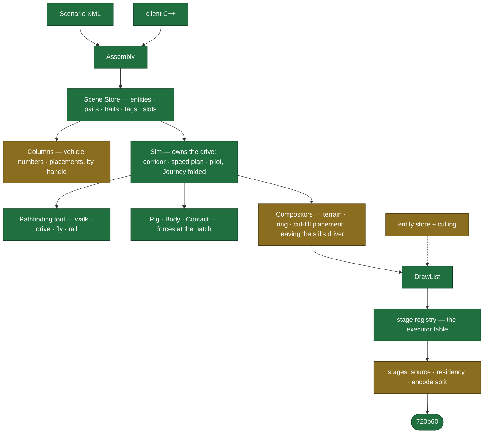

## Public interface (IST)

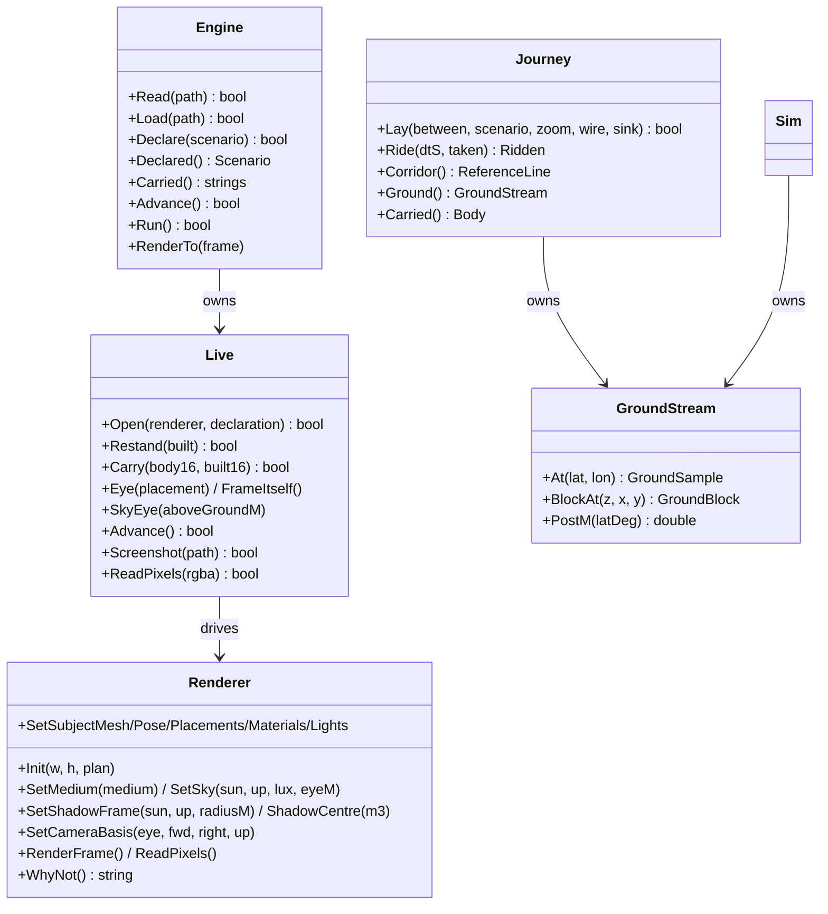

`Journey` still stands outside the library (it folds into `Sim`); `Live`, `Renderer`,
`GroundStream` and `Journey` are still reachable by clients — the SOLL below removes them.

## Public interface (SOLL — one door)

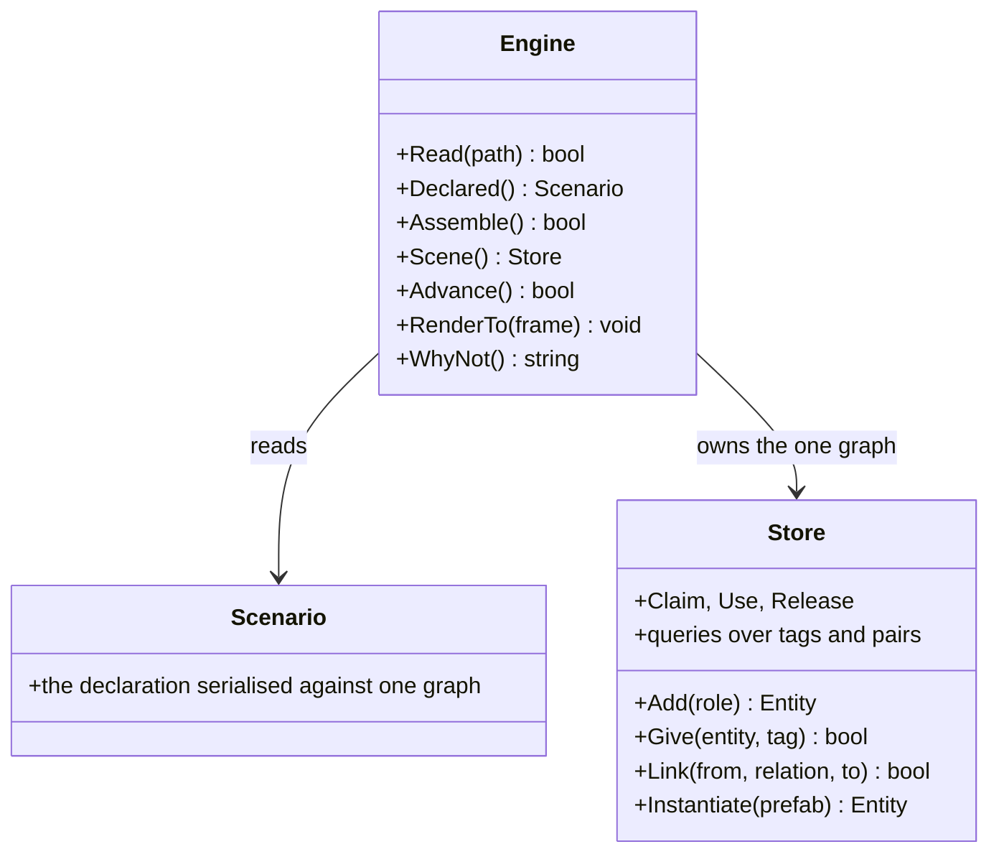

**The engine carries no gameplay verb.** Driving is an assembly, not a method: body `IsA`
four-wheel, `DrivenBy` mind, mind `Uses` a nav tool, mind `Assigned` a route as data — declared
in XML or built through `Scene()`, which are the same calls against the same graph. A verb per
activity on `Engine` would leak the catalogue into the facade and hand XML a graph it cannot
spell. Possession is the `DrivenBy` relation — the player's mind and the autopilot take the same
seam, so "take the wheel" is one relink, not an API. A client includes `include/outshine/` and
nothing else; Live, Renderer, GroundStream and the drive fold behind this door.

## Tests

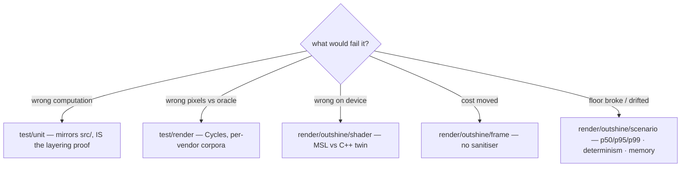

`test/run.sh` is the only runner (one process per test, real verdict, includes per layer = the
build's own sets). `tools/` builds ON the library, runs only by name. Oracle pipeline:
fetch → generate → patch (both sides) → convert → Cycles → compare (perceptual tail / geometric
bound, 0.005 px floor); **criteria met** and **cases within bound** published side by side.
Read the trailer first — a count without `N tests: … PASS … FAIL` may measure the past.
The one offline script: `test/harness/shared/corpus/prepare.py`.

## Board

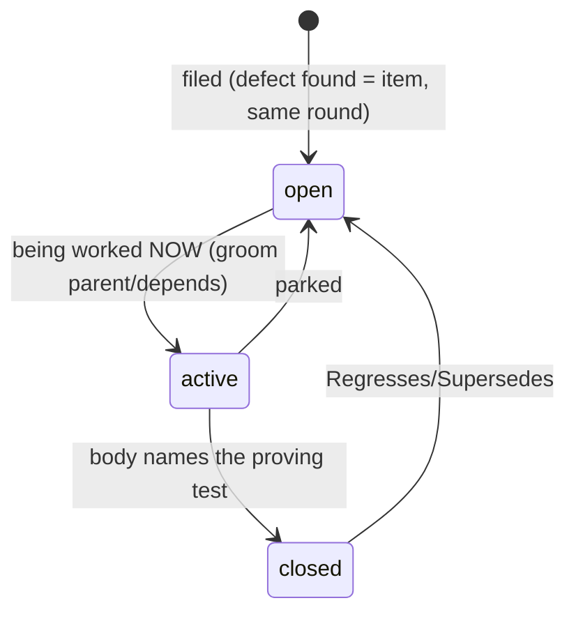

One file = RFC 822 header + markdown body. Fields: `Type` (feature|task|bug|issue) · `Parent`
(task→feature only) · `Area` (the tree's layers) · `Tags` · `Depends` · `Regresses` · `Supersedes`.
Filename `NNNN_label.md`; number = identity; no State/Id/dates — directory and git are the truth.
Titles say what WILL BE TRUE. Comments record what was LEARNED (append-only). Commits reference
`board:NNNN`. `board/active/` mirrors what is being worked on right now — always.

```sh
ls board/active/                                     # in flight NOW
grep -l '^Type: bug' board/open/*.md                 # by kind
grep -l '^Parent: 0007' board/*/*.md                 # a feature's children
git log --grep 'board:0042'                          # every commit on an item
ls board/*/ | grep -o '^[0-9]\{4\}' | sort -n | tail -1   # next id, derived
```

## Setup

| | |
|---|---|
| `src/` | the library entire; `src/assets/` its declared data; no entry point, no test |
| `test/` | `test/unit/` (mirror), `test/render/` (per vendor), `test/harness/` (scorers + `test/harness/claims/`) |
| `tools/` | `tools/driver/` (the test-drive game: worldwide A→B, FPV-first, declarative), `tools/viewer/`, `tools/host/` |
| `Makefile` | build · test · clean, nothing else |
| `board/` | the working system (above) |

References (fetched, not recalled): C++ Core Guidelines (binding) · Gregory GEA3 · RTR4 · PBR4 ·
Frostbite PBR/FrameGraph · Nanite (error-driven LOD) · Decima (runtime placement) · id Tech 7
(hard frame floor) · RAGE (decisionless pools) · SpeedTree (LOD cross-fade). Distance-ratio LOD
selection is refused by construction — one currency: projected error.
