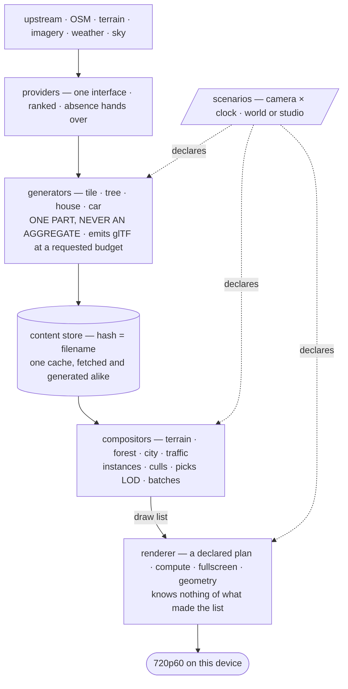

# Outshine

> **A CryEngine-class game engine: an OSM-based global open world, LLM-driven intelligence and an RPG
> above it, every piece of content from a generator behind one interface, external data behind another,
> and declarative `scenarios/` that declare interactive or non-interactive worlds — with or without a
> world at all. Kingdom Come: Deliverance is the world and its vegetation, GTA 5 the built world and
> the verbs — walk, drive, fly.**

The world is **loaded, not modelled**. **One physics system** carries walking, driving, flying and
swimming; an **epoch and decay dial** dresses the same geometry; the actors **think**; the setting is
post-scarcity. **The repository speaks one language: English** — code, comments, documents, commits.

## The shape, and it is the goal rather than the state

**Each layer is a suite**: a generated part is a render case against Cycles, a composition is a scenario
case over a moving camera, the renderer holds the Khronos criteria. **A layer that cannot be named on
this diagram does not belong in the engine.**

## The constraints, and there are no others

**SDL3** · **SDL_GPU** · **modern C++, and only C++ in the engine** · **this device at 720p60** — an Apple A18 Pro, 2 performance and
4 efficiency cores, 5 GPU cores, 8 GB, Metal 4. It is the development platform *and* the budget, so no
machine stands between the work and the target.

*Only C++ in the engine* leaves one door: a script may **prepare data offline**, committed beside what it
produces — never a test, a gate, a build step, or anything at runtime. Everything else here is a stance
or a setup; **the scope is [`doc/requirements.md`](doc/requirements.md)**, the authority on what the engine must do.

## Stance

**The owner's comments outrank everything.** The bar is CryEngine's level out of upstream data alone, and
**the way is the goal** — a round that learned something is a good round. **Nothing is a possession**:
formats, directories, algorithms, interfaces, build, tools are all material.

**Good C++ and proven engine design.** The Core Guidelines are binding and a deviation is a defect until
its reason stands beside it; the established way is the starting point and a deviation needs its reason
too. Prefer the shape that makes a mistake **unspellable** over the rule that forbids it — a rule a
checker counts can be broken and reported; a rule the type system carries does not compile.

**The engine is a library and it is platform agnostic.** A kernel manages it, so this can: the library
declares what it needs from a host and calls nothing else. Everything that runs it is a test.

**Testability is a design property.** If a thing cannot be tested, that is a fact about its shape. **Very
high coverage is part of the CryEngine-class claim** — requirement coverage the target, line and branch
coverage the instrument. **Something missing is a task, not a limit**: distinguish **not measurable** from
**not yet measured**, since the second has a cost rather than a boundary.

**Every number carries its origin** — derived, measured or `[SET]` — with its unit and frame of
reference. **No magic numbers.** Performance is a **distribution over a moving camera**, p50/p95/p99,
never a mean. **Appearance is judged by eye and in motion**; a number decides whether the frame floor
holds, never whether it looks right. **The mathematics is deterministic** — if pace decides the result,
the coupling is a bug.

## Setup

| | |
|---|---|
| `src/` | the library **entire** — its C++ and, in `src/assets/`, the declared data the engine is made of. No entry point, no build file, no host implementation, no test fixture |
| `test/` | four suites, split by **what decides them**. `unit/` **mirrors `src/` exactly** and carries the layering proof; `render/` is declarative and decided by agreement with the oracle; `scenario/` by frame time over a moving camera; `shader/` by a device. Plus the harness and the fixtures |
| `test/run.sh` | the harness. One process per test, a real verdict per test, non-zero on any failure or undeclared skip. **macOS has no `timeout(1)`** — it brings its own |
| `doc/requirements.md` | **the scope** — one line per feature with a box and a stable id; a ticked line **names the file that implements it and the test that holds it**. The architect extends it on its own evidence; only the owner shortens it |
| `doc/todo.md` · `doc/bugs.md` | the current work item, short · what exists and is wrong, with file and site, what decides it and what right looks like. A fixed bug is deleted in the round that fixes it |
| `.claude/agents/` | **`engine-developer`** builds and measures · **`engine-architect`** designs, judges and owns `doc/bugs.md` and `doc/requirements.md` |
| this file | the vision, the constraints, the stance, the setup. At most **100 lines** |

**Layering is the build, never a checker.** Each directory compiles with its own include set, so a name
it must not reach **has no spelling**. A breach is a compile error, and `test/` mirrors `src/` so every
test is a continuous proof that its layer's include set is exactly what it claims.

**Only correct work is committed**, and `git log` is what was — no journal.

## References

**Stroustrup/Sutter, [C++ Core Guidelines](https://isocpp.github.io/CppCoreGuidelines) — BINDING**, whole
in the tree at [`doc/CppCoreGuidelines.md`](doc/CppCoreGuidelines.md) (514 rules). Cite by number and
**read the rule rather than recalling it** — `ES.9` is *avoid ALL_CAPS names*, not the enumeration rule,
and that miscitation has already cost this project a round.

Gregory *Game Engine Architecture* 3e · Lengyel *FGED* I–III · Akenine-Möller *Real-Time Rendering* 4e ·
Pharr *PBR* 4e · Lagarde/de Rousiers *Moving Frostbite to PBR* · Ebert/Musgrave/Perlin/Worley *Texturing
& Modeling*, the canon for "appearance is a function" · Meyers · Pikus · Ericson · Bridson. **CryEngine**
is the level to match, **Kingdom Come: Deliverance** the world and its vegetation on a known budget,
**GTA 5** the built world and the verbs; SpeedTree, and **Blender** the oracle a render is checked against.
