# Outshine

**A modern game engine combining the best of RAGE and Unreal.** Development platform IS the target:
Apple A18 Pro (2P+4E cores, 5 GPU cores, 8 GB, Metal 4), **720p60 held** — p50/p95/p99 over a moving
camera, never a mean.

- **SDL3 · SDL3_GPU · SDL3_\*** are the only platform surface; **glTF 2.0** the only content surface
- **C++23**, `-Wall -Werror -Wpedantic`, one `-std` for the whole tree; `static_assert` and the type system over checkers; `std::span`/`std::string_view` at boundaries, `std::mdspan` for field and instance views, `std::expected` where a refusal carries its reason
- **SIMD- and optimization-friendly**: contiguous, one-width, pointer-free layouts; fast path on the hot path; batch over per-item; bounded terms on the frame path (no alloc/lock/disk/unbounded block)
- **Declarative**: scenarios declare, the engine behaves; content = data, engine = verbs; the consumer selects from a `constexpr` catalogue and cannot add to it
- **Batteries as declarations**: outshine ships convenience components -- generators, providers, world templates and factories (`Planet(params)` → a Scenario value) -- all catalogue citizens the scenario selects; the engine core stays scenario-agnostic
- **Every number carries its origin** (derived · measured · `[SET]`) with unit and population; no magic numbers; calibration measures, never decides
- **The code carries NO comments** — `src/`, `include/`, `tools/`, `apps/` hold no `//`, no block, no
  TODO, no derivation, no board number: names and structure carry the meaning, a number's
  origin lives in its board item and its commit, and prose may stand in a PROOF because a proof
  explains what it proves -- a proof being any source that carries `Covers("`, wherever it
  lives, and every source that does not being bound; work items live in `board/`, code never
  names them
- **Infrastructure built from OSM is PLAUSIBLE and geometrically correct, never necessarily
  true to the real road**: the data is a source of shape, not a specification to be reproduced,
  so a corner the graph demands is a finding only where it is implausible or geometrically
  wrong — never merely because the real road there is built to another class. And OSM does not
  carry the third dimension: **bridges, ramps, over- and underpasses, tunnels and every other
  3D course are RECONSTRUCTED**, and what a reconstruction owes is four kinds of plausibility —
  **geometric** (it closes, it is continuous, it does not intersect itself or what it crosses),
  **physical** (a vehicle can drive it at the speed the class implies), **static** (it stands:
  spans, piers and clearances that could carry their own load), **architectural** (it looks
  like the thing it is). A guess that holds all four is right; one that holds three is a finding
- **Cycles is the oracle** for correctness; references are for ambition; the corpus is a driver, not a certificate
- **One world space**; a failure is loud; something is always drawn; delete on the day you replace
- Artefacts go to the system temp dir, never the tree; `git log` is what was — no journal

**Diagram colours** — CURRENT: green = correct by current knowledge · amber = uncertain · red =
provably wrong · grey dashed = absent. TARGET: green = certain · amber = probable.

## Architecture (TARGET)

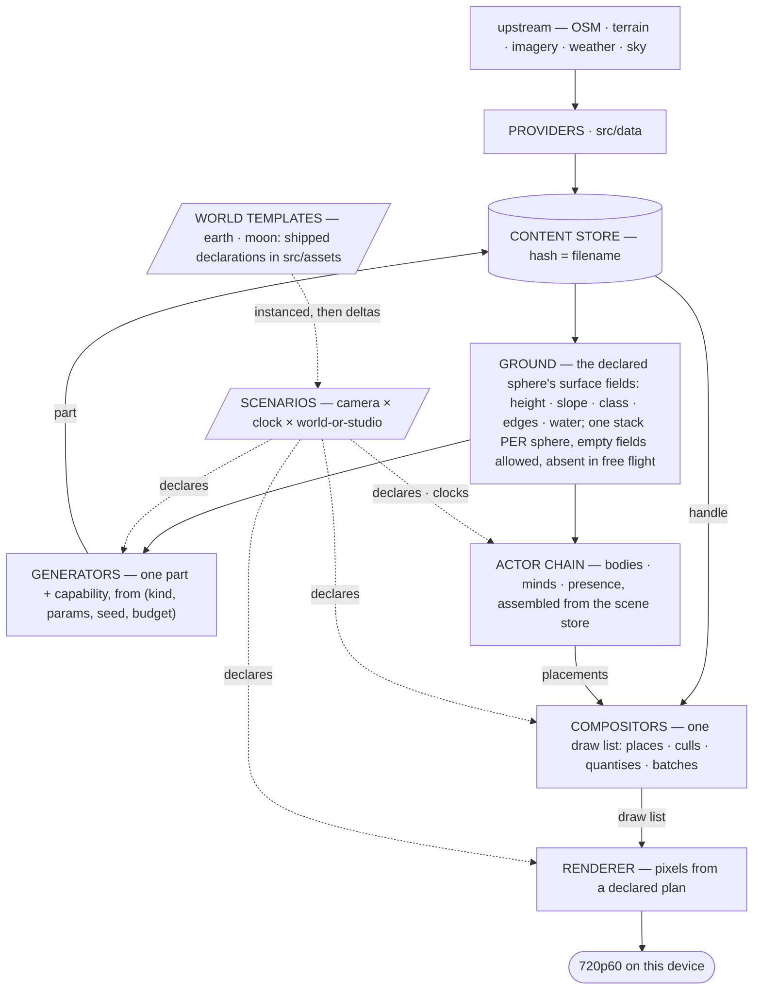

| layer may not spell | |
|---|---|
| any of src/ | Earth · Moon · a planet's name or numbers — worlds are declared spheres, templates are assets |
| Ground | camera · frustum · clock · LOD level · device · sun |
| generator | camera · neighbour part · draw list · device |
| compositor | device · pipeline · texture · shader · pass |
| renderer | any content noun |

Peers never call each other; a part-on-part dependency travels as data through Ground.
**The engine knows no Earth, no Moon, no stars — and GROUND is no planet either**: it is the
surface-field stack of whichever sphere is declared, instantiated per sphere, its fields empty
where the sphere has nothing (lunar water), and absent entirely for an actor in free flight —
the chain never requires a surface. A scenario declares a SYSTEM of spheres
(radius, gravity, providers, sky) shaped by height data; travel between them is an actor with
thrust and a possession relink, and local behaviour — the high jump, the bad driving — emerges
from the declared gravity through the physics, never from code. Earth ships as a TEMPLATE
(src/assets/scenarios/earth.xml, to be): a scenario instances it (`<world template="earth">`, one
level deep) and overrides by delta — setting replaces, removal is named, omission keeps the
template's value, an orphaned override refuses loudly, and the reader walks template then
deltas through the SAME assembly API (no merger). `Scenario Earth()` is the code-side factory
returning that declaration; the template alone must hold 720p60. CURRENT departs from this —
g and Earth radii still sit in code — and the audit with its repayment is the board's.
Budget = screen-space error in px, quantised to a global ladder before it becomes a key;
key = `(kind, params, seed, rung)` value, no strings. Degrade on detail, refuse on existence.

### The actor chain (TARGET — the owner's causal decomposition, general)

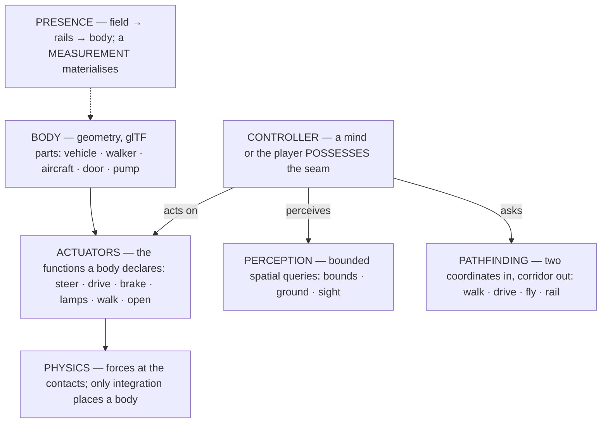

The chain holds for EVERYTHING that moves, with or without a mind: a parked car is a body whose
seam nobody possesses; a door is a body with one actuator; an NPC differs from the player only
in who possesses the seam (Unreal's Pawn/Controller possession — the reference). Perception is
spatial query over bounds, never privileged state; navigation is one pathfinding service with
modes, handed as a TOOL ; physics binds to actuators, never to the controller. Presence is a
rung on two axes (existence · fidelity, thresholds ordered): unmeasured actors are a conserving
FIELD, measured ones materialise (rails, then body) as a PURE EVALUATION of (kind, params, seed,
rung) — and materialisation is never transitive: minds read the abstract layer, only declared
instruments collapse it.
The drive is a product of free systems (AssembleDrive · DriveTick), no orchestration class left. **A client includes nothing but
`include/outshine/`** — enforced by the build.

### The component model (TARGET — the decided reference design)

Reference: **Flecs** (relationships + traits + script parity), supplemented by GAS tag algebra,
Smart-Object slots, CARLA's vehicle grammar. Written here, never a dependency.

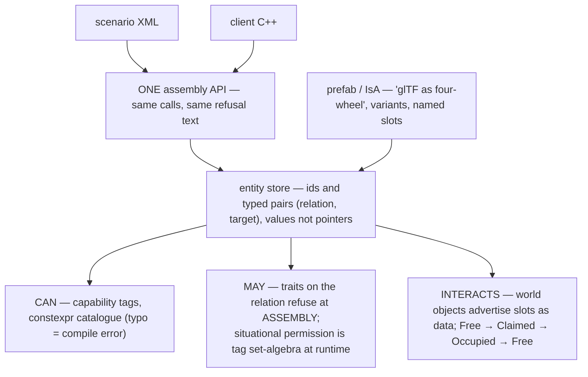

The XML reader is a serialisation of the assembly API against ONE graph — no second
representation, no converter (the Unity-baking rot). XML declares what the API can and nothing of
its own: no conditions, no control flow — behaviour belongs to the mind and the assignment. The
render plan stays a `constexpr` catalogue (unspellable beats refused-at-load); this graph is the
SCENE domain: vehicles, minds, tools, assignments, world objects. Banned by the sources
themselves: stringly-typed capabilities · content that ships a program · god actors ·
ECS-for-everything · unreserved shared affordances.

## Render plan (CURRENT — what executes, judged as architecture)

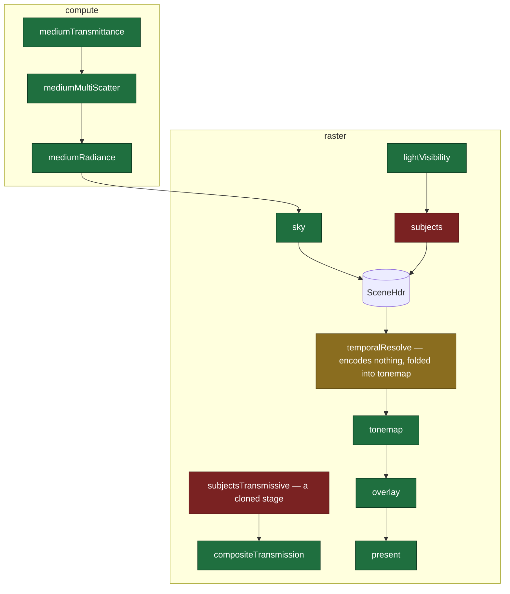

Green = sound abstraction by current knowledge; amber = form in question; red = provably wrong,
and each red cites what makes it so:

| red | what makes it red, at HEAD |
|---|---|
| `SUBJ` | one stage carrying six responsibilities -- `ShaderSource(const SourceOptions &options)` (SubjectDraw.h:30), `PipelineAt(VertexLayout layout, SurfaceKind kind, bool cullsBack)` (:147), `FlushCrossings(SDL_GPUCommandBuffer *commands)` (:141), `SetPlacements(const double *models, size_t rows, std::string &error)` (:51), `SetLights(std::span<const SubjectLight> lights, std::string &error)` (:82) and `EncodeDepthOnly(const double lightFromWorld16[16], const double eye[3], int atlasPx,` (:89) beside its one `void Encode(const FrameContext &ctx, const PassRecording &into)` (:86); nothing culls |
| `GLASS` | `{Stage::SubjectsTransmissive, Provenance::Content, PassKind::Raster, "subjectsTransmissive",` (RenderCatalogue.h:268) is a full clone of `{Stage::Subjects, Provenance::Content, PassKind::Raster, "subjects",` (:263) -- transmissive draws belong in the one subject stage |

One `Writes` producer per derived resource (`static_assert`); missing contributor = picture
choice, **published** as `-> neutral`; load/store ops derived from the plan (`Stored()`).

## Render plan (TARGET)

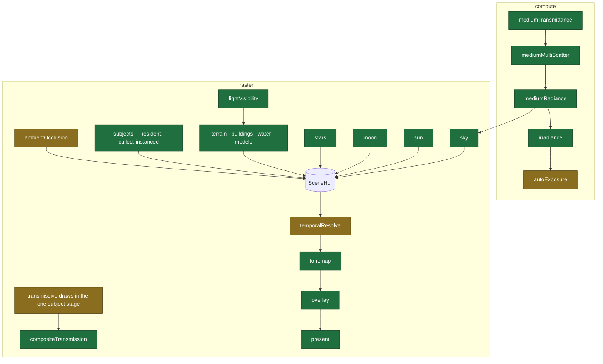

Green = certain; amber = probable (auto-exposure shape, AO method, TAA's place, and whether
transmissive draws fold into the subject stage are open design calls).

## Class structure (CURRENT)

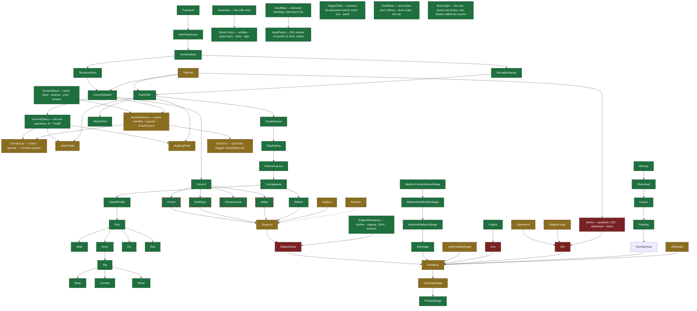

Colours are ARCHITECTURE, re-adjudicated against HEAD (2026-08-24); every red below cites what
makes it red, and a colour whose stated reason has gone stale is itself a finding. Green = right
responsibility in the right layer; amber = form in question. **A DASHED RED OUTLINE is the
second axis, added 2026-08-24 (board:1805): the node's FILL says whether its shape is right,
the outline says whether anything outside `src/` can reach it — a dashed node's only path to a
client runs through a node this map colours red, so its fill is a judgement about a layer
nobody calls.** Green and reached is the only state that means the picture gets drawn.

| red | what makes it red, at HEAD |
|---|---|
| `World` | spells camera and LOD inside the ground layer: `struct Eye` (World.h:49), `Refine(const Eye &eye, double nowMs)` (:55), `EyeInMercatorBand()` (:118), and 9 `const double eye[3]` (:189-195) |
| `SubjectDraw` | six responsibilities in one class: `ShaderSource(const SourceOptions &options)` (SubjectDraw.h:30), `PipelineAt(VertexLayout layout, SurfaceKind kind, bool cullsBack)` (:147), `FlushCrossings(SDL_GPUCommandBuffer *commands)` (:141), `SetPlacements(const double *models, size_t rows, std::string &error)` (:51), `SetLights(std::span<const SubjectLight> lights, std::string &error)` (:82), and `EncodeDepthOnly(const double lightFromWorld16[16], const double eye[3], int atlasPx,` (:89) beside the one `void Encode(const FrameContext &ctx, const PassRecording &into)` (:86) a stage owes |
| `Sim` | `class Sim {` (Sim.h:37) is a hand-wired god facade the component model replaces: a facade reached through 25 `#include "` |
| `Live` | `class Live {` (Live.h:71) reaches the renderer and the layout from one class — `#include "Renderer.h"` (:18) beside `#include "Layout.h"` (:13) |

Amber says the FORM is in question, and every amber below names the line the question stands
at (board:1777):

| amber | the form in question, at HEAD |
|---|---|
| `BuildingField` | `class BuildingField {` (BuildingField.h:20) holds a `struct Footprint` of raw index ranges (`uint32_t FirstPoint = 0, PointCount = 0;`, :24) and takes a mesher by pointer (`void Shapes(const StructureMesher *mesher)`, :32) -- a field that tessellates |
| `WaterField` | `void Tessellate(const OsmField &field, std::vector<float> &out) const;` (WaterField.h:47) -- the same: a field that meshes rather than one that answers |
| `Subject` | `class Subject {` (Subject.h:98) carries 42 `[[nodiscard]]` over one glTF document -- the getter carpet |
| `DrawList` | `class DrawList {` (DrawList.h:167) with `struct VertexLayoutRow {` (:49) beside it: the list and the layout table in one header |
| `Renderer` | `class Renderer {` (Renderer.h:31) publishes 52 `[[nodiscard]]` and 16 `const {` -- the getter carpet, on the frame path |
| `TonemapStage` | `class TonemapStage {` (TonemapStage.h:14) is where `temporalResolve` folded into, so it carries two picture decisions |
| `LightVisibilityStage` | `class LightVisibilityStage {` (LightVisibilityStage.h:16) -- one shadow atlas for every light, no cascade selection declared |
| `Frustum` | `struct Frustum {` (Camera.h:94) sits in core beside the camera, while culling belongs to the compositor |
| `Ephemeris` | `inline void EarthSunPos(double lat, double lon, double utc, float *el, float *az) {` (Ephemeris.h:11) -- a whole-function header, out-parameters by pointer, and `constexpr int kEphemerisMinYear = 1901, kEphemerisMaxYear = 2099;` (:9) bounding a sphere the engine may not name |
| `RegionForge` | `class RegionForge {` (RegionForge.h:18) forges regions from a client layer |
| `GltfStudio` | `struct Studio {` (GltfStudio.h:26) beside `struct StudioScratch {` (:49) -- the studio and its scratch are two spellings of one stand-up |
| `DriveAssembly` | `[[nodiscard]] bool AssembleDrive(const Store &scene, const Assembled &cast,` (DriveAssembly.h:39) takes a product's worth of inputs, listed one per line, and a product that needs that many is a product whose shape is not settled |
| `CorridorLay` | `[[nodiscard]] bool LayCorridor(const Path::Route &route, const GroundQuery &ground,` (CorridorLay.h:36) -- same shape, same question |
| `DriveTick` | `[[nodiscard]] Ridden DriveTick(const Corridor &way, const Rigged &stood,` (DriveTick.h:98) returns a whole struct by value each tick |
| `TAA` | `{Stage::TemporalResolve, Provenance::Content, PassKind::Raster, "temporalResolve",` (RenderCatalogue.h:278) declares a stage that encodes nothing of its own -- it is folded into tonemap rather than standing as its own resolve |
| `TilePool` | `class TilePool {` (TilePool.h:35) holds 3 `std::mutex`, a `std::condition_variable`, a `std::map` and a `std::set` where a slot table and a ring would do -- a decisionless pool holds no tree |

Dashed says the node is STRANDED, and every dashed node below names the facade it hangs off
(board:1805, measured 2026-08-24):

| stranded | its only way to a client, at HEAD |
|---|---|
| `Forest` | `src/clients/Sim.{h,cpp}` and nothing else in `src/` |
| `Buildings` | `Sim.{h,cpp}`, `BuildingField.cpp`, `OsmLayer.h`, `World.{h,cpp}` -- every one of them inside the ground/client pair |
| `Water` | `Sim.cpp`, `World.h` |
| `Infrastructure` | `Sim.h` |
| `RegionForge` | `Sim.h` |

and `Sim` itself: `grep -rln '"Sim.h"' src test tools apps` finds `src/clients/Sim.cpp` and one
test. 798 lines of facade, no consumer. The world composition path exists, is proven per node
since board:1806, and nothing walks it -- which is why `apps/driver` builds its terrain, its
far ring and its road ribbon in 1281 lines of its own C++.

`TilePool` moved red → amber (its row above carries the form now in question): the earlier
sentence said it spells camera and LOD, and it does not — `grep -cEi 'eye|camera|frustum|\blod\b'` over both its files is 0. It is a
byte-budgeted LRU work pool keyed on projected error, which is the RAGE reference, not a
layering breach. Its amber is its FORM, and its row above carries the count: a `condition_variable`, a `std::map`
and a `std::set` of pointer-chasing nodes where a slot table and a ring would do — a
decisionless pool holds no tree. `LayCorridor`'s twin debt is PAID (board:1624 closed
2026-08-24): its door takes `const GroundQuery &` -- the two questions it asks -- and
`test/unit/sim/ACorridorIsLaidOverASyntheticRoute` lays 364 lines of route over a ten-line
synthetic ground, so its amber is now the parameter list alone, as its row says.
`AssembleDrive` and `DriveTick` keep the older reason. Journey died with move 2(e): the six consumers hold
{GroundStack, DriveProduct} and call the free systems directly. The rot concentrates at the
orchestration edges; the middle of the tree is sound.

## Class structure (TARGET — where the tree is going)

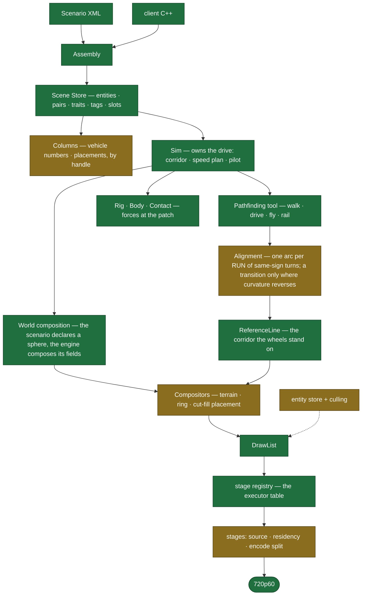

Two nodes are new (2026-08-24) and each is argued rather than wished:

- **`Alignment` replaces the per-vertex corner table**, and the reason is a measurement, not a
  preference. `Fit` puts a spiral-arc-spiral at EVERY vertex and returns the curvature to zero
  between them, so a polyline that describes a curve is laid at `R/(1+alpha)` — `alpha = 0.5` in
  the code, giving exactly two thirds of the true radius, reproduced to four digits over five
  values of alpha and at every digitisation density (board:1795). No constant repairs it; a
  transition is owed where the CURVATURE changes, not where a digitiser put a point. On
  Munich--Hamburg 769 of 2202 corners (35 %) sit inside a run of same-sign turns and would be
  lifted from `R/1.5` to `R*cos(s/2)`. It is amber because the split rule at a run's end — when
  the accuracy bound forces a run apart — is not settled.
- **`World composition` is the layer board:1805 found missing**, and it is green because the
  requirement is not in doubt: *scenarios declare, the engine behaves*. A scenario declares the
  sphere and which surface fields it wants drawn; the engine composes them. That the one client
  in the tree builds its own terrain and ribbon in C++ is the distance to be repaid, not a
  reason to lower the target.

## Public interface (CURRENT)

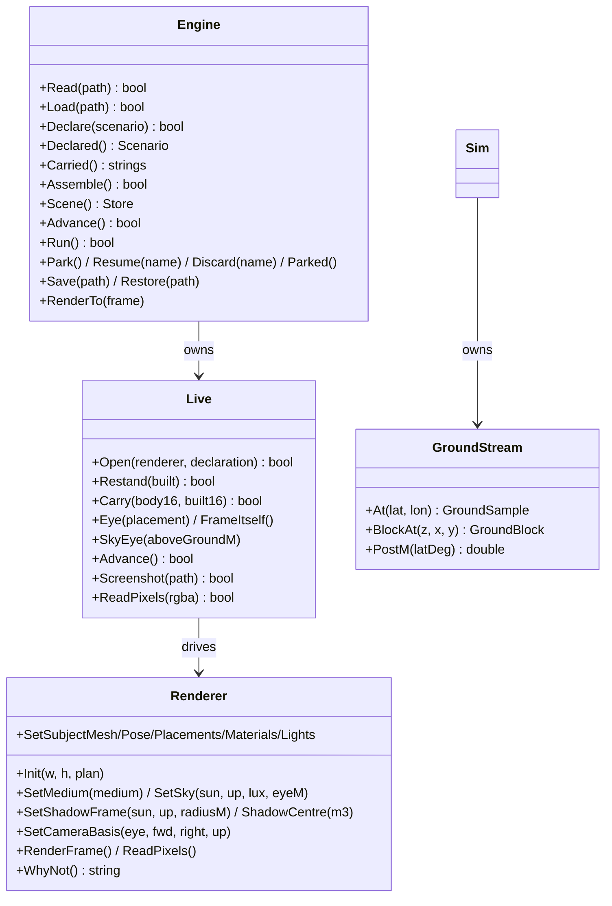

`Live`, `Renderer`, `GroundStream` and the drive systems are still reachable by clients —
the TARGET below removes them.
The assembly API stands public since 2026-08-22: `include/outshine/{Register,Store,Column}.h`
are the C++ door, `Engine::Assemble/Scene` own the one graph, proven by a client that includes
nothing but `outshine/`.

## Public interface (TARGET — one door)

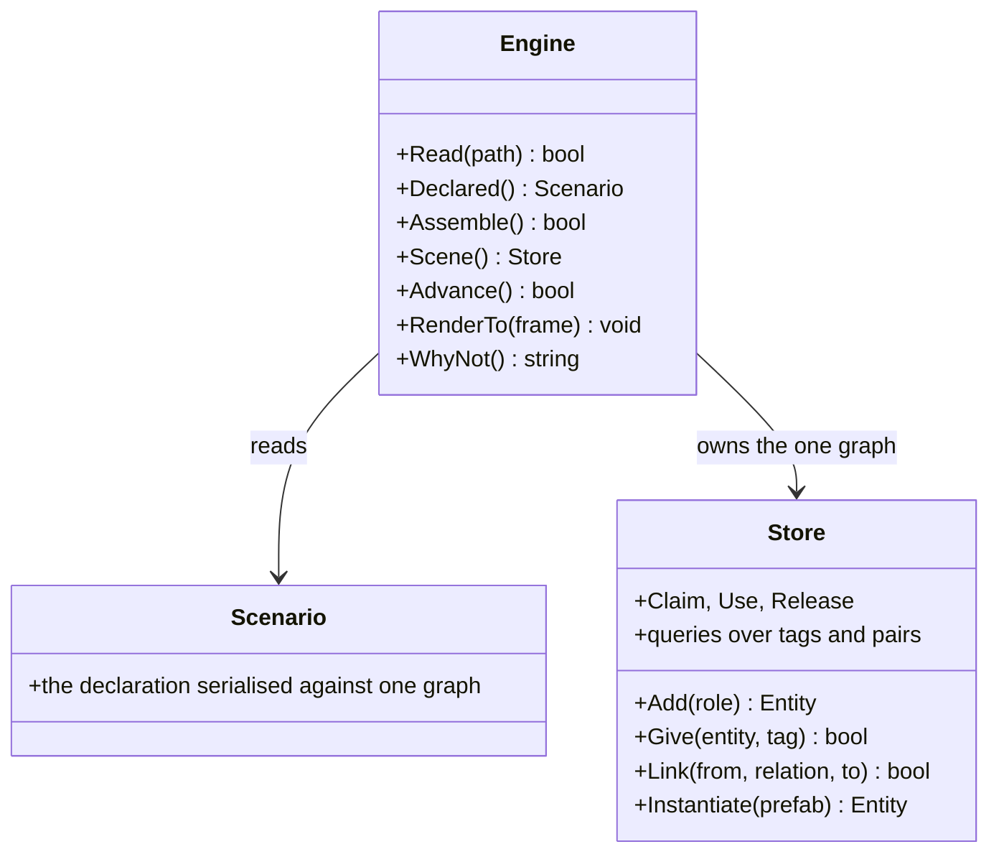

**The engine carries no gameplay verb.** Driving is an assembly, not a method: body `IsA`
four-wheel, `DrivenBy` mind, mind `Uses` a nav tool, mind `Assigned` a route as data — declared
in XML or built through `Scene()`, which are the same calls against the same graph. A verb per
activity on `Engine` would leak the catalogue into the facade and hand XML a graph it cannot
spell. Possession is the `DrivenBy` relation — the player's mind and the autopilot take the same
seam, so "take the wheel" is one relink, not an API. A client includes `include/outshine/` and
nothing else; Live, Renderer, GroundStream and the drive fold behind this door.

## Tests

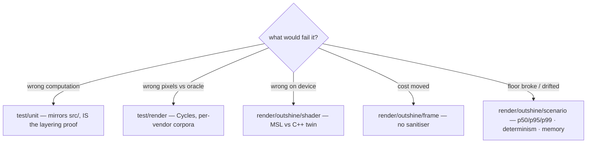

The unit mirror is the REGRESSION GATE and it is fast; the long device and corpus suites are the
sporadic full proof, run when named, never per edit. `test/run.sh` is the only runner (one process per test, real verdict, includes per layer = the
build's own sets). `tools/` and `apps/` build ON the library and run only by name. Oracle pipeline:
fetch → generate → patch (both sides) → convert → Cycles → compare (perceptual tail / geometric
bound, 0.005 px floor); **criteria met** and **cases within bound** published side by side.
Read the trailer first — a count without `N tests: … PASS … FAIL` may measure the past. The
fast gate also publishes **what it did not judge**: every source it stood aside from is still
COMPILED (`N source(s) the gate did not run still compile, M do not`, and `M > 0` turns the
gate red — board:1766), and every declared case family holding no fetched subject is named,
because a corpus is fetched and a green trailer must not read as coverage it never had
(board:1765). `test/run.sh --corpus` answers that second question alone.
The one offline script: `test/harness/shared/corpus/prepare.py`. The corpus lives in the system
temp dir, so the machine may sweep it: a case whose prepared input is gone is **rebuilt from its
owning manifest** before it is judged — per owner, found by inverting the prepared-directory
mapping onto the path the failing case names in its log, its cost beside the bound with the
builds. A missing subject says `UNPREPARED`, never `FAIL`: the first says this run judged
nothing here, the second says the code is wrong (board:1797, 1798).

## Board

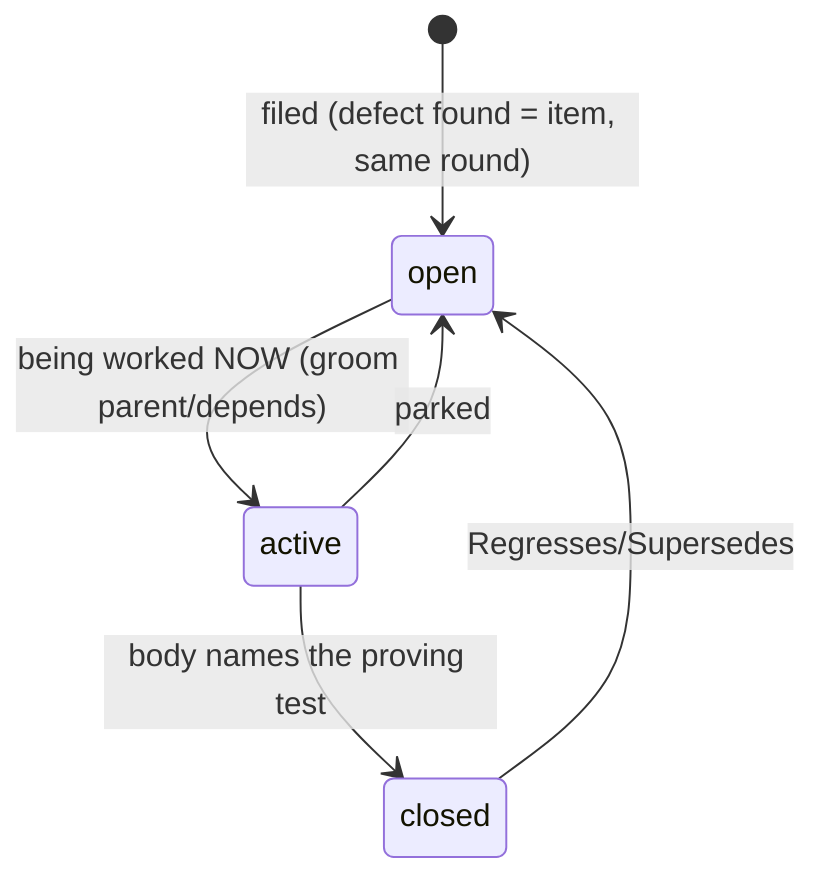

One file = RFC 822 header + markdown body. Fields: `Type` (feature|task|bug|issue) · `Parent`
(task→feature or task→issue: working a reviewer issue files a task attached to it) · `Area` (the tree's layers) · `Tags` · `Depends` · `Regresses` · `Supersedes`.
Filename `NNNN_label.md`; number = identity; no State/Id/dates — directory and git are the truth.
Titles say what WILL BE TRUE. Comments record what was LEARNED (append-only). Commits reference
`board:NNNN`. `board/active/` mirrors what is being worked on right now — always.

```sh
ls board/active/                                     # in flight NOW
grep -l '^Type: bug' board/open/*.md                 # by kind
grep -l '^Parent: 0007' board/*/*.md                 # a feature's children
git log --grep 'board:0042'                          # every commit on an item
ls board/*/ | grep -o '^[0-9]\{4\}' | sort -n | tail -1   # next id, derived
```

## Setup

| | |
|---|---|
| `src/` | the library entire; `src/assets/` its declared data; no entry point, no test |
| `test/` | `test/unit/` (mirror), `test/render/` (per vendor), `test/harness/` (scorers + `test/harness/claims/`) |
| `tools/` | development support built ON the library: what serves the PROCESS — transports, and a browser for looking at the corpus |
| `apps/` | applications built ON the library: what serves the PRODUCT — not tests, but they exercise the whole engine and are run by name; the engine knows none of them. **At HEAD it holds five case sources and no program** — the split is right and the tree has not caught up (board:1803) |
| `Makefile` | build · test · clean, nothing else |
| `board/` | the working system (above) |

## The hourly architect

A cron fires at **:17 every hour** and runs the `architecture-reviewer` agent over the tree:
it reads this file and the commit delta since the last review, judges the code as a principal
engineer would (RAGE and Unreal are the benchmark), and files what it finds into `board/`.
The review NEVER edits src/ — it files, sharpens and REOPENS; the repair is the queue's work.

| | |
|---|---|
| what it delivers | delta verdict · findings with file:line · new/changed board items · **what moved in CURRENT and in TARGET** · an explicit defect-free yes/no |
| where its findings land | `board/open/`, numbered from the next free id, one commit per round |
| a finding that reappears | reopens the item HARDER, with the measurement that disproves the closure |
| its gate | run only in its own `git worktree` — the main nest is pid-locked (`test/run.sh`) |

**It owns both maps, and the aim is CURRENT = TARGET** — the distance between them is the
work list, and the review is the only writer of the diagrams in this file:

| | | |
|---|---|---|
| **CURRENT** | the tree at HEAD, measured | MUST be corrected when the code moves — a node added, removed, renamed, recoloured, or a `file:line` citation that no longer says what its row claims |
| **TARGET** | where the tree is going | MAY change on a fetched reference, a measurement, or an owner requirement — argued in the commit, never silent |

No aspirational green; "it turned out harder" never lowers TARGET. A node that reaches its
target goes green and is named in the report. A gap no board item covers gets one filed.

Between reviews the open board is worked continuously: pick the next item, repair it, close
it with the proving test named in its body and a NEGATIVE CONTROL that shows the test red
against the defect. A closure that names no such test is not a closure. Done is: the board
holds no open item and a full round finds nothing — said explicitly — and the round after
it agrees.

References (fetched, not recalled): C++ Core Guidelines (binding) · Gregory GEA3 · RTR4 · PBR4 ·
Frostbite PBR/FrameGraph · Nanite (error-driven LOD) · Decima (runtime placement) · id Tech 7
(hard frame floor) · RAGE (decisionless pools) · SpeedTree (LOD cross-fade). Distance-ratio LOD
selection is refused by construction — one currency: projected error.
