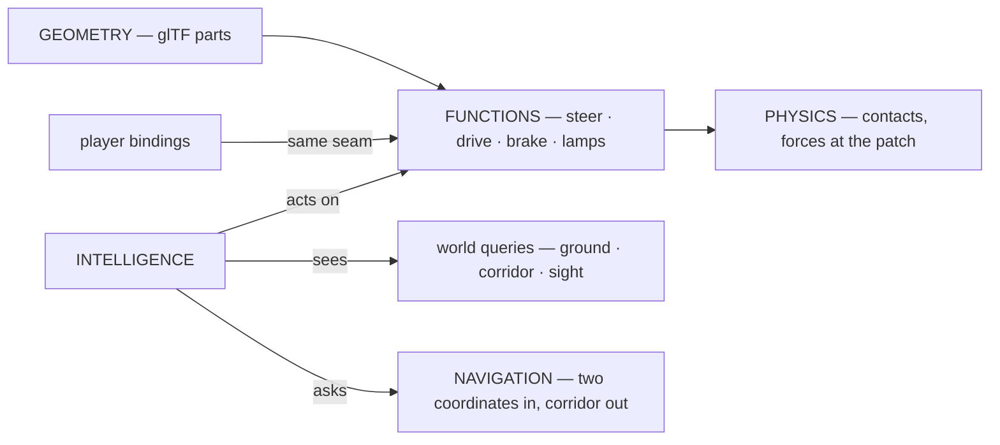
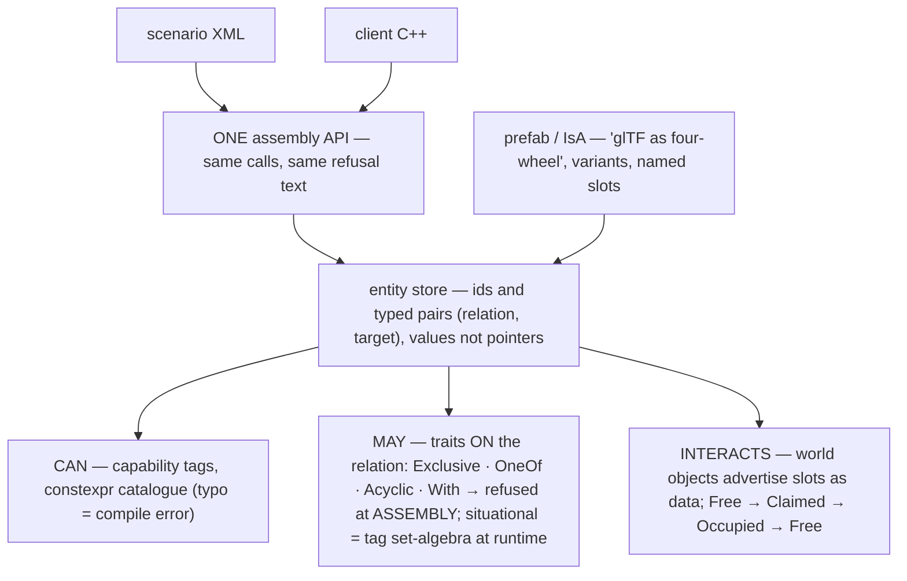
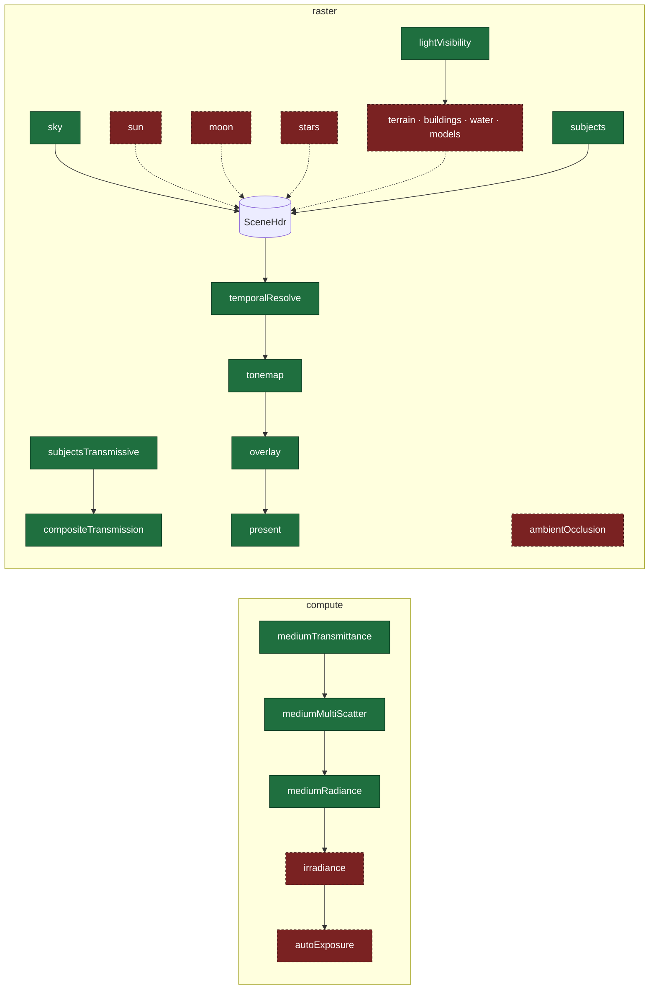
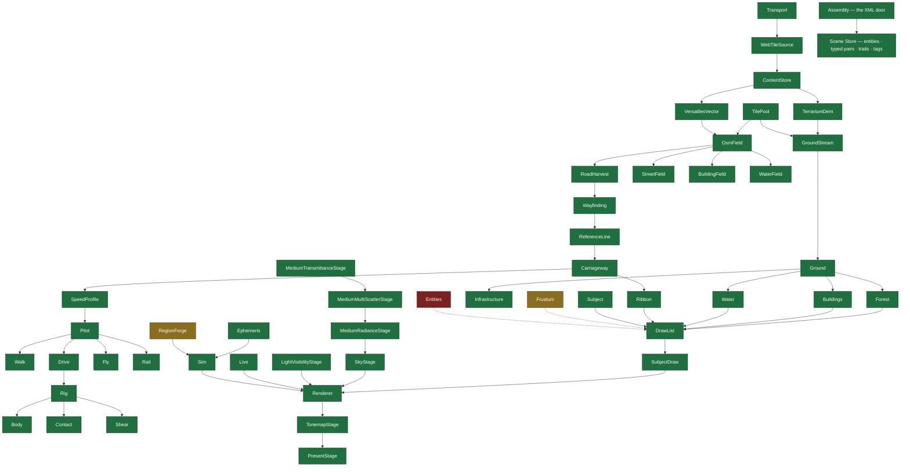
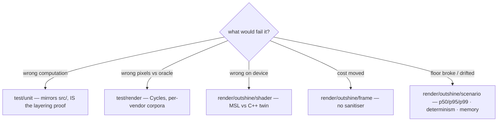
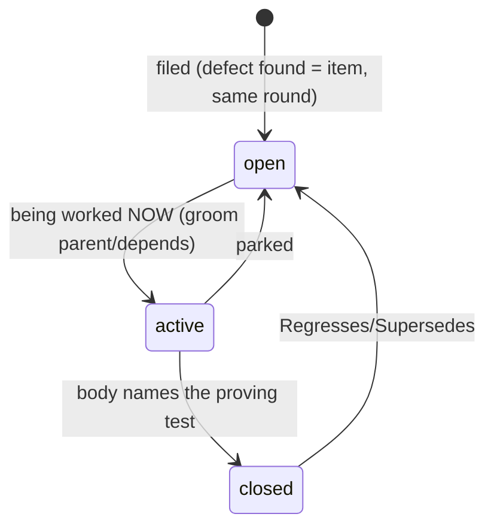

# Outshine

**A modern game engine combining the best of RAGE and Unreal.** Development platform IS the target:
Apple A18 Pro (2P+4E cores, 5 GPU cores, 8 GB, Metal 4), **720p60 held** — p50/p95/p99 over a moving
camera, never a mean.

- **SDL3 · SDL3_GPU · SDL3_\*** are the only platform surface; **glTF 2.0** the only content surface
- **Modern C++**, `-Wall -Werror -Wpedantic`; `static_assert` and the type system over checkers
- **SIMD- and optimization-friendly**: contiguous, one-width, pointer-free layouts; fast path on the hot path; batch over per-item; bounded terms on the frame path (no alloc/lock/disk/unbounded block)
- **Declarative**: scenarios declare, the engine behaves; content = data, engine = verbs; the consumer selects from a `constexpr` catalogue and cannot add to it
- **Every number carries its origin** (derived · measured · `[SET]`) with unit and population; no magic numbers; calibration measures, never decides
- **The code carries no commentary**; work items live in `board/`, code never names them
- **Cycles is the oracle** for correctness; references are for ambition; the corpus is a driver, not a certificate
- **One world space**; a failure is loud; something is always drawn; delete on the day you replace
- Artefacts go to the system temp dir, never the tree; `git log` is what was — no journal

## Architecture (SOLL)


| layer may not spell | |
|---|---|
| Ground | camera · frustum · clock · LOD level · device · sun |
| generator | camera · neighbour part · draw list · device |
| compositor | device · pipeline · texture · shader · pass |
| renderer | any content noun |

Peers never call each other; a part-on-part dependency travels as data through Ground.
Budget = screen-space error in px, quantised to a global ladder before it becomes a key;
key = `(kind, params, seed, rung)` value, no strings. Degrade on detail, refuse on existence.

### The actor chain (SOLL — the owner's causal decomposition)



Physics binds to functions, never to the mind; the mind and the player actuate ONE seam.
`Journey` folds into `Sim` along this chain (`board:1581`). **A client includes nothing but
`include/outshine/`** — enforced by the build (`board:1582`).

### The component model (SOLL — reference design, `board:1583`)

Reference: **Flecs** (relationships + traits + script parity), supplemented by GAS tag algebra,
Smart-Object slots, CARLA's vehicle grammar. Written here, never a dependency.



The XML reader is a serialisation of the assembly API against ONE graph — no second
representation, no converter (the Unity-baking rot). XML declares what the API can and nothing of
its own: no conditions, no control flow — behaviour belongs to the mind and the assignment. The
render plan stays a `constexpr` catalogue (unspellable beats refused-at-load); this graph is the
SCENE domain: vehicles, minds, tools, assignments, world objects. Banned by the sources
themselves: stringly-typed capabilities · content that ships a program · god actors ·
ECS-for-everything · unreserved shared affordances.

## Render plan (IST/SOLL per stage)



Green = `Renderer::Executable` returns true and a suite proves it; red dashed = catalogued, refused
loudly by name. One `Writes` producer per derived resource (`static_assert`); missing contributor =
picture choice, **published** as `-> neutral`; load/store ops derived from the plan (`Stored()`).

## Class structure (IST)



Green = in a passing suite's source list; amber = compiled, run by nothing; red dashed = target
needs it, not in the tree. Known departures (each a board item): instancing passes a literal 1 and
nothing culls (`board:1538`); glass is a cloned stage and content change = full rebuild
(`board:1574`); shading samples no atlas yet (`board:1575`); `SubjectDraw` is six responsibilities
(`board:1577`).

## Public interface (IST)

```mermaid
classDiagram
  class Engine {
    +Read(path) bool
    +Load(path) bool
    +Declare(scenario) bool
    +Declared() Scenario
    +Carried() strings
    +Advance() bool
    +Run() bool
    +RenderTo(frame)
  }
  class Live {
    +Open(renderer, declaration) bool
    +Restand(built) bool
    +Carry(body16, built16) bool
    +Eye(placement) / FrameItself()
    +SkyEye(aboveGroundM)
    +Advance() bool
    +Screenshot(path) bool
    +ReadPixels(rgba) bool
  }
  class Renderer {
    +Init(w, h, plan)
    +SetSubjectMesh/Pose/Placements/Materials/Lights
    +SetMedium(medium) / SetSky(sun, up, lux, eyeM)
    +SetShadowFrame(sun, up, radiusM) / ShadowCentre(m3)
    +SetCameraBasis(eye, fwd, right, up)
    +RenderFrame() / ReadPixels()
    +WhyNot() string
  }
  class GroundStream {
    +At(lat, lon) GroundSample
    +BlockAt(z, x, y) GroundBlock
    +PostM(latDeg) double
  }
  class Journey {
    +Lay(between, scenario, zoom, wire, sink) bool
    +Ride(dtS, taken) Ridden
    +Corridor() ReferenceLine
    +Ground() GroundStream
    +Carried() Body
  }
  Engine --> Live : owns
  Live --> Renderer : drives
  Journey --> GroundStream : owns — folds into Sim, board:1581
  Sim --> GroundStream : owns via World
```

Headers must read like a good book: `include/outshine/Outshine.h` is the four-line client;
`src/corridor/Ribbon.h`, `src/world/TerrainLoader.h`, `src/render/plan/RenderCatalogue.h` are the
models to match.

## Tests



`test/run.sh` is the only runner (one process per test, real verdict, includes per layer = the
build's own sets). `tools/` builds ON the library, runs only by name. Oracle pipeline:
fetch → generate → patch (both sides) → convert → Cycles → compare (perceptual tail / geometric
bound, 0.005 px floor); **criteria met** and **cases within bound** published side by side.
Read the trailer first — a count without `N tests: … PASS … FAIL` may measure the past.
The one offline script: `test/harness/shared/corpus/prepare.py`.

## Board



One file = RFC 822 header + markdown body. Fields: `Type` (feature|task|bug|issue) · `Parent`
(task→feature only) · `Area` (the tree's layers) · `Tags` · `Depends` · `Regresses` · `Supersedes`.
Filename `NNNN_label.md`; number = identity; no State/Id/dates — directory and git are the truth.
Titles say what WILL BE TRUE. Comments record what was LEARNED (append-only). Commits reference
`board:NNNN`. `board/active/` mirrors what is being worked on right now — always.

```sh
ls board/active/                                     # in flight NOW
grep -l '^Type: bug' board/open/*.md                 # by kind
grep -l '^Parent: 0007' board/*/*.md                 # a feature's children
git log --grep 'board:0042'                          # every commit on an item
ls board/*/ | grep -o '^[0-9]\{4\}' | sort -n | tail -1   # next id, derived
```

## Setup

| | |
|---|---|
| `src/` | the library entire; `src/assets/` its declared data; no entry point, no test |
| `test/` | `test/unit/` (mirror), `test/render/` (per vendor), `test/harness/` (scorers + `test/harness/claims/`) |
| `tools/` | `tools/driver/` (the test-drive game: worldwide A→B, FPV-first, declarative — `board:1573`), `tools/viewer/`, `tools/host/` |
| `Makefile` | build · test · clean, nothing else |
| `board/` | the working system (above) |

References (fetched, not recalled): C++ Core Guidelines (binding) · Gregory GEA3 · RTR4 · PBR4 ·
Frostbite PBR/FrameGraph · Nanite (error-driven LOD) · Decima (runtime placement) · id Tech 7
(hard frame floor) · RAGE (decisionless pools) · SpeedTree (LOD cross-fade). Distance-ratio LOD
selection is refused by construction — one currency: projected error.
