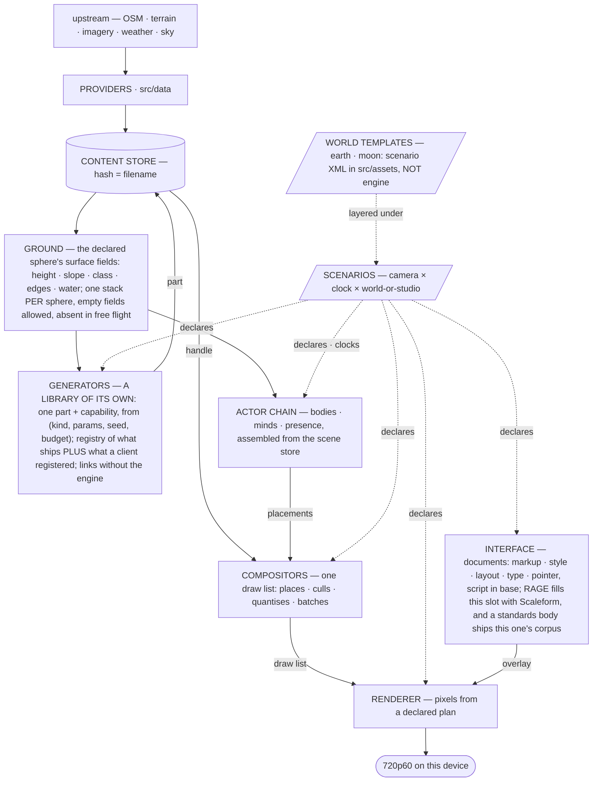
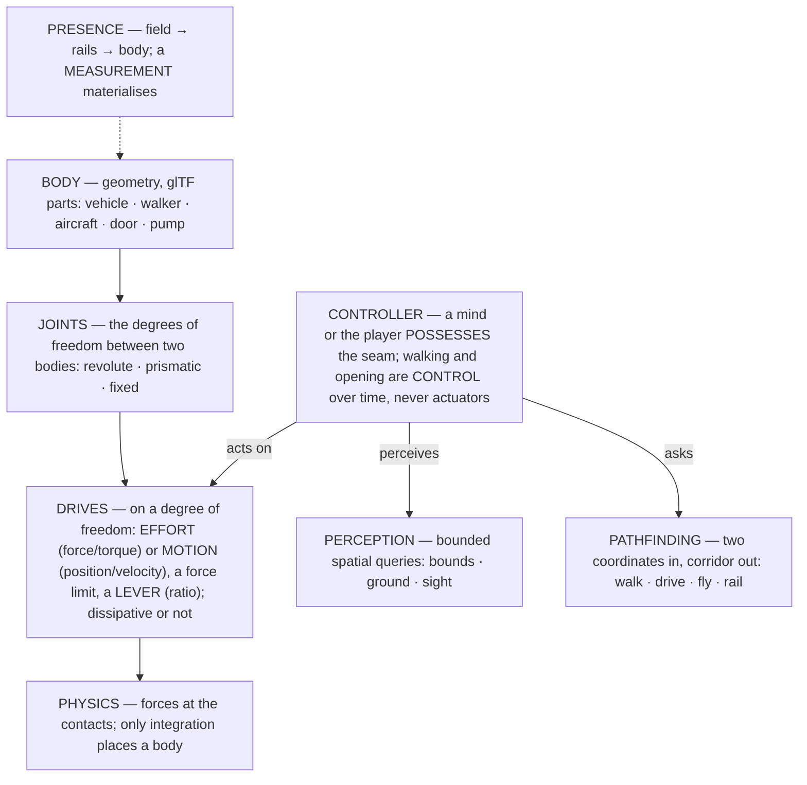
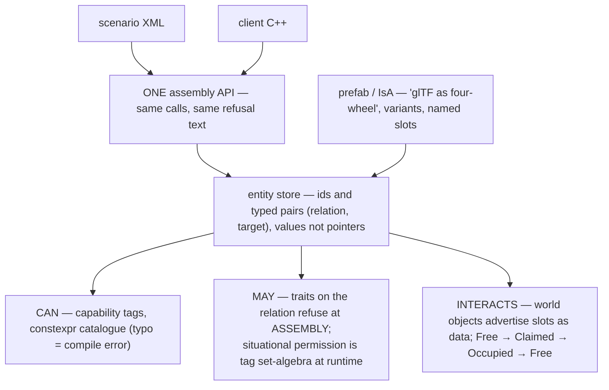
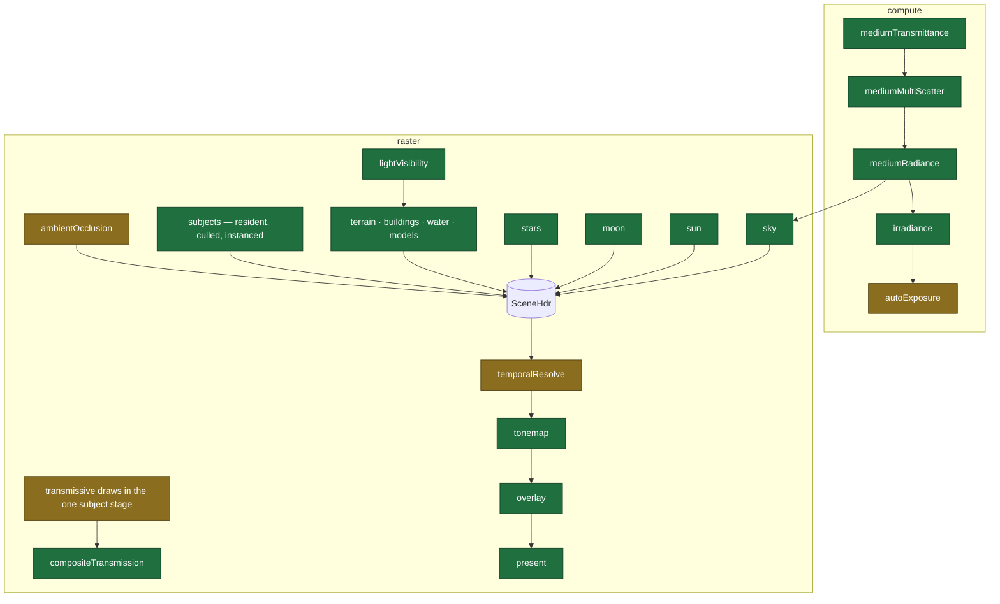
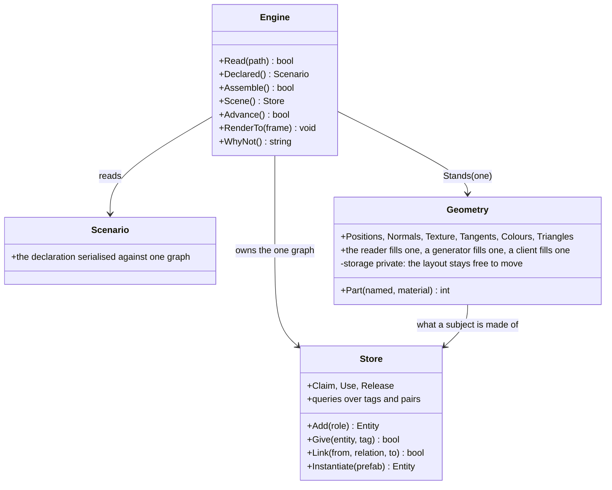

# outshine

A game engine at RAGE/Unreal level. **Development platform IS the target**: Apple A18 Pro
(2P+4E cores, 5 GPU cores, 8 GB, Metal 4), **720p60 held** — p50/p95/p99 over a moving camera,
never a mean.

An engine is an **interactive physics simulation with a focus on graphics**, and each word is a
bound: physically as accurate as NECESSARY, graphically as good as the FRAME BUDGET allows,
temporally DETERMINISTIC. The middle bound is the one "as good as possible" cannot carry — a
target without a ceiling cannot be missed.

**This file is TARGET and never description.** What the tree IS lives in `STATE.md`, regenerated
by every `make`, written by no hand. Where the two disagree, `STATE.md` is right and the distance
is the work.

## What done means

Not "it works". The bar is an answer RAGE or Unreal would recognise as their own, or a better one
I can defend with a measurement of THIS tree. An engine that renders is not the goal — an engine
whose every structural answer is the best of the two is, because that is the only definition that
does not drift. Anything I cannot defend that way is a finding I have not filed yet.

The two are not authorities to obey; they are the only two bodies of evidence that exist for these
questions, and both were paid for over a decade of shipping. Ignoring them is not independence,
it is choosing to learn something twice.

## Before I write

Three questions, answered IN WRITING before a type, a function or a file exists. The answers land
in the commit, which is why they cannot be skipped quietly — an empty answer is visible.

1. **What does Unreal do here, and what does RAGE do?** If I cannot name it, I do not understand
   the problem yet. Where they agree it is settled. Where they differ, the table below says which
   and why. **If the question is not in the table, I add the row BEFORE the code** — a decision
   made in a function body is a decision nobody can find again
2. **Does this already exist here, unreachable?** `grep` first. A complete capability no
   declaration reaches is the commonest defect in this tree, and writing a second one is the worst
   outcome available: now there are two, and neither is right
3. **What measurement will show I was wrong?** Name the case, the audit flag or the number, and
   what it reads if the change is bad. A change with no such number is a guess wearing a commit
   message

**A commit that changes structure names the row it serves.** If neither engine answers the
question, say so and say why the choice is mine — that is a new row, not a private decision.

## How I decide

For every question below, one of RAGE or Unreal already has the right answer. My job is to hold
the better of the two, never to invent a third. Where they agree the matter is closed. Where they
differ, the row says which wins and WHY — the reason is the part I owe. Unreal can be read; RAGE
is reconstruction and carries less. **A measurement of THIS tree outranks both.**

| question | Unreal | RAGE | take | why |
|---|---|---|---|---|
| **module boundary** | `Build.cs` public deps, `Public/`+`Private/`, `*_API` | fw/rage libs under `CGame` | **Unreal** | the COMPILER enforces it; a layering audited afterwards is a convention, and a convention is how a 44-header drawer forms |
| **scene** | `UWorld` → `FScene` + `FPrimitiveSceneProxy`, fed by DELTAS | `fwEntity` on update lists | **Unreal** | game state and render state are separate objects joined by an explicit delta — that IS "one world, the rest are views", and it lets the renderer keep GPU state across frames |
| **frame path** | `FGPUScene` instances GPU-side, Nanite culls in compute, ONE indirect draw | per-batch draw calls | **Unreal** | no CPU term scales with geometry or lights |
| **streaming** | World Partition: cell grid, data layers, HLOD | map nodes, IMAP/ITYP, LOD | **agree** | a non-resident cell is COARSER, never nothing; the horizon is the proof |
| **resources** | import → DDC → cooked | **map the bytes, fix the pointers, no parse** | **RAGE** | a load that parses cannot keep up with a camera; zero-parse is what makes cell streaming affordable |
| **behaviour** | Behavior Tree + blackboard | **`CTask` tree**: owns sub-tasks, yields, abandoned as a subtree | **RAGE** | for a physical actor a hierarchical task decomposes the way the act does; a behaviour tree re-decides from the root every tick |
| **possession** | `AController` possesses `APawn` | ped/vehicle relation | **Unreal** | the seam between a mind and a body is the seam a player plugs into, so one interface serves both |
| **time** | variable step + substeps | fixed step, replay- and network-exact | **RAGE** | determinism is a mechanism, not a wish: fixed step, one order, INTERPOLATION to the display |
| **threading** | `FTaskGraph`, render + RHI threads | `sysTaskManager`, fibers | **agree** | explicit dependencies; 720p60 on four usable cores is unreachable from one thread and retrofitting is a rewrite |
| **engine composition** | thin `UEngine`; each concern a SUBSYSTEM with a declared lifetime | **`gameSkeleton`**: INIT/UPDATE/SHUTDOWN steps in declared PHASES | **both** | they answer different halves — who OWNS state, and WHEN it runs. A flat struct of members has neither: every concern reaches every other, and the order is whatever the bodies happen to do |
| **interface** | Slate/UMG authored in an editor | Scaleform: documents authored OUTSIDE, engine renders them | **RAGE's slot, HTML/CSS/JS in it** | an editor-authored widget tree is a build artefact, not declared content. A standards format buys what neither has: **WPT and test262 certify this layer from outside** |
| **content surface** | `.uasset` + Interchange | offline tool chain | **neither** | glTF 2.0 is the only content surface — Interchange's role without its format |

## Invariants

- **Precision has ONE boundary and it is the camera.** Scene keeps 64-bit positions; the renderer
  is camera-relative in 32-bit. `Anchor - Eye` and the MVP product in `double`, the cast to
  `float` only at the uniform push (`src/render/stages/SubjectDraw.cpp:731,733,736`). A `float`
  holding a world position is a defect; a `double` reaching a shader is a different one
- **ONE WORLD; everything else is a VIEW.** One space is a convention, one HOLDER is the thing —
  the second holder is what makes two subsystems disagree about the same place
- **ONE PRE-VIEW TRANSLATION PER FRAME** (Unreal's `FViewMatrices::PreViewTranslation`). The frame
  picks one origin; view, light and every instance transform build against THAT one. A subsystem
  that subtracts its own origin is the defect that costs whoever gets it right, because the next
  one will get it wrong
- **The world STREAMS by cell, with its content** — ground, structures and actors in and out
  together. Nothing holds the whole of anything
- **AN ENGINE KNOWS LAWS AND NO SUBJECTS.** Its vocabulary: **body · joint · degree of freedom ·
  drive · constraint · force · contact · integration**. A vehicle, wheel, tyre, seat, door or
  walker is a SUBJECT — an assembly a scenario builds — and the engine never names one. There is
  **no actuator in physics**, only a constraint with a target and a force limit (Chaos/PhysX call
  it a joint DRIVE). Motor and brake are ONE drive on one degree of freedom, split by whether it
  may add energy; a LEVER is a ratio in the same statement. `walk` and `open` are CONTROL over
  time. A convenience outshine ships — a raycast-and-spring wheel — ships as a DECLARED ASSEMBLY,
  which is where RAGE's `CWheel` and Unreal's Chaos vehicles sit
- **The simulation is MECHANICS, the renderer is OPTICS.** Both are physics, and naming them so
  decides what may appear in either. Neither speaks of cars
- **THE ENGINE READS ALL OF glTF 2.0 AND ACTS ON ALL OF IT** — core and every ratified `KHR_`
  extension, not the subset a scene needs. A feature parsed that changes no pixel is not read.
  Khronos ships the corpus and the validator, so the distance to "all of it" is a number someone
  else computes. `include/Geometry.h` must carry whatever the reader takes from a FILE, or a
  client's generator is weaker than a file and the interchange claim is false. `EXT_` is out
- **GEOMETRY HAS TWO FORMS AND NO THIRD**, and the tier chain is **math ← geometry ← everything
  that carries shape**. The AUTHORED form (`include/Geometry.h`) is what a reader, a generator or
  a client fills: attribute-general, editable, format-free. The COOKED form is what the renderer
  consumes: one-width GPU streams plus the CLUSTER DAG that carries LOD and culling
  (`src/base/spatial/ClusterDag.h` — this tree's Nanite, and essential to the frame path). One
  cooker turns the first into the second; nothing else may define a mesh. Unreal splits exactly
  here — `FMeshDescription` against `FStaticMeshLODResources` + `FNaniteResources`, with
  `FMeshBatch` a description of a DRAW rather than a third form — and RAGE's `grmGeometry` is the
  cooked form, which is why its file can be mapped rather than parsed
- **THE INTERFACE IS A DOCUMENT** the scenario names. Markup, style, layout, type and pointer are
  engine verbs; the panel is CONTENT beside the glTF, never in C++
- **Declarative.** Scenarios declare, the engine behaves. Content = data, engine = verbs; the
  consumer selects from a `constexpr` catalogue and cannot add to it. **A section NOT declared
  decides nothing** — its `Declared` flag is read where the decision is made, and the engine's own
  default stands in its place, never the zeroes of a struct nobody filled in
- **A SCENARIO IS A STREAM.** `Declare` seeds; then parts enter and leave. The work a declaration
  causes is proportional to what CHANGED, never to how big it is
- **A world template is a FILE** — earth and moon are scenario XML under `src/assets`, reached
  through `Layer{Id, Path, Set}`. A `Planet(params)` in the engine puts a world behind a compiler
  instead of in front of an editor
- **THE DOOR'S IMPLEMENTATION IS A SKELETON OF SUBSYSTEMS**, never a struct of members: each
  concern OWNS its state behind a small door and the engine states the ORDER they run in. A defect
  then has an address, and the phase order is read without reading a body
- **Private is the DEFAULT** and a wider door justifies itself in the item that widened it. A
  public data member is an invariant nobody can hold. Composition usually; inheritance where a
  stable interface carries shared machinery. `--audit-access` refuses when the count moves
- **A claim checkable at compile time is a `static_assert`, never a case.** Layout, size,
  alignment, trait, catalogue completeness, an enum's exhaustiveness: the compiler is a faster and
  stricter oracle than a suite, and it cannot be skipped, sampled or left unlinked
- **C++23**, `-Wall -Werror -Wpedantic`, one `-std`. `static_assert` and the type system over
  checkers; `std::span`/`std::string_view` at boundaries, `std::mdspan` for field and instance
  views, `std::expected` where a refusal carries its reason
- **SIMD- and optimisation-friendly**: contiguous, one-width, pointer-free layouts; fast path on
  the hot path; batch over per-item; bounded terms on the frame path — no alloc, lock, disk or
  unbounded block
- **The code carries NO comments.** `src/`, `include/` and `apps/` hold no `//`, no
  block, no TODO, no board number: names and structure carry the meaning, a number's origin lives
  in its board item and its commit. Prose may stand in a PROOF — any source carrying `Covers("`
- **Every number carries its origin** (derived · measured · `[SET]`) with unit and population. No
  magic numbers; calibration measures, never decides
- **OSM is a source of SHAPE, not a specification.** What is built from it is plausible and
  geometrically correct, never necessarily true to the real road; a corner the graph demands is a
  finding only where it is implausible or wrong. OSM carries no third dimension, so bridges,
  ramps, over- and underpasses and tunnels are RECONSTRUCTED, and a reconstruction owes four
  plausibilities: **geometric** (closes, continuous, no self-intersection), **physical** (drivable
  at the class speed), **static** (it stands — spans, piers, clearances), **architectural** (it
  looks like the thing). Three of four is a finding
- **GREP BEFORE YOU WRITE.** A capability that looks absent is usually present and unreachable —
  that is the finding, and it is the commonest defect in this tree
- **A failure is loud; something is always drawn; delete on the day you replace.** Artefacts to
  the system temp dir, never the tree. `git log` is the logbook — no journal

## Where things live

| | |
|---|---|
| `include/` | **the whole door, four headers**: `Outshine.h` the verbs, `Scenario.h` the declaration, `Event.h` the return channel (`Host`, `Argument`, `Measure` — RAGE's `fwEvent`, Unreal's delegate header), `Geometry.h` the 3D value handed both ways — `std::span`/`std::string_view` and no outshine type, so a foreign producer needs nothing of ours. SDL3 is REQUIRED and `Outshine.h` says so by including it: the CLIENT owns the process and calls `SDL_Init`. SDL_GPU is one renderer, not the door |
| `src/` | the library; `src/assets/` its declared data. **The directory IS the dependency tier and the tier is DECLARED** — `LayerReaches` in `test/run.sh`, enforced by `--audit-layers`, which also refuses a CYCLE between two modules inside one tier |
| `test/` | **the vendor's word and ours stand apart and the directory says which.** `khronos/` · `wpt/` · `test262/` · `geographiclib/` are the corpora (`khronos/validator/`: 263 cases judged as a REFUSAL against Khronos's report); `harness/` their scorers and the board claims; **`outshine/` is ours**. Everything here reaches the library through `include/` and nothing of `src/` — it tests the DOOR |
| `src/<module>/tests/` | **a low-level case lives inside the module it tests** and compiles as part of it, which is Unreal's `Private/Tests/`. It may reach that module's private headers; nothing else may reach it. A case belongs here when it tests an internal type and outside when it tests the door |
| `apps/` | the CLIENTS, each a product. **A client is almost no code and its LINE COUNT measures the door**: when a client needs much code the door is the finding, never the client. `apps/driver` is the one integration test and the stakeholder signs it off; `apps/viewer` shows any scenario and becomes one |
| `Makefile` | build · test · clean. Writes `liboutshine.a` and `libgenerators.a`, the latter's member list DERIVED from the linker's own closure |
| `board/` | one flat directory of work items (below) |

**THE GENERATORS ARE A LIBRARY WITH THEIR OWN DOOR** — forest, buildings, water, infrastructure —
a client REGISTERS its own beside them, and another project takes the tier with none of outshine
behind it. A generator hands back the INTERNAL REPRESENTATION, never a file; a glTF serialiser
ships beside it. That representation is the universal interface for 3D with outshine: a reader
fills it, a generator fills it, a foreign program fills it with no file anywhere. The shipped
catalogue stays closed against a typo; a client's generator enters as a VALUE with a handle.

`test/run.sh` is the only TEST runner. **`test/gate.sh` is the fast gate for iteration** — about a
minute, naming a subset plus `make` and one drive; it prints what it does NOT cover, because a
gate that hides its bounds reads as coverage. A standing RED is declared in `EXPECT_FAIL` with its
count, and the gate turns red the day such a case passes with the declaration still standing.

## What proves what

**Only the vendor corpora prove anything.** Khronos, WPT, test262 and GeographicLib are where a
standards body or a computation carried further than ours states the answer; a case there fails
because the code is wrong. Everything under `test/outshine/` is a REGRESSION NET of unknown grade:
it holds the tree to what the tree already did, which is agreement with ourselves. **That bites
hardest during a refactor** — green means the previous behaviour was preserved, and if that
behaviour was wrong, green is the wrong answer preserved exactly. So a red in `outshine/` during a
refactor is INFORMATION, and it is never made green by editing the case.

| grade | it holds | it proves |
|---|---|---|
| **SPEC** | a standards body states the answer | conformance |
| **TRUTH** | a measurement or computation carried further than ours | correctness |
| **SNAPSHOT** | another implementation, frozen | agreement, never correctness |
| **INPUT** | nothing is supplied | that we survive it |

Every case is a scenario with an invariant oracle: it declares what the engine should stand up,
the engine runs it, and the answer is compared against a reference whose truth does not depend on
our design. A case that asserts the shape of our own architecture specifies nothing while TARGET
moves. An `outshine/` case carries its DERIVATION in prose beside the number, because the
derivation is the part a reader can check and the number is not.

A FUZZ case is INPUT grade and DETERMINISTIC — every mutant a pure function of (seed, position,
kind). Its two controls: the schedule must produce documents the reader REFUSES and documents that
still STAND. `test/CORPORA.md` is the survey of which corpus asserts which capability, at which
grade, and what it costs to reach.

## How I work

**The order does not vary: ask whether TARGET matches the best of RAGE and Unreal and repair
TARGET first if it does not · rebuild onto TARGET · then close the feature gaps.** A refactor
toward a target short of the benchmark spends the effort and arrives somewhere that still has to
be left. Then: guards (static_assert, the type system, refusal at assembly) · corpus cases · judge
the driver · extend.

**A REFACTOR TO TARGET BLOCKS THE BOARD.** While one stands `active`, nothing outside it is
worked. Findings are recorded and they wait. An item repaired on the architecture about to be
replaced is work done twice, and the second time is the one that counts.

**After every gate run, read `STATE.md` and name what still departs from RAGE and Unreal** — one
area, one concrete thing they hold that this tree does not. The numbers there are the distance;
the board is where the answer goes, and `grep` there first so it lands once.

**EVERY item carries the benchmark and the choice**, in one line near the top:

    **Benchmark** — Unreal: <what it does>. RAGE: <what it does>. **Taking <which>** because <why>.

When neither answers the question, the line says so and says why the choice is mine — and that is
a candidate row for the settled table. An item without this line is an item whose premise nobody
checked, and this tree has already paid for two of those.

`board/` is ONE FLAT DIRECTORY. One file = RFC 822 header + markdown body. Fields: `Type`
(feature|task|bug|issue) · `State` (open|active) · `Parent` · `Area` · `Tags` · `Depends` ·
`Regresses` · `Supersedes`. Filename `NNNN_label.md`; the number is identity; no dates. Titles say
what WILL BE TRUE. Commits reference `board:NNNN`. **`State: active` means being worked RIGHT NOW
— always**, and it is recorded in a commit before the item leaves.

```mermaid
stateDiagram-v2
  [*] --> open : filed (defect found = item, same round)
  open --> active : being worked NOW (groom parent/depends)
  active --> [*] : the file is DELETED; the commit names the proving test
  active --> open : parked
  open --> withdrawn : the PREMISE was wrong -- the defect is not there
  active --> withdrawn : the same, found while working it
  open --> removed : it names no step toward the benchmark, or does not say how
  withdrawn --> [*] : the file is DELETED; the commit says what was misread
  removed --> [*] : the file is DELETED; the commit says `removed` and names the number
```



An item leaves THREE ways. A REMOVAL needs no active state because nobody worked it: the item
named no step toward an engine at their level, or did not say how, and a board is not a backlog.
It must be deliberate — the deleting commit says `removed` and names the number.

A WITHDRAWAL is stated the same way: the commit says `withdrawn`, names the number and says what
was misread. Only a CLOSURE has to pass through `State: active`, because only a closure had
someone working it.

The other two are worked, and they are not the same. A CLOSURE says a defect was real and is gone,
and names the proving test and its negative control. A WITHDRAWAL says the defect was never there
and names what was misread — a measure that was absent rather than zero, a number read from the
wrong frame, a capability that turned out reachable. Both states are recorded before the file
goes. **Closing is DELETING the file**: what it said is in the commit that removed it. Git is the
logbook; the item is what is true NOW — a newer measurement REPLACES the older one, and a
paragraph the tree has overtaken is deleted, not appended after.

```sh
grep -l '^State: active' board/*.md                  # in flight NOW
grep -l '^Type: bug' board/*.md                      # by kind
grep -l '^Parent: 0007' board/*.md                   # a feature's children
git log --grep 'board:0042'                          # every commit on an item, and its closure
ls board/*.md | grep -o '[0-9]\{4\}' | sort -n | tail -1  # next id, derived
```

**PROGRESS in `STATE.md` measures nine areas against RAGE and Unreal, counted from `board/`** —
where the target already lives, so there is no second list. An item declares `Progress: <area>`
and its checkboxes are that area's predicates; a ticked one must NAME ITS PROOF, and a tick whose
proof this tree does not hold is REPORTED rather than counted. A predicate states a behaviour or a
reachability, never a name: counting class names would have scored the world generators complete
while 6528 lines sat in an archive no declaration reached. The denominator GROWS, because
discovering work is not progress.

## What goes wrong

Measured failure modes, each of which has cost a day here:

| trap | what it looks like | the guard |
|---|---|---|
| **a gate blind to a path** | two vendor cases green while three engine cases are red, because the harness bypasses the engine's own submission | know which path each case exercises; name what the gate does not cover |
| **a blind rename** | one regex over a word that four unrelated types share | rename per type, and let the compiler be the oracle |
| **an inverted premise** | "this tree has no joints" — it had one, misnamed `Contact` | measure the thing before filing the item about it |
| **a measure that cannot see** | `STATE.md` counted headers and missed every source without one, so a 1439-line file was invisible | ask what the measure cannot see before trusting a number it produced |
| **empty vs identity** | an empty table said "no placement"; sizing it to identity changed the picture | a state nobody can read is not a statement — make it one |
| **a green negative control** | the control passes, so the proof proves nothing | restate the claim or delete it; never keep a false proof |

## Architecture







## Render plan

**The plan is a graph and the frame path is GPU-DRIVEN.** The stage graph is Unreal's RDG shape
and it is half the answer; the other half is what the CPU spends per pass. Instances live in GPU
buffers, culling runs in compute, a pass is ONE indirect draw (`FGPUScene`). Lights are assigned
to clusters by a compute stage and the shading pass reads the grid, so a light budget is a GPU
allocation and never a constant in a header. The shadow atlas carries cascades and the shader
picks one. **No CPU term on this path scales with geometry, lights or pixels.**



## Classes and the door




**Diagram colours** — CURRENT: green = correct by current knowledge · amber = uncertain · red =
provably wrong · grey dashed = absent. TARGET: green = certain · amber = probable. A diagram here
is an intention, never a description.

## Who else reads this

**TWO reviewers read from OUTSIDE the change**, each against its own brief in `.claude/agents/`,
each filing findings and neither editing `src/`. I advance, they CORRECT. A finding either files
becomes work, so it takes nothing on my word — each runs the gate itself and reads the tree, not
my account of it. Each is started with its brief and NOTHING else; that independence is the only
thing that makes their findings worth having.

| who | judges | never |
|---|---|---|
| **architect** | structure: layering, abstraction, the door, what a scenario can REACH | takes a screenshot, signs off the picture |
| **stakeholder** | the PICTURE: `apps/driver` as a test drive at Gran Turismo 7's level, on short routes it picks itself | judges architecture |

The asymmetry is standing, not tempo: inside the work I can be wrong and measure my way out
before the hour is over.
