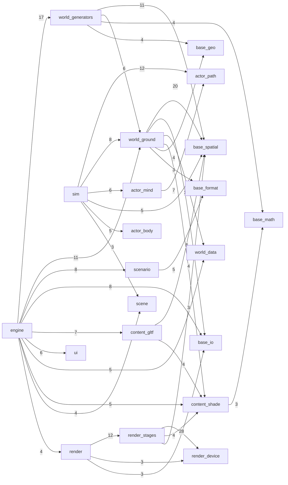

outshine -- what the tree IS, generated by `make`; TARGET lives in CLAUDE.md

DOOR -- include/
  Event.h
 virtual bool Calls(std::string_view name, std::span<const Argument> args) = 0
  Outshine.h
 bool DrawsInto(SDL_Window *presents)
 void Offers(Host *host)
 bool Takes(std::string_view view)
 bool Handles(const SDL_Event &event)
 bool DrawsInto(Extent offscreen)
 void Under(Roots roots)
 bool Capture(std::string_view path)
 bool Read(std::string_view path)
 bool Declare(const Scenario &scenario)
 bool Shows(const std::vector<Surface> &surfaces)
 const Scenario &Declared(void) const
 const std::vector<std::string> &Carried(void) const
 const std::vector<Measure> &Numbers(void) const
 bool Assemble()
 double Along(void) const
 double Whole(void) const
 bool Advance()
 bool Advance(double elapsedS)
 double StepS(void) const
 bool Run()
 bool Park()
 bool Resume(std::string_view name)
 bool Discard(std::string_view name)
 bool Save(std::string_view path) const
 bool Restore(std::string_view path)
 std::vector<std::string> Parked(void) const
 bool Standing(void) const
 const std::string &Error(void) const
 bool ReadInto(std::string_view path, Scenario &out)
  Scenario.h
 const Asset *Subject(void) const

SHAPE -- module depends on module, from the includes themselves

  37 edge(s) drawn, 41 thinner than three includes not drawn

TIERS -- src/, and what each may include
  base        -> nothing
  content     -> base
  world       -> base content
  actor       -> base
  render      -> base content
  scene       -> base
  scenario    -> base content world
  ui          -> base content
  audio       -> base
  host        -> base world
  compositor  -> base world content
  sim         -> base world content actor scene
  engine      -> base content world actor render scene scenario sim ui audio host compositor

MASS -- the heaviest units, against the median of them all
    1993  content/gltf/Document.h
    1397  ui/Layout.h
    1347  content/gltf/Subject.h
    1319  render/Renderer.h
    1141  base/format/Script.h
    1006  render/stages/SubjectDraw.h
     955  ui/Style.h
     943  base/spatial/ClusterDag.h
     108  the median of 241 unit(s)

CARPET -- the widest public surfaces
    55 [[nodiscard]] in src/render/Renderer.h
    51 [[nodiscard]] in src/content/gltf/Document.h
    42 [[nodiscard]] in src/content/gltf/Subject.h
    34 [[nodiscard]] in src/scene/Store.h
    32 [[nodiscard]] in src/engine/Live.h
    31 [[nodiscard]] in src/base/format/Xml.h

TWINS -- header names that collide
  none

STRANDED -- sources no declared suite links, so nothing they hold is proven
  src/audio/BusGraph.cpp
  src/engine/EyeTelemetry.cpp
  src/engine/RegionForge.cpp
  src/engine/Sim.cpp
  src/engine/StreamTelemetry.cpp
  src/scenario/Animation.cpp
  src/scenario/Mod.cpp
  src/scenario/Scene.cpp
  src/scenario/Tables.cpp
  src/world/generators/Buildings.cpp
  src/world/generators/draw/BuildingMesh.cpp
  src/world/generators/draw/BuildingShape.cpp
  src/world/generators/draw/DrawSet.cpp
  src/world/generators/draw/ForestDraw.cpp
  src/world/generators/draw/LeafAngleDistribution.cpp
  src/world/generators/draw/RoofSurface.cpp
  src/world/generators/draw/TreeFoliage.cpp
  src/world/generators/draw/TreeGrower.cpp
  src/world/generators/draw/TreeLeaf.cpp
  src/world/generators/draw/TreeMesher.cpp
  src/world/generators/draw/TreePrototype.cpp
  src/world/generators/FeatureField.cpp
  src/world/generators/Forest.cpp
  src/world/generators/GeneratorSet.cpp
  src/world/generators/Ground.cpp
  src/world/generators/GroundPatch.cpp
  src/world/generators/GroundTable.cpp
  src/world/generators/GrowthForm.cpp
  src/world/generators/Infrastructure.cpp
  src/world/generators/OccupancySink.cpp
  src/world/generators/Region.cpp
  src/world/generators/RegionPool.cpp
  src/world/generators/Schedule.cpp
  src/world/generators/Species.cpp
  src/world/generators/TreeSpecies.cpp
  src/world/generators/Water.cpp
  src/world/generators/Yield.cpp

PROVES -- what src/ provably does, one line each
  , while every source that // does not is bound. Nine live citations stood under tools/ while this walk read two roots // and claimed three. std::vecto
  a derived camera is computed where the bounds are, and the rule's constants cannot drift between the engine and the preparer
  gltf-2.0 conformance at the door: an asset Khronos's validator errors on is refused with a reason, and one it passes stands
  gltf-2.0: an accessor's declared min and max are the actual componentwise extremes of its data, refused in both directions -- a box around the data an
  gltf-2.0: an array the schema gives a minimum of one item is refused when it is present and empty, and the refusal names which one
  gltf: appending one subject onto another shifts the guest's material names clear of the host's, so a joined buffer set is still two bodies and neither
  I.17 the picture is a function of the declaration and not of the machine: no layer of the engine that decides one reads an environment variable, and t
  I.26.10 a render test is a directory: one runner reads the declaration, renders the subject with no world, scores it against the cached oracle by name
  I.36 The harness's own red demonstrated by a test that is declared to fail
  I.56 the engine is a library: it does not name what runs it, and a claim about it is proven by a test that cites the requirement rather than by a comm
  I.61 a repository is what is declared and what is built from it: the case trees carry declarations and never products
  I.83 the layering is declared once: the runner's group declarations are the only spelling of which source compiles with which includes, and `make` bui
  INPUT grade: the glTF reader survives a fixed schedule of corrupted documents -- every one either stands or is refused with a reason, and none of them
  IV.10 every include guard in src/ spells its folder and no two collide -- the rule is a walk, not a habit repeated per layer (board:1643, 1748)
  IV.11 no comment stands in src/, include/, tools/ or apps/ -- the rule is a walk, not a habit repeated per file (board:1763)
  IV.11) and therefore// exempts its own file` in src/base/spatial/Span.h turned this claim green, measured. Tightening the// needle again is the same c
  IV.12 CLAUDE.md is TARGET and argues from the tree: every path it names is present and every line it cites carries the text quoted beside it. STATE.md
  IV.13 the runner publishes, per run, which declared case families hold no fetched subject, so a green trailer is never mistaken for conformance it did
  IV.17 the corpus is planned, and therefore rebuildable, by one command over every manifest in the tree -- including those that declare no scene, whose
  IV.19 the gradient and the design minimum radius each carriageway class declares are figures its own origin block prints, so a value cannot drift away
  IV.20 one toolchain is spelled once: test/run.sh is the only place in test/ that names a compiler or a standard, so no corpus can be built by a compil
  IV.21 the device does not leave the render layer: a client hands in a window or an extent and gets back pixels, never a handle it must do GPU work wit
  IV.22 the prepared corpus is shared and the right to delete from it is not: every route into the corpus writes an owner, and the runner's guard prunes
  IV.26 one runner per nest: the lock claim and the claimant's identity are one atomic step, a second runner refuses naming the live holder, a stale cla
  IV.27 the build declaration audits itself in the fast gate: every source is listed once and by some suite, every declared suite's object set is closed
  IV.31 a refusal that names the device keeps what the device said: static text reaches the caller and the reason reaches WhyNot, because SDL_GetError()
  IV.7 every field of the tick's public product has a writer in the tick -- the writerless-mirror-field class (1613, 1703) is a claims gate now, not a r
  one world space: a coordinate turned into a tile and back is the coordinate it started as, at every zoom and in all four quadrants
  one world space: the distance between two coordinates is the WGS84 geodesic, measured against a 50-digit reference this tree cannot influence
  physics: a body's brake effort is proportioned to the static load each axle carries, derived from where the declaration puts the centre of mass and ne
  physics: a force builds the moment its arm demands, so squat under power and dive under the brakes fall out of the integration; and resistance is the 
  physics: a point a declaration measures from the road reaches the body's frame only after its centre of mass is subtracted, so a seat stays inside the
  physics: a tyre's lateral force follows the brush characteristic -- the cornering stiffness at small slip, the friction limit at full breakaway, and a
  pi stands once and it is std::numbers: every pi in src/ derives from std::numbers::pi and the alias lives in one header (board:1630)
  the door: a declared binding reports both edges of its button, so a control command can be held and can end
  the door: a section a scenario did not declare decides nothing, and what stands in its place is the engine's own default rather than the zeroes of an 
  the door: a subject casts a shadow over every batch it draws, and a declaration that names no shadow radius gets one derived from the subject's extent
  the door: a subject that changes costs the reading of that subject and nothing else, so a scenario streams its parts rather than being rebuilt around 
  the door: the declared key illuminance sets the fill ratio and nothing else, so the picture is invariant under a common scale of key and environment
  the door: the work a declaration causes is proportional to what it changed, so a scenario can be streamed rather than rebuilt
  the oracle key covers the preparer's own code, so a preparer change invalidates the corpus instead of being found by hashing on a hunch
  the pass-index mapping is a keyed product of the render and comes back from the store with the bytes it describes, so a cached oracle still names its 
  the runner can read the oracle's EXR directly, so the flat raw beside it is a derived cache rather than an artefact that must survive
  the runner prunes test by test, and a file whose producer cannot be proven stays with the reason its proof failed

ACCESS -- what stands wider than private
  6 protected section(s), and inheritance is right where a stable interface carries
  shared machinery -- Source, WebTileSource, TerrariumDem is that shape
    src/world/data/TerrariumDem.h
    src/world/data/VersatilesVector.h
    src/world/data/WebTileSource.h
    src/world/generators/draw/DrawSource.h
    src/world/generators/Generator.h
    src/world/ground/StructureMesher.h

DECIDED -- named constants standing as a bare literal, whose origin is elsewhere
   16  src/world/generators/draw/BuildingShape.cpp
   14  src/world/generators/draw/BuildingMesh.cpp
    6  src/content/gltf/Framing.h
    5  src/world/ground/World.cpp
    5  src/render/stages/ParticipatingMedium.h
    5  src/render/stages/IridescenceLobe.h
    4  src/render/stages/SubjectDraw.h
    4  src/actor/path/ReferenceLine.h
    3  src/world/ground/WaterField.cpp
    3  src/world/ground/TerrainLoader.cpp

COUNTS
  150 source(s) under src/, 37 of them linked by no suite
  241 header(s) in 28 module(s) over 13 tier(s)
