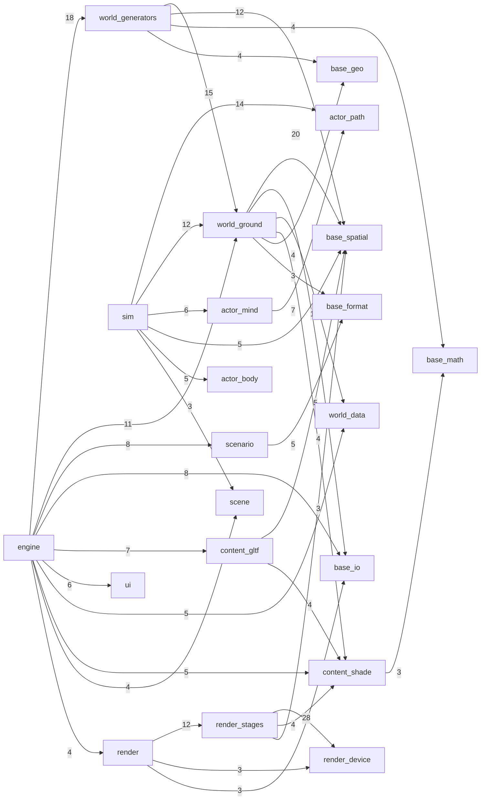

outshine -- what the tree IS, generated by `make`; TARGET lives in CLAUDE.md

DOOR -- include/
  Event.h
 virtual bool Calls(std::string_view name, std::span<const Argument> args) = 0
  Geometry.h
  Outshine.h
 bool DrawsInto(SDL_Window *presents)
 void Offers(Host *host)
 bool Takes(std::string_view view)
 bool Handles(const SDL_Event &event)
 bool DrawsInto(Extent offscreen)
 void Under(Roots roots)
 bool RenderTo(Extent frame)
 bool Capture(std::string_view path)
 bool Pixels(std::vector<uint8_t> &rgba)
 bool Read(std::string_view path)
 bool Stands(const Geometry &geometry)
 bool Declare(const Scenario &scenario)
 bool Shows(const std::vector<Surface> &surfaces)
 const Scenario &Declared(void) const
 const std::vector<std::string> &Carried(void) const
 const std::vector<Measure> &Numbers(void) const
 bool Assemble()
 double Along(void) const
 double Whole(void) const
 bool Advance()
 bool Advance(double elapsedS)
 double StepS(void) const
 bool Run()
 bool Park()
 bool Resume(std::string_view name)
 bool Discard(std::string_view name)
 bool Save(std::string_view path) const
 bool Restore(std::string_view path)
 std::vector<std::string> Parked(void) const
 bool Standing(void) const
 const std::string &Error(void) const
 bool ReadInto(std::string_view path, Scenario &out)
  Scenario.h
 const Asset *Subject(void) const

SHAPE -- module depends on module, from the includes themselves

  37 edge(s) drawn, 41 thinner than three includes not drawn

TIERS -- src/, and what each may include
  base        -> nothing
  content     -> base
  world       -> base content
  actor       -> base
  render      -> base content
  scene       -> base
  scenario    -> base content world
  ui          -> base content
  audio       -> base
  host        -> base world
  compositor  -> base world content
  sim         -> base world content actor scene
  engine      -> base content world actor render scene scenario sim ui audio host compositor

MASS -- the heaviest units, against the median of them all
    2020  content/gltf/Document.h
    1397  ui/Layout.h
    1347  content/gltf/Subject.h
    1330  render/Renderer.h
    1141  base/format/Script.h
    1103  base/spatial/Wayfinding.h
    1042  render/stages/SubjectDraw.h
     955  ui/Style.h
     108  the median of 245 unit(s)

CARPET -- the widest public surfaces
    58 [[nodiscard]] in src/render/Renderer.h
    51 [[nodiscard]] in src/content/gltf/Document.h
    42 [[nodiscard]] in src/content/gltf/Subject.h
    34 [[nodiscard]] in src/scene/Store.h
    34 [[nodiscard]] in src/engine/Live.h
    31 [[nodiscard]] in src/base/format/Xml.h

TWINS -- header names that collide
  none -- and --audit-layers REFUSES the day one appears, because both walks on
    this page resolve an include by its basename alone

STRANDED -- sources no declared suite links, so nothing they hold is proven
  src/audio/BusGraph.cpp
  src/engine/EyeTelemetry.cpp
  src/engine/RegionForge.cpp
  src/engine/Sim.cpp
  src/engine/StreamTelemetry.cpp
  src/scenario/Animation.cpp
  src/scenario/Mod.cpp
  src/scenario/Scene.cpp
  src/scenario/Tables.cpp
  src/world/generators/draw/BuildingMesh.cpp
  src/world/generators/draw/BuildingShape.cpp
  src/world/generators/draw/DrawSet.cpp
  src/world/generators/draw/ForestDraw.cpp
  src/world/generators/draw/LeafAngleDistribution.cpp
  src/world/generators/draw/RoofSurface.cpp
  src/world/generators/draw/TreeFoliage.cpp
  src/world/generators/draw/TreeGrower.cpp
  src/world/generators/draw/TreeLeaf.cpp
  src/world/generators/draw/TreeMesher.cpp
  src/world/generators/draw/TreePrototype.cpp

ACCESS -- what stands wider than private
  6 protected section(s), and inheritance is right where a stable interface carries
  shared machinery -- Source, WebTileSource, TerrariumDem is that shape
    src/world/data/TerrariumDem.h
    src/world/data/VersatilesVector.h
    src/world/data/WebTileSource.h
    src/world/generators/draw/DrawSource.h
    src/world/generators/Generator.h
    src/world/ground/StructureMesher.h
  49 public data member(s) in a class, by file -- an invariant nobody can hold
      7  src/world/generators/ContactMaterial.h
      5  src/world/generators/draw/TreeMesh.h
      4  src/engine/Live.h
      3  src/world/generators/draw/TreeFoliage.h
      3  src/world/generators/draw/LeafAngleDistribution.h
      2  src/world/ground/EyeColumn.h
      2  src/render/draw/DrawKey.h
      2  src/content/shade/TangentFrame.h
      1  src/world/weather/ConstantWindWeather.h
      1  src/world/ground/tiles/TileGeodesy.h
      1  src/world/ground/TerrainLoader.h
      1  src/world/ground/ClassField.h
      1  src/world/generators/FeatureLevel.h
      1  src/world/generators/draw/TreeRandom.h
      1  src/world/generators/Cover.h
      1  src/world/generators/Claim.h
      1  src/world/data/StarBands.h
      1  src/scene/Register.h
      1  src/scenario/Tables.h
      1  src/scenario/Scene.h
      1  src/scenario/InputMap.h
      1  src/scenario/Fields.h
      1  src/render/stages/TonemapStage.h
      1  src/engine/SceneWeather.h
      1  src/content/gltf/Keyframes.h
      1  src/base/spatial/Span.h
      1  src/base/spatial/Sink.h
      1  src/base/io/StackProbe.h
      1  src/base/format/Xml.h
      1  src/audio/BusGraph.h

REDS -- what is declared to fail, and its red is a finding not a licence
    74 case(s) declared red
     73  khronos/validator
      1  harness/claims

REACH -- suites reaching past include/ into src/, which CLAUDE.md forbids
  15 of 17 declared suite(s) are granted a -Isrc path (board:1879)
  reaching the library through include/ alone:
    apps/viewer/src
    apps/driver/src

DECIDED -- named constants standing as a bare literal, whose origin is elsewhere
   16  src/world/generators/draw/BuildingShape.cpp
   14  src/world/generators/draw/BuildingMesh.cpp
    6  src/content/gltf/Framing.h
    5  src/world/ground/World.cpp
    5  src/render/stages/ParticipatingMedium.h
    5  src/render/stages/IridescenceLobe.h
    4  src/render/stages/SubjectDraw.h
    4  src/actor/path/ReferenceLine.h
    3  src/world/ground/WaterField.cpp
    3  src/world/ground/TerrainLoader.cpp

PROGRESS -- counted from board/, where the target lives; a tick names its proof
  actors           2/7    29%
  client           1/8    13%
  corpus           3/8    38%
  door             4/14   29%
  gpu-driven       1/8    13%
  layers           4/6    67%
  perception       1/6    17%
  render-plan      0/7     0%
  streaming        1/15    7%

COUNTS
  153 source(s) under src/, 20 of them linked by no suite
  245 header(s) in 28 module(s) over 13 tier(s)
