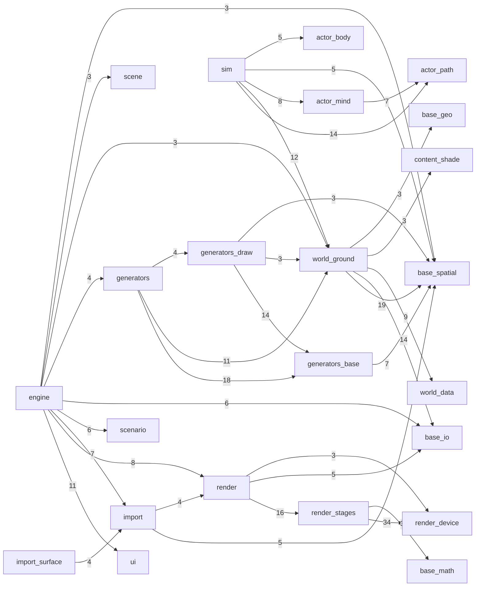

# outshine

What the tree **is**, generated by `make` and written by no hand. TARGET lives in
`CLAUDE.md`; where the two disagree, this page is the tree.

## Progress

Nine areas against RAGE and Unreal, counted from `board/` where the target already
lives. A ticked predicate must NAME ITS PROOF -- a case or an audit flag -- and a tick
whose proof this tree does not hold is reported rather than counted.

| area | predicates open/closed | share | ACTIVE, and how many open | open, and how many | note |
|---|---|---|---|---|---|
| `actors` | 5/2 | 29% | -- | [1944](board/1944_the_engine_knows_bodies_forces_and_control.md) 5 | |
| `audio` | 8/6 | 43% | -- | [1982](board/1982_sound_is_declared_and_a_standards_body_owns_it.md) 6, [1983](board/1983_outshine_mixes_what_the_world_does_to_a_sound.md) 2 | |
| `client` | 8/3 | 27% | -- | [1947](board/1947_a_client_is_almost_no_code.md) 7, [1984](board/1984_the_demo_is_a_client_that_measures_the_door.md) 1 | |
| `corpus` | 5/3 | 38% | -- | [1942](board/1942_the_corpus_judges_against_oracles_that_are_not_ours.md) 5 | |
| `door` | 14/7 | 33% | -- | [1939](board/1939_the_door_is_three_headers_and_a_client_reaches_nothing_else.md) 6, [1949](board/1949_one_value_carries_3d_into_and_out_of_outshine.md) 8 | |
| `gpu-driven` | 17/5 | 23% | -- | [1943](board/1943_no_cpu_term_scales_on_the_frame_path.md) 7, [1985](board/1985_sim_video_audio_and_io_run_independently.md) 3, [2012](board/2012_the_picture_reflects.md) 4, [2013](board/2013_the_sky_lights_what_it_stands_over.md) 3 | |
| `perception` | 5/1 | 17% | -- | [1945](board/1945_a_body_perceives_what_is_around_it.md) 5 | |
| `render-plan` | 4/3 | 43% | -- | [1941](board/1941_the_render_plan_compiles_and_every_row_executes.md) 4 | |
| `streaming` | 12/1 | 8% | -- | [1946](board/1946_the_generated_world_reaches_the_scene.md) 12 | |

## Door -- `include/`

The door speaks **Filament** for the renderer and **Cesium** for the Earth
(CLAUDE.md). What a reader already owns, and whether this door says it yet:

| the name a client knows | from | here |
|---|---|---|
| `Engine` | Filament | yes |
| `Scene` | Filament | yes |
| `View` | Filament | yes |
| `Camera` | Filament | yes |
| `Renderer` | Filament | yes |
| `Material` | Filament | yes |
| `MaterialInstance` | Filament | yes |
| `TransformManager` | Filament | yes |
| `IndirectLight` | Filament | yes |
| `LightManager` | Filament | yes |
| `SwapChain` | Filament | yes |
| `Viewport` | Filament | yes |
| `RenderableManager` | Filament | yes |
| `Georeference` | Cesium | yes |
| `GlobeAnchor` | Cesium | yes |
| `LongitudeDeg` | Cesium | yes |
| `LatitudeDeg` | Cesium | yes |
| `HeightM` | Cesium | yes |
| `SamplesHeight` | Cesium | yes |
| `Skybox` | Filament | **no, and on purpose** |

**19 of 19 spoken, and one refused.** A name here is not a rename to make: it is a
promise a client already understands. `Skybox` is the refusal: Filament shows an image or
a colour where nothing else stands, and this sky is COMPUTED -- the sun, the moon and the
stars stand where the georeference and the clock put them. A picture handed in would
disagree with its own shadows the moment the clock moved, so a client declares the
WEATHER and never the sky. The ones marked *not yet*, if any, are what board:2016 owes.

And the verbs, because a client calls those rather than the types:

| the verb a client knows | from | here |
|---|---|---|
| `beginFrame` | Filament | yes |
| `render` | Filament | yes |
| `endFrame` | Filament | yes |
| `readPixels` | Filament | yes |
| `addEntity` | Filament | yes |
| `setScene` | Filament | yes |
| `setCamera` | Filament | yes |
| `setViewport` | Filament | yes |
| `lookAt` | Filament | yes |
| `setProjection` | Filament | yes |
| `setExposure` | Filament | yes |
| `flushAndWait` | Filament | yes |
| `sampleHeight` | Cesium | yes |
| `LongitudeLatitudeHeight` | Cesium | yes |

**14 of 14 spoken.**

OURS BY RIGHT, because Filament is a renderer and does not face the question:

`Declare` · `Read` · `Assemble` · `Advance` · `Run` · `Mixes` · `Park` · `Resume` ·
`Numbers` · `Inspects` — a scenario, a simulation, a mixer and a measure. A client that
knows Filament still has to learn these, and that is the door being HONEST about what
outshine is rather than pretending to be a renderer it is not.

### `Event.h`

    value: Argument
    type: Host
    value: Measure
    virtual bool calls(std::string_view name, std::span<const Argument> args) = 0

### `Generate.h`

    value: Ask
    type: Generates
    type: Makers
    virtual std::string_view kind() const = 0
    virtual bool make(const Ask &ask, Geometry &into) const = 0
    bool offers(const Generates &maker)
    const Generates *named(std::string_view kind) const
    size_t count() const

### `Geometry.h`

    type: TransformManager
    type: LightManager
    type: RenderableManager
    type: Geometry
    bool setTransform(int part, const double modelM16[16])
    const double *getTransform(int part) const
    int count(void) const
    const PunctualLight &getLight(int lamp) const
    bool setLight(int lamp, const PunctualLight &light)
    std::string_view nameOf(int lamp) const
    const double *getTransform(int lamp) const
    int count(void) const
    std::string_view nameOf(int part) const
    MaterialInstance getMaterial(int part) const
    bool setMaterial(int part, MaterialInstance surface)
    size_t vertexCount(int part) const
    size_t triangleCount(int part) const
    TransformManager transforms(void)
    LightManager lights(void)
    RenderableManager renderables(void)
    MaterialInstance addSurface(std::string_view named, const Material &surface)
    int parts() const
    std::string_view nameOf(int part) const
    MaterialInstance materialOf(int part) const
    int images() const
    ImageView imageAt(int image) const
    int surfaces() const
    std::string_view surfaceNameOf(int surface) const
    const Material &surfaceAt(MaterialInstance surface) const
    int lamps() const
    std::string_view lampNameOf(int lamp) const
    const PunctualLight &lampAt(int lamp) const
    const double *lampPlacementOf(int lamp) const
    std::span<const float> positionsOf(int part) const
    std::span<const float> normalsOf(int part) const
    std::span<const float> textureOf(int part, int set = 0) const
    std::span<const float> tangentsOf(int part) const
    std::span<const float> coloursOf(int part) const
    std::span<const uint32_t> trianglesOf(int part) const
    bool wellFormed() const
    const double *placementOf(int part) const

### `Json.h`

    type: Json
    bool Parse(const char *text, size_t len)
    bool ParseString(uint32_t &off, uint32_t &len, bool &escaped)
    void Skip()

### `Loaded.h`

    type: Loaded
    bool reads(std::string_view path)
    bool wears(std::string_view variant)
    const std::string &error(void) const
    const Geometry &geometry(void) const
    bool plays(std::span<const int> animations)
    int animations(void) const
    double durationS(void) const
    bool poses(double seconds)
    bool carriesCamera(void) const
    const Camera &camera(void) const
    int cameras(void) const
    bool camera(int index, Camera &out) const
    bool frames(double fill, Camera &out) const
    bool frames(Camera &out) const

### `Logging.h`

    value: LogField
    type: LogSink

### `Material.h`

    value: Material
    type: MaterialInstance
    bool operator==(const MaterialInstance &) const = default

### `Outshine.h`

    value: Loading
    value: Roots
    type: SwapChain
    type: Renderer
    type: Engine
    Extent extent(void) const
    bool presents(void) const
    Result beginFrame(SwapChain &into)
    Result endFrame(void)
    Result flushAndWait(void)
    Result render(Extent frame)
    Result saveScreenshot(std::string_view path)
    Result readPixels(std::vector<uint8_t> &rgba)
    Result readPixels(Buffer which, std::vector<float> &out)
    int settleFrames(void) const
    Result drawsInto(SDL_Window *presents)
    Result setView(std::string_view view)
    Result handleEvent(const SDL_Event &event)
    Result drawsInto(Extent offscreen)
    Renderer renderer(void)
    SwapChain swapChain(void)
    Result inspect(void)
    bool settled(void) const
    Result preload(double patienceS)
    Result preload(double patienceS, const std::function<void(const Loading &)> &tell)
    Loading loading(void) const
    double loadProgress(void) const
    bool sampleHeight(double latitudeDeg, double longitudeDeg, double &heightM) const
    Result mix(std::span<float> stereo, int rate)
    Result readScenario(std::string_view path)
    Result setGeometry(const Geometry &geometry)
    Result declare(const Scenario &scenario)
    Result setSurfaces(const std::vector<Surface> &surfaces)
    const Scenario &declaration(void) const
    Scene &scene(void)
    const Scene &scene(void) const
    const std::vector<std::string> &unacted(void) const
    const std::vector<Measure> &measures(void) const
    Result assemble()
    Result advance()
    Result advance(double elapsedS)
    double stepSeconds(void) const
    Result run()
    Result park()
    Result resume(std::string_view name)
    Result discard(std::string_view name)
    Result save(std::string_view path) const
    Result restore(std::string_view path)
    std::vector<std::string> parked(void) const
    bool standing(void) const
    const std::string &error(void) const
    bool render(Extent frame)
    bool saveScreenshot(std::string_view path)
    bool readPixels(std::vector<uint8_t> &rgba)
    bool readPixels(Buffer which, std::vector<float> &out)
    bool beginFrame(void)
    bool endFrame(void)
    bool flushAndWait(void)
    Extent canvas(void) const
    bool camera(Camera &out) const
    bool presenting(void) const
    bool readScenarioInto(std::string_view path, Scenario &out)
    bool generated(const Scenario &scenario)

### `PunctualLight.h`

    value: PunctualLight

### `Scenario.h`

    value: Extent
    value: Light
    value: Identity
    value: Layer
    value: Georeference
    value: Weather
    value: WorldSettings
    value: Provider
    value: Setting
    value: Generator
    value: Compositor
    value: Patch
    value: RenderPlan
    value: Lighting
    value: SurfaceOverride
    value: Asset
    value: LongitudeLatitudeHeight
    value: Standing
    value: Placement
    value: Surface
    value: Mind
    value: Kind
    value: Instance
    value: Region
    value: Door
    value: Volume
    value: Emitter
    value: Voice
    value: Sound
    value: Room
    value: Bus
    value: Table
    value: Event
    value: Camera
    value: View
    value: Prismatic
    value: Slip
    value: Contact
    value: Drive
    value: Slot
    value: Body
    value: Journey
    value: Player
    value: PhysicsSettings
    value: Clock
    value: Binding
    value: Persisted
    value: Scenario
    bool viewMatrix(double outM16[16]) const
    bool projectionMatrix(double aspect, double outM16[16]) const
    bool clipMatrix(double aspect, double outM16[16]) const
    double exposureScale(void) const
    const Asset *subject(void) const

### `Scene.h`

    type: Tag
    value: TagCatalogue
    value: RelationRule
    value: Entity
    type: Scene
    bool open(size_t capacity)
    Entity addEntity(Role role)
    bool alive(Entity of) const
    Role roleOf(Entity of) const
    bool giveTag(Entity to, Tag tag)
    bool hasTag(Entity of, Tag tag) const
    bool link(Entity from, Relation how, Entity to)
    bool relink(Entity from, Relation how, Entity to)
    Entity targetOf(Entity of, Relation how) const
    size_t targets(Entity of, Relation how, Entity into[], size_t room) const
    size_t sources(Entity to, Relation how, Entity into[], size_t room) const
    size_t entitiesWithRole(Role role, Entity into[], size_t room) const
    size_t linkedPairs(Relation how, Entity from[], Entity to[], size_t room) const
    size_t entitiesWithTagAndRole(Tag tag, Role role, Entity into[], size_t room) const
    Entity instantiate(Entity prefab)
    Entity copyOf(Entity instance, Entity prefabChild) const
    bool offerSeats(Entity at, Tag activity, size_t seats)
    size_t entitiesOffering(Tag activity, Entity into[], size_t room) const
    bool claimSeat(Entity by, Entity at)
    bool takeSeat(Entity by, Entity at)
    bool releaseSeat(Entity by, Entity at)
    Seat seatOf(Entity by, Entity at) const
    size_t capacity() const
    std::string_view error() const
    size_t touched() const

### `SurfaceState.h`

    type: SurfaceState

### `Texture.h`

    value: Sampler
    value: SurfaceMap
    value: ImageView
    bool operator==(const Sampler &) const = default
    bool operator==(const SurfaceMap &) const = default

### `UvTransform.h`

    value: UvPoint
    value: UvTransform
    value: UvTransformProperties
    bool operator==(const UvTransformProperties &) const = default

## Shape

Module depends on module, derived from the includes themselves.

  35 edge(s) drawn, 52 thinner than three includes not drawn
  CYCLE import and import/surface include each other, 1 deep and 4 back

## Tiers

What each directory under `src/` may include. `--audit-layers` refuses a crossing.

| tier | reaches |
|---|---|
| `base` | nothing |
| `content` | base |
| `world` | base content |
| `actor` | base |
| `render` | base content |
| `scene` | base |
| `scenario` | base content world |
| `ui` | base content |
| `audio` | base |
| `host` | base world |
| `compositor` | base world content |
| `sim` | base world content actor scene |
| `engine` | base content import world generators actor render scene scenario sim ui audio host compositor |

## Mass

The heaviest files. Headers and sources counted apart.

| lines | kind | file |
|---|---|---|
| 1979 | `cpp` | `import/Document.cpp` |
| 1757 | `cpp` | `engine/Picturing.cpp` |
| 1375 | `cpp` | `ui/Layout.cpp` |
| 1373 | `cpp` | `import/Subject.cpp` |
| 1229 | `cpp` | `render/SceneRenderer.cpp` |
| 1167 | `cpp` | `engine/Live.cpp` |
| 1093 | `cpp` | `base/format/Script.cpp` |
| 1056 | `cpp` | `generators/draw/BuildingMesh.cpp` |
| 1019 | `cpp` | `render/stages/SubjectDraw.cpp` |
| 950 | `cpp` | `base/spatial/Wayfinding.cpp` |
| **50** | `h` | *the median of 240 header(s)* |
| **128** | `cpp` | *the median of 173 source(s)* |

## Carpet

The widest public surfaces.

| `[[nodiscard]]` | header |
|---|---|
| 70 | `src/render/SceneRenderer.h` |
| 66 | `src/engine/Live.h` |
| 59 | `include/Outshine.h` |
| 51 | `src/import/Document.h` |
| 46 | `src/import/Subject.h` |
| 40 | `src/render/stages/SubjectDraw.h` |

## Twins

Header names that collide.

  none -- and --audit-layers REFUSES the day one appears, because both walks on
    this page resolve an include by its basename alone

## Stranded

Sources no declared suite links, so nothing they hold is proven.

  src/client/Main.cpp
  src/client/PlaceCamera.cpp

## Access

What stands wider than private. Private is the default and a wider door justifies itself.

7 protected section(s), and inheritance is right where a stable interface carries
shared machinery -- Source, WebTileSource, TerrariumDem is that shape.

- `src/actor/mind/Task.h`
- `src/generators/base/Making.h`
- `src/generators/draw/DrawSource.h`
- `src/world/data/TerrariumDem.h`
- `src/world/data/VersatilesVector.h`
- `src/world/data/WebTileSource.h`
- `src/world/ground/StructureMesher.h`

35 public data member(s) in a class -- an invariant nobody can hold.

| members | header |
|---|---|
| 7 | `src/generators/base/ContactMaterial.h` |
| 5 | `src/generators/draw/TreeMesh.h` |
| 4 | `src/render/stages/SkyStage.h` |
| 4 | `src/render/stages/AerialPerspectiveStage.h` |
| 4 | `src/content/shade/TangentFrame.h` |
| 3 | `src/generators/draw/LeafAngleDistribution.h` |
| 2 | `src/generators/draw/TreeFoliage.h` |
| 2 | `src/engine/Live.h` |
| 1 | `src/world/ground/tiles/TileGeodesy.h` |
| 1 | `src/world/ground/TerrainLoader.h` |
| 1 | `src/world/ground/GroundStack.h` |
| 1 | `src/world/ground/ClassField.h` |
| 1 | `src/world/data/StarBands.h` |
| 1 | `src/scenario/Tables.h` |
| 1 | `src/scenario/InputMap.h` |
| 1 | `src/render/stages/TonemapStage.h` |
| 1 | `src/render/draw/DrawList.h` |
| 1 | `src/render/draw/DrawKey.h` |
| 1 | `src/import/Keyframes.h` |
| 1 | `src/generators/draw/TreeRandom.h` |
| 1 | `src/generators/base/FeatureLevel.h` |
| 1 | `src/generators/base/Cover.h` |
| 1 | `src/generators/base/Claim.h` |
| 1 | `src/engine/Asset.h` |
| 1 | `src/base/spatial/Sink.h` |
| 1 | `src/base/io/StackProbe.h` |
| 1 | `src/base/format/Xml.h` |

## Reds

What is declared to fail. A standing red is a finding, never a licence.

**74 case(s) declared red.**

| cases | family |
|---|---|
| 73 | `khronos/validator` |
| 1 | `harness/claims` |

## Reach

Suites reaching past `include/` into `src/`, which CLAUDE.md forbids.

**15 of 18** declared suite(s) are granted a `-Isrc` path (board:1879).

Reaching the library through `include/` alone:

- `harness/khronos/glTF`
- `apps/viewer/src`
- `apps/demo/src`

## Clients

What a product costs to write on this engine. A client that needs much code is a
finding about the DOOR, never about the client.

| lines | units | client | reaches |
|---|---|---|---|
| 198 | 1 | `apps/demo` | `include/` alone |
| 723 | 3 | `apps/viewer` | **does not link from the library alone** |

## Corpora

What each outside oracle judges, from the upstream path every case manifest records.
The count is cases; the reach is chapters. A wide count over a narrow reach is still narrow.

| corpus | cases | all under | chapters |
|---|---|---|---|
| `geographiclib/geodesic` | 1 | *stated against a document, no chapter path* | -- |
| `khronos/generator` | 34 | `Output/Positive/` | 5 -- Output/Positive/Animation_Skin (12), Output/Positive/Animation_NodeMisc (9), Output/Positive/Animation_Node (6), Output/Positiv... |
| `khronos/glTF` | 151 | `Models/` | 148 -- Models/Cameras (2), Models/MaterialsVariantsShoe (2), Models/SimpleTexture (2), Models/ABeautifulGame (1), Models/AlphaBlendMod... |
| `khronos/validator` | 263 | `test/base/data/` | 21 -- test/base/data/mesh (32), test/base/data/glb (28), test/base/data/node (23), test/base/data/buffer (19), test/base/data/image (... |
| `test262/js` | 813 | `test/language/` | 23 -- test/language/expressions/assignment (109), test/language/statements/if (69), test/language/expressions/greater-than (49), test... |
| `wpt/css` | 162 | `css/` | 3 -- css/css-flexbox (138), css/css-sizing (19), css/css-overflow (5) |

## Decided

Named constants standing as a bare literal, whose origin is elsewhere.

| constants | file |
|---|---|
| 17 | `src/generators/draw/BuildingMesh.cpp` |
| 16 | `src/generators/draw/BuildingShape.cpp` |
| 9 | `src/client/PlaceCamera.cpp` |
| 6 | `src/render/Framing.h` |
| 6 | `src/generators/draw/RoofSurface.cpp` |
| 5 | `src/render/stages/ParticipatingMedium.h` |
| 5 | `src/render/stages/IridescenceLobe.h` |
| 4 | `src/world/ground/TerrainLoader.cpp` |
| 4 | `src/render/stages/SubjectDraw.h` |
| 4 | `src/actor/path/ReferenceLine.h` |
