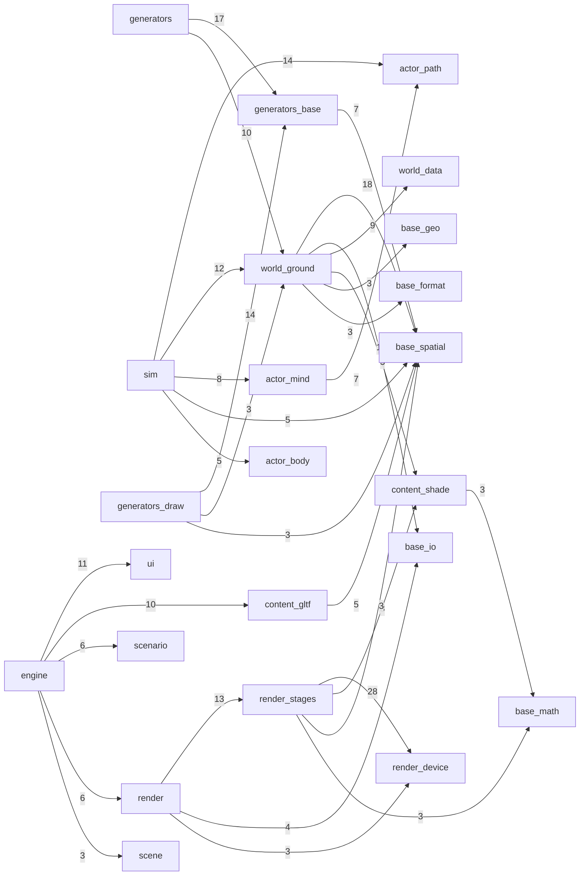

# outshine

What the tree **is**, generated by `make` and written by no hand. TARGET lives in
`CLAUDE.md`; where the two disagree, this page is the tree.

## Progress

Nine areas against RAGE and Unreal, counted from `board/` where the target already
lives. A ticked predicate must NAME ITS PROOF -- a case or an audit flag -- and a tick
whose proof this tree does not hold is reported rather than counted.

| area | held | share | tickets | note |
|---|---|---|---|---|
| `actors` | 2/7 | 29% | [1944](board/1944_the_engine_knows_bodies_forces_and_control.md) | |
| `audio` | 4/11 | 36% | [1982](board/1982_sound_is_declared_and_a_standards_body_owns_it.md), [1983](board/1983_outshine_mixes_what_the_world_does_to_a_sound.md) | |
| `client` | 1/11 | 9% | [1947](board/1947_a_client_is_almost_no_code.md), [1984](board/1984_the_demo_is_a_client_that_measures_the_door.md) | |
| `corpus` | 3/8 | 38% | [1942](board/1942_the_corpus_judges_against_oracles_that_are_not_ours.md) | |
| `door` | 7/21 | 33% | [1939](board/1939_the_door_is_three_headers_and_a_client_reaches_nothing_else.md), [1949](board/1949_one_value_carries_3d_into_and_out_of_outshine.md) | |
| `gpu-driven` | 1/13 | 8% | [1943](board/1943_no_cpu_term_scales_on_the_frame_path.md), [1985](board/1985_update_render_and_audio_run_independently.md) | |
| `layers` | 4/6 | 67% | [1940](board/1940_the_tier_table_is_declared_and_refuses.md) | |
| `perception` | 1/6 | 17% | [1945](board/1945_a_body_perceives_what_is_around_it.md) | |
| `render-plan` | 0/7 | 0% | [1941](board/1941_the_render_plan_compiles_and_every_row_executes.md) | |
| `streaming` | 2/17 | 12% | [1946](board/1946_the_generated_world_reaches_the_scene.md), [1948](board/1948_the_generators_are_a_library_with_their_own_door.md) | |

## Door -- `include/`

### `Event.h`

    value: Argument
    type: Host
    value: Measure
    virtual bool Calls(std::string_view name, std::span<const Argument> args) = 0

### `Generate.h`

    value: Ask
    type: Generates
    virtual std::string_view Kind() const = 0
    virtual bool Make(const Ask &ask, Geometry &into) const = 0

### `Geometry.h`

    type: Geometry
    void Place(int part, const double modelM16[16])
    int Parts() const
    std::string_view NameOf(int part) const
    int MaterialOf(int part) const
    const double *PlacementOf(int part) const
    int Surfaces() const
    std::string_view SurfaceNameOf(int surface) const
    const Material &SurfaceAt(int surface) const
    int Lamps() const
    std::string_view LampNameOf(int lamp) const
    const PunctualLight &LampAt(int lamp) const
    const double *LampPlacementOf(int lamp) const
    std::span<const float> PositionsOf(int part) const
    std::span<const float> NormalsOf(int part) const
    std::span<const float> TextureOf(int part, int set = 0) const
    std::span<const float> TangentsOf(int part) const
    std::span<const float> ColoursOf(int part) const
    std::span<const uint32_t> TrianglesOf(int part) const
    bool Whole() const

### `Material.h`

    value: Material

### `Outshine.h`

    value: Roots
    type: Engine
    bool DrawsInto(SDL_Window *presents)
    void Offers(Host *host)
    void Offers(const Generates &maker)
    bool Takes(std::string_view view)
    bool Handles(const SDL_Event &event)
    bool DrawsInto(Extent offscreen)
    void Under(Roots roots)
    bool RenderTo(Extent frame)
    bool Capture(std::string_view path)
    bool Pixels(std::vector<uint8_t> &rgba)
    bool Mixes(std::span<float> stereo, int rate)
    bool Read(std::string_view path)
    bool Stands(const Geometry &geometry)
    bool Declare(const Scenario &scenario)
    bool Shows(const std::vector<Surface> &surfaces)
    const Scenario &Declared(void) const
    Store &Scene(void)
    const Store &Scene(void) const
    const std::vector<std::string> &Carried(void) const
    const std::vector<Measure> &Numbers(void) const
    bool Assemble()
    bool Advance()
    bool Advance(double elapsedS)
    double StepS(void) const
    bool Run()
    bool Park()
    bool Resume(std::string_view name)
    bool Discard(std::string_view name)
    bool Save(std::string_view path) const
    bool Restore(std::string_view path)
    std::vector<std::string> Parked(void) const
    bool Standing(void) const
    const std::string &Error(void) const
    bool ReadInto(std::string_view path, Scenario &out)
    bool Generated(const Scenario &scenario)
    void Ships(void)

### `PunctualLight.h`

    value: PunctualLight

### `Scenario.h`

    value: Extent
    value: Light
    value: Identity
    value: Layer
    value: WorldSettings
    value: Provider
    value: Setting
    value: Generator
    value: Compositor
    value: Patch
    value: RenderPlan
    value: Lighting
    value: Asset
    value: Standing
    value: Placement
    value: Surface
    value: Mind
    value: Kind
    value: Instance
    value: Region
    value: Door
    value: Volume
    value: Emitter
    value: Voice
    value: Sound
    value: Bus
    value: Table
    value: Event
    value: View
    value: Prismatic
    value: Slip
    value: Contact
    value: Drive
    value: Slot
    value: Body
    value: Journey
    value: Player
    value: PhysicsSettings
    value: Clock
    value: Binding
    value: Persisted
    value: Scenario
    const Asset *Subject(void) const

### `Scene.h`

    type: Tag
    value: TagCatalogue
    value: RelationRule
    value: Entity
    type: Store
    bool Open(size_t capacity)
    Entity Add(Role role)
    void Remove(Entity of)
    bool Alive(Entity of) const
    Role RoleOf(Entity of) const
    bool Give(Entity to, Tag tag)
    bool Has(Entity of, Tag tag) const
    bool Link(Entity from, Relation how, Entity to)
    bool Relink(Entity from, Relation how, Entity to)
    Entity TargetOf(Entity of, Relation how) const
    size_t Targets(Entity of, Relation how, Entity into[], size_t room) const
    size_t Sources(Entity to, Relation how, Entity into[], size_t room) const
    size_t Cast(Role role, Entity into[], size_t room) const
    size_t Pairs(Relation how, Entity from[], Entity to[], size_t room) const
    size_t Bearing(Tag tag, Role role, Entity into[], size_t room) const
    Entity Instantiate(Entity prefab)
    Entity CopyOf(Entity instance, Entity prefabChild) const
    bool Offer(Entity at, Tag activity, size_t seats)
    size_t Offering(Tag activity, Entity into[], size_t room) const
    bool Claim(Entity by, Entity at)
    bool Use(Entity by, Entity at)
    bool Release(Entity by, Entity at)
    Seat SeatOf(Entity by, Entity at) const
    size_t Capacity() const
    std::string_view Error() const
    size_t Touched() const
    void ResetTouched()

## Shape

Module depends on module, derived from the includes themselves.

  32 edge(s) drawn, 49 thinner than three includes not drawn

## Tiers

What each directory under `src/` may include. `--audit-layers` refuses a crossing.

| tier | reaches |
|---|---|
| `base` | nothing |
| `content` | base |
| `world` | base content |
| `actor` | base |
| `render` | base content |
| `scene` | base |
| `scenario` | base content world |
| `ui` | base content |
| `audio` | base |
| `host` | base world |
| `compositor` | base world content |
| `sim` | base world content actor scene |
| `engine` | base content world generators actor render scene scenario sim ui audio host compositor |

## Mass

The heaviest files. Headers and sources counted apart.

| lines | kind | file |
|---|---|---|
| 1891 | `cpp` | `content/gltf/Document.cpp` |
| 1261 | `cpp` | `content/gltf/Subject.cpp` |
| 1256 | `cpp` | `ui/Layout.cpp` |
| 1015 | `cpp` | `render/Renderer.cpp` |
| 1013 | `cpp` | `base/format/Script.cpp` |
| 943 | `h` | `base/spatial/ClusterDag.h` |
| 926 | `cpp` | `base/spatial/Wayfinding.cpp` |
| 856 | `cpp` | `ui/Style.cpp` |
| 832 | `cpp` | `render/stages/SubjectDraw.cpp` |
| 684 | `cpp` | `scenario/ScenarioRead.cpp` |
| **45** | `h` | *the median of 238 header(s)* |
| **119** | `cpp` | *the median of 158 source(s)* |

## Carpet

The widest public surfaces.

| `[[nodiscard]]` | header |
|---|---|
| 61 | `src/render/Renderer.h` |
| 51 | `src/content/gltf/Document.h` |
| 46 | `src/content/gltf/Subject.h` |
| 38 | `src/engine/Live.h` |
| 32 | `include/Scene.h` |
| 32 | `include/Outshine.h` |

## Twins

Header names that collide.

  none -- and --audit-layers REFUSES the day one appears, because both walks on
    this page resolve an include by its basename alone

## Stranded

Sources no declared suite links, so nothing they hold is proven.

## Access

What stands wider than private. Private is the default and a wider door justifies itself.

7 protected section(s), and inheritance is right where a stable interface carries
shared machinery -- Source, WebTileSource, TerrariumDem is that shape.

- `src/actor/mind/Task.h`
- `src/generators/base/Making.h`
- `src/generators/draw/DrawSource.h`
- `src/world/data/TerrariumDem.h`
- `src/world/data/VersatilesVector.h`
- `src/world/data/WebTileSource.h`
- `src/world/ground/StructureMesher.h`

40 public data member(s) in a class -- an invariant nobody can hold.

| members | header |
|---|---|
| 7 | `src/generators/base/ContactMaterial.h` |
| 5 | `src/generators/draw/TreeMesh.h` |
| 5 | `src/engine/Live.h` |
| 3 | `src/generators/draw/TreeFoliage.h` |
| 3 | `src/generators/draw/LeafAngleDistribution.h` |
| 2 | `src/world/ground/EyeColumn.h` |
| 2 | `src/render/draw/DrawKey.h` |
| 2 | `src/content/shade/TangentFrame.h` |
| 1 | `src/world/weather/ConstantWindWeather.h` |
| 1 | `src/world/ground/tiles/TileGeodesy.h` |
| 1 | `src/world/ground/TerrainLoader.h` |
| 1 | `src/world/ground/ClassField.h` |
| 1 | `src/world/data/StarBands.h` |
| 1 | `src/scenario/Tables.h` |
| 1 | `src/scenario/InputMap.h` |
| 1 | `src/render/stages/TonemapStage.h` |
| 1 | `src/generators/draw/TreeRandom.h` |
| 1 | `src/generators/base/FeatureLevel.h` |
| 1 | `src/generators/base/Cover.h` |
| 1 | `src/generators/base/Claim.h` |
| 1 | `src/content/gltf/Keyframes.h` |
| 1 | `src/base/spatial/Span.h` |
| 1 | `src/base/spatial/Sink.h` |
| 1 | `src/base/io/StackProbe.h` |
| 1 | `src/base/format/Xml.h` |
| 1 | `src/audio/BusGraph.h` |

## Reds

What is declared to fail. A standing red is a finding, never a licence.

**74 case(s) declared red.**

| cases | family |
|---|---|
| 73 | `khronos/validator` |
| 1 | `harness/claims` |

## Reach

Suites reaching past `include/` into `src/`, which CLAUDE.md forbids.

**16 of 19** declared suite(s) are granted a `-Isrc` path (board:1879).

Reaching the library through `include/` alone:

- `apps/viewer/src`
- `apps/demo/src`
- `apps/driver/src`

## Decided

Named constants standing as a bare literal, whose origin is elsewhere.

| constants | file |
|---|---|
| 16 | `src/generators/draw/BuildingShape.cpp` |
| 14 | `src/generators/draw/BuildingMesh.cpp` |
| 6 | `src/content/gltf/Framing.h` |
| 5 | `src/render/stages/ParticipatingMedium.h` |
| 5 | `src/render/stages/IridescenceLobe.h` |
| 4 | `src/render/stages/SubjectDraw.h` |
| 4 | `src/actor/path/ReferenceLine.h` |
| 3 | `src/world/ground/WaterField.cpp` |
| 3 | `src/world/ground/TerrainLoader.cpp` |
| 3 | `src/world/ground/BuildingField.cpp` |
