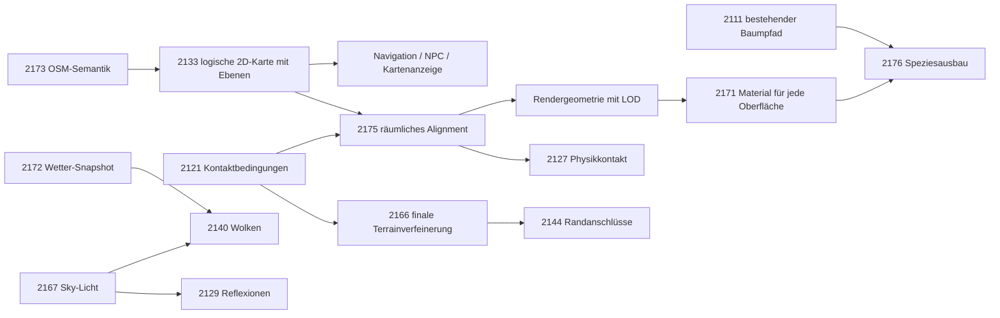

Type: feature
State: open
Area: world, render, generators, navigation
Tags: webcam, measured
Depends: 2092, 2101, 2111, 2128, 2129, 2137, 2138, 2140, 2144, 2145, 2152, 2155, 2166, 2167, 2168, 2170, 2171, 2172, 2173, 2174, 2175, 2176

# A plausible realtime sandbox closes the webcam quality gaps

## Auftrag und Abnahmemaßstab

Stand 2026-09-07, Renderer-Commit **12ceb790**. Ziel: eine plausible, annähernd fotorealistische
Open-World-Sandbox in Echtzeit aus **OSM, DEM, Zeit und Wetter**. Die Webcam ist visuelle
Referenz, kein Generatorinput und kein Auftrag zur Rekonstruktion ihres tatsächlichen Weltzustands.
Belegte Gelände-/Netz-/Gebäudedaten erhalten; unbekannte Bauformen, Artenmischung, Materialdetail,
Wolken und Population plausibel und deterministisch generieren. Keine Place-ID-Sondermodelle.
Zusätzliche Quelldaten wie Fototexturen, Photogrammetrie oder reale Gebäudemodelle sind keine Voraussetzung.

| Gegenstand | Maßstab |
|---|---|
| belegte Lage/DEM/OSM-Semantik | geographische und topologische Konsistenz innerhalb Quellunsicherheit |
| ungetaggte Architektur/Geologie/Vegetation | plausible generische Formen/Verteilungen und korrekte Konstruktion |
| Licht/Luft/Wasser/Material | physikalische Zusammenhänge, konsistente deklarierte Zeit/Wetterdaten |
| Boote/Fahrzeuge/Menschen/einzelne Wolken | eigene plausible Sandbox; kein Fotozähl-/Pixeloracle |
| Kamera | korrekt deklarierte Konventionen; Referenzpose kalibrieren, Restunsicherheit nennen |
| Navigation/NPC/Map | logisches 2D-Netz mit Ebenen/Verbindungen, unabhängig vom Render-Mesh |
| Kontakt/Darstellung | aus demselben räumlichen Alignment, mit getrennten LOD-/Fehlerverträgen |

## Renderlauf und Bilder

`make shots > build/webcam-board-audit.log 2>&1` hat alle neun SHOT-Zeilen und PNGs ausgegeben;
kein Renderprozess ist mehr aktiv. Der ursprüngliche Terminal-Exitcode war nach Sessionwechsel
nicht mehr abrufbar; deshalb kein behaupteter vollständiger Test-Gate-Erfolg.
Alle neun PNGs und die neun Webcam-JPGs wurden visuell geöffnet. Keine Webcam-PNGs im Baum
gefunden. Fotos: `build/shots/webcam/*_2026-09-07_1240.jpg`, Husum `1230` (lokal UTC+2).

[Vergleichsansicht](../build/webcam-audit/index.html) ·
[Manifest](../build/webcam-audit/manifest.json) · [Renderlog](../build/webcam-board-audit.log).
Die Vergleichsansicht hält unveränderte Bildkopien mit Originalseitenverhältnis bereit.
Sie ist bewusst noch kein geometrisch registrierter Differenztest. Build-Artefakte sind lokal;
diese getrackte Tabelle plus vollständige Hashes konservieren die Identität des Audits.

1280×720; 120 residente **Standframes** pro Place. Fehlende Vegetation/Effekte und deaktivierte
Bewegung bedeuten, dass diese Zahlen keine vollständige Echtzeit-Sandbox abnehmen.

| Place | Digest | p50 ms | p95 ms | p99 ms | über 16,67 ms |
|---|---|---:|---:|---:|---:|
| DarmstadtWest | `e72d1925` | 2.65 | 2.86 | 2.95 | 0/120 |
| Wien | `8ff2d96d` | 5.39 | 5.89 | 6.52 | 0/120 |
| Rosenheim | `7da2e093` | 3.62 | 4.09 | 4.37 | 0/120 |
| Husum | `d60b18a7` | 2.74 | 2.95 | 3.00 | 0/120 |
| Olympiaturm | `07985050` | 3.38 | 3.81 | 4.07 | 0/120 |
| Graz | `f93ff5b9` | 4.19 | 4.71 | 5.24 | 0/120 |
| Koerbersee | `53e84b69` | 6.58 | 7.13 | 8.82 | 0/120 |
| Malcesine | `46e4db5c` | 4.19 | 4.56 | 4.64 | 0/120 |
| Feldkirch | `297a9d23` | 4.45 | 4.96 | 5.88 | 0/120 |

9 × 120 = 1080 gemessene Standframes, insgesamt 0 Überschreitungen. Perzentile einzelner
Orte werden nicht zu einem erfundenen Gesamt-p99 gemittelt. Live-Providerbytes sind nicht
vollständig eingefroren; 2154 bleibt offen. Vorherige Digests unterscheiden sich bei drei Orten.

## SOLL/IST – visuelle Befunde

| Place | SOLL als Plausibilitätsreferenz | IST im neuen PNG | zuständige WIs |
|---|---|---|---|
| DarmstadtWest | strukturierte rote/graue Dachlandschaft, diffuse helle Fassaden, Baumzwischenräume | repetitive Prismen, leere Fassaden, kaum Vegetation, klarer Himmel | 2173, 2138, 2171, 2111, 2167, 2172 |
| Wien | Brücke mit lesbarer Konstruktion, bewachsene Insel, spiegelndes Wasser, Luftperspektive | dünnes Brückenband, kahle Insel, dunkle uniforme Wasserfläche, flache Stadt | 2133, 2175, 2145, 2129, 2111, 2172 |
| Rosenheim | gegliederte Stadt, markante ferne Grate, tiefer gestaffelte Luft | uniforme Dach-/Wandmassen, gerundete Bergformen, fehlende Kronen | 2166, 2173, 2138, 2171, 2111 |
| Husum | gebaute vertikale Kaikante, verschiedene Fronten, reflektierendes Hafenwasser | helle gezahnte Böschung, durchgehende helle Bänder, uniformes Wasser, grobe Bauformen | 2121, 2145, 2175, 2138, 2129, 2171 |
| Olympiaturm | Sportfelder, niedrige Baukomplexe, gegliederte Wohnbauten, hohe Kronendeckung | sehr hohe uniforme Blöcke, kahle Freiflächen, fehlende Feld-/Straßendetails | 2173, 2111, 2176, 2138, 2137, 2175 |
| Graz | Hügel rechts der Mitte, differenzierte Industrie/Stadt, schlanke hohe Bäume | Hügel weit links, auffällige helle Hangflächen, uniforme Blöcke, kahle Stadt | 2170, 2166, 2173, 2138, 2176 |
| Koerbersee | gegliederte felsige Seitenflächen, alpine Baumgruppen, Wiesen, spiegelnder See | grobes aufgeblähtes Relief, große Farbpatches, keine lesbaren Bäume, dunkler See | 2166, 2171, 2111, 2176, 2129, 2167 |
| Malcesine | gegliederte Felswand, bewachsene Halbinsel, strukturierte Wasserreflexion | senkrechter Faltenvorhang/Zähne, kahle Landzunge, fast konstante Wasserfläche | 2166, 2144, 2145, 2171, 2176, 2129 |
| Feldkirch | bewaldete Hänge, eingebundene Fluss-/Straßenräume, gegliederte Stadt | abrupte Nahwand rechts, tiefer Ufergraben, kahle Hänge, uniforme Gebäude | 2170, 2121, 2166, 2145, 2175, 2176, 2138 |

Sichtbefund ist hoch sicher; allein daraus abgeleitete Ursache bleibt Hypothese. Bei Graz/
Feldkirch wurden keine geschätzten Kameraoffsets eingetragen: Pose/Datum und finale Geländeform
müssen zuerst auseinandergehalten werden (2170). Tunnel, Nahfassaden, Schatten unter Brücken,
Nacht und bewegte NPCs sind durch Außen-Standbilder nicht abgedeckt.

## Implementierungsreihenfolge

`Depends` bezeichnet Voraussetzungen für die vollständige Abnahme, keine Sperre für unabhängige
Vorarbeiten. 2169 ist das übergeordnete Abnahme-WI; Kinder hängen nicht zurück von 2169 ab.

| Stufe | Arbeiten | Ergebnis |
|---|---|---|
| P0, parallel | 2170 Kamera/Datum; 2173 Datensemantik; 2154 reproduzierbare Eingänge; 2124 Streaming | belastbarer Vergleich und stabile Produktgrenzen |
| P1, Struktur | 2133 logisches Netz → 2175 Alignment/Bauwerke; 2121 Kontakt; 2166 finale Terrainflächen → 2144 Nähte; 2145 Wasser; 2168 Körper | räumlich plausible Welt, Unterführungen/Tunnel bleiben offen |
| P1, Darstellung | 2123 LOD; 2111 vorhandenen Baumpfad reparieren; 2138 Bauformen/Fassaden | visuelle Masse und funktionale Oberflächen |
| P2, Material/Ökologie | 2171 MR für jede Geometrie; 2176 vorhandenen Species-Katalog ausbauen; 2137 Bodendetail | lesbare Baustoffe, Felsen, Vegetation auf jeder Distanz |
| P2, Licht/Wetter | 2167 indirektes Licht; 2128 Schatten; 2172 Wetter → 2140 Wolken; 2129 Reflexionen | ein konsistenter physikalischer Beleuchtungszustand |
| P3, Sandbox/Kamera | 2174 eigene Population; 2155 Kameraantwort; 2092/2143 Bewegung/Dauerlauf | plausible belebte Welt unter dem Frame-/Speicherbudget |

## Globale Abnahme

- [ ] Alle neun Paare erneut visuell öffnen, jeweils Gesamtbild und ursachenspezifischen
      Ausschnitt/AOV; Befund, noch offene Grenze, Digest und Kosten festhalten. Kein SSIM/
      Pixelgleichheitsziel gegen unabhängig erzeugte Population oder unbekannte Webcam-Grade.
- [ ] Kamera-/DEM-Korrespondenzen getrennt von generischer Material-/Formqualität prüfen.
      Zusätzliche Nah-/Seit-/Unter-/Tunnelansichten und Dreiebenen-Verkehrsfixture nach 2175.
- [ ] Kein Generator endet bei Fallback-RGB: 2171s Material-Coverage über alle Geometrieklassen.
      2176 erweitert den vorhandenen Baumgenerator; 2111s Placement-Fix allein genügt nicht.
- [ ] Tag/Nacht, klar/bedeckt/Regen/Nebel/Schnee und Jahreszeiten; mindestens ein nicht für
      den Fotovergleich angepasster Ort/Seed je relevanter Generatorfamilie als Transferprobe.
- [ ] 720p60 auf dem Projektziel Apple A18 Pro gemäß 2092, nicht nur residenter Stillrender.
      1000/60 = 16,666… ms; jede neue Stufe mit CPU/GPU/Bytes und Gesamtframe messen.
      Noch keine belastbaren Einzelpass-Etats: zuerst Profiling, keine addierten isolierten p99.
- [ ] Logisches Netz unverändert bei Render-LOD/Unsichtbarkeit; räumlicher Kontakt und
      Darstellung versioniert konsistent. Bekannte rote Orakel/Lint bleiben offen.

## Vollständige Bildidentitäten

| Place | Webcam SHA-256 | Render SHA-256 |
|---|---|---|
| DarmstadtWest | `972d9773fd8f4a511e66d30205acd479f0371c686c25cfc3d1fb3b2e8b47409c` | `e72d1925561342456282aa2b07253c35785f139a8f4877299247bdc50e997e57` |
| Wien | `c67cdb7a923314c81ecb0dd18aacecff3203998d974077644f863e419bc59d8a` | `8ff2d96dc0dfda7c8894460f0c6edb3662558cc0dfeae3f7b5449a4eeb53b3c8` |
| Rosenheim | `8f90c46f0cc39ae4720527addc686bf3f4de87983d8ce0f08c4465eb26d41929` | `7da2e09361625d3a95668e990c0b41a6b066f0bfbd4fb4b2df9126225312ba68` |
| Husum | `0e04683064a44cea3c88908fbb2bc406b53e4fbe4624be33dd410e8d1b83eabf` | `d60b18a7827df93d2739dc2dd0d5c53107f29914fe6efcc0555e2934faec823e` |
| Olympiaturm | `91c871946ee07dff52f38cc0cc7ac0929e2e229652fc8913e5a49dcb830b9d48` | `079850501dbd6d57bb09b063fe3bd9668eb7b892f968a86996cd273c9bfd38b3` |
| Graz | `dd86eabd5c81ddc8a89c792c551334ff486e5a25b80ad4d8a4069193f5cae23e` | `f93ff5b9a687cab792e8f33d1793782578bf4ff058b0576d54d45dd33513af9c` |
| Koerbersee | `80c10e343d693a07f30d63f246b7975bf701d571927dc9e72615c30d792dfac7` | `53e84b69bc0ebd6bec75f4b56e4c24bb9d5a036777e464172432f3c7c1453fcb` |
| Malcesine | `13ae10442cf1a3efbcc3004a703977f0d0bc11fde299bda4822d37dd1876996f` | `46e4db5c9f81f687f65801cf60ec79cfe0104b727d1efbd799465acbca62074a` |
| Feldkirch | `e08517756ea9ec1cb3a68d018add44eae8085177115f30647a848a8202f839be` | `297a9d23c5f6cf76fb8532407dab98bc6b8ffde43dda4bc38849ee9a35e598f1` |
