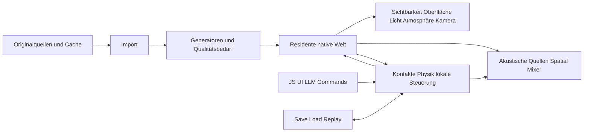

Type: feature
State: active
Architecture: ready
Priority: P0
Parent:
Depends:
Area: client, world, generators, render, gameplay
Tags: vision, webcam, sandbox

# Outshine becomes a believable data-driven open-world sandbox

## Ergebnis und erster Meilenstein
Die Welt wirkt vollständig, zusammenhängend und glaubwürdig. Zuerst nähere ich acht
Places an reale Webcams über Tages-/Jahreszeiten und Wetter an. Danach wachsen daraus
physikalisch konsistente bewegliche Systeme, LLM-NPCs, JavaScript, HTML/CSS, Interaktion
und Audio. GTA5/RDR2 prägen die Optik; technische Grenzen bestimmen den erreichbaren Look. Regeln/Budgets stehen in
AGENTS.md; dieses Board beschreibt den Weg. RDR2/GTA5 sind Qualitätsmaßstäbe.

| Place | foto-webcam.eu/webcam/ | Entscheidende Bildwirkung |
|---|---|---|
| Rosenheim | rosenheim | Dächer, Sonderbauten, gestaffelte Alpen, Nachtlicht |
| Flensburg | flensburg | Backstein, Kirchturm, Hafen und korrekte Küste |
| DarmstadtWest | darmstadt-west | Dachlandschaft, Fassaden und diffuse Stadttiefe |
| Wien | wien | Vollständige dichte Stadt, Donau, Brücken, Fernverbände |
| Husum | husum-hafenklappbruecke | Kai, Giebel, Brücke, Hafenwasser und Nässe |
| Feldkirch | feldkirch | Altstadt, Fluss, Tal und saubere Hanganschlüsse |
| Malcesine | malcesine | See, Felsufer, Spiegelung und Dunst |
| Koerbersee | koerbersee | Grate, Schnee/Schmelze, Bergsee und Wolken im Relief |

## Arbeitsweg nach Priorität
| Phase | Lieferung | Kinder | Zusammenhang |
|---|---|---|---|
| P0 jetzt | Architekturgrenzen tatsächlich durchsetzen | 2188 | Generische Welt, eigene Provider/Adapter und öffentliche Generatorverträge; alle erkannten Verstöße beheben |
| P0 danach | Vollständige Originalwelt | 2280 | Erwerb, begrenzte Ingestion und Residency über die korrigierten Verträge liefern |
| P0 | Ferndarstellung ohne Löcher oder Datenmengenexplosion | 2336 | Native Detailhierarchie begrenzt Arbeit vor Geometrie |
| P0 | Richtige Straßen, Bauwerke, Gelände und Gewässer | 2281, 2173, 2145 | Vorhandene Formen erhalten, reale Geometriefehler beseitigen |
| P1 | Relief und Oberflächen mit lesbarem Maßstab | 2337 | Bestehende Terrainverfeinerung; Quellrelief von plausibler Ergänzung trennen |
| P1 | Lesbare Materialien, kohärentes Licht, Ausgabeprofile, Wetter und Himmel | 2171, 2155, 2172 | Mit vorhandenen Oberflächen liefern; kein Warten auf Vegetation |
| P1 | Semantische Objekte und glaubwürdige Szenenbelegung | 2338 | Kompakte Formen/Instanzen statt Place-Sondermodelle |
| P2 zuletzt | Vegetation vom Fernwald bis zum Grashalm | 2111 | Standortdaten und gemeinsame Detail-/Residency-Verträge |
| P3 | Physikalische, programmierbare und bevölkerte Sandbox | 2136 | Gemeinsame Physik/Commands für JS, UI, LLM-NPCs und bewegliche Systeme |

## Entwurf von Eingaben bis Bild, Ton und Aktion
Jeder Beitrag folgt Quelle/UTC/Kamera → native Semantik → begrenzte Vorbereitung →
residente Produkte → Ausgabe oder Simulation → nächster Zustand. Kaltstart, stationärer
Frame, Drehung, Bewegung, Quellenwechsel und Fehler erhalten dieselben Besitzer.

```mermaid
flowchart LR
  Q[Originalquellen und Cache] --> I[Import]
  I --> G[Generatoren und Qualitätsbedarf]
  G --> W[Residente native Welt]
  W --> R[Sichtbarkeit Oberfläche Licht Atmosphäre Kamera]
  W --> A[Akustische Quellen Spatial Mixer]
  W --> P[Kontakte Physik lokale Steuerung]
  C[JS UI LLM Commands] --> P
  P --> W
  P --> A
  S[Save Load Replay] <--> P
```

Alle acht Archive sowie Sommer/Winter sind gesichtet. Diese Beitragsklassen decken die
sichtbaren Objekte und ihre Bildwirkung ab; sie behaupten keine pixelgenaue Fotorekonstruktion.
Ist bezeichnet vorhandenen Code, nicht bestandene vollständige Place-Integration.

| Beitrag | Verfahren und vorhandener Code / verbleibende Lücke | Kind |
|---|---|---|
| Abdeckung, Horizont, Rundumsicht | Originalzellen/residente Eltern; SourceAcquisition existiert, vollständiger Aufbau offen | 2280, 2336 |
| Gipfel, Hänge, Täler | GLO-30 → endgültiges Kontaktrelief → konservative Verfeinerung; TerrainRefinement besteht | 2337, 2145 |
| Felsrinnen, Risse, Schutt/Boden | Gerichtete Schichtung/Ridges/Bruchlinien, gefiltertes Detail; groundRock bisher isotrop | 2337 |
| Häuser, Hallen, Höfe, Kirchen/Türme | Semantischer Körper-/Parts-/Dachplan; BuildingMesh besteht, Klassen/Dächer lückenhaft | 2173 |
| Fenster, Türen, Balkone, Dachaufbauten | Parametrische Grammatik, nahe echte Tiefe; facadePattern bisher flach | 2173, 2171 |
| Putz, Ziegel, Backstein, Asphalt, Metall | Metrische Muster/Alterung, gefilterte Normalvarianz, BRDF; Materialpfad besteht | 2171 |
| Straßen, Bahn, Wege, Markierungen | Native Topologie/Alignment/Profile, instanzierte Markierung; Mesher besteht, Anschluss offen | 2281 |
| Brücken, Tunnel, Ufermauern, Kais | Getrennte Ebenen, Überbau/Pfeiler/Portale/Kaiquerschnitt; komplexe Kontakte offen | 2281, 2145 |
| Masten, Leitungen, Geländer, Kräne, Hafenobjekte | Klassengrammatiken/Instanzen, dünne Kurven oder gefilterte Fernbeiträge; Weltanschluss fehlt | 2338 |
| Autos, Boote, Segel, Menschen | Parametrische Formen und plausible Platzierung; lokale Physik/Steuerung später, Generatoren fehlen | 2338, 2136 |
| Wasserabdeckung, Inseln, Ufer | Native Körper/Datum/Pegel/Bett; WaterSurfaceBuilder besteht, Körperabschluss offen | 2145 |
| Wellen, Spiegelung, Durchsicht, Schaum | Windwellen, Fresnel/Absorption, Weltreflexion; dielektrische Fläche besteht, Kopplung fehlt | 2145, 2155 |
| Wald, Stadtbäume, Sträucher, Gras | Standort/Art/Seed → Verbände/Instanzen/Blätter; TreeGrower besteht, Weltqualität offen | 2111 |
| Schnee, Eis, Nässe, Laubzustand | Wetterhistorie/Exposition → gemeinsame Oberflächenzustände; kohärente Kopplung fehlt | 2172 |
| Blauer Himmel, Sonne, Luftperspektive | Atmosphären-LUTs/astronomische Richtung; SkyStage/AerialPerspective bestehen | 2172, 2155 |
| Wolken, Dunst, Nebel, Niederschlag | Dichte/Wind/Raymarch/History, begrenzte sichtbare Partikel; Wolkenrenderer fehlt | 2172 |
| Mond, Planeten, Sterne, Nacht | Ephemeris Sonne/Mond besteht; sichtbare Himmelsobjekte/Katalog/Weltlicht offen | 2172, 2155 |
| Licht, Schatten, Kontakt, indirekte Füllung | Gestaffelte Schatten, diffuse/speculare Himmelsantwort; LightVisibility/Irradiance bestehen | 2155 |
| Glas-/Wasserreflexion und lokale Nachtlichter | Roughness-gefilterte Reflexion/Innenwirkung, kompakte Lichtbeiträge; kohärente Integration offen | 2171, 2155 |
| Jeder ausgegebene Pixel | Sichtbarkeit/BRDF/Medium → HDR/History/Tonemapping/Farbraum; Pässe bestehen, Bildnachweis offen | 2155 |
| Bildausschnitt und alle Ausgabeprofile | Kalibrierte Kamera, Footprintfilter, stabiles 25/30/60-fps-Pacing; Extent besteht | 2155 |
| Wind, Regen, Wasser, Umweltton | Parametrische Noise-/Resonanz-/Event-Synthese; prozeduraler Umweltsound fehlt | 2136 |
| Schritte, Kontakte, Motor-/Bewegungsgeräusch | Material-/Impuls-/Kraftzustand → begrenzte Klangereignisse; allgemeine Kopplung fehlt | 2136 |
| Jeder ausgegebene Audioblock | Quellen → Panning/Doppler/Occlusion/Mix/Limiter; Mixer/AudioOcclusion bestehen | 2136 |
| Jede generierte Aktion | Beobachtung → lokale Steuerung/JS/UI/LLM → validierte Commands → Physik; Hostadapter besteht, NPC/Kontakte fehlen | 2136 |
| Fortlaufender/reproduzierbarer Zustand | Versionierte Entities/Quellen/Seeds, atomarer Save/Load/Replay; Save bisher nur numerische Traits | 2136, 2188 |
| Unnötige CPU/GPU/Bytes/Arbeit | Abhängigkeiten, Revision/LOD/Schlafzustand, frühe Filterung; vollständiger Kostenbeweis offen | 2188, 2336 |

OSM kennt nicht jedes Fassadendetail oder die momentane Belegung von Autos/Booten;
GLO-30 liefert weder alle nackten Böden noch einzelne Felsritzen. Wetterwerte bestimmen
keine exakten Wolkenformen/Hafentiden. Unbekanntes bleibt plausible, deterministische
Ergänzung. Kein exakter Foto-, vollständiger Laufzeit- oder A18-Pro-Claim aus diesem Entwurf.

## Arbeitsfähige Reserve
2188 und 2280 sind aktiv: öffentliche Besitzer korrigieren und eine vollständige Originalwelt liefern.
Der API-Erwerb allein belegt keine skalierbare 240-km-Welt. Nächster Integrationsschritt ist
2336s konservative Detailplanung vor Terrain; 2173/2281 und 2171 nutzen vorhandene native Inputs.
2336s globale Grobquelle und 2145s Küstenabschluss brauchen belegte Quellenverträge.
2136 besitzt Physik, Akustik und asynchrone NPC-Entscheidungen. Reihenfolge ist Priorität; `Depends` nennt nur den fehlenden konsumierten Vertrag, keine pauschale Gesamtabnahme.

## Abnahme und Zuständigkeit
`src/assets/places` und `client/PlaceCamera` besitzen den Katalog und die Aufnahme.
Kamera, FOV, Pose, Höhendatum, Zeit und Quellenfit getrennt von Weltfehlern prüfen;
unbekannte Kalibrierung bleibt benannt. Profil, Rendermaß und Zielrate sind explizit; Qualität hat Vorrang vor Pixelzahl.
480p30 auf A18 Pro bleibt eine Hypothese bis zur Gerätemessung. Referenzmanifest und Archivbilder
unter build/shots/reference/webcams bleiben erhalten. Fotos liefern keine Weltgeometrie.
Alle acht Bilder persönlich vergleichen; Form, Material, Licht/Wetter und Kosten getrennt
bewerten. Der nächste Schritt muss Bildgewinn oder einen konkreten Bildblocker liefern.
Historische Places bleiben ausdrücklich aufrufbare Diagnosen, kein erweitertes Pflichtgate.
Hockenheim-Runden und Physik-Ausbau warten auf Phase P3; vorhandene Fähigkeiten erhalten.
Der spätere Maßstab reicht nahtlos vom Planeten über Flug bis zur unmittelbaren Umgebung.
Kein Kind kann durch Tests allein fehlende Runtime-Inhalte oder Bilder für fertig erklären.
