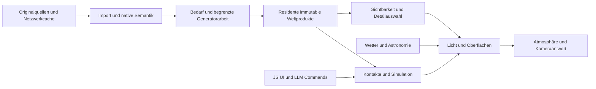

Type: feature
State: active
Architecture: ready
Priority: P0
Parent:
Depends:
Area: client, world, generators, render, gameplay
Tags: vision, webcam, sandbox

# Outshine becomes a believable data-driven open-world sandbox

## Ergebnis und erster Meilenstein
Die Welt wirkt vollständig, zusammenhängend und glaubwürdig. Zuerst nähere ich acht
Places an reale Webcams über Tages-/Jahreszeiten und Wetter an. Danach wachsen daraus
physikalisch konsistente bewegliche Systeme, LLM-NPCs, JavaScript, HTML/CSS, Interaktion
und Audio. GTA5/RDR2 prägen die Optik; technische Grenzen bestimmen den erreichbaren Look. Regeln/Budgets stehen in
AGENTS.md; dieses Board beschreibt den Weg. RDR2/GTA5 sind Qualitätsmaßstäbe.

| Place | foto-webcam.eu/webcam/ | Entscheidende Bildwirkung |
|---|---|---|
| Rosenheim | rosenheim | Dächer, Sonderbauten, gestaffelte Alpen, Nachtlicht |
| Flensburg | flensburg | Backstein, Kirchturm, Hafen und korrekte Küste |
| DarmstadtWest | darmstadt-west | Dachlandschaft, Fassaden und diffuse Stadttiefe |
| Wien | wien | Vollständige dichte Stadt, Donau, Brücken, Fernverbände |
| Husum | husum-hafenklappbruecke | Kai, Giebel, Brücke, Hafenwasser und Nässe |
| Feldkirch | feldkirch | Altstadt, Fluss, Tal und saubere Hanganschlüsse |
| Malcesine | malcesine | See, Felsufer, Spiegelung und Dunst |
| Koerbersee | koerbersee | Grate, Schnee/Schmelze, Bergsee und Wolken im Relief |

## Arbeitsweg nach Priorität
| Phase | Lieferung | Kinder | Zusammenhang |
|---|---|---|---|
| P0 jetzt | Architekturgrenzen tatsächlich durchsetzen | 2188 | Generische Welt, eigene Provider/Adapter und öffentliche Generatorverträge; alle erkannten Verstöße beheben |
| P0 danach | Vollständige Originalwelt | 2280 | Erwerb, begrenzte Ingestion und Residency über die korrigierten Verträge liefern |
| P0 | Ferndarstellung ohne Löcher oder Datenmengenexplosion | 2336 | Native Detailhierarchie begrenzt Arbeit vor Geometrie |
| P0 | Richtige Straßen, Bauwerke, Gelände und Gewässer | 2281, 2173, 2145 | Vorhandene Formen erhalten, reale Geometriefehler beseitigen |
| P1 | Relief und Oberflächen mit lesbarem Maßstab | 2337 | Bestehende Terrainverfeinerung; Quellrelief von plausibler Ergänzung trennen |
| P1 | Lesbare Materialien, kohärentes Licht, Ausgabeprofile, Wetter und Himmel | 2171, 2155, 2172 | Mit vorhandenen Oberflächen liefern; kein Warten auf Vegetation |
| P2 zuletzt | Vegetation vom Fernwald bis zum Grashalm | 2111 | Standortdaten und gemeinsame Detail-/Residency-Verträge |
| P3 | Physikalische, programmierbare und bevölkerte Sandbox | 2136 | Gemeinsame Physik/Commands für JS, UI, LLM-NPCs und bewegliche Systeme |

## Bildentwurf und vollständige Lückenübersicht
Archivbilder aller acht Kameras sind erneut gesichtet; Sommer, Dunst, bedeckter Himmel,
Hafen-Niedrigwasser und alpiner Winter zeigen unterschiedliche Anforderungen. Der
Idealzustand ist eine geschlossene Welt mit korrekten großen Formen, metrischen
Oberflächen, kohärenter Beleuchtung und stabiler Darstellung. Detail folgt Bildwirkung. Verfahren für Fels stehen in 2337, Gebäudestruktur in 2173
und prozedurale Baustoff-/Glasantwort in 2171; sie sind Entwürfe, keine Runtime-Beweise.

```mermaid
flowchart LR
  Q[Originalquellen und Netzwerkcache] --> I[Import und native Semantik]
  I --> G[Bedarf und begrenzte Generatorarbeit]
  G --> W[Residente immutable Weltprodukte]
  W --> V[Sichtbarkeit und Detailauswahl]
  V --> R[Licht und Oberflächen]
  A[Wetter und Astronomie] --> R
  R --> B[Atmosphäre und Kameraantwort]
  W --> P[Kontakte und Simulation]
  P --> R
  C[JS UI und LLM Commands] --> P
```

| Sichtbare/strukturelle Lücke | Lieferung und verantwortliches Kind |
|---|---|
| Keine rechtzeitig vollständigen Places | Erwerb → native Ingestion → geschlossene Residency, 2280 |
| Quellen/Jobs in Welt und private Generatorbakes | Besitzer/öffentliche Verträge, 2188 |
| Fernstadt und Zoom ohne begrenzte Detailarbeit | Rundumhierarchie, Zusammenfassung und Oberflächenfehler, 2336 |
| Falsche Dächer, Sonderbauten, Fassaden ohne Tiefe | Originalformen, Nahdetails und kompakte Fernkörper, 2173 |
| Straßenebenen, Brücken, Kai-/Tunnelanschlüsse | Logische Netze und native Kontaktgeometrie, 2281 |
| Falsche Pegel/Ufer, fehlende Wasserwirkung | Körperabschluss, Bett, Reflexion/Transmission und Zustand, 2145 |
| Glattes/gleichförmiges Relief und Boden | Quelltreues Terrain, Fels/Schutt/Boden und Detailfilter, 2337 |
| Baustoffe ohne Maßstab/Alterung | Metrisches Material, Roughness/Normaldetail und Energie, 2171 |
| Flache Tiefe, unkalibrierter Bildausschnitt, Flimmern | Kamera, Schatten, Fülllicht, Reflexion und History, 2155 |
| Fehlende Wolken und inkohärenter Winter/Nacht | Ein Wetter-/Astronomiezustand für Himmel und Oberflächen, 2172 |
| Fehlende Waldstruktur, Stadtgrün und Unterwuchs | Standortgerechte gemeinsame Detailhierarchie, 2111; zuletzt |
| Unbelebte, nicht interaktive Welt | Physik/Entities, bewegliche Systeme, NPC/JS/UI/Audio, 2136 |

Die Daten bestimmen nur belegte Eigenschaften: GLO-30 löst weder einzelne Felsritzen
noch alle nackten Böden auf; OSM enthält nicht jede Fassade oder Landmarkendetailform.
Wetterwerte rekonstruieren keine exakte Wolkenverteilung oder Hafentide. Fehlende
Information bekommt plausible deterministische Ergänzung mit benannter Unsicherheit.
Fotogenauigkeit und A18-Pro-Kosten sind Ziele, keine aus Gedankengängen bewiesenen Zusagen.

## Arbeitsfähige Reserve
2188 ist aktiv: Architekturgrenzen haben Vorrang; 2280 wartet auf die korrigierten Besitzer. Danach den
Projektions-/Fehlervertrag in native Detailplanung überführen; native Formen in
2173/2281 und Baustoffe 2171 können ihre vorhandenen Inputs unabhängig verwenden.
2336s globale Grobquelle und 2145s Küstenabschluss brauchen noch belegte Quellenverträge.
2136 besitzt den Ausbau der gemeinsamen Physik und asynchronen NPC-Entscheidungen. Reihenfolge ist
Priorität; `Depends` nennt nur den fehlenden konsumierten Vertrag, keine pauschale Gesamtabnahme.

## Abnahme und Zuständigkeit
`src/assets/places` und `client/PlaceCamera` besitzen den Katalog und die Aufnahme.
Kamera, FOV, Pose, Höhendatum, Zeit und Quellenfit getrennt von Weltfehlern prüfen;
unbekannte Kalibrierung bleibt benannt. Profil, Rendermaß und Zielrate sind explizit; Qualität hat Vorrang vor Pixelzahl.
480p30 auf A18 Pro bleibt eine Hypothese bis zur Gerätemessung. Referenzmanifest und Archivbilder
unter build/shots/reference/webcams bleiben erhalten. Fotos liefern keine Weltgeometrie.
Alle acht Bilder persönlich vergleichen; Form, Material, Licht/Wetter und Kosten getrennt
bewerten. Der nächste Schritt muss Bildgewinn oder einen konkreten Bildblocker liefern.
Historische Places bleiben ausdrücklich aufrufbare Diagnosen, kein erweitertes Pflichtgate.
Hockenheim-Runden und Physik-Ausbau warten auf Phase P3; vorhandene Fähigkeiten erhalten.
Der spätere Maßstab reicht nahtlos vom Planeten über Flug bis zur unmittelbaren Umgebung.
Kein Kind kann durch Tests allein fehlende Runtime-Inhalte oder Bilder für fertig erklären.
